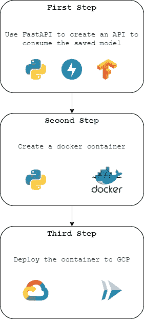
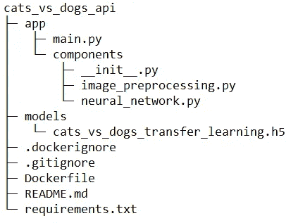
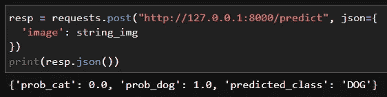
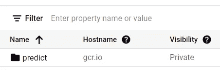
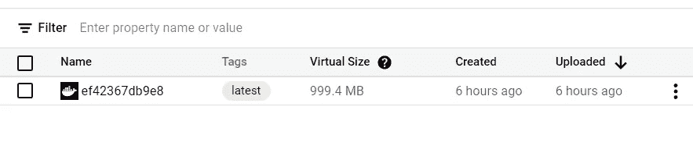
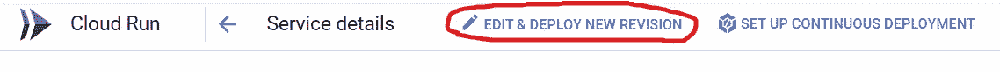
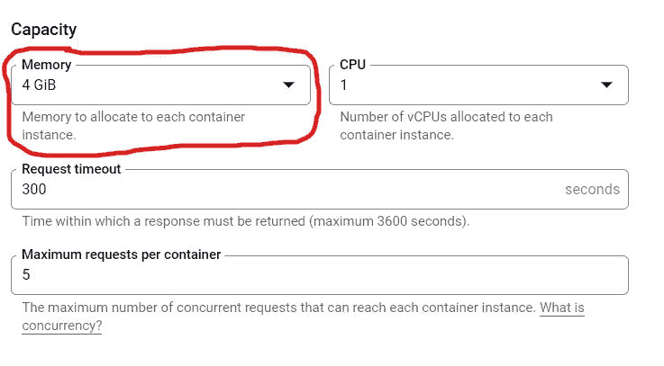
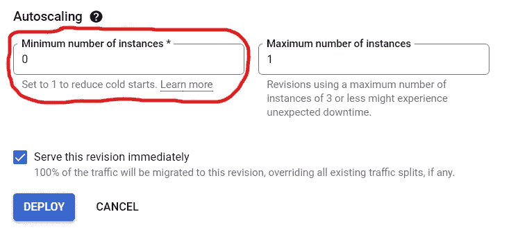
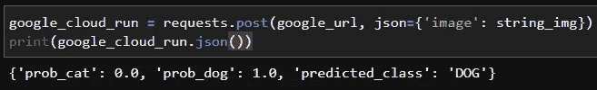

# 运行张量流模型(与 FastAPI、Docker 和 GCP 一起)

> 原文：<https://medium.com/mlearning-ai/operationalizing-a-tensorflow-model-with-fastapi-docker-and-gcp-9c6a81ccc361?source=collection_archive---------5----------------------->

了解如何在 GCP 创建并使用 API 来消费 ML 模型。


Photo by [Austin Chan](https://unsplash.com/@austinchan?utm_source=medium&utm_medium=referral) on [Unsplash](https://unsplash.com?utm_source=medium&utm_medium=referral)

在我的[上一篇文章](/mlearning-ai/practical-transfer-learning-with-tensorflow-1f16bb9ac379)中，我向您展示了如何使用 TensorFlow 创建模型，以及我们如何保存这些模型以备后用！今天我们向“后用”迈出第一步！让我们学习如何使用以下工具来使用这一模型:

1.  [FastAPI](https://fastapi.tiangolo.com/) :一个以简单快速的方式创建 API 的框架！
2.  [Docker](https://www.docker.com/) :操作系统级虚拟化，以称为容器的包的形式交付软件；
3.  [Cloud Run(Google Cloud Platform)](https://cloud.google.com/run/):这使您能够运行通过请求或事件调用的容器。

我们的工作流程是这样的:



Workflow — Source: the author

这将是这个项目的结构:



Project Structure — Source: the author

将上述结构与我们的工作流程联系起来:

1.  第一步，我们要构建 app 文件夹，里面会包含所有 API 相关的代码；
2.  在第二步中，我们将构建负责为 GCP 建立容器的 Dockerfile。

# **第一步—** 预热发动机。


Photo by [Bao Menglong](https://unsplash.com/@__menglong?utm_source=medium&utm_medium=referral) on [Unsplash](https://unsplash.com?utm_source=medium&utm_medium=referral)

我们在上一篇文章中开发的模型是一个计算机视觉模型，它获取一幅图像，并将其分类为一幅狗或猫的图像。我们今天要用的几乎是同一个型号。唯一不同的是，我添加了 softmax 激活的最后一层，以获得每个职业的概率。该模型与文章中所示的. h5 格式相同。

让我们从组件文件夹开始！

1.  **image_preprocessing.py**

这个文件将包含一个负责处理图像(以 base64 字符串接收)的函数，因此模型可以使用它。

2. **neural_network.py**

这里我们有两个函数！一个加载模型，另一个进行预测。

如您所见，我们的预测返回将是一个包含概率和预测类别的字典。

3. **__init__。py**

让 Python 将包含文件的目录视为包；这是一个空白文件。

4. **main.py**

现在是使用 FastAPI 库开发 API heart 的时候了。让我们创建两个方法:

*   GET——我们可以快速检查 API 是否工作，而不必发送图像；
*   POST -我们可以发送一个图像；做出预测并得到回应。

如果您想快速测试这个 API，只需取消代码的注释并在终端中运行命令:

```
python main.py
```

要进行预测，您可以在 jupyter 笔记本中处理图像(看到所有处理步骤很酷),并使用 requests 库。



Prediction — Source: the author

所以我们有一个完全正常工作的 API 现在让我们看看如何创建我们的容器！

# 第二步——起飞


Photo by [Jonathan Ridley](https://unsplash.com/@jridley1?utm_source=medium&utm_medium=referral) on [Unsplash](https://unsplash.com?utm_source=medium&utm_medium=referral)

现在让我们创建一个包含所有代码和库的容器，准备运行我们的 API！

负责建立环境、复制 API 文件、安装库和执行代码的文件是 Dockerfile。

要在本地测试容器，只需替换 Dockerfile 文件的 CMD 行:

并在终端中使用以下命令构建映像:

```
docker build -t api_image .
```

等待几分钟，让映像完成构建，然后运行下面的代码来启动它:

```
docker run -p 8000:8000 api_image
```

现在你可以预测了！


现在让我们把集装箱送到 GCP 吧！

# **第三步—** 展翅高飞


Photo by [Jerry Zhang](https://unsplash.com/@z734923105?utm_source=medium&utm_medium=referral) on [Unsplash](https://unsplash.com?utm_source=medium&utm_medium=referral)

现在是时候发布我们的 API 了！我们将通过终端执行大多数操作，使用 [Google CLI](https://cloud.google.com/sdk/docs/install#deb) ！

安装 Google CLI 并登录后，让我们将 docker 映像上传到 GCP 容器注册中心。您可以使用以下命令来完成此操作:

```
gcloud builds submit --tag gcr.io/<YOUR-PROJECT-HERE>/predict
```

用你正在做的项目替换< YOUR-PROJECT-HERE>，将要创建的文件夹将被命名为 predict。

执行此命令后，图像将被上传并出现在容器注册表中。



Container Registry — Source: the author



Container Registry— Source: the author

我们可以从 GCP 控制台或 Google CLI 创建云运行服务。对于这个项目，我使用了 CLI，命令如下:

```
gcloud run deploy --image gcr.io/<YOUR-PROJECT-HERE>/predict --platform managed
```

将会出现一些配置选项，比如为服务选择一个区域，以及是否允许未经身份验证的调用。过程结束时，服务的 URL 将显示在屏幕上。

启用云运行后，我重点更新了实例设置。



Cloud Run Settings— Source: the author



Cloud Run Settings— Source: the author

对于这个 API，4GB 是一个合理的内存量；少于该值会阻止代码运行。

每个周期的第一次预测可能需要一段时间，具体取决于您的设置；保留一个专用的实例可以避免冷启动，但是代价会大得多！



Cold Start— Source: the author

现在，您可以访问 Google 生成的 URL 并进行预测了！



GCP Request — Source: the author

如您所见，API 正在工作！

# 结论

今天我们看到了如何构建和创建一个 API 来消费一个 ML 模型；如何构建一个包含该 API 的 docker 映像，并使其在 GCP 上可用；用简单快捷的方式！

现在轮到你了！玩得开心！

**那都是乡亲们！**

您可以在我的 GitHub 上找到完整的资源库以及更多内容！

[](https://github.com/JPedroBraganca) [## JPedroBraganca -概述

### 此时您不能执行该操作。您已使用另一个标签页或窗口登录。您已在另一个选项卡中注销，或者…

github.com](https://github.com/JPedroBraganca) 

Photo by [Jason Leung](https://unsplash.com/@ninjason?utm_source=medium&utm_medium=referral) on [Unsplash](https://unsplash.com?utm_source=medium&utm_medium=referral)

[](/mlearning-ai/mlearning-ai-submission-suggestions-b51e2b130bfb) [## Mlearning.ai 提交建议

### 如何成为 Mlearning.ai 上的作家

medium.com](/mlearning-ai/mlearning-ai-submission-suggestions-b51e2b130bfb)