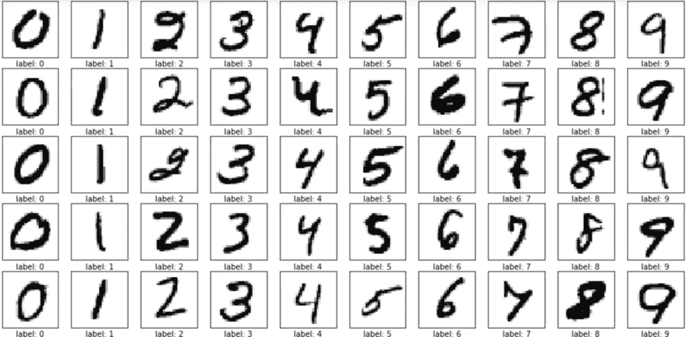
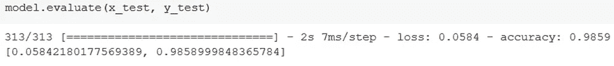
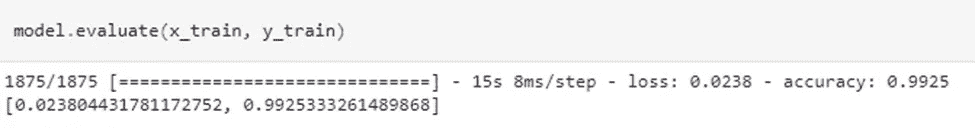
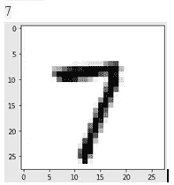

# 光学字符识别(OCR)

> 原文：<https://medium.com/mlearning-ai/optical-character-recognition-ocr-27eefdefc5a1?source=collection_archive---------9----------------------->

在这篇博客中，我们将讨论**“计算机视觉”**最重要的应用之一，即 OCR。

光学字符识别(OCR)是一种从图像中提取文本并将其转化为程序员可以访问和更改的*机器可读文本*的方法，如字符串变量(或任何其他计算机语言)。但是，使用 OCR，可以将图像转换为文本文件，并将其组成部分记录为文本数据。

使用 OCR 软件，将字母从图像中分离出来，将其转化为单词，然后将单词转化为句子，原始内容可能会被检索和更改。此外，它消除了手动数据输入的需要。OCR 系统将*硬件*和*软件*结合起来，将打印文档转换成机器可读的文本。

硬件，如*光学扫描仪*或专用*电路板*，用于复制或读取文本；然后，高级处理通常由软件执行。为了构建更复杂的*智能字符识别(ICR)* 方法，例如识别语言或手写风格，OCR 软件可以结合人工智能(AI)。使用 OCR 的主要原因是用户可以*格式化、编辑和搜索文档*。

# 使用的数据集

实际上， **MNIST** 是用于计算机视觉的“Hello World”数据集**(“修正的国家标准与技术研究所”)**。自从 1999 年出版以来，这个著名的手写图像集已经成为分类算法的标准。即使新的机器学习技术被创造出来，MNIST 仍然是一个可靠的资源。



Sample from MNIST dataset

# 使用代码的示例

数据集由**10000 张** *测试图像*和**60000 张** *训练图像*组成。在这种情况下，数据被分成*训练*和*测试*数据集。***x _ train****和 ***x_test*** 采用灰度代码，而 ***y_test*** 和 ***y_train*** 采用列出数字 0 到 9 的标签。你可以通过看一个数据集的形式来判断它是否可以和 ***CNN*** 一起使用。你可以看到我们的结果是(60000，28，28)，意味着我们的集合中有 60000 张图片，每张图片的**大小**为 *28×28 像素*。要使用 Keras API，我们需要一个 4 维数组，然而如上图所示，我们只有一个 3 维 numpy 数组。*

```
*x_train = x_train.reshape(x_train.shape[0], 28, 28, 1)
x_test = x_test.reshape(x_test.shape[0], 28, 28, 1)
input_shape = (28, 28, 1)*
```

*除法运算之后，我们将 4 维 numpy 数组的类型设置为 float，以便拥有浮点值，*

```
*x_train = x_train.astype('float32')
x_test = x_test.astype('float32')*
```

*既然我们已经达到了正常化阶段，我们总是在我们的神经网络模型中进行这一步。除以 255 来实现这个。*

```
*x_train /= 255
x_test /= 255model_name=Sequential()
model_name.add(Conv2D(28,kernel size=(3,3),input shape=input shape))
model_name.add(MaxPooling2D(pool_size=(2,2)))
model_name.add(Flatten())
model_name.add(Dense(128,activation=tf.nn.relu))
model_name.add(Dropout(0.2))
model_name.add(Dense(10,activation=tf.nn.softmax))*
```

*Keras API 用于构建模型。在添加 *Conv2D、MaxPooling、Flatten、Dropout 和 Dense 层*之前，应该导入 Keras 的序列模型。*

*丢弃层通过在训练时忽略一些神经元来避免过拟合。将展平图层中的 *2D 数组*转换为 *1D 数组*，然后构建完全连接的图层。*

```
*model.compile(optimizer='adam',
loss='sparse_categorical_crossentropy', metrics=['accuracy'])
model.fit(x=x_train,y=y_train, epochs=10)model.evaluate(x_test, y_test)*
```

**

*Evaluation result for test data*

```
*model.evaluate(x_train, y_train)*
```

**

*Evaluation result for training data*

*要检查模型的预测，无论模型预测是否正确，我们都可以运行下面的代码来检查预测。这里我们从*测试数据*中取了一个随机数据，并检查了它的预测，它正确地预测了图像中的字符。*

```
*image_index = 2853
plt.imshow(x_test[image_index].reshape(28, 28),cmap='Greys')
predict = x_test[image_index].reshape(28,28)
pred = model.predict(x_test[image_index].reshape(1, 28, 28, 1))
print(pred.argmax())*
```

## *输出*

**

*The predicted output with the input image*

*这都是关于光学字符识别(OCR)的。这在通过相机扫描并将其转换为文本以供进一步处理时非常有用。这对于将物理文档转换成 PDF 文件也很有用。*

**快乐学习！！**

*[](/mlearning-ai/mlearning-ai-submission-suggestions-b51e2b130bfb) [## Mlearning.ai 提交建议

### 如何成为 Mlearning.ai 上的作家

medium.com](/mlearning-ai/mlearning-ai-submission-suggestions-b51e2b130bfb)*