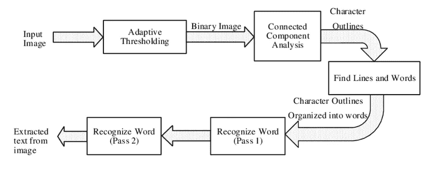

# 利用 R 中的魔方进行光学字符识别

> 原文：<https://medium.com/mlearning-ai/optical-character-recognition-using-tesseract-in-r-3f5d9676dade?source=collection_archive---------8----------------------->

在本文中，我将解释如何使用 r 从图像中执行文本提取。

乍一看，当您不知道使用哪些工具时，执行此任务似乎相当复杂。实际上，您可能会认为您必须使用深度学习模式来完成这项工作。你是对的！这需要深入的学习。

但不要惊慌。因为宇宙魔方引擎的存在，它不会花费你一周的开发时间。宇宙魔方是由惠普工程师在 20 世纪 80 年代开发的一款软件，广泛应用于数据科学领域。

Image from [https://www.researchgate.net/figure/Architechture-of-Tesseract-OCR_fig3_328997563](https://www.researchgate.net/figure/Architechture-of-Tesseract-OCR_fig3_328997563)

**1。商业价值**

从图像中提取文本在许多行业中都有很大的价值。

例如，我们可以考虑:

*   银行和保险:从客户发送的预格式化文件中提取信息，验证身份证信息…
*   行业:从 pdf 格式的订单中提取文本
*   公共当局:管理公民填写的文件

还有很多我在这里都没有列出的用例。

**2 .应用目标**

主要目标是构建一个闪亮的应用程序，用户可以在其中选择文档(例如，书籍或销售收据)来提取信息。

例如，我们将尝试从下面的销售收据中提取日期、时间和价格:

Image from author

我们将在接下来的章节中看到如何使用一些基本的 R 函数来执行文本挖掘。

**3 .创建支持功能**

在任何项目中，我总是建议编写函数(或者在需要的时候编写类)，而不是有一长串的命令。函数将帮助开发人员在代码需要重写时不会丢失。

我们首先加载库。

一旦库被加载，我们将编写一个函数，将图像作为输入。这时大部分工作都是用宇宙魔方完成的。

我们将从`stringr`库中提取文本并应用字符串函数来清理它。

然后我们创建另一个函数，从销售收据中提取感兴趣的信息。

事实上，我们需要收据上的 3 个信息:日期、时间和票价。为此，我们需要构建一个函数，该函数将原始文本和参数作为输入。

这种方法有一些局限性。商店销售收据的格式不尽相同。因此，为了能够在任何销售收据上做到这一点，人们应该做进一步的调查。

例如，如果您确信所有的文档都是统一格式的，这个方法将会非常有效。

**4 .在你的闪亮应用**中获得所有这些

一旦你完成了函数的创建，你基本上只需要在你的应用程序中调用它们！瞧

看看 github repo，看看该应用是如何构建的:

 [## GitHub -塞浦路斯 mbus/OCR

### 您现在不能执行该操作。您使用另一个选项卡或窗口登录。您在另一个选项卡上注销，或者…

github.com](https://github.com/CyprienCambus/OCR)  [## Mlearning.ai 提交建议

### 如何成为移动人工智能的作者

medium.com](/mlearning-ai/mlearning-ai-submission-suggestions-b51e2b130bfb)