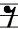
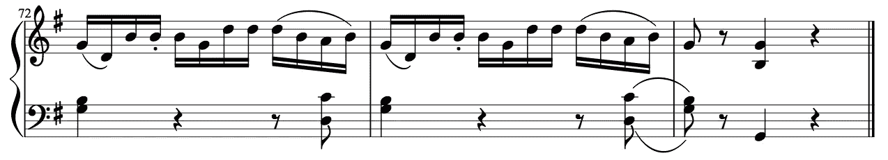
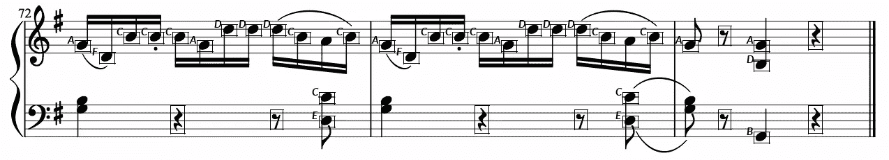
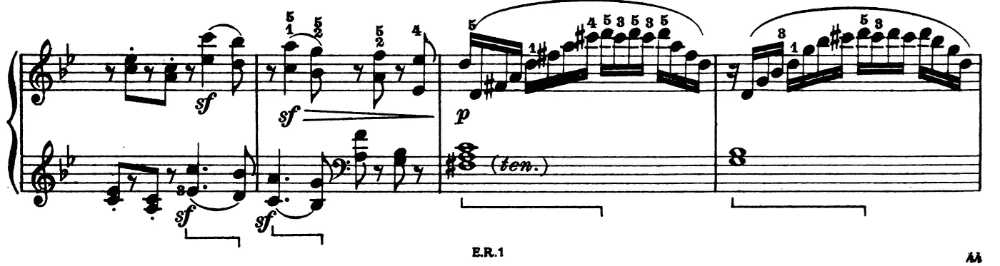
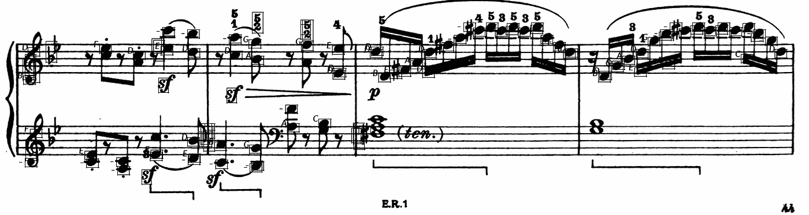

# 光学音乐识别

> 原文：<https://medium.com/mlearning-ai/optical-music-recognition-6257a9bcca52?source=collection_archive---------3----------------------->

Photo by [Valentino Funghi](https://unsplash.com/@iampatrickpilz?utm_source=unsplash&utm_medium=referral&utm_content=creditCopyText) on [Unsplash](https://unsplash.com/s/photos/music?utm_source=unsplash&utm_medium=referral&utm_content=creditCopyText)

# 问题陈述

给定一部分乐谱(PNG 图像)作为输入，我们需要使用 Hough 变换、Naive 和基于边缘检测的模板匹配等技术，根据 test_images 文件夹中的 3 个光学符号(预定义为模板)找到音符、四分休止符和八分休止符。下面给出了相同的 github 库。

 [## ojaashampiholi/光学 _ 音乐 _ 识别

### 给定一个 PNG 图像(乐谱的一部分)作为输入，我们需要找到音符、四分休止符和八分休止符…

github.com](https://github.com/ojaashampiholi/Optical_Music_Recognition) 

# 算法概述

[Template for Notes](https://github.com/ojaashampiholi/Optical_Music_Recognition/blob/main/test-images/template1.png)

[Template for Quarter Rest](https://github.com/ojaashampiholi/Optical_Music_Recognition/blob/main/test-images/template2.png)

[Template for Eighth Rest](https://github.com/ojaashampiholi/Optical_Music_Recognition/blob/main/test-images/template3.png)

1.乐谱图像由用户输入。

2.该应用程序有一个预定义的模板目录，用于检测音符、四分音符和八分音符。

3.预处理的第一步是将输入图像和所有模板转换成灰度。

4.执行霍夫变换以找到五线谱行之间的间距和每组中第一行的行坐标。

5.一旦我们获得了五线谱线之间的间距，我们就可以调整模板的大小来匹配输入图像的比例。

6.调整模板大小后的下一步是应用对象检测来识别音乐符号的类型。

7.已经实现了简单的模板匹配和基于边缘检测的模板匹配，并且是基于用例来选择的。

8.通过模板匹配算法获得匹配区域和相应的概率，然后进行非最大抑制。

9.通过绘制边界框和打印间距名称来生成输出图像。

10.生成的文本文件包含左上角的行和列、边界框的高度和宽度、符号类型、间距和概率。

# 实施和设计选择

[**主文件**](https://github.com/ojaashampiholi/Optical_Music_Recognition/blob/main/omr.py)

三个实用函数文件被导入到主文件 omr.py 中。一旦程序运行，main 方法从命令行参数中读取输入音乐图像的名称。读取输入的 PNG 图像和所有模板。调用 getResults()方法，并将输入图像、模板以及相应的模板因子传递给该方法。

***getResults()****—*在 get results()方法中创建三个实用程序文件中的类的实例。

然后，输入图像被转换为 numpy 数组格式以进行进一步的操作，然后使用 kernelOperations 类中的“rgbtogray()”方法将 RGB 图像数组中的每个通道乘以特定权重(红色通道为 0.2989，绿色通道为 0.5870，蓝色通道为 0.1140)以获得灰度图像。

然后在灰度图像阵列上执行霍夫变换，以检测五线谱并估计音符头的尺寸，因为五线谱线之间的间隔大约是音符头的高度，然后将其用作重新缩放的参考。

[**霍夫变换**](https://github.com/ojaashampiholi/Optical_Music_Recognition/blob/main/Hough_Transform.py)

***霍夫()*** *—* 该方法以灰度图像为输入。小于 128 的像素值被替换为 0，而剩余的像素被替换为 1，从而产生二进制图像。扫描该图像中的每个像素，并创建名为“votesDict”的投票字典，将每个行索引作为关键字(x ),并且对于具有边缘像素的每对(行，高度),其值增加 1。最终“votesDict”中的每个键值对都有行索引和该行中相应数量的白色像素。然后从字典中过滤出行列表，即值超过列长度(y)50%的键。该过滤假设五线谱是音乐图像中的平行、水平和连续的线，该音乐图像在行中延伸超过其列的 50%。因此，如果一个行索引有超过 50%的连续白色像素，它可以被认为是一个五线谱线。

板条线的行索引在过滤列表 l 中。从理论上我们知道，在一组板条中的任意两个板条线之间存在固定的间距，并且该间距在整个板条组中是相同的。为了找出一组中两个板条线之间的间距，确定彼此不紧邻的行索引之间的差异。这种差异给出了两条板条线之间的间距。

必须找到所有组中第一板条线的更多行坐标。我们知道过滤列表 l 中的第一行索引(或第一个条目)是第一个集合中第一行的行坐标。我们已经知道了行之间的间距和第一行的行坐标。我们遍历所有可能的行候选项，并查看它们是否位于第一行坐标的“space x 5”距离内。如果发现任何线不在这个界限内，那么我们可以假设该行是另一组板条线的第一行。我们不断检查列表，直到所有可能的行候选项被拒绝或用尽。

现在，所有组中第一个五线谱线的空间和行坐标已经使用 hough()方法确定，drawLines()方法可用于可视化预测的五线谱线。

***【drawLines()】****—*该方法以灰度图像、空间和首行坐标作为输入。对于每组五线谱行，使用第一行的行坐标确定接下来四行的行坐标。对另一组第一行坐标重复这一过程。然后，与我们的灰度输入形状相同的复制图像被初始化为所有零值，并且先前找到的所有行坐标的像素值被设置为 255。

当在 getResults()方法中查看时，拷贝图像是黑白图像，只有两组五线谱线类似于输入音乐图像。此副本图像存储为“detected_staves.png”。

一旦检测到五线谱线，就会创建一个音高字典来查找音高类型。空格和第一行坐标被传递给一个名为 getPitchDictionary()的方法。

***getPitchDictionary()****—*该方法以灰度图像、空间和首行坐标作为输入。两个五线谱从 A 到 G 的音高类型在音高字典中根据间距定义，即五线谱中任意两行之间的间距。这个查找字典是为将来使用而创建的。

***resize template()****——*通过传递模板图像和缩放因子调用 resize()方法。传递给该方法的第二个参数是空间乘以一个模板特定值，该值按如下方式确定。如果要在音乐图像中检测的模板是八分之一休止符，那么它跨越任意两个五线谱线之间的两倍间距的长度。因此，模板缩放因子应该是 2 *空间。如果要检测的模板是四分之一静止的，那么它跨越的长度大约是任意两条板条线之间的距离的三倍。因此，模板缩放因子应该是 3 *空间。

重新调整大小的模板被返回供进一步使用。然后，调整大小后的模板被转换为 numpy 数组，并转换为灰度，就像我们为了可视化的目的对输入图像所做的那样。以上所有步骤都包括预处理，在预处理之后，调用 omrApplication()方法。

**[**模板匹配**](https://github.com/ojaashampiholi/Optical_Music_Recognition/blob/main/Template_Matching.py)**

*****【nonMaximalSupression()****—*这里，我们考虑通过并集交(IoU)的方法来确定边界框之间的重叠，然后设置 0.5 倍面积的上限阈值。当交集高于 50%时，可以安全地假设边界框包含相同的对象。**

*****naive template matching()****—*在这种方法中，图像和模板被转换成相应的二进制形式。阈值计算为置信区间(作为输入传递给方法)、模板高度和宽度的乘积。该分数评估图像 I 中的区域与模板的相似程度。需要为图像的每个 m×n 像素邻域计算该函数。当分数高于阈值时，分数连同图像的区域被添加到名为“scorArr”的列表中，该列表受到非最大抑制以避免边缘的重复检测。**

*****get edges()****—*在这种方法中，使用可分离的 Sobel 算子来寻找 X 和 Y 方向的梯度。X 和 Y 梯度的平方和的平方根给出了模板的边缘。这里，超过阈值的像素被替换为边缘像素。**

*****edgeDetectionTemplateMatching()****—*在这个方法中，我们使用 get edges()方法来获得图像和模板的边缘。定义了用于边缘检测的距离变换矩阵。该方法将 getEdges()方法的结果作为输入，并返回距离矩阵。**

**对图像边缘进行距离变换后，阈值计算为模板边缘*作为输入传递的阈值因子之和。然后，像朴素匹配一样，匹配距离矩阵的区域和模板边缘。具有最大分数的区域受到非最大抑制。**

**一旦从朴素方法或边缘检测方法返回匹配区域，就绘制边界框，并且使用音高字典来确定音符的类型。置信度值被认为是预测音符的概率。**

**[**内核操作**](https://github.com/ojaashampiholi/Optical_Music_Recognition/blob/main/Kernel_Operations.py)**

**名为 kernel operations 的实用程序文件由各种常用的可分离和不可分离内核组成，用于对灰度图像执行卷积，以进行边缘检测、模糊处理等。**

# **结果**

**输入图像可以从 [*MusicNet 数据集获得。*](https://www.kaggle.com/imsparsh/musicnet-dataset)**

****

**[Input Image 1](https://github.com/ojaashampiholi/Optical_Music_Recognition/blob/main/test-images/music1.png)**

****

**[Result Image 1](https://github.com/ojaashampiholi/Optical_Music_Recognition/blob/main/results/result1.png)**

****

**[Input Image 2](https://github.com/ojaashampiholi/Optical_Music_Recognition/blob/main/test-images/music2.png)**

****

**[Result Image 2](https://github.com/ojaashampiholi/Optical_Music_Recognition/blob/main/results/result2.png)**

# **结论**

**上述算法在乐谱数据集的范围内运行良好。一些选择留给了用户——在模板匹配类型、更改阈值等之间进行选择。然而，在某些情况下，应用程序需要是健壮的，而不必依赖用户的决定。因此，实施后的下一步将是尝试使用高级深度学习技术进行光学音乐识别。**