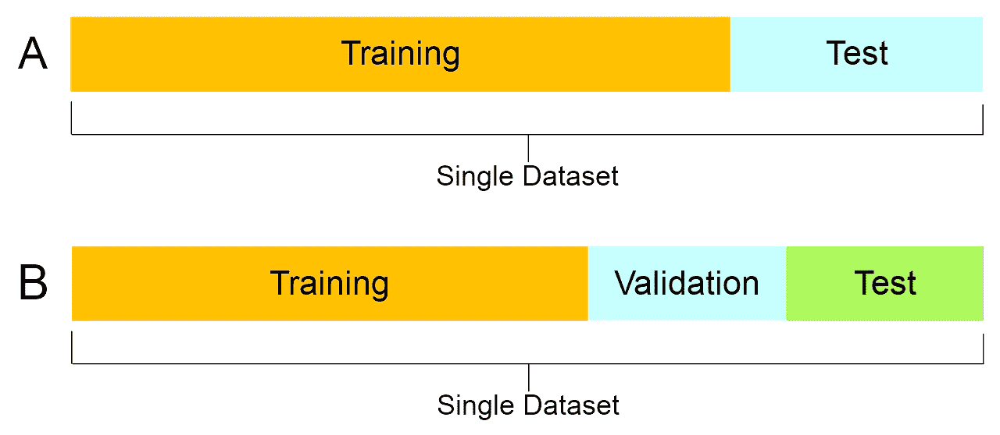
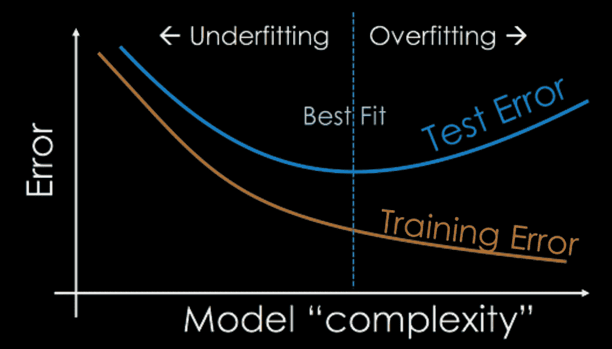

# 训练神经网络的最优数据划分

> 原文：<https://medium.com/mlearning-ai/optimal-data-division-for-training-neural-network-3c83726e9551?source=collection_archive---------5----------------------->

> 这篇文章解决了深度学习中最常见和最常见的问题“训练/验证/测试的比率应该是多少”

Photo by [Alina Grubnyak](https://unsplash.com/@alinnnaaaa?utm_source=unsplash&utm_medium=referral&utm_content=creditCopyText) on [Unsplash](https://unsplash.com/s/photos/neural-network?utm_source=unsplash&utm_medium=referral&utm_content=creditCopyText)

> 为什么我们需要这些拆分？

数据被分为不同的集合，用于不同的目的，这种做法非常普遍，被每个数据科学家采用，这有助于减少数据的过度拟合和评估模型的准确性。这些不同的分割服务于不同的目的，在训练集上训练模型，由验证集评估模型，最后，用测试集测试模型。

Train/ Test/ Split

在 A 部分中，数据被分成训练和测试两部分。这种情况通常发生在数据太小而不能分成三部分的时候。该模型根据数据进行训练，然后根据测试数据(未知数据/未标记数据)进行测试。这为我们提供了显示模型准确性的矩阵。

在 B 部分中，数据分为训练集、测试集和验证集，训练集和验证集在训练模型中起着重要作用，模型在训练集上训练，并根据验证集进行迭代测试(未知数据/未标记数据)，验证集不同于测试集。验证集实际上可以被视为训练集的一部分，因为它用于建立您的模型，即神经网络。它通常用于参数选择和避免过度拟合。当我们只在训练集上训练模型时，它可能会获得 100%的准确性和过度拟合，从而在测试集上获得非常差的性能。因此，独立于训练集的验证集被用于参数选择。这个过程通常被称为“交叉验证”。

> W **帽子太合身了，为什么要把它减到最小？**

当用训练数据训练模型时，模型很可能会过度拟合，过度拟合是模型一点一点地记住训练数据、其噪声以及特征，以至于在引入新数据时对模型的性能产生负面影响的情况。

有各种对策来减少过拟合，交叉验证是其中之一，并被广泛使用。交叉验证使用验证/维持集。

Overfitting and Underfitting

> **比例应该是多少？**

这是最大的数据块，用于训练模型，模型记住这些数据的特征来预测类别。这通常是整个数据的 70%。
验证和测试集通常等于剩余部分的 15%。测试数据用于测试新数据模型的性能，这表明我们的模型在现实世界中的表现如何。

> **当数据非常大，以百万计时会发生什么？**

对于如此大的数据集，这个比率是不够的，那么我们不能依赖默认比率，因为在每个时期之后都有交叉验证，用于评估的数据越多，减少这个时间所花费的时间就越长。我们使测试集更大，而其他测试集更小。例如，如果我们有 2000 万张图像来训练模型，我们可以采用 99.5:0.4:0.1 的比例，或者 98:1:1 的比例，或者任何可以加快训练速度并为模型提供更多数据以供学习的比例。这个决定取决于数据的大小和科学家。

> 小费

数据应该来自相同的分布，如果数据来自不同的分布，则模型可能表现不佳。假设训练数据来自 web(假设其质量很高),而测试集来自从移动设备捕获的图像，则模型在测试期间表现不佳的可能性很高。