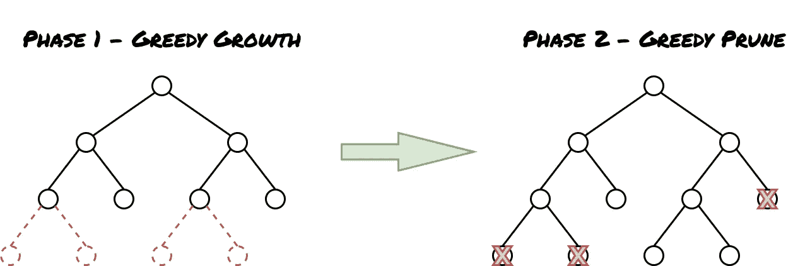
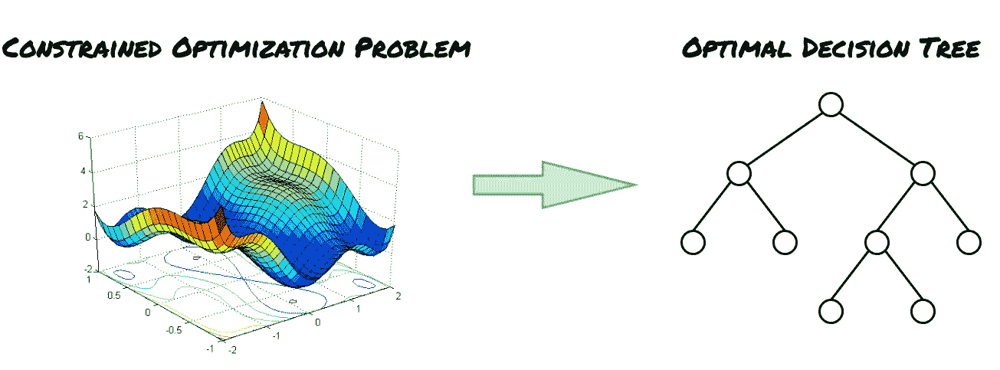

# 最优决策树

> 原文：<https://medium.com/mlearning-ai/optimal-decision-trees-dbd16dfca427?source=collection_archive---------0----------------------->

## 决策树的新前沿:获取小型高性能决策树的非贪婪训练

决策树是最流行的机器学习算法之一，并且构成了最成功的集成方法(即随机森林和梯度推进机器)的主要构件。可解释性经常被认为是受欢迎的主要原因。然而，决策树只有在很小的情况下才是可解释的，因此，所涉及的分裂和变量的数量很容易被人脑掌握。当树长得太大，树叶的深度超过 3 或 4 时，或者当它们与几十棵树聚集在一起时，大部分的可解释性价值就丧失了。所以，最大的问题是:我能训练小决策树来提供最先进的性能吗？回答:大概是的:)

# 一点历史:贪婪的训练

决策树传统上以贪婪的方式训练，一次又一次地分裂，直到满足终止标准。一旦完成，分割就不会被重新考虑，这就是贪婪的来源。之后可以执行修剪阶段，以控制模型的复杂性并限制过度拟合。基本上，训练分两个阶段进行:第一阶段，树(贪婪地)生长，第二阶段，树(贪婪地)收缩。

Greedy training of a decision tree: first the tree is grown split after split until a termination criterion is met, and afterwards the tree is pruned to avoid overly complex models.

贪婪地训练决策树的主要的，也可以说是唯一的原因是计算成本。众所周知，训练决策树是一个 *NP* 难题[1]。然而，近年来，求解器技术的巨大进步和计算能力的增加为改进决策树训练和摆脱纯粹的贪婪方法提供了几种可能性。

从贪婪训练转向全局优化方法可以一次构建树的所有节点，优化一个或多个总体标准可以产生几个优点:

*   **可解释性:**最优树往往更小，因此更易解释。
*   **全局约束:**给定问题公式化的数学优化性质，可以施加全局约束以增强可解释性、公平性或其他性能测量。
*   **一般化:**科学文献中的几项工作[2，3，4，5，6，7，8]表明，最优树比贪婪训练的树更容易一般化，贪婪训练的树被认为是弱学习者。然而，目前还不清楚最优树是否比随机森林或梯度推进方法等贪婪树的集合概括得更好。换句话说，最优决策树可以被认为是强分类器吗？
*   **小数据:**基于优化的机器学习算法(如支持向量机)倾向于在小数据问题上获得最先进的性能。然而，它们往往难以处理大型数据集，因为它们通常至少是线性缩放的(但通常更大！)与数据集中的样本数。

# 下一件大事:非贪婪训练

好吧，有很好的理由尝试以非贪婪的方式训练决策树，但是我实际上如何做呢？本文对文献中提出的拟合最优决策树(ODT)的方法进行了分类，重点组织了各种优化范例，即动态规划、约束规划、混合整数规划和连续优化。提醒一句:这篇文章并不是对最优决策树研究的详尽综述，而是感兴趣的研究者/从业者的起点。

Optimal training of a decision tree: a constrained optimisation is solved, and the decision tree is obtained as the solution. Loss function image taken from [here](https://algorithmia.com/blog/introduction-to-loss-functions).

## 动态规划

动态编程是一种优化技术，通过递归地将复杂问题分解成更简单的子问题来解决它们。可以用动态规划有效解决的一个经典问题是背包问题。

文献中很少有基于动态规划的 ODTs 的例子，其中有[2]。动态编程的目的是避免重复计算。这是在[2]和其他基于动态规划的最优决策树论文中通过使用以相当复杂的数学为特征的特别算法实现的，其解释超出了这篇短文的范围。

据我所知，基于动态规划的 ODT 公式是相当具体的，通常局限于具有二元或分类特征的分类问题。

## 约束编程

约束编程是一种优化范例，它将焦点放在约束上而不是目标函数上，以至于人们可以在根本没有目标函数的情况下制定问题(满意度问题)。通常使用约束传播、局部和回溯搜索以及动态编程的混合来解决约束程序。此外，通过在全局约束中编码特殊的组合结构，可以获得重大的性能提升，全局约束由特别算法解决(全局约束的经典例子是 *alldifferent* 约束)。

[3]中提出的 ODT 公式似乎非常有效，并且利用了新的全局约束(*覆盖*)和特定的搜索策略(*和/或搜索*)。然而，提出的模型只能处理分类问题，并且不清楚它如何能被扩展到回归。此外，需要将特征二进制化以馈入该模型，这使得该模型的适用性受到限制。

## 数学规划—混合整数优化

混合整数优化是一种范式，在这种范式中，我们试图最小化受一组约束的目标函数，并且决策变量既是连续的又是离散的。混合整数优化问题通常通过放松离散变量的完整性约束，以及求解连续优化问题来解决。然后，通过使用分支定界和切割试探法，恢复完整性约束，并找到可行解。众所周知，混合整数优化是一个 *NP* 难题。

基于混合整数优化的 ODT 是目前文献中最常见的，这使得很难选择一篇论文在这里引用。嗯…我要两个！ODT 在[4]中提出的理论可以说是我偶然发现的最完整的理论。它可以处理分类和回归问题，可以处理分类和连续特征，甚至可以引入公平性约束，以确保学习的树对于敏感特征是无歧视的。该模型使用 Gurobi 求解，没有提出特别的优化算法。该公式中变量的数量与数据集的大小成线性比例。不幸的是，看看训练时间，似乎[4]中提出的公式不能很好地扩展。这一方面由[5]解决，其中，与受众所周知的 1-范数支持向量机启发的新 ODT 公式一起，提出了一种数据选择方法，以允许该方法扩展到大数据集(实验中提出的具有 245k 样本的数据集，所有其他方法很难超过具有 5k 样本的数据集)。此外，作者提出了一个特设切割方法，加强了连续松弛，提高了模型的运行时间。

## 数学规划——连续优化

正如我们在上一节提到的，解决混合优化问题最困难的部分是离散变量带来的完整性约束。因此，尝试制定一个完全避免离散变量的 ODT 是有吸引力的。这正是本节中介绍的公式的作用。从从业者的角度来看，这一系列方法的一个主要吸引人的方面是，由于这些模型是连续的，因此可以使用各种基于梯度的方法进行优化，这些方法在 Tensorflow 或 Pytorch 等框架中很容易获得。很多功能，包括 GPU 加速，可能都是免费的！

[6]中提出的公式是一个基于损失函数上限的模型，这将很难优化。这个上限可以使用连续优化技术进行优化，如小批量 SGD。该模型可以执行分类(二元和多类)和回归，并且可以处理所有类型的特征。主要缺点是，由于损失是非凸的，该方法不提供任何最优保证。此外，可能很难施加额外的约束，但另一方面，考虑到连续优化的性质，目标函数可以非常灵活。

最近[7]，除了提出一个非常有趣和简单的非贪婪决策树公式(基于树节点的概率解释)之外，还向 ODTS 的特征重要性分析迈出了第一步。

# 结论

从这篇短文所引用的论文的出版年份可以看出，目前 ODT 研究正在蓬勃发展。关于 ODT 如何与贪婪决策树和系综树进行比较的许多方面仍然不清楚。在我看来，ODT 的圣杯将是能够产生一个在性能上与系综树(随机森林，梯度推进机器)不相上下的决策树，但是它更紧凑，因此更容易解释。此外，ODT 应该在计算上是可行的，并且可以扩展到大数据集，这对于大多数当前提出的公式来说不是这样。

总的来说，机器学习和离散优化的领域越来越近，开辟了新的视野。我可以推荐[8]作为关于这个主题的优秀书籍，涵盖了机器学习和离散优化相遇的几个主题，其中包括最优决策树、规范分析、实验设计等等。

# 参考

[1] Hyafil L .，Rivest R. L. (1976 年)。构造最优二元决策树是 np 完全的。信息处理信函，5(1)，15–17。

[2]林 j，钟 c，胡 d，鲁丁 c，萨尔茨 M. (2020)。广义可扩展最优稀疏决策树。第 37 届机器学习国际会议论文集，119:6150–6160。此处提供[开源代码。](https://github.com/xiyanghu/OSDT)

[3] Verhaeghe H .，Nijssen S .，Pesant G .，Quimper C.G .，Schaus P.(2019 年)。使用约束规划学习最优决策树。第 25 届国际会议关于原则和惯例对约束编程。开源代码可用[这里](https://bitbucket.org/helene_verhaeghe/classificationtree/src/master/)。

[4] Aghaei S .，Azizi M.J .，Vayanos P.(2019 年)。非歧视决策的学习最优公平决策树。第 33 届 AAAI 人工智能会议论文集，201

[5] Zhu H .，Murali P .，Phan D .，Nguyen L .，kalagnanm j .(2020 年)。一种基于可伸缩 MIP 的学习最优多元决策树的方法。神经信息处理系统进展 33(neopps 2020)

[6]诺鲁齐 m .，Collins M .，Johnson M .，Fleet D.J .，Kohli P.(2015 年)。决策树的有效非贪婪优化。第 28 届国际神经信息处理系统会议录(NIPS 2015)。

[7]blankero r .，Carrizosa E .，Molero-Río C .，Romero Morales D.(2021 年)。最佳随机分类树，计算机和运筹学。

[8] Bertsimas D .，Dunn J.(2019 年)。现代优化视角下的机器学习。Dynamic Ideas LLC