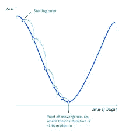
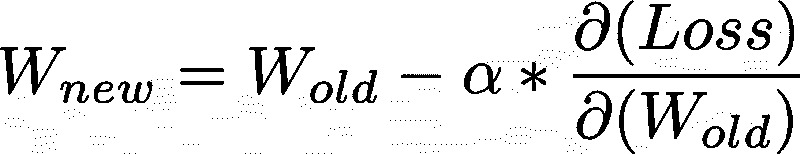
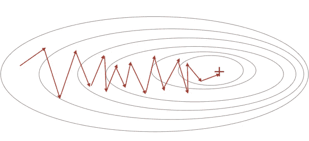
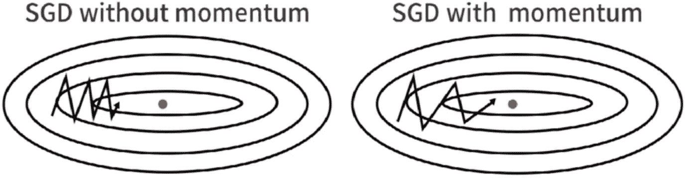
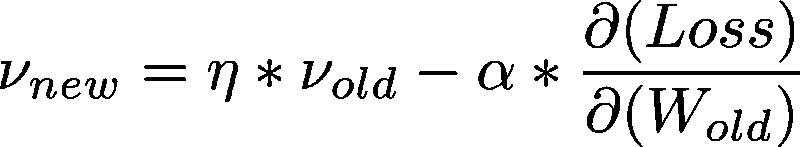
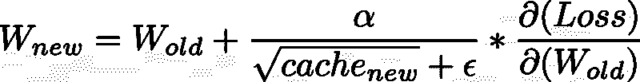
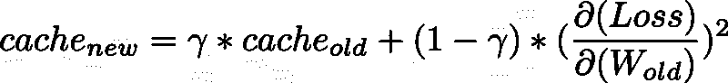
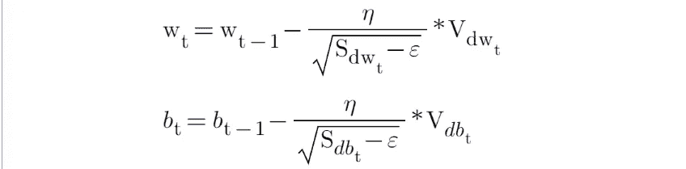

# 深度学习中的优化器

> 原文：<https://medium.com/mlearning-ai/optimizers-in-deep-learning-7bf81fed78a0?source=collection_archive---------0----------------------->

# 什么是优化器？

**优化器**是用于最小化误差函数(*损失函数*)或最大化生产效率的算法或方法。优化器是数学函数，取决于模型的可学习参数，即权重&偏差。优化器帮助知道如何改变神经网络的权重和学习速率来减少损失。

这篇文章将带你了解优化器和一些流行的方法。

# 优化器的类型

让我们来了解不同类型的优化器，以及它们是如何将损失函数最小化的。

# **梯度下降**

梯度下降是一种基于凸函数的优化算法，它反复调整凸函数的参数，以使给定函数最小化到其局部最小值。梯度下降通过在与最陡上升相反的方向上移动来迭代地减少损失函数。寻找最小值依赖于损失函数的导数。使用整个训练集的数据来计算成本函数对参数的梯度，这需要大量的存储器并且减慢了过程。

Gradient Descent

**梯度下降的优点**

1.  容易理解
2.  易于实施

**梯度下降的缺点**

1.  因为这种方法在一次更新中计算整个数据集的梯度，所以计算非常慢。
2.  它需要很大的内存，并且计算量很大。

# 学习率

梯度下降进入局部最小值方向的步长有多大/多小由学习速率决定，学习速率计算出我们向最优权重移动的快慢。

Learning Rate

# 随机梯度下降

这是梯度下降的一个变种。它逐个更新模型参数。如果模型有 10K 数据集，SGD 将更新模型参数 10k 次。

Stochastic Gradient Descent

**随机梯度下降的优势**

1.  模型参数的频繁更新
2.  需要更少的内存。
3.  允许使用大型数据集，因为一次只需更新一个示例。

**随机梯度下降的缺点**

1.  这种频繁还会导致噪声梯度，从而导致误差增加而不是减少。
2.  高方差。
3.  频繁更新的计算成本很高。

# 小批量梯度下降

它结合了 SGD 和批量梯度下降的概念。它只是将训练数据集分成小批，并对每一批执行更新。这在随机梯度下降的鲁棒性和批量梯度下降的效率之间建立了平衡。它可以减小参数更新时的方差，收敛更稳定。它将数据集分成随机选择的 50 到 256 个样本。

Mini Batch Gradient Descent

**小批量梯度下降的优势:**

1.  它导致更稳定的收敛。
2.  更高效的梯度计算。
3.  需要更少的内存。

**小批量梯度下降的缺点**

1.  小批量梯度下降不能保证良好的收敛性，
2.  如果学习率太小，收敛速度会很慢。如果太大，损失函数会在最小值处振荡甚至偏离。

# 带动量的 SGD

**带动量的 SGD**是一种在常规随机梯度下降中加入动量项的随机优化方法。动量模拟物体在运动时的惯性，即在更新时一定程度上保留前一次更新的方向，而用当前的更新梯度来微调最终的更新方向。这样就可以在一定程度上增加稳定性，让自己学得更快，也有能力摆脱局部优化。

SGD with Momentum

Momentum Formula

**带动量的 SGD 的优势**

1.  动量有助于降低噪音。
2.  指数加权平均用于平滑曲线。

**带动量的 SGD 的缺点**

1.  增加了额外的超参数。

# **AdaGrad(自适应梯度下降)**

在我们之前讨论的所有算法中，学习率保持不变。AdaGrad 背后的直觉是，我们可以基于不同的迭代对每个隐藏层的每个神经元使用不同的学习速率。

**AdaGrad 的优势**

1.  学习率随着迭代自适应地变化。
2.  它也能够训练稀疏数据。

**阿达格拉德的缺点**

1.  如果神经网络很深，学习率变得非常小，这将导致死神经元问题。

# 均方根传播

RMS-Prop 是 Adagrad 的特殊版本，其中学习速率是梯度的指数平均值，而不是梯度平方的累积和。RMS-Prop 基本上结合了动量和 AdaGrad。

**RMS-Prop 的优势**

1.  在 RMS-Prop 中，学习率会自动调整，并为每个参数选择不同的学习率。

**RMS-Prop 的缺点**

1.  缓慢的学习

# 阿达德尔塔

Adadelta 是 Adagrad 的扩展，它也试图减少 Adagrad 的攻击性，单调地降低学习率，并消除学习率衰减的问题。在 Adadelta 中，我们不需要设置默认的学习速率，因为我们采用先前时间步长的运行平均值与当前梯度的比值。

**阿达德尔塔的优势**

1.  AdaDelta 的主要优点是我们不需要设置默认的学习速率。

**阿达德尔塔的缺点**

1.  计算成本高

# Adam(自适应矩估计)

Adam optimizer 是最流行和最著名的梯度下降优化算法之一。这是一种为每个参数计算自适应学习率的方法。它存储过去梯度的衰减平均值(类似于动量)和过去平方梯度的衰减平均值(类似于 RMS-Prop 和 Adadelta)。因此，它结合了两种方法的优点。

**亚当的优点**

1.  易于实施
2.  计算效率高。
3.  内存需求小。

# 比较

Optimizers Comparison

**Optimization on saddle point**

# 如何选择优化器？

*   如果数据稀疏，使用自适用的方法，即 Adagrad、Adadelta、RMSprop、Adam。
*   RMSprop，Adadelta，Adam 在很多情况下都有类似的效果。
*   Adam 只是在 RMSprop 的基础上增加了偏差修正和动量，
*   随着梯度变得稀疏，Adam 的性能将优于 RMSprop。

我希望这篇文章能够帮助你学习和理解这些概念。

 [## Mlearning.ai 提交建议

### 如何成为 Mlearning.ai 上的作家

medium.com](/mlearning-ai/mlearning-ai-submission-suggestions-b51e2b130bfb) 

[成为 ML 作家](/mlearning-ai/mlearning-ai-submission-suggestions-b51e2b130bfb)