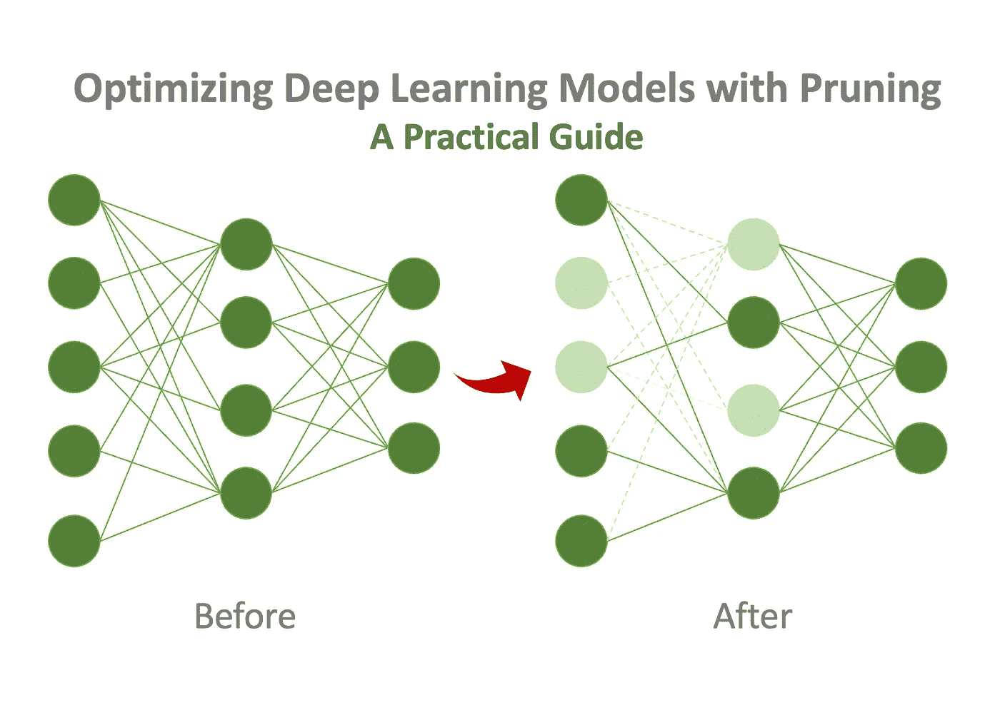

# 用剪枝优化深度学习模型:实用指南

> 原文：<https://medium.com/mlearning-ai/optimizing-deep-learning-models-with-pruning-a-practical-guide-163e990c02af?source=collection_archive---------1----------------------->

## 用 TensorFlow 和 PyTorch 探索和实现剪枝方法

Optimizing Deep Learning Model with Pruning: A Practical Guide

如果你对提高机器和深度学习模型的效率和复杂性感兴趣，你可能听说过一种叫做模型修剪的技术。

> 在这篇博文中，我将探索…