# 用 GridSearchCV 优化机器学习模型

> 原文：<https://medium.com/mlearning-ai/optimizing-machine-learning-models-with-gridsearchcv-c3ff518c3a48?source=collection_archive---------2----------------------->

开发机器学习模型的主要挑战之一是选择最佳模型超参数。超参数是定义模型算法将如何学习的细节的设置。根据模型的不同，它们可以控制学习功能，例如算法如何迭代解决方案、计算内部功能或对预测进行加权。

虽然大多数 ML 模型都有很好的记录，超参数选择仍然很迟钝。选择最佳设置通常需要迭代不同的选项，看看它们如何影响模型精度，这个过程称为*网格搜索*。幸运的是，Scikit-learn 已经开发了`[GridSearchCV](https://scikit-learn.org/stable/modules/generated/sklearn.model_selection.GridSearchCV.html?highlight=grids#sklearn.model_selection.GridSearchCV)` [工具](https://scikit-learn.org/stable/modules/generated/sklearn.model_selection.GridSearchCV.html?highlight=grids#sklearn.model_selection.GridSearchCV)来自动化这个过程。`GridSearchCV`还会在遍历选项时存储超参数组合的精确度分数，从而方便地探索这些选项对模型的影响。让我们看看它是如何工作的。

这个工作流程是在 Python 3.10 中创建的，相应的 Jupyter 笔记本可以在[这里](https://github.com/RDhoelzle/gridsearchcv_optimization)找到。

# 1.导入和处理数据

该项目使用了 [kaggle](https://www.kaggle.com/datasets/mdmahmudulhasansuzan/students-adaptability-level-in-online-education) 上的“在线教育中的学生适应性水平”公共数据集，并在 *2021 年第 12 届国际计算、通信和网络技术会议(ICCCNT)* 会议录(DOI:10.1109/ICC CNT 51525 . 2021 . 579741)中发表为[使用机器学习方法的在线教育中的学生适应性水平预测](https://ieeexplore.ieee.org/document/9579741)。在这里，作者收集了一系列在线学习学生的人口统计、经济和其他背景数据，以及他们对在线学习适应性的个人得分。然后作者利用这些数据，通过建立机器学习分类器模型来预测新生的适应水平。他们比较了一系列模型的准确性，包括`K-Nearest Neighbors`、`Decision Tree`、`Random Forest`、`Support Vector Machine`、`Artificial Neural Network`和`Naive Bayes`，为我们开发和比较自己的分类器模型提供了很好的参考点。

让我们从下载并导入数据作为一个`pandas`数据帧开始。

```
#download and import data
import wget
import os.path
import pandas as pdfile_path = 'data/students_adaptability_level_online_education.csv'
if not os.path.isfile(file_path):
    url = '[https://www.kaggle.com/datasets/mdmahmudulhasansuzan/students-adaptability-level-in-online-education?select=students_adaptability_level_online_education.csv'](https://www.kaggle.com/datasets/mdmahmudulhasansuzan/students-adaptability-level-in-online-education?select=students_adaptability_level_online_education.csv')
    wget.download(url, out = file_path)

df = pd.read_csv(file_path)
df.head()
```

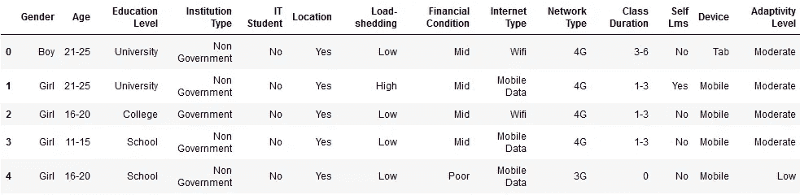

Screenshot by author

看起来我们所有的变量都是对象。让我们在处理数据之前确认一下。

```
#check data structure
df.dtypes
```

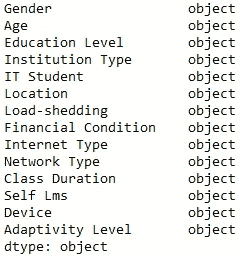

Screenshot by author

为了构建和探索一系列分类器模型，我们需要将数据转换为编码整数。首先，让我们按字母顺序对每个变量的`value_counts`进行排序，并将它们保存到变量列表的字典中。然后，我们将使用每个值的列表索引作为新编码数据帧中的整数。

```
#check distribution of all data values and list values in dict
values_dict = {}
for column in df:
    values_dict[column] = df[column].value_counts().sort_index().index.to_list()#inspect values
values_dict
```


Screenshot by author

**年龄**、**教育程度**、**财务状况**依次为。也就是说他们有一个自然的等级顺序。由于这些值当前是按字母顺序排列的，因此当前列出的顺序与它们的自然排序不匹配。虽然这不会影响我们的分类器模型的准确性，但它确实使数据探索和模型解释变得复杂。为了让接下来的事情变得更容易，让我们在处理最终的编码数据帧之前，手动对这些值进行重新排序。请记住，在构建实时模型时，所有新数据都需要以同样的方式进行预处理。

```
#reorder lists
order = [0,5,1,2,3,4]
values_dict[‘Age’] = [values_dict[‘Age’][i] for i in order]order = [1,0,2]
values_dict[‘Education Level’] = [values_dict[‘Education Level’][i] for i in order]
values_dict[‘Financial Condition’] = [values_dict[‘Financial Condition’][i] for i in order]order = [1,0]
values_dict[‘Institution Type’] = [values_dict[‘Institution Type’][i] for i in order]
values_dict[‘Load-shedding’] = [values_dict[‘Load-shedding’][i] for i in order]order = [1,2,0]
values_dict[‘Adaptivity Level’] = [values_dict[‘Adaptivity Level’][i] for i in order]#build integer-coded dataframe
coded_dict = {}
for column in df:
    coded_dict[column] = []
    for i in range(0,df.shape[0]):
        coded_dict[column].append(values_dict[column].index(df[column][i]))coded_df = pd.DataFrame(coded_dict)
coded_df.head()
```

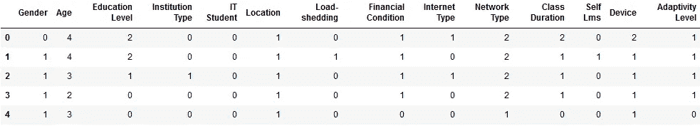

Screenshot by author

# 2.数据探索

既然数据是整数编码的，我们可以在数据集中寻找任何明显的趋势。我总是喜欢从相关矩阵开始，它可以快速可视化相关变量。在这里，我们将使用 *Spearmans 的等级相关性*来说明这些是分级整数的事实，并且我们将把结果矩阵绘制成热图。

```
#plot correlation matrix
import seaborn as sns
import matplotlib.pyplot as pltcmap = sns.color_palette(“vlag”, as_cmap=True).reversed()
sns.heatmap(coded_df.corr(method=’spearman’), cmap=cmap, vmin=-1, vmax=1)
plt.show()
```

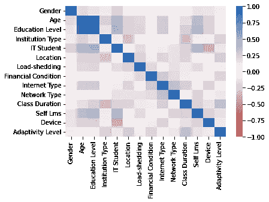

Correlation heatmap of coded data.

鉴于获得教育需要时间(我们大多数人进步的速度都差不多)，毫不奇怪**的年龄**和**的教育水平**相互之间有很强的相关性。然而，与**适应性水平**没有很强的个体相关性，表明需要进行多变量探索。值得注意的是，响应变量与**课时**、**财务状况**和**位置**之间存在微弱的正相关，这似乎表明，生活在城镇中、接受更多教师互动的资源丰富的学生适应得最好。与**机构类型**也存在微弱的负相关，表明民办学校比公办学校具有更高的适应性。

由于没有一个变量与**适应性水平**有很强的相关性，让我们纵坐标(维度减少)数据，看看在整个数据结构中是否有任何聚类。首先，我们将数据标准化。然后我们将使用`Principal Component Analysis`进行排序，它沿着可变性最大的维度投影全部数据(在这里阅读更多关于排序的信息[)。](https://towardsdatascience.com/a-one-stop-shop-for-principal-component-analysis-5582fb7e0a9c)

```
#split X and Y, and standardize X
import numpy as np
import sklearn
from sklearn import preprocessingY = coded_df[‘Adaptivity Level’].to_numpy()
X = coded_df.loc[:, coded_df.columns != ‘Adaptivity Level’].to_numpy()
xform = preprocessing.StandardScaler()
X_z = xform.fit(X).transform(X)#define pca plot fuction
def plot_pca(ordi,lab,y):
    '''
    Generates biplot of 1st and 2nd axes from an ordination model
    '''
    plt.figure()
    plt.scatter(ordi[y==0, 0], ordi[y==0, 1], color='red', label='Low')
    plt.scatter(ordi[y==1, 0], ordi[y==1, 1], color='blue', label='Moderate')
    plt.scatter(ordi[y==2, 0], ordi[y==2, 1], color='green', label='High')
    plt.xlabel(lab[0])
    plt.ylabel(lab[1])
    plt.legend()
    plt.show()#train and plot PCA
from sklearn.decomposition import PCApca = PCA()
X_pca = pca.fit_transform(X_z)
labels = [f"PCA1 ({pca.explained_variance_ratio_[0]*100:.1f}%)",
          f"PCA2 ({pca.explained_variance_ratio_[1]*100:.1f}%)"]
plot_pca(X_pca,labels,Y)
```

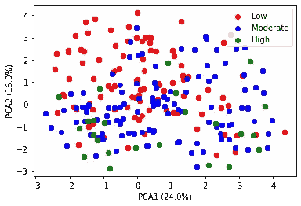

Principle component analysis biplot, colored by **Adaptivity Level**

虽然有一个轻微的明显趋势，即*向左上方的适应性低*和*向右下方的适应性高*，但是这个趋势是微弱的和高度混合的。第一个和第二个*主成分*仅占总数据可变性的 39.0%，因此我们无法从简单排序的二维数据中获得有意义的分离。还有其他排序方法，它们应用更结构化的数据投影，试图最大化固有的数据结构。`t-Distributed Stochastic Neighbor Embedding`就是这样一种尝试最大化自然数据聚类的方法。

```
#train and plot tSNE
from sklearn.manifold import TSNEtsne = TSNE(n_components=2, learning_rate=300, perplexity=30, early_exaggeration=12, init=’random’, random_state=2019)
X_tsne = tsne.fit_transform(X_z)
labels = [“tSNE1”,”tSNE2"]
plot_pca(X_tsne,labels,Y)
```

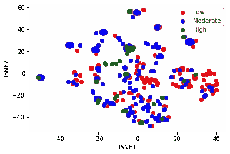

t-Distributed stochastic neighbor embedding biplot, colored by **Adaptivity Level**

显然有许多相似的学生群，但他们并不根据适应性水平来区分。让我们看看我们能用一些常见的 ML 分类算法做些什么。在这里，我们将使用`Logistic Regression`、`K-Nearest Neighbors`、`Decision Tree`、`Random Forest`、`Support Vector Machine`和`Artificial Neural Network`。在最初的出版物中，作者没有使用`Logistic Regression`，尽管它允许多分类，但对于 n > 2 类来说，它的性能通常不太好。然而，他们确实建立了一个`Naive Bayes`模型，该模型假设独立变量之间互不影响。然而，我们可以合理地假设某些变量之间的相互作用，例如受教育程度越高的学生年龄越大，经济富裕的学生越有可能负担得起更高的网速和更昂贵的设备。因此，对于该数据集来说，这不是一个有效的假设，因此我们将不包括`Naive Bayes`模型。

# 3.基于 GridSearchCV 的模型优化

所有机器学习算法都有一系列超参数，这些参数会影响它们如何构建模型。其中包括`regularization parameters`、`scaling values`、`solver algorithms`、`tree depth`和`number of neighbors`等等。这些超参数的最佳设置很少是显而易见的，因此有必要在这些设置的范围内迭代和测量模型精度。`GridSearchCV`通过运行这些超参数的所有组合的复制`cross-validations`，然后选择具有最高模型精度的超参数集，来自动化该过程。

我们首先将数据随机分为训练集(80%)和测试集(20%)。`GridSearchCV`还将测试训练分割输入的训练数据，并因此报告样本内训练精度的准确度。为了比较和选择最佳的整体模型，我们还需要用测试集测量样本外的准确性。我们还将过滤掉警告消息，将打印输出限制为仅显示进度消息。

```
#split train and test data sets
from sklearn.model_selection import train_test_splitX_train, X_test, Y_train, Y_test = train_test_split(X_z, Y, test_size=0.2, random_state=2)#ignore all warnings
from warnings import simplefiltersimplefilter(action='ignore')
```

现在我们可以开始优化我们的第一个模型。先从`Logistic Regression`说起吧。在建立新模型之前，最好先查看一下[用户指南](https://scikit-learn.org/stable/modules/generated/sklearn.linear_model.LogisticRegression.html)中的超参数描述。对于我们的数据集，我们将优化`C`、`penalty`和`solver`超参数，同时将`multi_class`设置为`multinomial`。这是使用`parameters`字典完成的。然后，我们使用`parameters`和`Logisitic Regression`模型对象以及定义数量的`cross-validations`创建一个`GridSearchCV`对象(这里我们使用 10 个)。最后，我们通过拟合训练数据来优化我们的模型。

```
#train logistic regression
from sklearn.model_selection import GridSearchCV
from sklearn.linear_model import LogisticRegressionparameters = {'C': np.logspace(-2, 0, 20),
              'penalty': ['none', 'l2', 'l1', 'elasticnet'],
              'solver': ['newton-cg', 'lbfgs', 'sag', 'saga'],
              'multi_class': ['multinomial']}
lr = LogisticRegression()
grid_search = GridSearchCV(lr, parameters, cv=10, verbose=0)
logreg_cv = grid_search.fit(X_train, Y_train)
```

一旦`GridSearchCV`完成优化我们的模型，我们可以检查我们的最终超参数值、样本内精度和样本外精度。

```
#test logistic regression
print(“Tuned hpyerparameters (best parameters):”, logreg_cv.best_params_)
print(“Train accuracy:”, logreg_cv.best_score_)
print(“Test accuracy:”, logreg_cv.best_estimator_.score(X_test, Y_test))
```

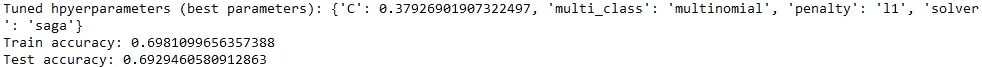

Screenshot by author

我们还可以提取每个测试超参数组合的样本内得分，以探索每个参数如何影响模型准确性。

```
#plot logreg scores
logreg_cv_df = pd.DataFrame(logreg_cv.cv_results_[‘params’])
logreg_cv_df[‘score’] = logreg_cv.cv_results_[‘mean_test_score’]sns.lineplot(data=logreg_cv_df, x=’C’, y=’score’, hue=’penalty’)
plt.show()
```

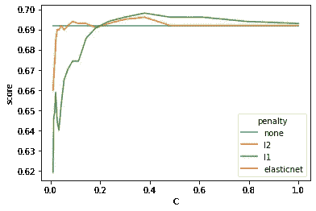

Lineplot of **C** by **score** for different **penalty** values.

最精确的`Logistic Regression`模型是用 l1 和 l2 `pentalty`项以及大约为 0.4 的`regularization`项实现的。尽管如此，在最大准确率为 70%的情况下，这远远低于原始出版物中的最佳模型(使用`Random Forest`模型获得了 89.63%的准确率)。

让我们看看使用`K-Nearest Neighbors`是否能得到更好的结果。

```
#train k-nearest neighbors
from sklearn.neighbors import KNeighborsClassifierparameters = {'n_neighbors': list(range(1, 20)),
              'weights': ['uniform', 'distance'],
              'algorithm': ['auto', 'ball_tree', 'kd_tree', 'brute'],
              'p': [1,2]}
knn = KNeighborsClassifier()
grid_search = GridSearchCV(knn, parameters, cv=10, verbose=0)
knn_cv = grid_search.fit(X_train, Y_train)#test k-nearest neighbors
print("Tuned hpyerparameters (best parameters):", knn_cv.best_params_)
print("Train accuracy:", knn_cv.best_score_)
print("Test accuracy:", knn_cv.best_estimator_.score(X_test, Y_test))
```

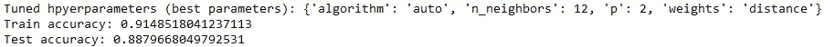

Screenshot by author

```
#plot knn scores
knn_cv_df = pd.DataFrame(knn_cv.cv_results_[‘params’])
knn_cv_df[‘score’] = knn_cv.cv_results_[‘mean_test_score’]sns.lineplot(data=knn_cv_df, x=’n_neighbors’, y=’score’, hue=’weights’, style=’algorithm’)
plt.show()
```

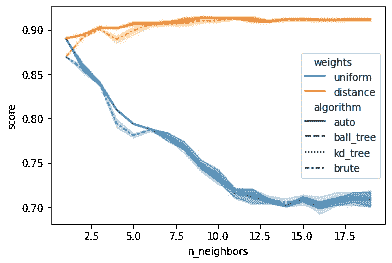

Lineplot of **n_neighbors** by **score** for different **weights** and **algorithm** values.

邻域`weighting`方法是对`K-Nearest Neighbors`模型准确性影响最大的超参数。计算类型`algorithm`在较低的`n_neighbor`值时也发挥了重要作用，但其影响在大约 10 个邻居以上减弱。该模型获得了 88.80%的样本外准确率，接近原作者用`Random Forest`模型获得的 89.63%的准确率。

接下来，我们来造一个`Decision Tree`。

```
#train decision tree
from sklearn.tree import DecisionTreeClassifierparameters = {'criterion': ['gini', 'entropy', 'log_loss'],
              'splitter': ['best', 'random'],
              'max_depth': [2*n for n in range(1,10)],
              'max_features': ['auto', 'sqrt', 'log2'],
              'min_samples_leaf': [1, 2, 4],
              'min_samples_split': [2, 5, 10]}
tree = DecisionTreeClassifier()
grid_search = GridSearchCV(tree, parameters, cv=10, verbose=0)
tree_cv = grid_search.fit(X_train, Y_train)#test decision tree
print("Tuned hpyerparameters (best parameters):", tree_cv.best_params_)
print("Train accuracy:", tree_cv.best_score_)
print("Test accuracy:", tree_cv.best_estimator_.score(X_test, Y_test))
```

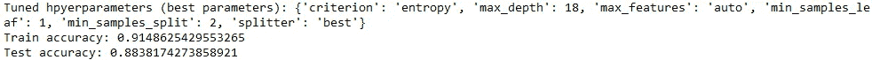

Screenshot by author

```
#plot decision tree scores
tree_cv_df = pd.DataFrame(tree_cv.cv_results_[‘params’])
tree_cv_df[‘score’] = tree_cv.cv_results_[‘mean_test_score’]sns.lineplot(data=tree_cv_df, x=’max_depth’, y=’score’, hue=’min_samples_leaf’, style=’min_samples_split’)
plt.show()
```

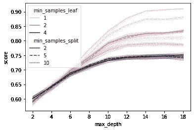

Lineplot of **max_depth** by **score** for different **min_samples_leaf** and **min_samples_split** values.

使用最小的`min_samples_leaf`和`min_samples_split`值和最高的树`max_depth`时，`Decision Tree`模型表现最佳。这表明该模型需要进行许多小的划分，以便对样品进行分类，这与通过排序产生聚类的困难是一致的。该模型仍然达到了 88.38%的高精度，尽管这种高深度、细粒度的变量分裂不是非常有效。

现在到了`Random Forest`，这是一个`Decision Tree`“元估计器”。这也给了原作者他们最好的结果。

```
#train random forest
from sklearn.ensemble import RandomForestClassifierparameters = {'criterion': ['gini', 'entropy', 'log_loss'],
              'max_depth': [2*n for n in range(1,10)],
              'max_features': ['auto', 'sqrt', 'log2'],
              'min_samples_leaf': [1, 2, 4],
              'min_samples_split': [2, 5, 10]}
forest = RandomForestClassifier()
grid_search = GridSearchCV(forest, parameters, cv=10, verbose=0)
forest_cv = grid_search.fit(X_train, Y_train)#test random forest
print("Tuned hpyerparameters (best parameters):", forest_cv.best_params_)
print("Train accuracy:", forest_cv.best_score_)
print("Test accuracy:", forest_cv.best_estimator_.score(X_test, Y_test))
```

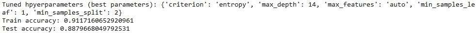

Screenshot by author

```
#plot random forest scores
forest_cv_df = pd.DataFrame(forest_cv.cv_results_[‘params’])
forest_cv_df[‘score’] = forest_cv.cv_results_[‘mean_test_score’]sns.lineplot(data=forest_cv_df, x=’max_depth’, y=’score’, hue=’min_samples_leaf’, style=’min_samples_split’)
plt.show()
```

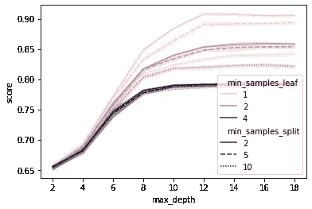

Lineplot of **max_depth** by **score** for different **min_samples_leaf** and **min_samples_split** values.

我们的`Random Forest`模型，从 100 个独立的决策树中获得一致*投票*，仅仅略微提高了原始`Decision Tree`的准确性。它仍然依赖于最小的`min_samples_leaf`和`min_samples_split`值，尽管将`max_depth`减少到了 14。令人惊讶的是，我们的`Random Forest`与原始出版物相比表现不佳，尽管作者没有描述他们选择了哪些超参数，我们也没有调整这里所有可能的参数。

我们将稍微不同地优化我们的`Support Vector Machine`模型。支持向量机找到一个超平面函数来最大化类别之间的分离，以一种逆排序的方式向数据添加更高维度。与其他模型相比，这是一个计算量很大的模型，我的机器(32GB RAM，3600Mhz/8CPU)在试图一次运行它时停滞不前。这里使用的嵌套 for-loop 方法是对`GridSearchCV`的手动迭代，一次只执行整个网格搜索的一小部分。这仍然花了我的机器 4 天时间来完成，所以我建议用`verbose`设置来启用一些进度消息，以保持你的理智。

```
#train support vector machine
from sklearn.svm import SVCsvm_params = []
svm_scores = np.empty(0)
for i in np.logspace(-3, 3, 10):
    for j in range(2,5):
        for k in np.logspace(-3, 1, 10):
            parameters = {'C': [i],
                          'kernel': ['linear', 'poly', 'rbf', 'sigmoid'],
                          'degree': [j],
                          'gamma': [k]}
            svm = SVC()
            grid_search = GridSearchCV(svm, parameters, cv=10, verbose=1)
            svm_cv = grid_search.fit(X_train, Y_train)

            svm_params = svm_params + svm_cv.cv_results_['params']
            svm_scores = np.append(svm_scores, svm_cv.cv_results_['mean_test_score'])#test support vector machine
print("Tuned hpyerparameters (best parameters):", svm_params[np.argmax(svm_scores)])
print("Train accuracy:", np.max(svm_scores))
svm_cv = SVC(C=svm_params[np.argmax(svm_scores)]['C'],
             degree=svm_params[np.argmax(svm_scores)]['degree'],
             gamma=svm_params[np.argmax(svm_scores)]['gamma'],
             kernel=svm_params[np.argmax(svm_scores)]['kernel'])
svm_cv.fit(X_train, Y_train)
print("Test accuracy:", svm_cv.score(X_test, Y_test))
```

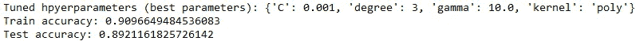

Screenshot by author

```
#plot svm scores
svm_cv_df = pd.DataFrame(svm_params)
svm_cv_df['score'] = svm_scoresfrom mpl_toolkits.mplot3d import Axes3D
fig = plt.figure()
ax = fig.gca(projection='3d')
surf = ax.plot_trisurf(svm_cv_df[(svm_cv_df['C']==0.001) & (svm_cv_df['kernel']=='poly')]['degree'],
                       svm_cv_df[(svm_cv_df['C']==0.001) & (svm_cv_df['kernel']=='poly')]['gamma'],
                       svm_cv_df[(svm_cv_df['C']==0.001) & (svm_cv_df['kernel']=='poly')]['score'],
                       cmap=plt.cm.viridis, linewidth=0.2)
ax.view_init(18,300)
ax.set_xlabel('degree')
ax.set_ylabel('gamma')
ax.set_zlabel('score')
plt.show()
```

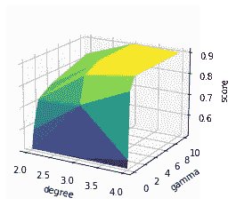

Surface plot of **gamma** and **degree** by **score**.

`Support Vector Machine`以 89.21%的准确率提供了最好的分类。尽管这仍然稍微低于原始出版物中的模型。多项式`degree`和`gamma`标度是最重要的超参数。

最后，我们来看一款`Artificial Neural Net`车型。

```
#train artificial neural network
from sklearn.neural_network import MLPClassifierparameters = {'activation': ['identity', 'logistic', 'tanh', 'relu'],
              'solver': ['lbfgs', 'sgd', 'adam'],
              'alpha': np.logspace(-5, 0, 10),
              'learning_rate': ['adaptive'],
              'max_iter': [1000]}
ann = MLPClassifier()
grid_search = GridSearchCV(ann, parameters, cv=10, verbose=0)
ann_cv = grid_search.fit(X_train, Y_train)#test artificial neural network
print("Tuned hpyerparameters (best parameters):", ann_cv.best_params_)
print("Train accuracy:", ann_cv.best_score_)
print("Test accuracy:", ann_cv.best_estimator_.score(X_test, Y_test))
```

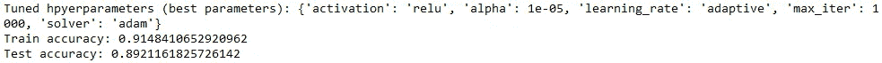

Screenshot by author

```
#plot ann scores
ann_cv_df = pd.DataFrame(ann_cv.cv_results_['params'])
ann_cv_df['score'] = ann_cv.cv_results_['mean_test_score']sns.lineplot(data=ann_cv_df, x='alpha', y='score', hue='solver', style='activation')
plt.legend(loc='lower right')
plt.show()
```

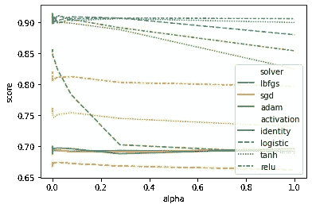

Lineplot of **alpha** by **score** for different **solver** and **activation** values.

`Artificial Neural Network`比`Support Vector Machine`具有更高的样本内准确率，但相当于 89.21%的样本外准确率。`solver`超参数对模型精度的影响最大，lbfgs 表现最好，尤其是使用 tanh 和 relu `activation`函数。这与 [ANN 文档](https://scikit-learn.org/stable/modules/generated/sklearn.neural_network.MLPClassifier.html?highlight=mlpclassifier#sklearn.neural_network.MLPClassifier)一致，后者推荐 lbfgs 在小数据集上更快收敛。

`GridSearchCV`还能够比 SVM 更快地优化人工神经网络，优化时间为 1 小时，而优化时间为 4 天，这使得人工神经网络成为该数据集更高效的实施选项。

# 4.最终模型比较

最后，我们将直接比较模型的准确性，并构建混淆矩阵，以查看每个模型的优势和不足。

```
#compare models
print("Logistic Regression: {}\nKNN: {}\nDecision Tree: {}\nRandom Forest: {}\nSVM: {}\nANN: {}".format(
    logreg_cv.best_estimator_.score(X_test, Y_test),
    knn_cv.best_estimator_.score(X_test, Y_test),
    tree_cv.best_estimator_.score(X_test, Y_test),
    forest_cv.best_estimator_.score(X_test, Y_test),
    svm_cv.score(X_test, Y_test),
    ann_cv.best_estimator_.score(X_test, Y_test)))
```

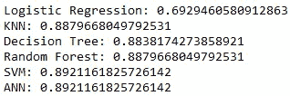

Screenshot by author

```
#plot confusion matrices using model predictions
from sklearn.metrics import confusion_matrixlogreg_cm = confusion_matrix(Y_test, logreg_cv.predict(X_test))
knn_cm = confusion_matrix(Y_test, knn_cv.predict(X_test))
tree_cm = confusion_matrix(Y_test, tree_cv.predict(X_test))
forest_cm = confusion_matrix(Y_test, forest_cv.predict(X_test))
svm_cm = confusion_matrix(Y_test, svm_cv.predict(X_test))
ann_cm = confusion_matrix(Y_test, ann_cv.predict(X_test))vmax = max(np.amax(logreg_cm), np.amax(knn_cm), np.amax(tree_cm), np.amax(forest_cm), np.amax(svm_cm), np.amax(ann_cm))fig, axs = plt.subplots(2, 3, constrained_layout=True)sns.heatmap(logreg_cm, annot=True, cbar=False, ax=axs[0,0], cmap='mako', fmt='g', vmin=0, vmax=vmax)
sns.heatmap(knn_cm, annot=True, cbar=False, ax=axs[1,0], cmap='mako', fmt='g', vmin=0, vmax=vmax)
sns.heatmap(tree_cm, annot=True, cbar=False, ax=axs[0,1], cmap='mako', fmt='g', vmin=0, vmax=vmax)
sns.heatmap(forest_cm, annot=True, cbar=False, ax=axs[1,1], cmap='mako', fmt='g', vmin=0, vmax=vmax)
sns.heatmap(svm_cm, annot=True, cbar=False, ax=axs[0,2], cmap='mako', fmt='g', vmin=0, vmax=vmax)
sns.heatmap(ann_cm, annot=True, cbar=False, ax=axs[1,2], cmap='mako', fmt='g', vmin=0, vmax=vmax)axs[0,0].set_title('Logistic Regression')
axs[1,0].set_title('K-Nearest Neighbors')
axs[0,1].set_title('Decision Tree')
axs[1,1].set_title('Random Forest')
axs[0,2].set_title('Support Vector Machine')
axs[1,2].set_title('Artificial Neural Network')axs[0,0].xaxis.set_ticklabels(['Low', 'Mod', 'High'])
axs[1,0].xaxis.set_ticklabels(['Low', 'Mod', 'High'])
axs[0,1].xaxis.set_ticklabels(['Low', 'Mod', 'High'])
axs[1,1].xaxis.set_ticklabels(['Low', 'Mod', 'High'])
axs[0,2].xaxis.set_ticklabels(['Low', 'Mod', 'High'])
axs[1,2].xaxis.set_ticklabels(['Low', 'Mod', 'High'])axs[0,0].yaxis.set_ticklabels(['Low', 'Mod', 'High'])
axs[1,0].yaxis.set_ticklabels(['Low', 'Mod', 'High'])
axs[0,1].yaxis.set_ticklabels(['Low', 'Mod', 'High'])
axs[1,1].yaxis.set_ticklabels(['Low', 'Mod', 'High'])
axs[0,2].yaxis.set_ticklabels(['Low', 'Mod', 'High'])
axs[1,2].yaxis.set_ticklabels(['Low', 'Mod', 'High'])fig.supxlabel('Predicted Adaptability')
fig.supylabel('True Adaptability')plt.show()
```

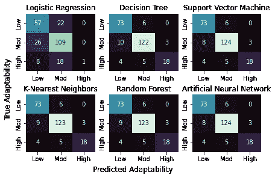

Confustion matrices showing performances of all models on the test data.

在这里，我们可以看到来自`Logistic Regression`的糟糕结果是由二元预测的趋势导致的，将除了一个学生之外的所有学生的**适应性**分类为*低*或*中等*，尽管`mutli_class`参数被优化为`multinomial`。其他每个模型几乎都是一样的，只是分类不足的学生数量不同。

最后，我们来比较一下每个模型的样本内和样本外精度如何变化。

```
#compare model accuracies
model_acc = {'Model': ['LogReg', 'KNN', 'Tree', 'Forest', 'SVM', 'ANN',
                       'LogReg', 'KNN', 'Tree', 'Forest', 'SVM', 'ANN'],
             'Accuracy': [logreg_cv.best_score_,
                          knn_cv.best_score_,
                          tree_cv.best_score_,
                          forest_cv.best_score_,
                          np.max(svm_scores),
                          ann_cv.best_score_,
                          logreg_cv.best_estimator_.score(X_test, Y_test),
                          knn_cv.best_estimator_.score(X_test, Y_test),
                          tree_cv.best_estimator_.score(X_test, Y_test),
                          forest_cv.best_estimator_.score(X_test, Y_test),
                          svm_cv.score(X_test, Y_test),
                          ann_cv.best_estimator_.score(X_test, Y_test)],
             'Data': ['GridSearch', 'GridSearch', 'GridSearch', 'GridSearch', 'GridSearch', 'GridSearch',
                      'Test', 'Test', 'Test', 'Test', 'Test', 'Test']}model_df = pd.DataFrame(model_acc)sns.catplot(kind='bar', y='Accuracy', x='Model', hue='Data', data=model_df)
plt.ylim(0.65, None)
plt.xlabel('Model', fontsize=13)
plt.ylabel('Accuracy', fontsize=13)
plt.show()
```

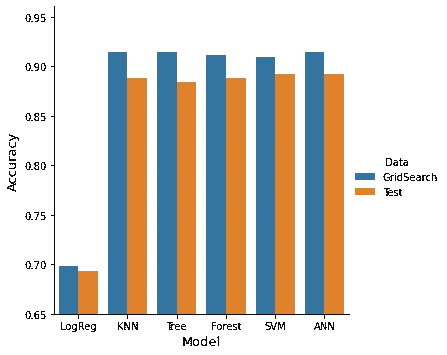

Barplot of the in- and out-of-sample accuracies of all models.

每个模型的样本内精度都高于样本外精度，证明了使用不同数据训练和验证模型的重要性。除了`Logistic Regression`之外，不同模型的精确度非常具有可比性。我们最终的模型选择归结为在`Support Vector Machine`和`Artificial Nueral Network`模型之间的训练效率选择，尽管`K-Nearest Neighbors`、`Decision Tree`或`Random Forest`每个都比 ANN 快得多，并且在这个数据集上的准确性仅稍差。根据您的计算资源，更好的训练效率可以合理地将最终的模型选择转向其他三个模型中的任何一个。

# 5.结论

正如我们所看到的，`GridSearchCV`是机器学习模型选择不可或缺的工具，允许在多个模型的超参数之间进行快速方便的比较。然而，对于像`Support Vector Machines`这样更加资源密集型的模型，有时需要手工迭代`GridSearchCV`才能完成。对于 for 循环，这很容易做到。

在决定和部署您的模型之前，通过重新采样您的训练和测试数据来交叉验证您的模型准确性总是一个好主意。这可以用 [Scikit-learn 的](https://scikit-learn.org/stable/modules/generated/sklearn.model_selection.cross_val_score.html) `[cross_val_score](https://scikit-learn.org/stable/modules/generated/sklearn.model_selection.cross_val_score.html)` [工具](https://scikit-learn.org/stable/modules/generated/sklearn.model_selection.cross_val_score.html)来完成，我可能会在以后的帖子中介绍。

[](/mlearning-ai/mlearning-ai-submission-suggestions-b51e2b130bfb) [## Mlearning.ai 提交建议

### 如何成为 Mlearning.ai 上的作家

medium.com](/mlearning-ai/mlearning-ai-submission-suggestions-b51e2b130bfb)