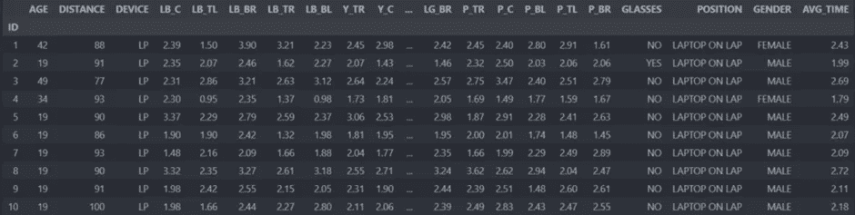
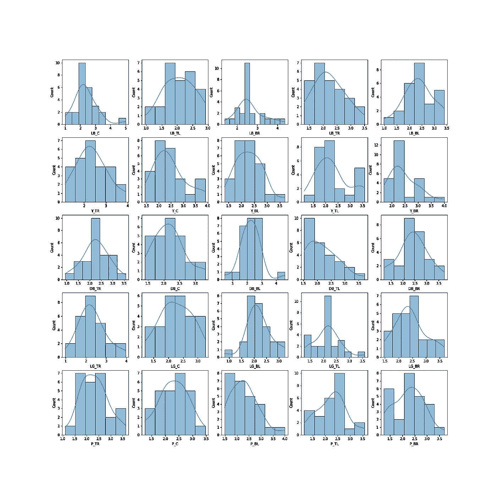
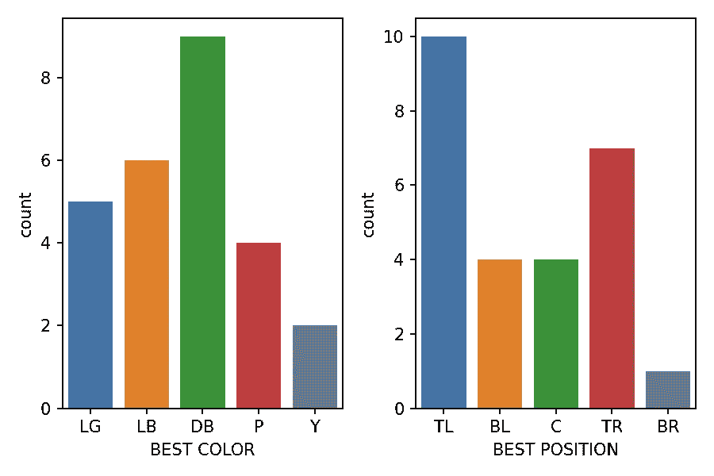
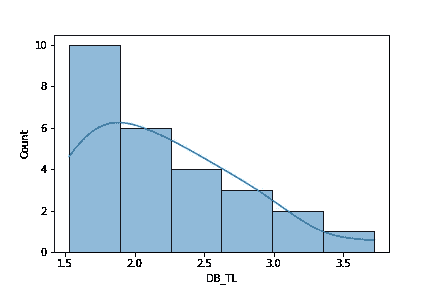
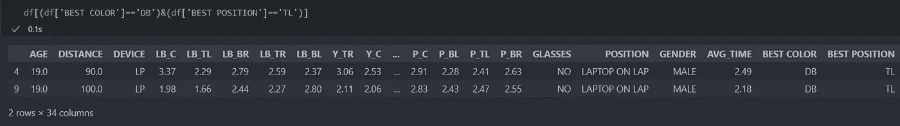
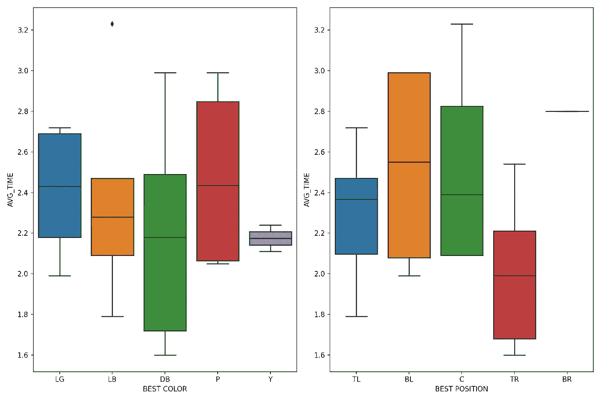
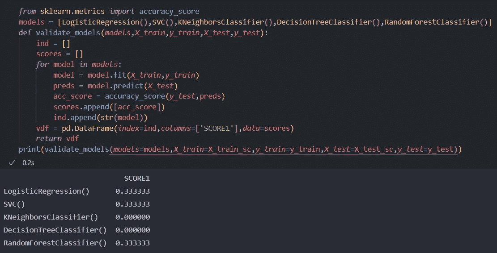

# 使用机器学习优化网页设计

> 原文：<https://medium.com/mlearning-ai/optimizing-web-design-using-machine-learning-1f3ac80ac4c1?source=collection_archive---------9----------------------->

*   [瓦姆斯里克里希纳 S](/@vamsrikrishna22) ，[萨提亚克里希纳](https://www.linkedin.com/in/sathya-krishnan-suresh-914763217/)苏雷什
    对文章的看法: [sat_articles](https://www.instagram.com/sat_articles/)

**摘要:**
我们今天使用的大多数网站设计都是静态的，对每个用户来说都是一样的。在决定设计的过程中需要进行大量的分析，但是设计不需要覆盖网站的所有用户。一个网站的设计对一些用户来说可能看起来不错，而对另一个用户来说，由于它的设计，可能很难在网站上找到重要的信息。我们希望提出一种使用机器学习的解决方案，使网站的设计动态化，以便网站的设计为特定用户定制，他/她将能够轻松地使用网站。

**构思:**
为了给每个用户定制一个网站的设计，网站必须在用户登录的前“n”次做一些小的改变(比如改变字体大小、字体风格、重要信息的位置、颜色等)。网站监控用户到达他/她正在寻找的信息所花费的时间。使用响应时间以及用户在创建帐户时可能提供的一些其他信息，如年龄等，网站应该能够从现有的设计中找到用户满意的设计。

为了实现上述想法，我们设计了一个网站的登录页面，你会期望很多人访问-医院的网站。然后，我们对设计中一些信息的颜色和位置进行了更改，以监控响应时间。总共使用了 25 种不同的设计。您可以点击此处的[查看设计。](https://www.figma.com/proto/zYzLOLO5KrftWtwFOBMsMq/Untitled?node-id=0%3A3&scaling=scale-down&page-id=0%3A1)

**数据收集流程:** 我们与每一位数据贡献者坐下来，给他们一一展示了设计的 25 个网站的照片。他们的目标是到达名为“查看测试结果”的按钮。按钮是随机放置的，网站的颜色也随机改变。我们计算了他们每个人达到目标所需的时间。其他特征如他们的性别、年龄、职位、使用的设备也被记录下来。

**收集数据描述:**
这里使用的数据是从我们的朋友和家人那里收集的。我们来看看收集的数据。

数据集由 32 个要素组成。前三个特征是你在设计网站时总想拥有的标准特征——年龄、距离和设备。接下来的 25 列由用户到达每个设计的目标列所花费的时间组成。接下来的四列告诉我们用户是否戴眼镜、用户使用网站时设备的位置、性别以及所有阅读的平均时间。

**对数据集所做的工作:**
虽然收集的数据量很小，但我们仍然能够从中提取一些有用的信息。响应时间的分布可以让我们了解每个用户对于特定设计的舒适程度。看看下面的情节。

Distribution plot of response time

上图显示了各种设计的响应时间分布。首先，让我们分析响应时间相对于所用颜色的变化。为此，请逐行查看该图。它们中的大多数具有正态分布，表明一些设计具有相同的“舒适因子”或“舒适因子”,与其他特征无关。这里一个有趣的观察是颜色*粉红色*的反应时间。分布不正常，到处都是。即使其他颜色具有一个或两个分布未被归一化的图，但是对于“粉色”颜色更明显。

现在让我们根据所用的位置来分析这个图。为此，请按列查看图。按钮在**中心**和**右上**位置时的响应时间分布图呈正态分布，几乎每个人都能快速识别按钮。但是当剩余位置的曲线随机分布时。这对于这项研究非常重要，因为它针对的是每个用户的首选设计。

通过计算每个用户对每种颜色和位置的平均响应时间，我们找到了他们喜欢的颜色和位置。下图显示了每种颜色和位置的计数。

Count plot

从上面的图中，我们可以推断出‘深蓝色’是大多数用户更喜欢的颜色。“粉色”的低值与我们从之前的图中获得的推论一致。我们可以通过查看“DB_TL”的分布图来确认这一点。下面给出了曲线图，您可以清楚地看到，分布是向左倾斜的，表明对于这种组合，人们能够更快地到达目标位置。他们中的一些人甚至告诉我们，他们喜欢深蓝色。

Distribution of response time for ‘DB_TL’ design.

在查看了获得的信息后，我们想知道更喜欢这两个组合的样本数，但我们只找到两个，并且它们的特征非常相似。两人都是男性，不戴眼镜，年龄相仿。这很有趣，因为这再一次告诉我们，每个用户都需要一个专为他们定制的设计。

目前得到的推论都是从颜色和位置的结合上来的，我们分开来看一下。第一个图符合我们一直在积累的推论，但在第二个图中，*‘TR’(右上)的响应时间比‘TL’(左上)*的响应时间短，而‘BR’(右下)甚至不在图中。这表明“TL”的响应时间只有在与“DB”(深蓝色)一起使用时才很短。你可以从这个情节中得出许多推论，但我们把它留给读者。

**开发一个好模型的困难:**
我们在这里使用了 [scikit-learn 库](https://scikit-learn.org/stable/)来使用各种可用的分类模型。这里有两个目标列——颜色和位置。基本分类模型，如逻辑回归、SVC、随机森林、决策树、KNeighborsClassifier。各种模型的精度如下所示。

每个模型的准确度分数都很差。但没有必要对这一事实感到惊慌。这是一个预期的结果。这有两个原因。一个是收集的数据量非常小。第二个原因是，你不能指望一个没有超参数调整的简单模型来理解这个小数据集的复杂模式。在大多数情况下，响应时间相差 0.01 秒，在某些样本中，响应时间具有相同的值，但偏好的颜色和设计不同。为了获得良好的准确度分数，必须至少有一百万个样本，并且肯定必须使用可能具有两个或更多激活层的神经网络来理解潜在模式的复杂性。你可以在 2 月 15 日点击查看完整代码[。](https://github.com/SathyaKrishnan1211/optimizing-web-design-with-Machine-Learning)

**解决方案模型:**
读完上面的部分后，你可能会认为想出一个解决方案是非常困难的，是的，执行微细分来为每个用户定制设计是一项艰巨的工作，但我们已经想出了一个可能对用户组可行的想法。首先，我们尝试对可用的测试样本进行聚类。这样做的原因是将庞大的数据集分成单独的相似部分，这样更容易分析和测试不同的模型。一旦我们对每个细分市场有了足够的了解。我们将尝试像在凝聚聚类中那样配对片段。然后，我们尝试不同的模型，这些模型是我们为之前分析过的细分市场开发的。如果模型在组合的分段上表现良好，那么我们可以组合两个两个分段并继续我们的测试。如果它表现不好，我们反向传播。这有点类似于神经网络中的“前馈”和“反向传播”概念，这也是我们之前推荐神经网络模型的原因。

**这个想法的未来:**
我们广泛搜索了一个已经实施了这个想法的网站，但是没有找到。我们只找到几篇小文章。有许多公司使用人工智能和人工智能来开发新的颜色和字体。这种想法只有像 Instagram，Twitter 这样拥有数百万用户的网站才能实现。因为他们有足够的人力来收集数据并进行彻底的分析。一旦颜色和位置被自动化，那么字体风格，字体大小和所有其他的东西都可以自动化。为个人用户定制网站会增加他们对网站的使用量，你可以期待很多新用户。

**结论:**
在本文中，我们大谈特谈并实施了一点，但随着我们收集的数据集规模的增长，我们将在未来尝试进行更多的分析。我们希望您在撰写这篇文章时和我们一样开心。如果你觉得这篇文章很有用，请留下评论并订阅。

**Villupuram ES Institutions 集团董事 K.Indira 博士的评论:
使用机器学习优化网页设计——这是一项非常创新的工作，着眼于动态网页设计的前景。所选的数据集要素是 opt，并且接近所选的工作。尽管准确性得分没有达到作者指出的标准，但可以通过增加数据集大小和对所选参数进行精细分析来实现改进。术语“n”次用户登录需要更加清晰，未来改进的范围非常广泛。**

 [## Mlearning.ai 提交建议

### 如何成为 Mlearning.ai 上的作家

medium.com](/mlearning-ai/mlearning-ai-submission-suggestions-b51e2b130bfb) 

🟠在 MLearning.ai 成为 [**作家**](/mlearning-ai/mlearning-ai-submission-suggestions-b51e2b130bfb)