# 线性回归:封闭形式的解决方案，飞镖方式

> 原文：<https://medium.com/mlearning-ai/ordinary-least-squares-closed-form-solution-the-dart-way-d7c0ee0e0d02?source=collection_archive---------0----------------------->

*本文是 Dart 编程语言机器学习系列文章的一部分:*

*   [*Dart 编程语言中的机器学习*](/mlearning-ai/machine-learning-in-dart-programming-language-fbfffd7deb18?source=friends_link&sk=12ba21f2c7a01f1aa18954ba2a82fae9)
*   [*一元线性回归温柔入门:镖道*](/mlearning-ai/a-gentle-introduction-to-linear-regression-the-dart-way-9750214e6fa2?source=friends_link&sk=e199d8f5b0bb71c97525be2ee7f5819b)
*   [*线性回归:简单地说就是普通最小二乘法*](/mlearning-ai/linear-regression-ordinary-least-squares-in-a-nutshell-c2e0d7ed260f?source=friends_link&sk=5c8bc0228d29bc67ebe524a91d687619)

大家好，

在我之前的[文章](/mlearning-ai/linear-regression-ordinary-least-squares-in-a-nutshell-c2e0d7ed260f?source=friends_link&sk=5c8bc0228d29bc67ebe524a91d687619)中，我解释了普通最小二乘问题。我提到有几种方法可以解决它，其中之一是封闭形式的解决方案。

今天我们将:

*   弄清楚什么是封闭形式
*   推导线性回归封闭解的公式
*   接触一个使用 Dart 编程语言的线性回归的实例

我们开始吧！

什么是封闭解？

让我们看一个简单的例子:

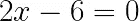

我想每个人都能找到`x`，它是 3。如果我们用`a`代替`2`，用`b`代替`6`，我们可以推导出`x`的公式:

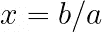

现在让我们看一个更复杂的例子:

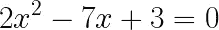

你可能注意到了，这是一个二次方程。因此，如果我们将`2`替换为`a`，将`7`替换为`b`，将`3`替换为`c`，我们可以使用众所周知的公式找到`x`的所有可能值:

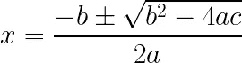

同样，很容易找到答案:3 和 0.5。

这两个例子有什么共同之处？是的，它们都可以用一个公式来表示，这意味着对有限数量的简单数学运算得出唯一可能的解。

现在让我们看另一个例子:

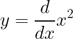

换句话说，我们必须区分正方形的功能。

回想一下什么是微分。这是一个过程，我们改变一点参数，观察函数的行为，了解函数对变化的敏感程度。我们可以用一个公式来表达这样一个过程:

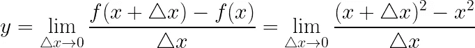

如您所见，不可能找到`y`的精确值。我们可以改变函数的参数无数次，但仍然没有最终的解决方案。

对于一个我们可以通过有限次数的简单数学运算得到的问题，我们有唯一可能的解决方案的情况称为**封闭形式的解决方案**。前两个方程是这种解决方案的很好的例子；它们可以简单地完成，并汇聚成一个可能的答案。显然，最后一个没有封闭的形式。

现在我们知道封闭形式是什么了。线性回归问题有这样的解吗？是的，确实如此。要推断公式，我们要记住普通最小二乘问题——推荐你看关于普通最小二乘的文章:

[](/mlearning-ai/linear-regression-ordinary-least-squares-in-a-nutshell-c2e0d7ed260f) [## 线性回归:简单的普通最小二乘法

### 大家好！

medium.com](/mlearning-ai/linear-regression-ordinary-least-squares-in-a-nutshell-c2e0d7ed260f) 

因此，我们有一个误差函数来最小化:

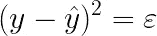

在哪里

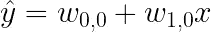

w_0_0 和 w_1_0 是未知项；我们必须找到他们。如你所知，我们问题的解决方案是尽可能减少误差。解析地说，它是误差函数的最小点。由于函数是可微的，我们可以得到函数导数的表达式，并使其等于零。

为什么要让它等于零？

如你所知，导数的值是某一点切线的斜率:

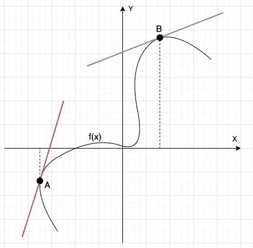

在上图中，我们看到在点`A`和点`B`的两条切线。很明显，这些线有一些斜率，这意味着这些点的绝对导数值大于 0。

如果导数值等于零，说明该点的切线没有斜率；平行于`X`轴；

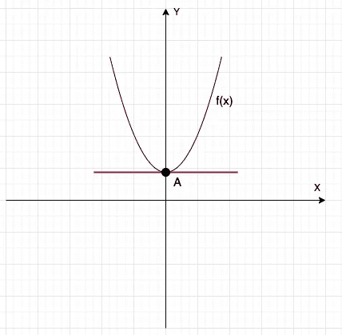

这意味着该点是函数的最小值。

当然，具有这种切线的点也可能是最大值:

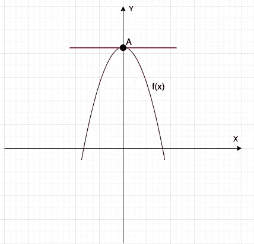

但是由于我们问题的性质，我们的误差函数只有一个全局最小值:


The parabolic plane has only one extremum, and it’s a minimum.

好的，但是函数由两个未知变量 w_0_1 和 w_1_0 组成。怎样才能找到这样一个函数的导数呢？

我们可以简单地找到关于每个未知项的偏导数的表达式，并使表达式等于零:


在上面的例子中，我们只为具有单个特征的单个`y`项——`x`项导出了表达式。

想象我们有很多特征。这意味着可以有很多`x`术语。此外，可能不只有一个`y`——通常，可能有许多值。让我们从矩阵的角度来看问题:有一个包含`x`值的特征矩阵，一个包含`w`值的权重矩阵，一个包含`y`值的结果矩阵。

据此，让我们为偏导数创建一个更一般的表达式:

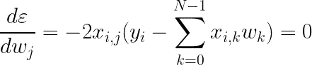

其中:

*   `j`是特征的指数(或特征权重的指数)，表示特征矩阵中的一列
*   `i`是观察的索引，表示特征矩阵中的行索引
*   `y_i`是第 I 次观察的结果(针对第 I 行)
*   `x_i_j`是特定的特征值(特征矩阵中第 j 列第 I 行的值)
*   `N`是若干特性

很好，现在我们知道了如何基于单个观测值来寻找特征权重的导数，但是我们可能有很多观测值。根据[普通最小二乘问题](/mlearning-ai/linear-regression-ordinary-least-squares-in-a-nutshell-c2e0d7ed260f?source=friends_link&sk=5c8bc0228d29bc67ebe524a91d687619)，如果我们有大量的观测值，我们必须对每个观测值的所有误差值求和:

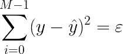

其中`M`是观察值的数量。

让我们考虑偏导数表达式求和的事实:

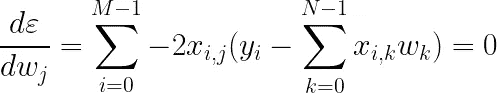

我们应该根据以下模式将该公式迭代地应用于我们的数据改变项`j`: j = 0…N-1，因为我们有 N 个特征和 N 个权重。

为了使事情变得简单一点，我们可以将结果、`y`值表示为 M×1 维度的矩阵`Y`，将特征、`x`值表示为 M×N 维度的矩阵`X`，将权重、`w`值表示为 N×1 维度的矩阵`W`。让我们用矩阵符号重写上面的等式:

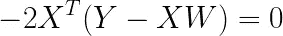

让我们检查等式中矩阵的维数:

*   `X`和`W`的乘积给出了 M×1 维的列矩阵，因为我们将 M×N 维的`X`矩阵乘以 N×1 维的`W`矩阵。有一个简单的经验法则:输出矩阵的维数是`number of rows of the first matrix` x `number of columns of the second matrix`，这就是为什么我们得到 M×1 维数矩阵的结果。
*   `Y`和`XW`相减是有效的，因为两项都是具有相同行数和列数的矩阵。
*   我们必须转置`X`矩阵以符合维度，因为`Y-XW`是 M×1 维度的矩阵，但是`X`矩阵是 M×N 大小:我们不能将 M×N 维度的矩阵乘以 M×1 维度的矩阵。转置后，`X`矩阵有 N x M 维，很完美，现在可以求积了。结果，我们得到了 N×1 矩阵。

很好，我们方程的维数符合。我们的目标是`W`矩阵。让我们从方程式中表达出来。

首先，让我们去掉`-2`，因为我们可以用这个值除等式的两个部分:

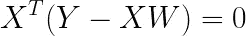

然后，让我们去掉括号。为此，我们应将`X`(转置)乘以`Y`，并从中减去`X`(转置)、`X`和`W`的乘积:

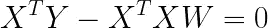

现在让我们将等式的第一项移到右边:

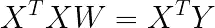

最后一步，现在我们可以将等式的两部分相乘:

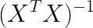

在矩阵世界中，将一个矩阵乘以它的逆矩阵(源矩阵的负 1 次方)意味着将一个数乘以该数的倒数，就像`5 * 1/5`。在数字世界中，后一个例子导致了`1`。在矩阵世界中，与逆矩阵相乘是类似的；它产生了一个单位矩阵，这与数字的`1`几乎相同。因此，在我们将等式的两部分乘以逆矩阵后，我们得到:

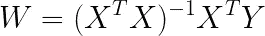

我们得到了线性回归任务的闭式解的公式。

我们来编码吧！

使用`[ml_linalg](https://github.com/gyrdym/ml_linalg)`库，可以很容易地根据上面的公式创建一个查找`W`矩阵的程序。

最好拿出一些易于验证的综合数据。说着，让下面的记录:

```
x1 | x2
-------
2  |  3
4  |  6
6  | 12
8  | 24
```

将我们的特征矩阵`X`和下列值:

```
y
--
13
26
48
88
```

将是我们的成果矩阵`Y`

用手很容易找到特征的重量——这是`2`和`3`:

```
2*2 + 3*3 = 13
4*2 + 6*3 = 26
6*2 + 12*3 = 48
8*2 + 24*3 = 88
```

让我们将公式应用于数据，并检查它是否工作正常:

最后一条指令打印如下:

```
Matrix 2 x 1:
(2.0000219345092773)
(2.9999969005584717)
```

这些值看起来是有效的。这正是我们所期望的(尽管有一些舍入误差)。

似乎我们只在一行代码中执行了线性回归(上面代码片段中的第 16 行)！

是什么阻止我们每次都使用这个简单而优雅的解决方案？

让我们试着分析一下算法的复杂性。它有一个矩阵求逆步骤，具有三次复杂度 O(n)。想象一下，如果你的特征矩阵是 100，000 乘以 1，000，000。因此，仅求矩阵逆的迭代总数大约是(100，000*1，000，000)！即使是支持 [ml_linalg](https://github.com/gyrdym/ml_linalg) 库的 SIMD 建筑也不会帮助我们；迭代太多。这就是为什么我们不能每次都使用线性回归的封闭形式解。

有一种不同的技术可以克服大数据的障碍，叫做梯度下降，但这在今天已经太难了。让我们把它留给[下一篇文章](/@ilgyrd/gradient-descent-the-dart-way-2d6c39416a8a?source=friends_link&sk=992b52c85a51ecea1c1e9e4afe2a8c1e)。

差不多就是这样。现在您知道线性回归的封闭形式解是什么了！

干杯:)

您也可能喜欢以下内容:

[](/@ilgyrd/google-engine-from-scratch-pagerank-algorithm-in-dart-flutter-b985c0c18567) [## 谷歌引擎从头开始:Dart/颤振中的 PageRank 算法

### 大家好，

medium.com](/@ilgyrd/google-engine-from-scratch-pagerank-algorithm-in-dart-flutter-b985c0c18567) [](/mlearning-ai/machine-learning-in-dart-programming-language-fbfffd7deb18) [## Dart 编程语言中的机器学习

### 大家好！

medium.com](/mlearning-ai/machine-learning-in-dart-programming-language-fbfffd7deb18) [](/mlearning-ai/mlearning-ai-submission-suggestions-b51e2b130bfb) [## Mlearning.ai 提交建议

### 如何成为移动人工智能的作者

medium.com](/mlearning-ai/mlearning-ai-submission-suggestions-b51e2b130bfb)