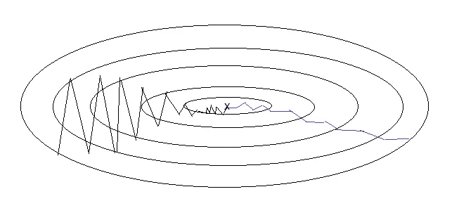
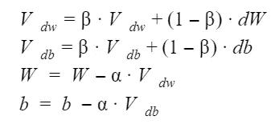
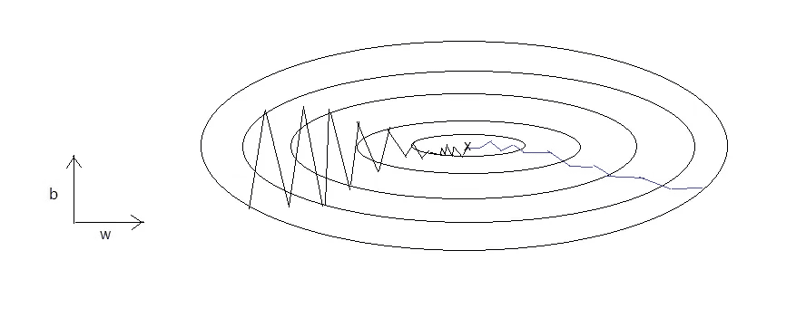
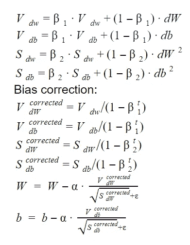

# 神经网络的其他优化方法和开始学习表

> 原文：<https://medium.com/mlearning-ai/other-optimization-method-for-neural-network-and-start-to-learn-tableau-849254671252?source=collection_archive---------5----------------------->

*   27/08/2021

我已经完成了深度神经网络改进专业化的第二周。它仍然会关注如何更快地训练神经网络以及神经网络的优化。

# 小批量梯度下降

首先，它将是小批量梯度下降。这有助于更快地训练神经网络。尽管矢量化用于高效地进行计算，但它可能无法处理大样本量(例如，500 万？甚至 50 万)。即使我们应用矢量化，对于大样本量也需要很长时间，并且每个历元都需要很长时间。为了解决这些问题，推荐采用小批量梯度下降法。以 5，000，000 样本量为例，我们可能需要将其分成 5，000 组小批量，每组包含 1，000 个样本。我们将用 X{t}来表示分裂后的集合 t。然后，我们需要像往常一样计算向前和向后传播，但我们可能需要对每组样本进行 5000 次矢量化。对于后向传播，我们需要分别计算每组样本的梯度成本函数，以获得 J{t}并重复它，直到我们可以获得成本的最大近似值。为了绘制成本函数与迭代次数的曲线，我们通常得到一条平滑的曲线，并且它随着批量梯度下降的成本函数的最小化而下降。对于小批量梯度下降，我们可以通过比较成本和每个小批量(#t)的成本来获得一个图，并且我们可以获得一个噪声更大、振荡更高的图。这是因为 J{1}的成本函数可能低于或高于 J{2}，J{…}。因此，我们获得小批量梯度下降的波动成本函数是非常正常的。

那么，如何决定小批量呢？这取决于我们的样本量。假设样本量为 m 时，最小批量为 m。那么，这只是一个批量梯度下降。每次迭代都会变得很长，因为它需要遍历整个样本。小批量= 1(随机梯度下降)怎么样？每个样本将成为它自己的小批量，我们可能会失去矢量化的好处。因此，我们应该在批量梯度下降和随机梯度下降之间决定最小批量。小批量不能太大或太小。通过向量化，我们可以获得一种最快的学习方法，而不需要等待整个训练集。建议我们仍然可以使用批量梯度下降，如果训练集大小为< 2,000\. If the training set size is >2000，我们可以应用小批量梯度气味。同样，我们可以用 2 的幂来决定最小批量(2⁶ — 64，2⁷ — 128，2⁸ — 256，2⁹ — 512，…)。这些是二进制值，它与我们计算机的内存相适应。此外，我们必须确保小批量适合 CPU/GPU 内存。

# 指数加权平均值

很少有比梯度下降更快优化算法。在我们讲之前，需要一个叫做指数加权平均的理论来理解。在统计学上可以称为指数加权移动平均线。它用于表示一段时间内的近似平均值。该公式可以如下找到，

From 0 to t, t: sample size

它将从 V0 = 0 开始，并尝试用您的数据进行计算。β值非常重要，因为它通过使用 ***1 / (1-β)来决定近似平均值的时间段。*** 例如，如果我们设β为 0.9。它显示了过去 10 天的近似平均值。我们需要考虑β值，它有助于将散点数据整合成近似直线。如果我们设置一个更高的 beta 值，我们可以在更多的时间内对数据进行平均。同样，我们可以得到一条更平滑的近似线。如果我们设置一个低的β值，我们可能会得到一个波动的近似线，因为我们可能会有一个当前值的高比率，而不是以前的平均值。它可以提供一个更短的窗口，更多的噪音，但它更容易受到离群值的影响，这意味着它可以更快地适应温度的变化。

那么，它到底在做什么？以β= 0.9 为例。当 t = 100 时，我们将尝试将样本大小从 t 反转为 0。

我们只是重新定位了方程的位置。我们可以通过当前值和之前的平均值(V99)以 0.9 的比率进行计算。然后，我们可以将等式表示如下:

我们正在试图取代 V99 等等…

我们就此打住，最后整个公式可以表达成这样…

每个先前数据的差值将是 0.9 的幂。根据等式 1 / (1-β)，它显示过去 10 天的近似平均值为 0.9 ⁰ ~0.35，接近 1/e。这意味着它需要 10 天才能衰减到 1/e(超过自然算法的基数 1)。它对β= 0.98 有同样的意义，它表明，由于 0.9⁵⁰ ~ 0.35，它将花费 50 天衰减到 1/e。在计算中，我们可以计算如下:

started by 0 and repeat for t times

我们可以通过迭代整个样本集值来获得最终值。通过应用指数加权平均值，您可能无法在开始时获得准确的值。为了获得更精确的计算值，使用偏差校正通过以下等式计算该点，

因此，它可以帮助消除开始时的偏差，但实际上，一旦值变大，偏差就不会那么明显了！

# 动量梯度下降

是另一种方法，我们可以比标准方法更快地训练神经网络。通常，我们将使用正态梯度下降来获得权重和偏差的新值，如下所示:

Please forgive my poor drawing

我们可能需要找到损失函数的最小点。在这个过程中，重量可能会上下波动，它会减缓梯度下降的过程，以达到最小点！从前面的图像中，我们可以知道垂直移动会减慢学习速度，我们可能需要水平移动来提高学习速度。因此，我们可以应用带动量的梯度下降来进行更快的学习。

Please forgive my poor drawing again

你可以看到蓝线被施加了动量梯度下降，它可以在水平方向快速移动，这是因为垂直移动平均为零。为了计算具有动量的梯度下降，我们可以迭代如下:

因此，我们可以得到另一个超参数—β，它可以用来控制指数加权平均值。完成 beta 测试后，我们可能还需要调整学习速率——alpha，以获得最佳的神经网络。

# 均方根传播

这也是加速梯度下降的另一种方法。这非常类似于带动量的梯度下降，因为我们希望最小化垂直移动而不是水平移动。

让我们定义偏差将控制垂直移动，重量将控制水平移动。我们希望减缓偏差的变化，并尝试保持较大的权重值，以获得训练的最快学习。我们可以用指数加权平均来计算均方根，如下所示:

这将有助于计算尽可能小的 Sdw，以便权重可以相对于偏差快速改变。我们需要添加 epsilon 的原因是我们需要确保 dW 不会被零除，因为这会给训练带来很大的麻烦。之后，我们可以调整学习速率— alpha 来加快整个过程。

# Adam 优化算法(RMPprop + momentum)

对于前两种方法，可以结合使用，以加快训练速度。我们必须定义超参数——动量的β-1 和 RMSprop 的β-2。我们可以如下计算它，

事实上，我们只是结合这两种方法和偏差修正，以获得一个更准确的值。也应该尝试α的范围。对于β-1(一阶矩)和β-2(二阶矩)，您可以使用 0.9 和 0.999 作为默认值，因为它不会改变太多，并且ε应该是 10^-8，因为它不会影响性能。

# 学习率衰减(随着时间降低学习率)

学习率——alpha 是我们可能需要调整的超参数之一，因为它会极大地影响学习过程。通常，我们将使用一个恒定的学习速率，但是对于梯度下降来说，它将需要一个更大的步长，这导致学习在最后将一直围绕着最小点循环。因此，我们可以使用学习率衰减来处理这些情况。

这个等式用于学习率衰减。根据纪元，学习率将更小。一旦我们通过数据集很多次，我们可以获得一个较小的学习率。然后，我们可以在开始时采取大得多的步骤，并在几次迭代后采取慢得多/小得多的步骤。学习会不断减少。

还有另一种学习率衰减的方式。

这有助于保持学习速率恒定，但在几个时期后会降低。然后，我们也可以得到学习率的离散阶梯情况。只是尝试用不同的方程和阿尔法-0 和衰减率来优化学习问题。

还提到了局部最优和鞍点问题。它可能会导致零梯度，并且需要更多的时间来消除它，因为它会保持平稳状态并减慢学习。此外，梯度将在很长一段时间内接近零，但长迭代可以处理它。

这是本周的结束。事实上，我已经花了很多时间来修改这些信息，因为一周内时间很紧。此外，我开始学习 tableau，我希望我可以试着解释一下，因为学习一个流行的数据可视化工具是非常重要的。我已经为 CS50 跳过了一个星期，但幸运的是，离我的截止日期还有很长时间。我需要合理安排我的时间表，这样我才能处理所有这些事情。