# 无监督环境下使用监督学习方法的离群点检测

> 原文：<https://medium.com/mlearning-ai/outlier-detection-using-supervised-learning-methods-in-an-unsupervised-context-7c134602b2e3?source=collection_archive---------4----------------------->

在运营资源有限的业务环境中，伪监督离群点检测(PSOD)能否提供比隔离林更高的准确性？在两个合成数据集和两个欺诈数据集上进行了检验。


**什么是离群值？**

异常值是与其他数据点显著不同的数据点(即位于外部很远的数据点)。异常值的原因可能各不相同。它们可能是技术性的(由于液氮的极度超频，主板的温度为 0 度)、行为性的(网站关闭，重新打开后出现多次正常登录尝试)或暗示数据中的问题(金额以当地货币存储，而不是转换成欧元)。

根据上下文的不同，异常值可以告诉我们很多关于数据的信息，或者给出一个在哪里查看的提示。

我们不会深入探讨异常值检测的各种选项。如果你感兴趣，那么关于异常值和新奇检测的 [scikit-learn 文档](https://scikit-learn.org/stable/modules/outlier_detection.html)将是一个好的开始。

**我们的目标是什么？**

隔离林通常用于异常值检测，因为它快速而可靠。但是，在由于日常业务中的资源限制，我们无法处理所有标记的异常值的情况下，我们要求标记/转发案例中的真实阳性率与阳性率一样高。我们将在下面更详细地解释这个商业案例。

此外，我们希望我们的算法能够处理开箱即用的分类特征。隔离林没有这种能力，只需要数字特征。用户当然可以对分类特征进行编码。然而，在标称特征的情况下，选择是非常有限的。

作为核心元素，我们将使用监督学习，而无需访问实际标签:无监督环境中的监督学习。

不知道那是什么意思？继续读！

**我们示例的业务环境**

在本文中，我们使用了两个合成数据集和两个欺诈数据集。合成数据集将说明隔离森林和 PSOD 之间的一些一般差异。由于合成数据集不能反映真实世界数据集的噪声，我们在 Kaggle 的两个欺诈数据集上比较了这两种算法。

Kaggle 数据集实际上是有标签的，但是我们只是为了验证的目的才使用它们。

我们可以在任何数据集上使用离群点检测，但对于欺诈，无监督学习提供了更广泛的应用:

*   欺诈具有不断变化的模式(因此无监督方法有助于发现新模式，即使在使用监督学习的情况下也是如此)。
*   尽管在许多其他领域，非监督方法可以取代监督方法(即，只要没有足够的标签)，因为离群值比其他领域更有可能反映目标类。

当使用离群点检测作为监督学习的替代时，我们做了一个非常强的假设:目标类匹配离群点的行为。这个假设只在一定程度上成立。因此，监督方法有望在这里胜过离群点检测。在本文中，我们还将展示与监督学习的比较。

**构建伪监督离群点检测器**

现在是我们实验模型的时候了。直觉如下:我们将异常值解释为难以预测的数据点。换句话说，给定观察到的模式，我们应该能够更容易地预测内联体(它们在我们的预期之内)。

想象一下你的一个朋友总是及时赶到。在某种程度上，你只是希望那个朋友能再次及时到达(在正常情况下)。如果火车晚点 5 分钟，这仍然不是一个例外。然而，如果火车晚点了 5 分钟，但是你的朋友晚了 2 个小时到达，这是一个异常值，因为到达的时间远远超出了我们的预测。

离群值是意料之外的，它打破了观察到的模式(即:特征之间的关系与我们目前所看到的不同)。因此，我们预测它们时的误差应该更高。

我们利用线性回归作为基础类。线性模型不太可能完全符合数据，这在这里是必要的。否则我们根本无法找到异常值。

我们将这个想法分解成几个简单的步骤:

*   我们接受除标签以外的所有数据
*   我们遍历数据帧的列

在每次迭代中，我们:

*   使用带有替换的数据样本(按照我们原始数据的大小，否则我们会丢失太多数据)
*   还对我们用来预测伪目标(bagging)的列进行采样
*   测量所有列相对于我们的伪目标列的相关性，并移除高度不相关的特征(特征选择)
*   目标编码分类列(使用伪目标)
*   对数转换数字列(这增加了对非线性模式的抵抗力)
*   使用所有随机选择的列来训练回归变量(线性回归)以预测伪目标
*   使用经过训练的回归器，使用原始的、未采样的数据来预测列
*   测量误差

循环后:

*   我们测量所有列的平均误差
*   如果平均误差高于平均误差的*平均值+ 1.96 *平均误差的标准偏差*，我们标记异常值(我们假设我们的误差是正态分布的，并标记超过 95%的异常值。)

**两个模型在合成数据上如何比较？**

为了说明差异，我们创建了一个非常简单的包含两列的合成数据集。一个特征只是随机的。第二个特征是第一个特征的函数，没有任何附加噪声:

```
treatment_data = pd.DataFrame({"feat_1": np.random.rand(1000)})
treatment_data["feat_2"] = treatment_data["feat_1"] * 100
```

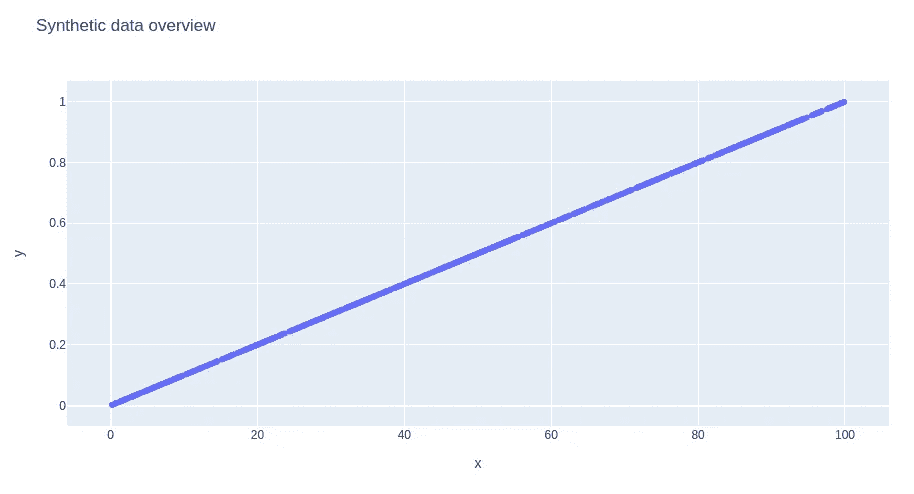

这里我们不希望出现异常值，原因有二:

1.)从视觉上看，没有什么看起来像异常值(不再是超过 3 个维度的有效策略)。

2.)我们知道，即使是特征 2 最极端的值，也可以用特征 1 来解释。

虽然伪监督离群点检测不会标记任何离群点，但隔离林在这里变得令人惊讶地疯狂:

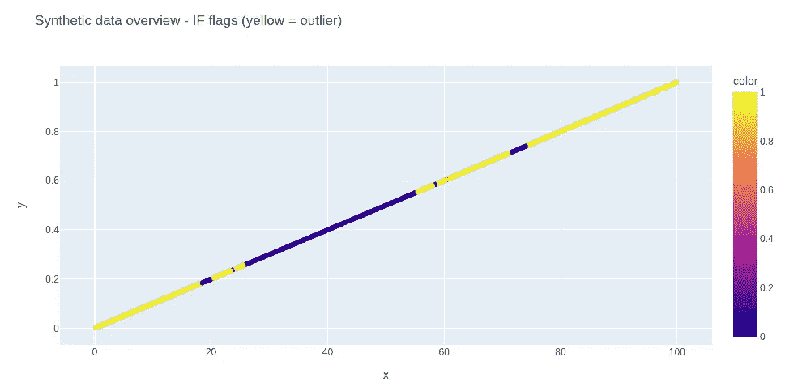

几乎 40%的数据点被隔离林标记为异常值。

我们创建第二个没有线性关系的合成数据集:

```
treatment_data = pd.DataFrame({"feat_1": np.random.randn(1000)})
treatment_data["feat_2"] = (treatment_data["feat_1"]*100)**2
```

这次我们的第一个特征是正态分布。第二个特征是高度倾斜的:

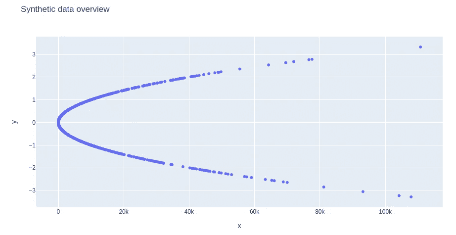

这一次，PSOD 标出了异常值:

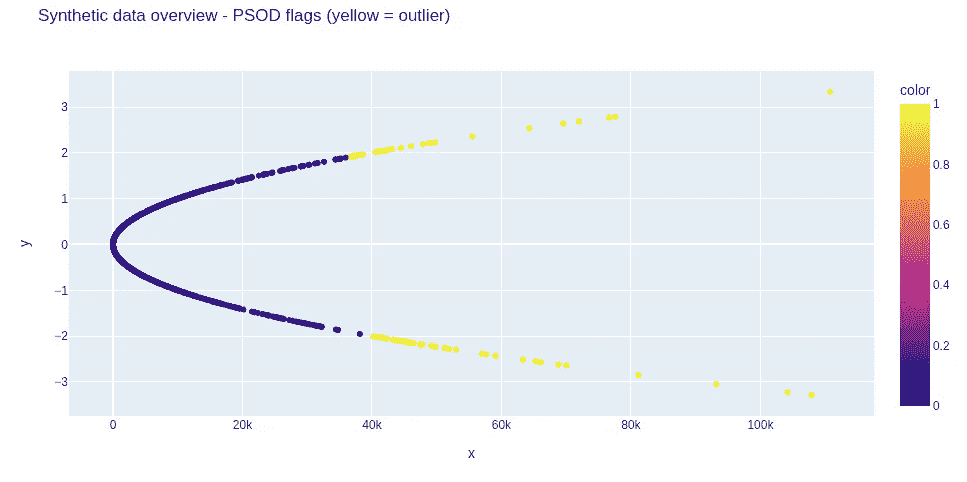

这个看起来很不错。我们还绘制了隔离林的结果:

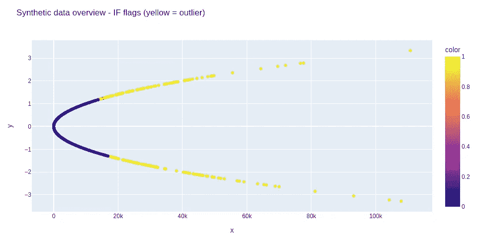

在这里，隔离森林似乎找到了合理的离群值。然而，它仍然超出了预期。

这些例子说明了隔离森林(和一些统计方法)和伪监督森林之间的区别。隔离森林寻找可以快速分离的数据点，而 PSOD 寻找全局模式，只标记无法解释的数据点的异常值。

哪种行为是首选将取决于数据和业务环境。

**加载欺诈数据**

我们从这个[信用卡欺诈](https://www.kaggle.com/datasets/mlg-ulb/creditcardfraud)数据集开始。数据以 csv 格式提供。因此，我们将熊猫载入数据帧。

```
# import libraries
import pandas as pd
import numpy as np
from sklearn.preprocessing import MinMaxScaler
from sklearn.linear_model import LinearRegression
from sklearn import metrics

# load the data
treatment_data = pd.read_csv("creditcard.csv")
```

**快速 EDA**

让我们看一下数据:

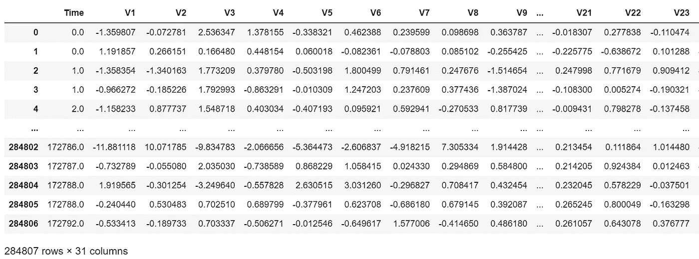

我们还检查数据类型，如果有任何缺失值:

```
treatment_data.info()
```

没有任何空值，所有数据都是数字:

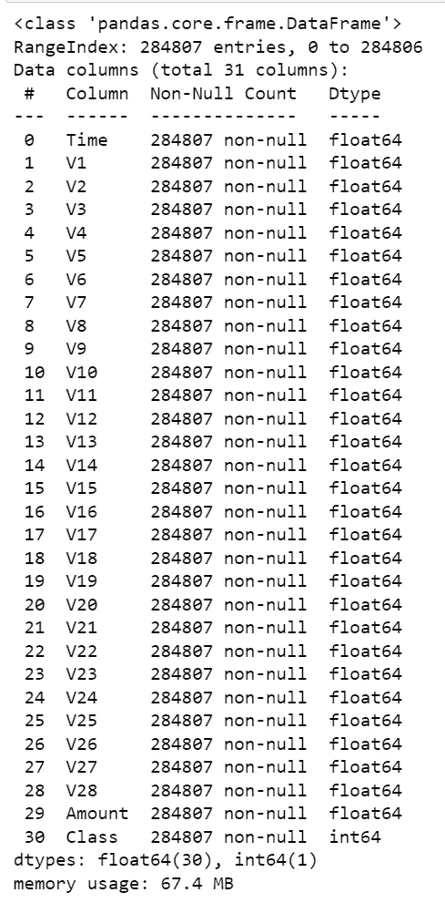

这为我们节省了时间。启动和运行不需要任何预处理。(所有特征都是 PCA 的结果)。

```
treatment_data[target].value_counts()
```

当我们处理欺诈时，数据也非常不平衡。在整个数据集中，我们有不到 500 个欺诈实例:

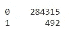

这还不到 1%！

**设定基线**

对于基线，我们使用隔离林。它相当健壮，可靠，计算速度快，并提供有竞争力的结果。

```
# make sure we do not leak the labels
cols = treatment_data.drop("Class", axis=1).columns.to_list()

# import IF and instantiate the class
from sklearn.ensemble import IsolationForest
clf = IsolationForest(random_state=0)

# train IF and get the predictions
iso_outlier_classes = clf.fit_predict(treatment_data[cols])
```

隔离林在这里只运行几秒钟。在进行评估之前，我们需要注意标签:

```
pd.Series(iso_outlier_classes).value_counts()
```

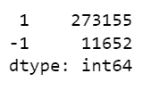

尽管我们有欺诈标签(其中欺诈= 1)，隔离林仍将异常值标记为-1。因此，我们需要首先转换隔离林标签。

```
# attach labels to DataFrame
treatment_data["isolation_forest_class"] = iso_outlier_classes

# convert IF labels to match data labels
conditions  = [treatment_data["isolation_forest_class"] == 1, 
               treatment_data["isolation_forest_class"] == -1]
choices     = [ 0, 1 ]

treatment_data["isolation_forest_class"] = np.select(conditions, 
                                                   choices, default=np.nan)
```

现在我们可以评估隔离森林。我们绘制了一个混淆矩阵，并得到了马修相关性。Matthew's correlation 是一种类似于 F1 的分类指标，从-1(完全错误)到+1(完全预测)，适用于不平衡的数据。

```
# confusion matrix
full_classification_report = classification_report(treatment_data["Class"], 
                                  treatment_data["isolation_forest_class"])
print(full_classification_report)
```


```
# matthews correlation
matthews_corrcoef(treatment_data["Class"], 
                  treatment_data["isolation_forest_class"])
```

马修斯相关系数为 0.17。给定一个无人监管的环境，这些是不错的结果，但我们可以做得更好。

**测试伪监督异常值检测器(PSOD)**

在测试算法之前，对列进行归一化，因为我们正在训练线性模型:

```
# scaling the data
scaler = MinMaxScaler()
scaler.fit(treatment_data[cols])
scaled = scaler.transform(treatment_data[cols])
scaled = pd.DataFrame(scaled, columns=cols)
```

我们这里不处理任何共线性。虽然这对于许多数据集来说是值得研究的，但在这里应该不是问题，因为 PCA 返回不相关的特征(这里提供的所有特征都是主成分分析的结果)。

是时候测试我们的算法了:

```
# instantiate the detector
iso_class = LinearRegressionOutlierDetector()

# get the outlier labels
full_res = iso_class.fit_predict(scaled, return_class=True)
```

我们再来看看混淆矩阵和马修关联:

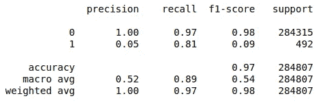

马修的相关系数是 0.19。

**模拟运营瓶颈**

根据业务环境，我们可能无法在操作上处理所有标志。原因可能是有限的人力资源或预算(即流失处理)。在这种情况下，我们可能只使用最适合我们能力的预测。

为了模拟这种情况，我们采用隔离林和 PSOD 标记的前 200 个异常值，并检查这些数据集中的真实阳性率(对于隔离林，我们必须按升序排序)。

对于隔离森林，我们观察到几乎 20%的真实阳性率。对于 PSOD，我们达到了高达 56%的真实阳性率！

与隔离林相比，这种提升在现实世界的业务场景中会产生更大的影响。

**监督学习与此相比如何？**

作为比较，我们在 Kaggle 上使用了 automl 框架 [e2eml](/@thomasmeissnerds/e2eml-a-full-ml-pipeline-with-just-a-few-lines-of-code-a857f25d8174) (因为这发生在不久前，数据分割是不同的)(见笔记本[这里](https://www.kaggle.com/code/thomasmeiner/credit-card-fraud-using-automl-99-96-accuracy))。监督学习在这里显示了强大的优势，因为它可以针对目标标签优化模式，而不是具有强大的优势(就像假设离群值是欺诈)。

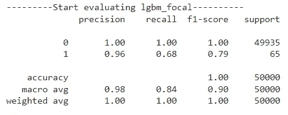

马修的分数达到了 0.80 以上！

**离开舒适区**

到目前为止，我们的算法能够处理干净的数据:

*   没有缺失值
*   没有类别
*   无共线性
*   可管理维度

其中至少有一种可能不会在现实世界的应用中发生，并且大多数算法不能开箱即用地处理它们。因此，我们利用另一个数据集:IEEE-CIS[欺诈数据集。这是上述所有四种病理。](https://www.kaggle.com/competitions/ieee-fraud-detection/data)

隔离林无法处理所有这些问题。它对共线性具有鲁棒性，但不能处理缺失值。然而，这些可以通过多种方式填充(甚至丢弃)。高维度可以(但不是必须)增加性能损失。数据集有 400 多列，但是消除共线性和/或低方差特征对两种算法都有很大的负面影响。

然而，最大的问题出现在分类值上。在无监督的上下文中，目标编码会消失，所以一键编码看起来是下一个最好的选择。这对于隔离森林来说是困难的。一个类别越重要，性能越有可能下降。因此，除了基数大于 5 的特性之外，我们对分类特性进行一次性编码。(在某些情况下，顺序编码可能会执行得更好，即使该功能本质上是无序的。或者，我们可以利用 PCA 来减少独热编码特征。然而，这将损害模型的可解释性。)

对于我们的伪监督学习者，我们实际上可以利用目标编码，因为我们在技术上有目标(即使它们不是欺诈标签)。

这里，在每次迭代中，我们的目标是对我们的分类变量进行编码。根据数据集的不同，这会增加(额外信息)或降低(过度拟合)性能。

在这个测试中，隔离林达到了马修的 0.19，而 PSOD 达到了 0.18。

我们还重复了前 200 个异常预测的性能。此处隔离林的真实阳性率为 0%。相比之下，伪监督学习者取得了 34%的成绩。

虽然隔离森林只需要 2.5 分钟，但伪监督学习器需要 1.5 小时才能完成(处理超过 50 万行和 400 个特征)。隔离林的计算效率要高得多！

最后一次调整

总的来说，PSOD 在数据的每个数字列上训练监督模型。我们的主要目标是使用受离群值影响较小或不受离群值影响的数据表示来训练模型，以便这些数据在推断过程中作为离群值被捕获。

因此，我们在途中做了多个设计决策。我们选择了:

*   作为基础学习者的线性模型(因为它们倾向于对数据过度拟合)
*   Bagging(通过采样而不是仅使用完整数据，我们尝试使用更少的异常值并减少噪声数据集中的方差)
*   采样列(即使存在共线性，我们也将利用不同的模式)

然而，我们还有最后一招。我们可以转换我们的数据，使 clother 向正态分布移动，并添加一些额外的异常值阻力(这起初听起来可能很奇怪，但在高维数据集中，我们希望防止仅由一列结果产生的假阳性，并控制数据)。

这可以通过对数变换或者其他方式来实现，比如 [Yeo-Johnson](https://scikit-learn.org/stable/modules/generated/sklearn.preprocessing.PowerTransformer.html) ，但是我们在这里任意选择了对数变换。

这最后一次调整实际上产生了积极的影响。对于我们的第一个数据集，Matthews 的正确率略低于 0.18，但我们的前 200 个案例的正确率为 56%。对于第二个数据集，Matthews 上升了一点，而真正的阳性率上升到了 38%(使用分类值)。

**给它起了个名字**

在我们投入了这样的努力之后，我们也应该给这个算法一个名字。所以我们称之为伪监督离群点检测( **PSOD** )。

**查看代码**

完整的代码(包括示例笔记本)可以在 [GitHub](https://github.com/ThomasMeissnerDS/Pseudo-supervised-outlier-detection) 上获得。我们也在 Pypi 上公开了 PSOD。

**恢复结果**

正如所料，这里监督学习优于非监督策略。然而，根据业务环境，可能还没有足够的训练数据来使用监督策略。

Isolation Forest 和我们的伪监督离群点检测器已经能够检测许多标签，并且在两个数据集的准确性上相对接近。

在只能处理少量标记案例的业务环境中，伪监督异常值检测器的性能远远优于隔离森林。然而，作为一种折衷，它需要长得多的运行时间(这取决于列的数量，并随列的数量而变化)。

无监督算法在默认设置下运行，并且没有进行超参数调整，这可能会揭示更大的差异。(为此，需要旧数据的标签进行验证。)

这些是初步测试的令人满意的结果。不能保证这些结果可以在其他数据集上复制。事实上，必须对其进行测试，因为每个数据集都有自己的注意事项。即使是简单的想法也能如此成功，这实在是太棒了。

**展望未来**

那么，在看到这样的初步结果后，可以做些什么呢？实际上有许多事情要做:

1.  在附加数据集上测试该算法。
2.  调整伪监督检测器，以接受任何回归变量作为 *base_learner* 参数(这种方式也可以测试脊和套索回归或甚至基于树的模型或神经网络)。
3.  调整伪监督检测器，以接受 category_encoders 库中的任何分类编码器。
4.  尝试正规化。到目前为止，所有特征的预测误差都没有。如果我们将预测误差与总体预测误差进行加权(即，作为一个比率)以不对具有普遍高误差率的特征进行加权，会发生什么情况？
5.  添加功能重要性
6.  使模型 scikit-learn 兼容。
7.  比较隔离森林和伪监督学习器产生的标签是否有许多重叠，或者它们是否找到不同的离群值集。
8.  进一步调查哪种类型的异常值该算法检测得更好。
9.  优化运行时。
10.  研究我们是否可以定义一个因果 DAG 的特征，并且在每次迭代中只使用因果箭头的特征。
11.  根据代码质量进行抛光，以准备生产。
12.  将算法发布为库。

就是这样！我希望你喜欢这篇文章(如果掌声和后续是受欢迎的:-)。如果你对后续话题感兴趣，或者对如何进一步改进算法有想法，请在评论中告诉我。

**免责声明**

*整篇文章是一个相当自发的想法。如果有任何与此主题相关的研究论文，请在评论中注明出处，我将很乐意在此添加。*

[](/mlearning-ai/mlearning-ai-submission-suggestions-b51e2b130bfb) [## Mlearning.ai 提交建议

### 如何成为 Mlearning.ai 上的作家

medium.com](/mlearning-ai/mlearning-ai-submission-suggestions-b51e2b130bfb)