# 使用 RANSAC 算法的异常值检测

> 原文：<https://medium.com/mlearning-ai/outlier-detection-using-the-ransac-algorithm-de52670adb4a?source=collection_archive---------0----------------------->

# 介绍

在本文中，我们将探索**随机样本一致性**算法——更广为人知的缩写是 RANSAC。这是一种迭代的非确定性算法，有助于消除异常值。这种算法通常用于解决计算机视觉挑战。在本文中，我展示了 RANSAC 算法的动机和使用 **Python** 的简单实现的源代码。

# 问题定义

考虑下图中的点分布。

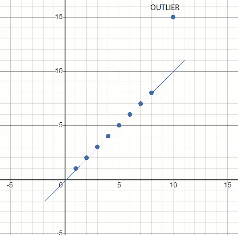

Data points free from noise

人类思维可以立即发现该分布中的所有点，除了一点之外，都在一条直线上，并且思维在区分内点和外点方面没有困难。我怎样才能让计算机模拟人类行为的这一方面呢？ **RANSAC** 算法试图解决这一挑战。

# 传统方法—拟合直线

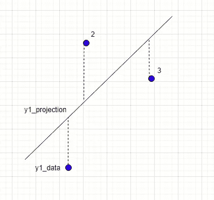

考虑以上几点。我们如何找到一条符合这种分布的线？最流行的方法之一是最小平方距离法。在这种方法中，我们:

1.  创建一个成本函数，它将所有点到直线的距离相加
2.  迭代地修改线的方程并评估成本函数
3.  选择产生最低成本函数的线

# 我们如何建立一个成本函数？

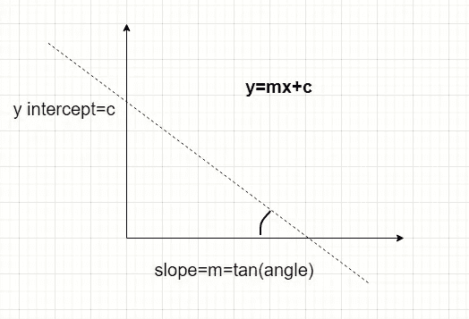

*   考虑任意一点***π***坐标 ***易***
*   考虑一条直线，公式为 y=m.x+c，其中 **m** 是斜率， **c** 是 Y 轴截距
*   ***Pi*** 垂直投影与这条线相交的点的距离由***d(I)***=(***m***给出。*+***c***)——*
*   **我们不想担心消极的价值观。因此，让我们平方上述距离。d(i) =(( ***m*** )。*+***c***)——***易)******
*   **所有 **N** 点垂直距离的平方和由**Sum**=∑((***m***)给出。*+***c***)——***易)******
*   **我们可以将总和表示为依赖于两个变量的函数——斜率 **m** 和 Y 截距 **c****
*   **成本函数 **f(m，c)** 现在可以表示为∑(( ***m*** )。*+***c***)——***易)******
*   **因为我们有两个变量(m 和 c ),我们需要两个方程来确定它们的值。**
*   **函数的最大值/最小值可以用导数来确定。函数达到最大值/最小值的点，函数在该点的导数为零。**
*   **我们将使用偏导数来找出产生最低值的 m 和 c 的值**
*   ****f(m，c)** 相对于变量 **m** 和 **c** 的偏导数必须为零，以给出最低的成本值**
*   *****df/DM***= 2∑((***m***)。***【Xi】***+***c***)——***易)*Xi*****
*   *****df/DC***= 2∑((***m***)。*+***c***)——***易)******
*   **由于时间关系，我将跳过最小二乘距离公式的推导，直接给出解决方案**
*   ****m=(n .σ(x . y)-σx .σy)/(n .σ(x2)+(σx). 2)****
*   *****c***=(σy—m .σx)/N**

# **最小二乘法的挑战**

## **场景—无噪音**

**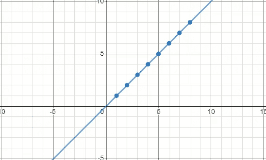**

**Perfectly aligned data points**

## **场景—一些有噪声的数据点**

**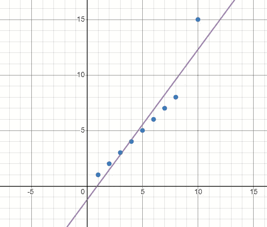**

**Data points which are mostly linear and with 1 outlier**

# **了解 RANSAC —概述**

**在进入完整的细节之前，我在这一节中介绍了 RANSAC 的一个精华版本**

*   **从整个分布( **N** )中随机选择较小的一组点( **n****
*   **使用最小二乘回归确定符合 **n** 点的线性方程**
*   **确定每一点 **N** 到这条线的平均距离。这个分数可以被认为是对该线良好性的一种衡量。**
*   **记录**分数**。如果该分数小于从先前迭代获得的最佳分数，则丢弃旧的线性方程并选择当前的线性方程。**
*   **回到第一步，继续迭代，直到完成预定次数的迭代**
*   **当预定数量的迭代已经完成时，停止算法**
*   **迭代结束时可用的线性方程可能是最佳候选线**

**我们可以看到，该算法是不确定的，因此在缩写 RANSAC 中命名为 *Random* 。有可能你得不到最好的型号。**

# **了解 RANSAC —详细**

**在这一节中，我展示了 RANSAC 的维基百科页面上的算法**

1.  ****最大值** =最大迭代次数**
2.  ****n** =每次迭代中要选取的点数。可以初始化为 2**
3.  ****best _ model**= best _ error 的直线方程。初始化为空**
4.  ****best_error** =目前为止获得的最低误差(平均距离)。初始化为一个大数字**
5.  ****threshold _ error**=如果一个点到一条线的距离低于该值，则该点被分类为内点，否则为离群点**
6.  ****threshold _ inliers**=要选择的模型的最小内联器数量**
7.  ****k** =完成的迭代次数。初始化为 0**

# **开始**

*   ****k** = **k** + 1**
*   **如果 **(k > MAX)** 则停止算法**
*   **从整个群体中选择 **n** 个随机点。用**随机点**表示该集合**
*   **使用最小二乘回归找出符合 **random_points** 的直线。用**电流模型**表示该方程**
*   **确定**内连线**，它是**阈值 _ 内连线**距离**当前 _ 模型**内所有点的集合**
*   ****内联程序的计数**=内联程序**中的点数****
*   **如果 **count_of_inliers** 小于 **threshold_inliers** ，则放弃该样本并转到 **Start****
*   **通过组合**内嵌器**和**随机点**来扩展样本。**
*   **使用最小二乘回归找出符合**内曲线**和**随机点**的直线。这个等式被表示为 **better_model****
*   **从 **better_model** 确定所有点的平均距离。这由**电流误差**表示**
*   **如果(**current _ error**>**best _ error**)则转到 **Start****
*   ****最佳 _ 型号** = **当前 _ 型号****
*   ****最佳 _ 错误** = **当前 _ 错误****
*   **转到**开始****

# **结束**

# **结果**

## **测试 1**

**投入**

****

**输出**

**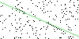**

## **测试 2**

**投入**

**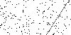**

**输出**

**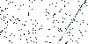**

## **测试 3**

**投入**

**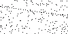**

**输出**

**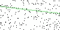**

# **代码概述**

# **源代码位置**

**我使用了以下工具来编写本文附带的 Python 脚本。**

1.  **Visual Studio 2019**
2.  **使用 Python 项目模板**
3.  **Python 3.7 引擎**

**源代码可以在 https://github.com/sdg002/RANSAC 找到，你不必使用 Visual Studio。我很确定 Phython 代码应该像现在这样工作。**

# **Python 文件和文件夹列表**

*   ****RANSAC.py** —可以从命令行执行的最外层 Python 脚本**
*   ****generatenosiline . py**—最外层的 Python 脚本，它将生成一条带有椒盐噪声的随机直线**
*   ****LineModel.py** —实现一个表示直线方程的类**
*   ****Point.py** —实现一个代表 2d 点的类**
*   ****RansacHelper.py** —实现核心 RANSAC 算法**
*   ****Util.py** —实用功能**
*   ****测试 _？？。py** —这些是单元测试类**
*   **。\输入\ —包含输入文件的文件夹**
*   **。\输出\ —发布结果图像的文件夹**

# **快速启动—生成噪声线的图像**

*   **运行脚本**
*   **生成的图像将在子文件夹**中生成。\出去****

**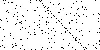**

**Straight line with salt and pepper noise**

# **快速启动—对有噪声的图像执行 RANSAC**

*   **运行脚本 [**RANSAC.py**](http://RANSAC.py) 在嘈杂的图像中找到最佳拟合线**
*   **输入文件由 [RANSAC.py](http://RANSAC.py) 中的一个变量控制，这个文件应该放在子目录**中。\输入****
*   **输出以新图像的形式生成，该新图像具有叠加在原始线上的 RANSAC 线**

**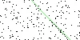**

**after running RANSAC the detected line**

# **参考资料和进一步阅读**

*   **Youtube 讲座([https://www.youtube.com/watch?v=BpOKB3OzQBQ](https://www.youtube.com/watch?v=BpOKB3OzQBQ))**
*   **维基百科关于兰萨克的文章([https://en.wikipedia.org/wiki/Random_sample_consensus](https://en.wikipedia.org/wiki/Random_sample_consensus))**
*   **推导最小二乘回归([https://online.stat.psu.edu/stat414/node/278/](https://online.stat.psu.edu/stat414/node/278/))**
*   **加权最小二乘法([https://towards data science . com/when-and-how-to-use-weighted-least-squares-WLS-models-a 68808 B1 a89d](https://towardsdatascience.com/when-and-how-to-use-weighted-least-squares-wls-models-a68808b1a89d))**
*   **霍夫变换(【https://en.wikipedia.org/wiki/Hough_transform】T2**
*   **寻找最大值和最小值(【http://clas.sa.ucsb.edu/staff/lee/Max】和 Min's.htm )**