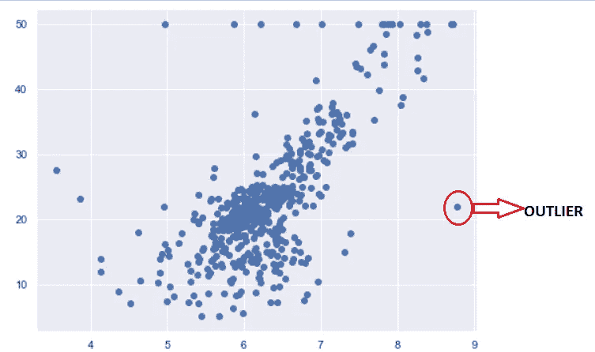
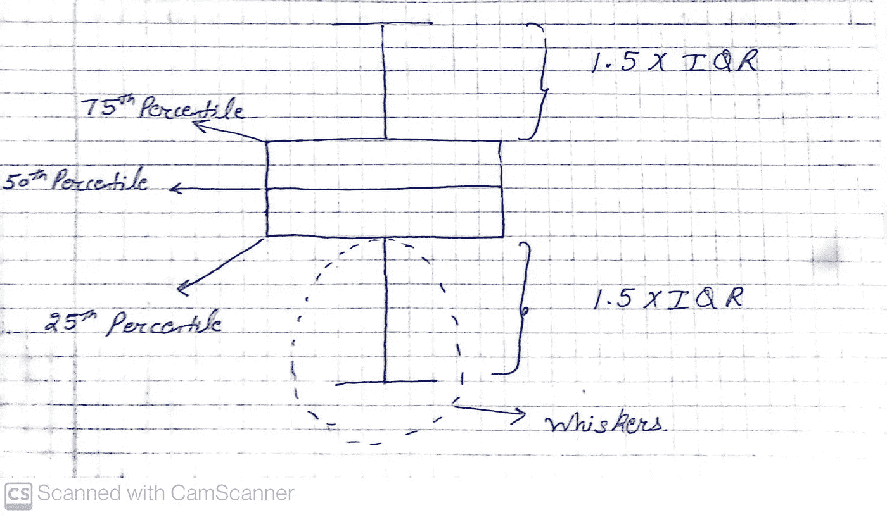
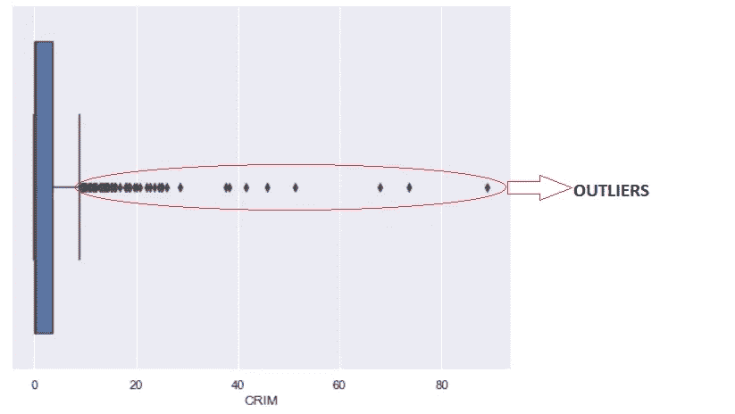
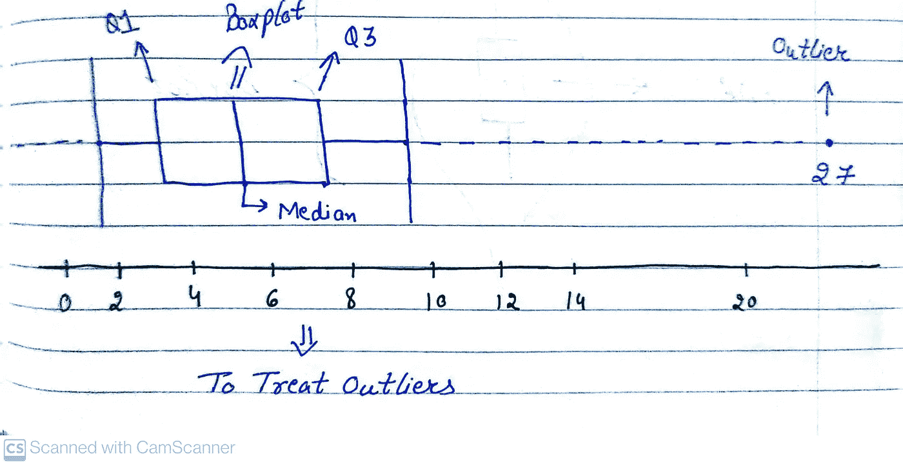

# 离群值，如何发现离群值，以及 5 个数字摘要

> 原文：<https://medium.com/mlearning-ai/outliers-how-to-find-outliers-and-5-number-summary-c3072ad0f0cc?source=collection_archive---------10----------------------->

你在训练机器学习模型时遇到过离群值吗？或者曾经想过

## 什么是离群值？

离群值是与数据集中的其余数据有显著不同的数据点。它们可能是由数据收集、测量或分析中的错误引起的，也可能是完全合法但不寻常的值。异常值可能会扭曲分析结果，可以在执行进一步的统计分析之前将其删除。

**举例:**我们有一个班级的学生成绩列表比如
x = [3，30，35，25，45，50，48，40，32，38，22，25，29，90]
这里，3 和 90 都是异常值。

## 为什么离群值很重要？

异常值很重要，因为它们可以提供对数据的有价值的洞察，并有助于发现可能被忽视的模式和趋势。它们还可以指示需要进一步调查的错误或异常。异常值还有助于确定变量之间的关系，并有助于确定哪些变量对整体数据有更大的影响。

**Graph Showing Outlier**

## 如何检测异常值？

通过绘制箱线图，我们可以很容易地发现异常值。

BOXPLOT

这些胡须上下的任何东西都是异常值。

**Boxplot showing Outliers**

## 5 号总结

五位数摘要是一组描述性统计数据，提供了有关数据集的信息。它用于移除异常值。它包括以下内容:

**1:最小值**

数据集中存在的最小值。

**2:第一个四分位数(第 25 个百分位数)或 Q1**

百分位数是某个百分比的观察值位于其下的值。

例如，如果一个学生获得了 99%的分数，这意味着这个学生比 99%的学生获得了更好的分数。

因此，Q1 或第 25 百分位是一个分布中心趋势的衡量标准。25%的数据点低于该值，75%的数据点高于该值。

**3:中间值**

当数据按数字顺序排列(升序或降序)时，通过取一组数据中的中间数来计算中位数。它也被称为中间值或第 50 百分位。与平均值相比，它给出了更准确的数据描述，因为它不受异常值的影响。

**4:第三个四分位数(第 75 个百分位数)或 Q3**

与 Q1 类似，Q3 或第 75 百分位是指 75%的数据点低于该值，25%高于该值。

**5:最大值**

数据集中存在的最大值。

## **5 个数字汇总示例以及如何使用它来消除异常值？**

假设我们有一个数据集

X = [1，2，2，2，3，3，3，4，5，5，5，6，6，7，8，8，9，27]

我们将尝试创建一个栅栏，其值应介于较低栅栏和较高栅栏之间。此外，27 是异常值。

**四分位数间距(IQR) = Q3 — Q1
下限= Q1 — 1.5(IQR)
上限= Q3 + 1.5(IQR)**

**1:** **最小值= 1**

**2:Q1**=(25/100)*(n+1)= 5.25 指数
其中 n 为数据点总数。为了得到第 5.25 个指数的值，我们可以取第 5 和第 6 个指数的平均值。

**Q1 = (3+3)/2 = 3**

**3:中位数= 5**

**4:Q3**=(75/100)*(n+1)= 15.75 指数

**Q3 = (8+7)/2 = 7.5**

**5:最大值= 9**

下限= 3-(1.5)(4.5)=-3.65
上限= 7.5+ (1.5)(4.5) = 14.25

**Boxplot using 5 number Summary**

感谢您阅读这篇文章！如果你有任何问题，请在下面留言。

 [## Mlearning.ai 提交建议

### 如何成为 Mlearning.ai 上的作家

medium.com](/mlearning-ai/mlearning-ai-submission-suggestions-b51e2b130bfb)