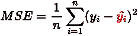
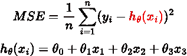
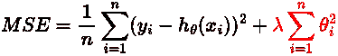
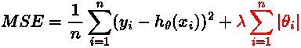
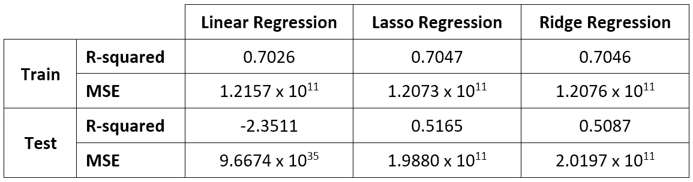

# 用正则化克服过拟合

> 原文：<https://medium.com/mlearning-ai/overcoming-overfitting-with-regularization-4064eaf7a3a3?source=collection_archive---------3----------------------->

过度拟合是机器学习问题中的一个常见问题，但它可能很难处理。删除某些不重要的特性是处理过度拟合的一种简单方法，但是正则化呢？

正则化就像是治疗我们倾向于适应或被数据中的噪音分散注意力的方法。如果我们的模型正在学习这种噪音，这将毫无意义，因为这些数据点并不真正代表我们数据的真实属性。

正则化是指修改学习算法以支持“更简单”的预测规则来避免过度拟合的行为。正则化通过约束模型来工作，使得我们的模型不能适应噪声。

假设我们将均方误差(MSE)作为回归模型的损失函数。MSE 的工作原理是计算实际值和预测值之差的平方。预测值通过高次多项式获得，而θ值是权重，x 是我们的模型使用的特征。请记住，我们的目标是在训练迭代过程中最小化这个 MSE 值。

如上所述，当我们的模型与数据非常吻合时，这意味着我们的模型对于某些特征具有较高的权重值，尽管这些特征并不重要。正则化的主要思想是我们惩罚不重要的特征，特别是惩罚大的权重。

记住复杂的假设导致过度拟合。正则化的主要思想是改变误差函数来惩罚假设或正则项的复杂性。

L2 Regularization (Ridge)

L1 Regularization (Lasso)

λ被称为正则化系数，它控制着我们的模型与数据的吻合程度。L1 正则化和 L2 正则化的主要区别是在上面的公式中使用了平方和绝对值。

如果系数等于 0，解决方案与普通最小二乘线性回归相同。正系数将导致权重的大小小于通常的线性解。

如果系数处于“好”值，正则化有助于**避免过度拟合**。如果存在与模型不相关的要素，正则化将赋予它们较小但非零的权重(理想情况下，不相关要素的权重应恰好等于 0)

**让我们进入代码来证明这一点！**

首先，我们需要导入相关的库，特别是线性回归、Ridge 和 Lasso，以便对它们进行比较。我们将使用 Kaggle 的墨尔本房屋快照数据。之后，我们需要选择相关的特征并对空值进行插补。为了简单起见，我们对数据使用一个热编码和标准化。最后，我们可以将它们分成训练集和测试集。

在数据准备过程之后，我们准备制作一些模型。首先，我们构建线性回归作为基线。之后，我们可以建立拉索(L2)和里奇(L1)作比较。请注意，当我们定义 Lasso 或 Ridge 时，我们可以使用它们的超参数，正如您在 sklearn 文档中所看到的。

下表总结了实验结果。

Result table

我们可以看到，我们的基线模型(线性回归)对数据拟合过度，因为它在训练数据上有很好的表现，但在测试数据上表现不佳。请注意，如果 R 平方的结果为负，这意味着我们的模型性能更差。

另一方面，套索和岭比我们的线性回归表现更好。它显示了测试数据的性能改进，尽管它仍然不是我们的模型所能做到的最好的性能。如前所述，正则化项是这种改进的原因。很好。

**结论:**

正则化可以防止过度拟合。它通过添加正则化项来惩罚某些特征的权重。通过这样做，我们使我们的模型变得简单，并对模型进行约束，这样我们就不能很好地拟合噪声或训练数据。

代码和数据可在 [GitHub](https://github.com/yogawicaksana/regularization_medium) 上获得。

**参考文献:**

*   [https://sci kit-learn . org/stab/modules/class . html # module-sklearn . linear _ model](https://scikit-learn.org/stable/modules/classes.html#module-sklearn.linear_model)
*   [https://www . kaggle . com/dataset/dans Becker/Melbourne-housing-snapshot](https://www.kaggle.com/datasets/dansbecker/melbourne-housing-snapshot)

 [## Mlearning.ai 提交建议

### 如何成为移动人工智能的作者

medium.com](/mlearning-ai/mlearning-ai-submission-suggestions-b51e2b130bfb)