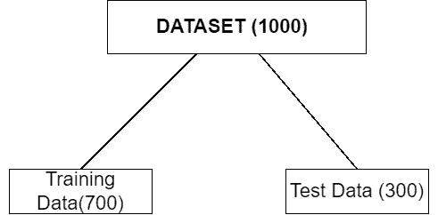
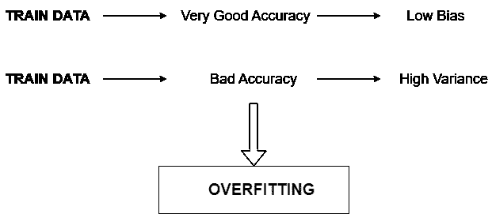
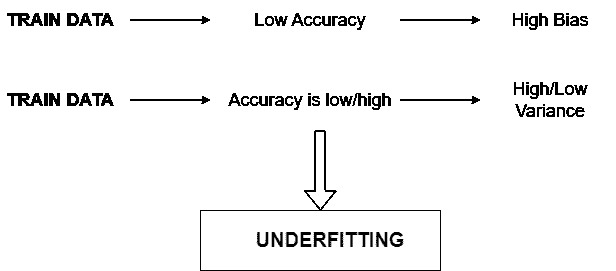

# 过度拟合与欠拟合

> 原文：<https://medium.com/mlearning-ai/overfitting-vs-underfitting-6a41b3c6a9ad?source=collection_archive---------3----------------------->

过拟合和欠拟合是机器学习中的常见问题，会影响模型的性能。了解这些概念对于构建有效的机器学习模型至关重要。

在了解过度拟合和欠拟合之前，您应该了解**训练和测试数据集**。

## 训练和测试数据集

在建立机器学习模型之前，通常将整个数据集分成两个子数据集:**训练**数据和**测试**数据。

顾名思义，训练数据用于训练机器学习模型，以找到数据中的模式和关系。然后，在测试数据集上使用训练好的模型进行预测。

简而言之，训练数据用于训练模型，而测试数据用于评估训练数据的性能。

Training and Test Dataset

## 过度拟合和欠拟合

**过度拟合**发生在模型非常复杂并且与训练数据非常接近的时候。这将导致模型的泛化能力差。这意味着该模型在训练数据上表现良好，但它将无法预测新的、看不见的数据的准确结果。

**欠拟合**发生在模型过于简单，无法正确捕捉数据中的模式和关系时。这意味着模型在训练和测试数据上都表现不佳。

Image Source: [GeeksforGeeks](https://www.geeksforgeeks.org/underfitting-and-overfitting-in-machine-learning/)

***机器学习模型的目的应该是获得良好的训练和良好的测试精度。***

## 什么导致过度拟合和欠拟合？

过度拟合通常是由于使用带有太多参数的模型，或者模型对于给定的数据集来说过于强大。另一方面，拟合不足通常是由于模型的参数太少，或者使用的模型对于给定的数据集来说不够强大。

## **偏差和方差**

偏差和方差是可能严重影响机器学习模型性能的两种误差。

如果模型具有非常好的训练精度，这意味着该模型具有低方差，但是如果训练精度差，则该模型具有高方差。如果模型的测试精度差，那么它具有高的方差，但是如果测试精度好，这意味着模型具有低的方差。

Overfitting

Underfitting

## 如何避免过拟合和欠拟合？

*   为了解决过拟合和欠拟合的问题，为给定的数据集选择合适的模型是很重要的。
*   还可以执行超性能调优。
*   对于过拟合，降低模型复杂度可以有所帮助，类似地，对于欠拟合，可以增加模型复杂度。
*   由于过拟合是由于数据集中的特征太多造成的，而欠拟合是由于特征太少造成的，因此在特征工程期间，可以减少和增加特征的数量，以分别避免过拟合和欠拟合。

## 结论

过拟合和欠拟合是机器学习中两个非常常见的问题。过度拟合和欠拟合都会影响模型的性能。过度拟合发生在模型复杂且与数据非常吻合的时候，而欠拟合发生在模型过于简单且无法准确找到关系和模式的时候。在建立模型时认识到这两个问题并处理它们以提高模型的性能是非常重要的。

*感谢您阅读这篇文章！如果你有任何问题，请在下面留言。可以在* [*Linkedin*](https://www.linkedin.com/in/devsachin0879/) *和*[*GitHub*](https://github.com/devsachin0879)*上关注我。*

 [## Mlearning.ai 提交建议

### 如何成为 Mlearning.ai 上的作家

medium.com](/mlearning-ai/mlearning-ai-submission-suggestions-b51e2b130bfb)