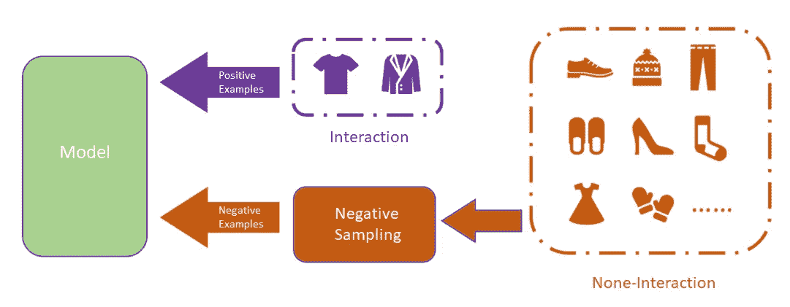
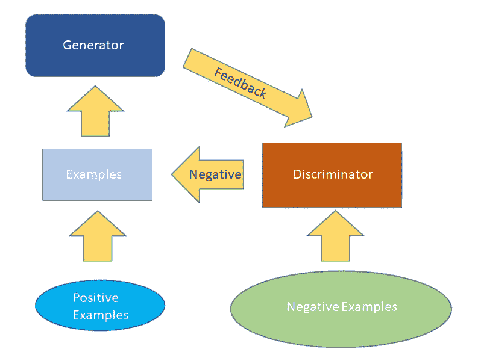

# 推荐系统中的负抽样概述

> 原文：<https://medium.com/mlearning-ai/overview-negative-sampling-on-recommendation-systems-230a051c6cd7?source=collection_archive---------0----------------------->

推荐系统的负样本作为推荐模型训练的重要组成部分，对模型的训练效果有着重要的影响，也是推荐系统领域的一个重要研究分支。本文将从推荐系统的研究背景到现有的经典著作对推荐系统的负采样进行一个总体的介绍。

> 为了扩大学术分享，我将中文博客[0]翻译成英文。

# 介绍

推荐系统的目的是根据用户的兴趣和爱好向用户进行个性化推荐，从而提升用户在网上购物、新闻阅读、视听娱乐等场景中的体验。在推荐场景下，推荐模型主要依靠用户的历史反馈信息对用户兴趣进行建模。一般来说，在模型训练的过程中，我们需要同时向模型提供 ***正例(用户喜欢的产品)和反例(用户不喜欢的产品)*** ，然后基于损失函数学习用户和产品的表征，最终完成模型训练。但是，在实际推荐场景中，考虑到数据收集的难度，我们很难从用户那里获得显性的反馈信息(比如用户对产品的评分)来确切知道用户喜欢哪些产品，不喜欢哪些产品，大部分数据是用户的隐性反馈信息(比如用户消费过的产品的记录)。

对于隐性反馈，数据没有明确的标签。对于模型训练，我们一般假设用户交互过的产品都是正例，通过抽样，选取一部分用户没有交互过的产品作为负例。从用户的非交互产品集合中选择基于某种策略的负样本的过程称为 ***负采样*** 。

Negative Sampling on Recommendation Systems

# 相关著作

负采样算法的本质是在负采样过程中根据一定的方法设置或调整采样分布。根据负采样算法设置采样分布的方式，我们可以将目前的负采样算法分为两类: ***启发式负采样算法*** 和 M ***基于模型的负采样算法*** 。

## ***启发式否定抽样***

启发式负抽样算法主要是指通过设置一些启发式规则来设定抽样分布。这类算法的特点是开销较小，易于理解和实现，但在效果上会有一定的瓶颈。下面介绍两种经典的启发式负采样算法。

1.  **随机负采样，RNS [1]**

RNS 是最基本的负采样算法。它的思想是平等对待抽样池中的每一个产品，等概率抽样。RNS 的算法逻辑非常简单，在效率上有很大优势。这也避免了在取样过程中引入新的偏差。这是一种广泛使用的采样算法。

**2。受欢迎程度偏负抽样，PNS [2]**

PNS 也是一种启发式负采样算法。其思想是以产品人气作为抽样权重，用权重对抽样池中的产品进行抽样。人气越高越容易挑。这里有很多定义人气的方法。定义产品历史互动次数的一个常用方法是，产品消费越多，其受欢迎程度越高。与 RNS 相比，该算法用基于流行度的抽样分布代替了均匀分布。它只需要在抽样前计算每个产品的流行度作为抽样分布，然后按照这个分布进行抽样。开销没有明显增加。

与 RNS 相比，按流行度抽样的目的是增加反面例子的信息量，提高抽样质量。例如，如果一个非常受欢迎的产品出现在用户的非交互产品集合中，那么这个产品极有可能是用户不喜欢的产品。那么通过这个反面例子，就可以很好的了解用户的喜好。相反，一个大家都不喜欢的产品把它作为反面例子来学习，其实能带给模型的信息量很小，很难学习到用户的个性化特征。

然而，一些文献指出[3]，PNS 也有一定的局限性。第一，由于 PNS 的采样分布是预先计算好的，所以在模型训练过程中，采样分布不会发生变化。所以，那些在训练前期可以增加信息量的反面例子，在经过多个时代的训练后，可能会减少它们带来的信息量。 ***其次，引入流行度也可能引入新的偏差，因为流行度的计算是全局的。而且在用户之间，不同用户类别的兴趣可能是不一样的。如果给定数据中的用户类别分布不均匀，可能会导致流行度定义的偏差。***

## ***基于模型的负采样***

与上面提到的两种启发式算法相比，基于模型的负采样算法更容易挑出高质量的负样本，也是目前比较前沿的采样算法。以下是几种基于模型的负采样算法:

**1。动态负采样，DNS [4]**

在模型训练的过程中，负样本能给模型带来的信息量会随着模型的训练而不断变化。DNS 的思想是根据模型的当前情况动态改变采样分布，以提高每一轮的采样质量。对于模型， ***我们希望的最后一个模型是能够给正面案例更高的分数，给负面案例更低的分数*** 。因此，对于每一轮训练，应该选择样本池中会被模型打高分的产品供模型学习，它们包含了更多的模型信息。基于这种思想，DNS 每次采样时都会将当前模型作为采样模型，对样本进行评分，然后选择评分较高的样本作为负样本对当前模型进行训练，获得新一轮的模型，如此迭代。

**2。基于生成对抗网络的负采样**

在模型训练过程中，模型的训练目标是降低损失函数值，采样器的采样目标是选择能够增加模型损失函数值的负样本，这就隐含了一种对抗性的思想。自然地，生成对抗网络(GAN)也被用于否定抽样。IRGAN [5]是信息检索负抽样领域的经典著作。首次将 GAN 的思想应用于信息检索领域进行负采样。具体来说，IRGAN 的设计包含两个推荐模型，一个作为鉴别器，一个作为生成器，基于对手的思想进行训练。生成器的目的是通过从负例池中选择负例混合到正例中来迷惑鉴别器，而鉴别器是区分生成器混合的正例与负例并反馈给生成器。

IRGAN Model Architecture

**3。简化和稳健的负采样，SRNS [8]**

虽然上面提到的两种基于模型的采样算法都可以通过模型学习的方法提高采样质量，获得硬负样本，但是有两个关键问题:

1.  由于使用模型评分来选择负样本，会加剧重采样时的假阴性问题。因为单从评分的角度来看，无论是假阴性还是强阴性都会得到更高的分数，按照模型分数得到的分布进行抽样会增加假阴性被挑中的概率。
2.  这种基于模型的算法，尤其是基于 GAN 的算法，会有很大的时间开销，影响模型的训练。

为了解决这两个问题，nips 2020 上的工作提出了一种“用于隐式协同过滤的简化且鲁棒的负采样”。该算法利用观察到的统计特征作为先验知识来区分假阴性样本和强阴性样本，以增强模型的鲁棒性，并使用类似 DNS 的结构进行采样，以保证采样质量。在时间复杂度分析上，SRNS 也优于 GAN 型方法。这项工作将视角放在采样去偏和采样效率优化上，同时创新性地引入统计指标，试图区分假阴性和强阴性。这是启发性的工作。

# 研究方向

在负抽样的推荐系统中，主要有三个研究方向:****【抽样偏差】******抽样效率*** 。*

1.  ***取样质量***

*一般来说，在负面抽样过程中，抽样的质量主要是指所收集的负面样本所包含的信息量。与信息量较低的负样本相比，信息量较高的负样本集合将显著提高模型训练的效率，加速模型收敛。从近年来推荐系统负抽样领域的论文数量来看，提高抽样质量是目前该领域的主要研究方向之一。*

***2。采样偏差***

*在推荐系统的负样本中，我们的基本假设是，用户交互过的产品都是用户的正例，没有交互过的产品都是负例。但是很容易发现这个假设还是比较强的，和真实场景有一定的偏差。例如，用户没有购买不一定不喜欢的产品。也可能是用户未来想要交互的产品。这种偏差可以称为假阴性问题。这些样本中的偏差会影响模型的训练，因此减轻或消除采样中的偏差是该领域的一个重要研究方向。*

***3。采样效率***

*在推荐场景下，用户的历史交互数据相对稀疏。一般来说，用户平均交互的产品数量不会超过整个产品集的 10%。因此，对于阴性采样，需要在更大的采样池中进行采样。一旦采样过于复杂，模型训练的开销就会增加，这也与实际工业场景中的要求不符。因此，采样算法的设计需要控制复杂度，提高采样效率也是该领域的一个重要研究方向。*

# *参考*

*[0] 小白必看：一文读懂推荐系统负采样[https://zhuanlan.zhihu.com/p/387378387](https://zhuanlan.zhihu.com/p/387378387) | AI Box 专栏：[https://www.zhihu.com/people/dou-hong-jian-44](https://www.zhihu.com/people/dou-hong-jian-44) | RecBole Framework:[https://github.com/RUCAIBox/RecBole](https://github.com/RUCAIBox/RecBole)*

*[1] Steffen Rendle、Christoph Freudenthaler、Zeno Gantner 和 Lars Schmidt-Thieme。2009.BPR:基于隐式反馈的贝叶斯个性化排序。在 UAI。AUAI 出版社，452-461 页。*

*[2]，，，，和洪。2017.基于神经网络的协同过滤采样策略研究。在 KDD。美国计算机学会，767-776。*

*[3] Steffen Rendle 和 Christoph Freudenthaler2014.改进基于隐式反馈的项目推荐成对学习。在 WSDM。273–282*

*[4]张渭南，陈天琪，，于勇.2013.通过动态负项抽样优化 top-n 协同过滤。在 SIGIR。美国计算机学会，785-788。*

*[5]，蓝涛宇，，张伟南，，徐，，王本友，，张戴尔.2017.IRGAN:一个统一生成式和判别式信息检索模型的极大极小游戏。在 SIGIR。ACM，515–524。*

*[6]朴大勋和张仪。2019.半监督信息检索中的对抗抽样和训练。在 WWW。ACM，1443–1453。*

*[7]丁，全，何湘南，，金德鹏.暴露数据推荐的强化负抽样。在 IJCAI，第 2230-2236 页，2019 年。*

*[8]丁，全，姚，，金德鹏.2020.隐式协同过滤的简化和鲁棒负采样。在 NeurIPS。*