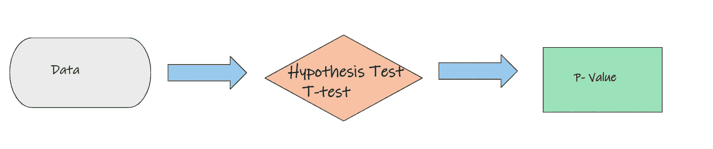
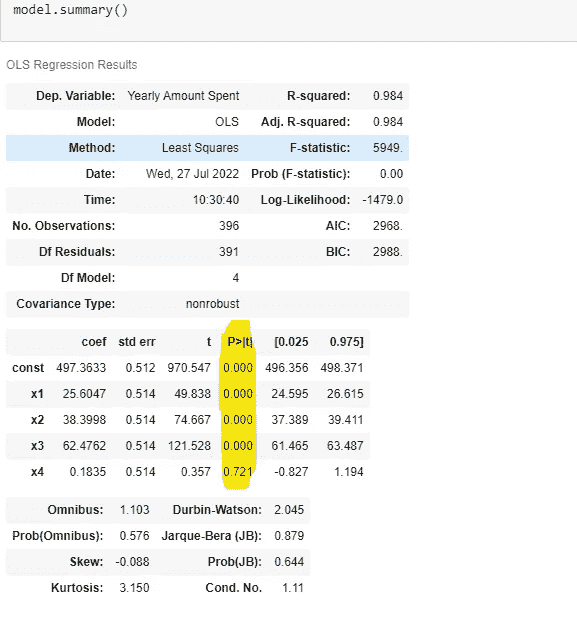

# 统计学中的 p 值简化及其数据科学应用。

> 原文：<https://medium.com/mlearning-ai/p-values-in-statistics-simplified-and-the-datascience-application-5dcb1ce498f6?source=collection_archive---------3----------------------->

Photo by [Brett Jordan](https://unsplash.com/@brett_jordan?utm_source=unsplash&utm_medium=referral&utm_content=creditCopyText) on [Unsplash](https://unsplash.com/s/photos/simplify?utm_source=unsplash&utm_medium=referral&utm_content=creditCopyText)

# 先决条件—假设和假设检验

假设是关于预期关联的假设。

示例:

*   增加苹果水果的食用量将会减少看医生的频率。
*   给予顾客忠诚度积分的商家比不给予积分的商家拥有更多的顾客忠诚度。

在研究或统计领域，你的目标是确定是否有足够的统计证据支持关于参数的特定信念或假设，正如我们在上面的例子中看到的。这就是所谓的**假设检验。**

**现实世界中假设检验的例子**

*   确定某种新疗法或药物是否能改善患者预后的临床试验。
*   在计划市场策略时，确定哪种广告媒体可以增加销售或获得客户。
*   以确定肥料是否能促进植物生长。

# 无效假设和交替假设

在每个实验中，研究人员都在测试不同组之间的效果。

然而现实是，被观察的群体之间总有可能没有任何影响。这种差异的缺乏被称为零假设。

**零假设** **(H *o* )** —这是假设两组观测数据之间没有统计关系。

示例:

*   这种新肥料对植物的生长没有影响。
*   在企业中，忠诚度积分和客户忠诚度之间没有关系

**替代假设(Ha)——**这是零假设的逻辑对立面。这是一个与零假设相矛盾的关于人口的主张。即两组观察数据之间存在统计关系。

示例:

*   这种新肥料使植物生长得更快。
*   给予客户忠诚度积分可延长会员年限。

# p-value[魔鬼代言人]

source: vector stock

当我们说有人在玩**【唱反调】**时，我们指的是什么？这意味着他们在讨论中“假装”反对大多数人支持的观点，以引发辩论或测试反对意见的力量。

统计学中的 p 值支持魔鬼的主张。即旨在证明零假设为真。研究和科学领域的 p 值通常决定了什么研究可以发表，什么项目可以获得资助。

# 统计定义

p 值是零假设为真的“概率”。

# 例子

假设我们想测试肥料对植物生长的有效性。在这种情况下，肥料 A 施于第一组作物，肥料 B 施于第二组作物。

source-author

# 让我们从阐明零假设和替代假设开始

**无效假设**:肥料 A 和 B 对我们作物的影响没有观察到差异。即肥料 A 和 B 的效果是一样的。

**另一个假设:**肥料 A 和 B 对作物生长的影响有明显的差异。即肥料 A 和 B 的效果不同。

# 下一步是进行假设检验。

例如，让我们假设已经进行了 T 检验(一种假设检验)来获得 P 值。

source:author

# 结果:P 值

p 值可以取 0 到 1 之间的任何值。p 值用小数表示，尽管用百分比表示更容易理解。0.03 的示例 p 值为 3%。

让我们假设我们得到了 **p 值=0.2。**

*   这意味着如果我们进行 100 次实验，100 个无效假设中有 20 个是正确的。

如果我们得到 **p 值=0.1**

*   这意味着如果我们进行 100 次实验，100 个无效假设中有 10 个是正确的。

如果我们得到 **p 值=0.05**

*   这意味着如果我们进行 100 次实验，100 个无效假设中有 5 个是正确的。

以上是向我们展示如何解释 p 值的例子。

假设我们进行肥料效应实验，发现 **p 值为 0.3。这意味着如果我们进行 100 次实验，100 个无效假设中有 3 个是正确的。**请记住，我们的零假设表明，肥料 A 和 B 对作物的影响没有观察到的差异。

# 我们的 p 值显著吗？

p 值本身并不能给我们足够的信息。显著性水平，也称为α或α，是在拒绝零假设并得出该效应具有统计显著性的结论之前，样本中必须存在的证据强度的度量。这个显著性水平完全取决于作为研究者的你，并且通常是在实验之前决定的。alpha 值也用小数表示，用百分比表示也更容易理解。

# p 值

Let’s assume before the experiment we decide our level of significance is **0.05** 。在这种情况下，p 值为α。即 **0.03 < 0.05。**

**在这种情况下，我们将拒绝零假设，并得出肥料 A 和 B 显著不同的结论。**换句话说，我们样本中的证据足够有力，能够在总体水平上拒绝零假设。

source-author

# p 值> alpha

让我们假设在实验之前，我们决定我们的显著性水平是 **0.01。**在这种情况下 p 值为>α。即 **0.03 > 0.01。**在这种情况下，我们将**无法拒绝**零假设，并得出肥料 A 和 b 之间没有显著差异的结论。换句话说，我们样本中的证据不足以在总体水平上拒绝零假设。

source:author

总之，在假设检验中完成以下步骤:

1.  陈述假设。
2.  阐明无效假设和替代假设。
3.  确定显著性水平(alpha)。
4.  确定要使用的测试统计。
5.  计算检验统计量并获得 p 值。
6.  将 p 值与显著性水平进行比较。
7.  拒绝或未能拒绝零假设。

# P —数据科学中的价值解释

现在，让我们看看如何在模型开发和评估期间在数据科学环境中使用这种 p 值知识。

# **让我们从重新表述数据科学**中的无效假设和替代假设开始

**零假设:**自变量对目标变量没有显著影响

**备择假设:**自变量对目标变量有显著影响。

在数据科学中，我们基于这样一个事实来执行特征选择，即并非我们数据集中的所有自变量都对我们的因变量(目标变量)有重大影响。此外，我们在模型中使用的独立变量越多，模型就变得越复杂，模型的性能就降低得越多。因此，我们只需要重要的独立变量。

**因此，我们可以使用数据集中自变量的 p 值来确定它们是否对因变量(目标变量)有显著影响。**

下图是一个数据集的模型摘要，该数据集试图确定实体店的平均客户会话(x1)、客户在应用上花费的总时间(x2)、客户的会员时间(x3)和客户通过网站购物的总时间之间的哪个渠道对客户在商店的年消费金额影响最大。

source:author

**阿尔法值**

让我们选择阿尔法值为 0.05。

**P 值**

让我们分析上面的统计汇总图中的变量 x1、x2、x3 和 x4。当我们检查用黄色突出显示的 p>t 列时，我们得到变量 x1、x2、x3 和 x4 的 p 值。

**我们将保留变量 x1、x2 和 x3，因为这些变量的 p 值(0.000)小于 alpha 值**。当 p 值<α时，我们拒绝零假设，即自变量对目标变量没有显著影响。

变量 x4 p 值= 0.721。这意味着 p 值> alpha 值(0.721>0.05)。我们将**无法拒绝**零假设，并得出结论，自变量对目标变量没有显著影响，因此移除该变量。

在后面的文章中，我将阐述以下概念。

1.  单尾假设检验。
2.  双尾假设检验
3.  假设检验的类型，如 Z 检验，T 检验，卡方检验。
4.  假设检验中的第一类和第二类错误
5.  揭开关于 p 值的误解。

 [## Mlearning.ai 提交建议

### 如何成为 Mlearning.ai 上的作家

medium.com](/mlearning-ai/mlearning-ai-submission-suggestions-b51e2b130bfb)