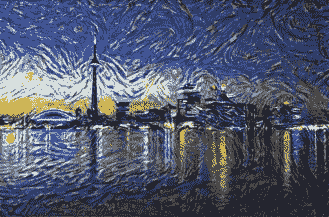
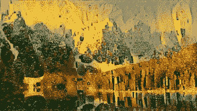
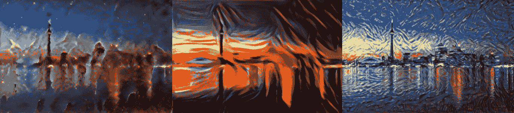
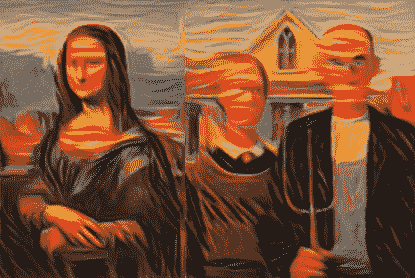

# 用深度学习画梵高

> 原文：<https://medium.com/mlearning-ai/painting-like-van-goh-using-deep-learning-625ae6678706?source=collection_archive---------2----------------------->

作为一个不太伟大的艺术家，我需要另一种方式来创作艺术。幸运的是，凭借一点张量流和一点数学知识，我能够创作出自己的梵高画作。

Toronto stylized with Starry Night and Lake Louise stylized with The Kiss

# 怎么会？

# 神经类型转移

> 它通过组合两个图像来创建一个产品图像，该图像具有一个图像的内容和另一个图像的风格。

该技术在论文[艺术风格的神经算法(Gatys 等人)中示出。](https://arxiv.org/abs/1508.06576)

它的工作原理是使用深度神经网络从一个图像中提取风格表示，并从另一个照片中提取内容表示，然后将两者融合在一起，以创建一个匹配内容表示和风格表示的新图像。这就用原来的内容创建了一个新的图像，但是用了新的颜色和纹理。

# 我们究竟如何提取风格和内容？

## 卷积神经网络

CNN | [Wikipedia](https://commons.wikimedia.org/wiki/File:Typical_cnn.png)

卷积神经网络擅长处理图像。他们能够很容易地将它们分类并识别它们的内容。要达到如此高的性能，CNN 对图像有着深刻的理解。在引擎盖下，CNN 构建复杂的图像表示来识别独特的特征。它们的许多层协同工作，提取最重要的信息，以正确识别和检测物体。表面层检测一般的直线和曲线，而更深层次的层使用以前的发现来定位更明确的一般对象，如眼睛或四肢。这种处理层次使输入图像能够被转换成捕获关于它的详细信息的表示，包括我们需要知道的提取和表达图像的风格和内容的所有信息。

# 履行

完整的 [Google Colab](https://colab.research.google.com/drive/1EuR75oG8hcmgEKQ0nAVDLw73kPEPuQAn?usp=sharing)

## 我们的 CNN，VGG 19 台

Architechture of VGG-19 | [researchgate](https://www.researchgate.net/figure/llustration-of-the-network-architecture-of-VGG-19-model-conv-means-convolution-FC-means_fig2_325137356)

如前所述，需要一个强大的 CNN 来捕捉错综复杂的绘画和照片。我们可以利用预训练网络的力量，而不是浪费时间训练一个全新的网络。VGG-19 是在 ImageNet 数据集上训练的 19 层 CNN，对图像有很强的理解能力。它可以检测和提取我们需要的所有直线、曲线和图案。

由于我们不训练网络，也不使用它来进行预测，我们可以将 trainable 设置为 false，并删除完全连接的层。

我们从网络中挑选中间层来使用。由于它们来自不同的区块，我们可以理解图像的不同部分，并恰当地捕捉内容和风格。

对于风格，我们使用多层来捕捉不同特征图之间的相关性。这些特征相关性允许我们获得输入图像的多级表示，以捕捉纹理信息，而不是特定的全局排列。

## 要素制图表达

为了捕获内容特征，我们只需将内容图像传递到模型中，并保存我们选择的中间层的特征映射。

同样，对于样式表示，我们通过模型传递样式图像，并获取我们为样式选择的中间层的特征图。

## 失败

为了能够组合两个图像并且都优化以捕捉一个图像的风格和另一个图像的内容，我们需要两个单独的损失。一个用来捕捉风格的差异，另一个用来捕捉内容的差异。

计算内容损失相当简单，我们只需计算原始内容图像和我们正在创建的图像的特征之间的均方误差。我们得到特定**局部**形状的精确差异。

对于风格损失，它变得有点棘手。由于艺术风格由色彩和纹理等组成，我们不能只找到特征图之间的差异。我们需要一种方法来捕捉更多关于图像的一般**非本地化**信息。

## 介绍格拉姆矩阵

gram 矩阵允许我们捕捉图像的更一般的画面，而不是特定的局部信息。格拉姆矩阵是由张量乘以它的转置矩阵得到的。

通过将一个张量乘以它自己的转置，gram 矩阵有效地将原始信息扩散和重新分布到它本身，以去除局部化的数据点。

为了计算样式损失，我们测量参考样式图像的样式表示的 gram 矩阵和正在创建的图像的样式表示的 gram 矩阵之间的均方误差。由于我们使用了多个层，我们为不同的层分配不同的权重，以强调某些层的特征。

随着训练的进行，产品图像的内容和风格损失被减少和最小化，以创建具有原始内容但具有新风格的图像。

## 培养

现在一起。

在我们的训练循环中，我们加载样式图像一次，内容图像两次。一个将用于提取内容特征，另一个将是我们的产品图像。在训练过程中，我们将对产品图像执行梯度下降，以最大限度地减少这两种损失。

在开始训练之前，我们提取原始图像的内容和风格特征，并计算风格的 gram 矩阵。

对于每个训练步骤，我们计算梯度，然后将它们应用于产品图像。在每一步，如果损失最低，我们保存产品图像。

最终，我们将拥有损失最小化的产品形象，这是我们原始内容和风格形象的融合。

# 结果

我们可以很容易地将风景与著名的绘画和建筑结合起来

[Toronto landscape](https://www.britannica.com/place/Toronto) stylized with P[illars of Creation](https://www.nasa.gov/image-feature/the-pillars-of-creation/), [The Scream](https://en.wikipedia.org/wiki/The_Scream), and [Starry Night](https://www.vangoghgallery.com/painting/starry-night.html)

它也适用于肖像

[Mona Lisa](https://en.wikipedia.org/wiki/Mona_Lisa) and American Gothic stylized with [The Scream](https://en.wikipedia.org/wiki/American_Gothic)

# 结论

1.  神经艺术风格转移可以将来自单独图像的风格和内容组合起来，并创建一个新的图像。它告诉我们，风格和内容是可以分离和抽象的。
2.  CNN 可以从图像中提取抽象表示
3.  gram 矩阵允许我们捕捉关于图像的非本地化信息

**在你离开之前，一定要查看一下**[**Google Colab**](https://colab.research.google.com/drive/1EuR75oG8hcmgEKQ0nAVDLw73kPEPuQAn?usp=sharing)**的完整代码**