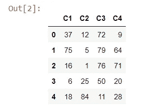
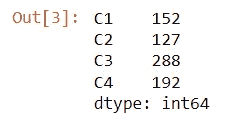
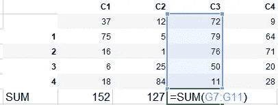
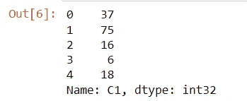
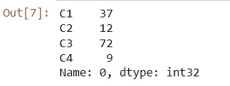
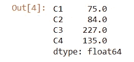
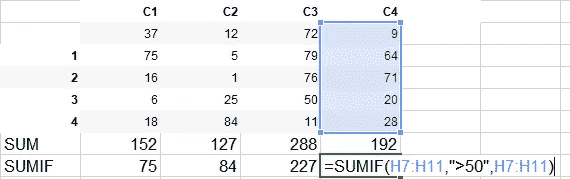
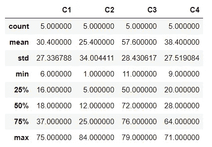

# 熊猫可以成为你从 excel 转换到 python 的门户

> 原文：<https://medium.com/mlearning-ai/pandas-can-be-your-gateway-to-switch-from-excel-to-python-26275d1357ff?source=collection_archive---------1----------------------->

## 如果你是一个高级 excel 用户，并计划学习 python，pandas 可能是一个不错的起点


PC: [Unsplash](https://unsplash.com/photos/XMFZqrGyV-Q)

如果你来自非编程和非工程背景，在开始学习一门编程语言时可能会有点害怕。Python 是一种高级语言，解释语言由于其直观和简单的语法而相对容易学习。但是，如果你发现很难记住你所学的东西，并且已经熟悉 excel 等基本分析工具，你可能会发现很容易在你已经知道的东西和将这些知识应用到 python pandas 等新的编程语言之间建立联系。

Pandas dataframe 及其方法的工作方式非常类似于 excel 表格和函数，但功能更加强大。你可以把 ***熊猫想象成 excel 数据查询的兴奋剂*** 。您可以用一行代码创建摘要并查看变量的性质(稍后将详细介绍)。虽然这不是一个编码教程，但我想画出 excel 和 pandas 的相似之处，这样你就可以开始设想如何利用你掌握的领域来学习新的和类似的技能。

一旦你掌握了 python 的基础知识，你可以从多种资源中学习，如 kaggle、coursera、datacamp、dataquest.io 和 stackoverflow 等。，您需要使用 pandas 开始执行您在 excel 中执行的任务。例如，你应该开始思考——“我如何在熊猫中执行类别求和？”(可以使用 excel 中的 SUMIF 来执行)。一旦你学会了熊猫的基础知识，你就可以开始学习更复杂的操作，比如熊猫操作的选择、过滤和 [**方法链接**](https://www.kaggle.com/botatu/7-learn-pandas-method-chaining) 。pandas 方法的链接也可以被认为非常类似于 excel 中的嵌套函数，但是 pandas 更有能力在单个步骤中完全转换数据，否则将需要多个函数并在 excel 中构建补充数据。Excel 还要求您创建帮助列和附加数据框架/表格，以获得所需的结果。

在这一节中，我将给出一些简单的例子，告诉你如何从 excel 到 pandas 建立连接

```
# generating some random data
#importing libraries
**import pandas as pd
import numpy as np
np.random.seed(1)** # will ensure you get the same number every time you run this code 
**data = np.random.randint(0,100,size=(5, 4))** # creating some random data to pull into a pandas data frame
**df = pd.DataFrame(data, columns = ['C1','C2','C3','C4'])** # creating a pandas dataframe which could be thought as equivalent to an excel table
**df**
```



data created using numpy; constructing a dataframe object in pandas

```
**df.sum(axis=0)** #equivalent to =SUM(of values along each column) in excel, if axis = 1 it will give sum of values in each row - horizontal sum
```



sum values for each column



Excel equivalent

```
#selecting a single column in a dataframe
**df['C1']** #selecting first column
```



```
#selecting a row
**df.iloc[0,:]** #selecting first row, pandas index starts from 0
```



```
#provide sum of rows after filtering the values >50 in each column
**df[df>50].sum()** #equivalent to =SUMIF(range=C1 column,criteria = '>50',sum_range = C1 column) and then dragging to all other columns
```



simple method chain and filtering in pandas



Excel equivalent

如果您现在想要为所有的数据创建描述性的统计数据，您可以在 pandas 中使用。describe()'方法，这需要您在 excel 中构造不同的公式

```
df.describe()
```



Result of using .describe()

您可以通过使用 [pandas profiling](https://pandas-profiling.github.io/pandas-profiling/docs/master/rtd/) 进一步扩展汇总统计和探索性数据分析(EDA ),它可以生成汇总图表、分类信息和易于导出的交互式 html 报告。

# 总结:

我所展示的实际上是 excel 中的基本函数以及它们在 pandas 中的等效方法。诀窍是使用在一种工具/语言中获得的知识来学习一种新的编程语言。以下是几个关键要点

*   拿起一个你已经在 excel 中分析过的简单数据集，或者创建一个
*   使用 pd.read_excel('filename ')将原始数据集从 excel 导出到 pandas
*   在 pandas 中重新创建所有计算——Google 和 stackoverflow 是您最好的朋友
*   通过在 pandas 中使用更多方法来扩展您的 EDA
*   一旦舒适，进展到熊猫的方法链

最后，我想分享一些有助于实现这一转变的资源:LinkedIn learning 上的
- [使用 python 进行数据分析](https://www.linkedin.com/learning/python-data-analysis-2015/comprehensions?autoAdvance=true&autoSkip=true&autoplay=true&resume=false&u=2274545)(在您尝试了上述方法之后)
- [使用 pandas 进行数据操作](https://app.datacamp.com/learn/courses/data-manipulation-with-pandas)Data camp 上的
-[Frank Andrade 在 towardsdatascience (tds)上撰写的一个完整而简单的从 excel 迁移到 Python 的指南](https://towardsdatascience.com/a-complete-yet-simple-guide-to-move-from-excel-to-python-d664e5683039)是 Excel 和 pandas 之间的另一个漂亮的汇编和比较，其中包含代码和教程
-[Pandas 中方法链接的不合理的有效性](https://towardsdatascience.com/the-unreasonable-effectiveness-of-method-chaining-in-pandas-15c2109e3c69)

**你可以在这里阅读我的其他文章:**

## [成为一名成功的数据科学家需要数学/统计吗？](/@aparna_vadlamudi/do-you-need-math-stat-to-be-a-successful-data-scientist-1ac1aa69fb3b?source=your_stories_page----------------------------------------)

## [脑电图数据能辅助重性抑郁障碍(MDD)的临床诊断吗？](/mlearning-ai/can-eeg-data-aid-clinical-diagnosis-of-major-depressive-disorder-mdd-96b09f5c1ced?source=your_stories_page----------------------------------------)

请关注我，帮助和鼓励我写更多这样的文章。
快乐阅读！

[](/mlearning-ai/mlearning-ai-submission-suggestions-b51e2b130bfb) [## Mlearning.ai 提交建议

### 如何成为 Mlearning.ai 上的作家

medium.com](/mlearning-ai/mlearning-ai-submission-suggestions-b51e2b130bfb)