# 十分钟后的熊猫——第一部分

> 原文：<https://medium.com/mlearning-ai/pandas-cheat-sheet-part-1-6816991aac65?source=collection_archive---------4----------------------->


image by [Ilona Froehlich](https://unsplash.com/@julilona) on unsplash

**Pandas** 是一款快速、强大、灵活且易于使用的开源数据分析和操作工具，构建于 [Python](https://www.python.org/) 编程语言之上。

Pandas 构建在 NumPy 和 Matplolib python 库之上。

**安装熊猫**

如果您的系统中安装了 Anaconda，那么您可以简单地从终端或命令提示符下安装:

```
conda install pandas
```

否则，如果您的系统中安装了 pip，那么您可以使用以下命令从终端或命令提示符安装它:

```
pip install pandas
```

**进口熊猫**

```
import pandas as pd
```

而不是写“熊猫”在熊猫体内使用这个方法，我们可以简单地写“pd”。因此，我们将其作为“pd”导入。

## **熊猫的数据结构**

***系列***

它是一种一维数据结构，非常类似于数组。

这是 python 中的一个列表

```
a = [3, 5, 2.71, -9.4, 8.432]
print(type(a))
a
```

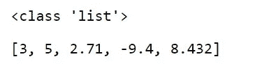

*创建系列*

1.

```
s = Series(a)
print(type(s))
s
```

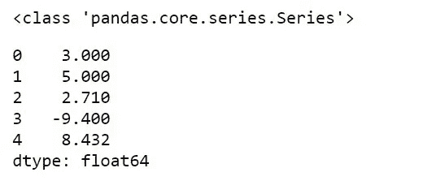

2.在系列中，指数可以是任何值。

```
idx = ['a', 'd', 'f', 'h', 'i', 't']
idx
```

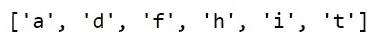

```
s1 = Series(a, idx)   #Series(data, index)
s1
```

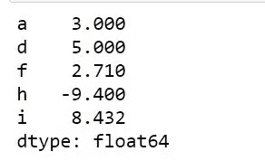

3.使用字典

```
dic = {"a" : 6, "b": 7, "c": "Disha", "d" : 30}
dic
```

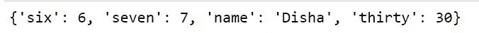

```
s2 = Series(dic)
s2
```

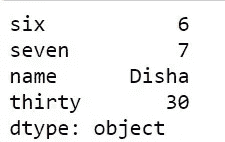

访问系列的元素

```
s[3]
```


```
s2[“name”]
```

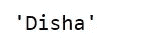

级数的算术运算

```
s1 + s2
```

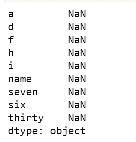

```
s2 + s2
```


```
s1 — s2
```

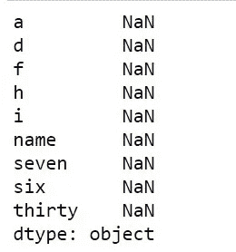

当熊猫找不到匹配时，它输出 NaN。

```
s — s
```

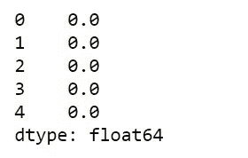

```
s * s
```

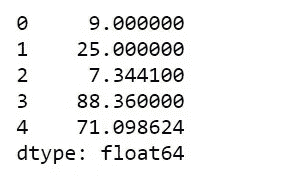

```
s / s
```

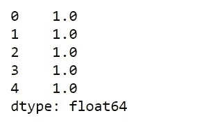

***数据帧***

数据框是一种二维数据结构，其中数据以表格形式排列。

熊猫中最常用的数据结构

**创建数据结构**

```
import numpy as np #another most important python library
df = pd.DataFrame(np.random.randn(5, 2), columns = list('AB'))
df
```

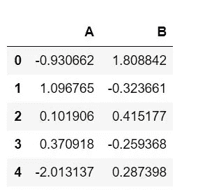

```
sample = {'name' : ['Riya', 'Sandy', 'Tonny', 'Alex'
          'age' : [14, 24, 30, 38],
    sample = {'name' : ['Riya', 'Sandy', 'Tonny', 'Alex'],
          'age' : [14, 24, 30, 38],
          'country' : ['India', 'New Zealand', 'Russia', 'Bangladesh']}
#creating a dataframe using dictionary
df1 = pd.DataFrame(sample)
df1
```

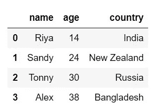

**从数据帧中选择列**

```
df1['name']
```

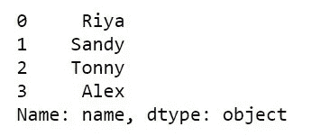

```
df1['name', 'age']
```


**添加列**

```
df1['year'] = [2006, 1996, 1990, 1982]
df1
```

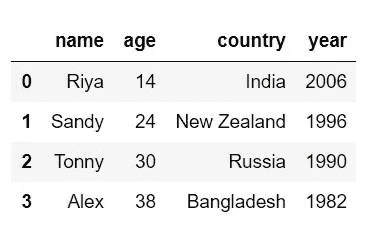

**移除或删除一列**

```
df1 = df1.drop(‘year’, axis = 1)
df1
```

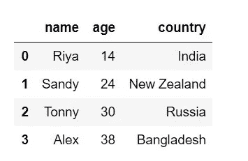

要删除多个列，我们可以将多个列放在一个列表中，如下所示:

df1 = df1 . drop([列 1，列 2，轴= 1)

**移除或删除行**

```
df1 =df1.drop(3)
df1
```

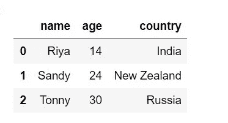

axis = 1 表示列，axis = 0 表示行。默认情况下，axis 值为“0”。

**访问元素**

1.  访问一列

```
df1['name']
```

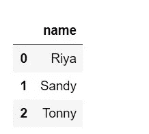

2.访问多个列

```
df1[['name', 'age']]
```

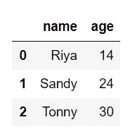

3.基于特定条件访问数据帧的列

```
df1[df1['age'] > 18] # df1[condition]
```

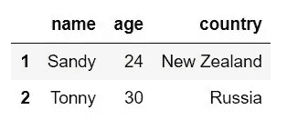[](https://varshithagudimalla.medium.com/pandas-in-10-minutes-part2-59782f7bfe20) [## 十分钟后的熊猫——第二部分

varshithagudimalla.medium.com](https://varshithagudimalla.medium.com/pandas-in-10-minutes-part2-59782f7bfe20)