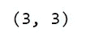
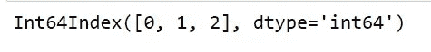
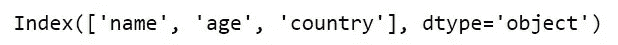
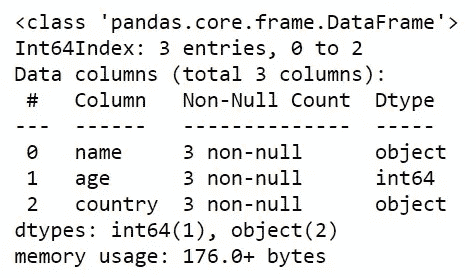
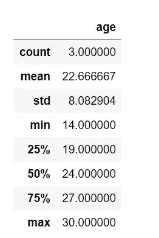
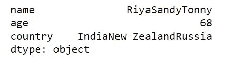
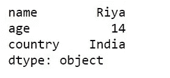
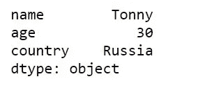

# 十分钟后的熊猫——第二部分

> 原文：<https://medium.com/mlearning-ai/pandas-in-10-minutes-part2-59782f7bfe20?source=collection_archive---------6----------------------->


image by Mika Baumeister on unsplash

[](/mlearning-ai/pandas-cheat-sheet-part-1-6816991aac65) [## 熊猫小抄—第一部分

medium.com](/mlearning-ai/pandas-cheat-sheet-part-1-6816991aac65) 

**读取输入文件**

1.  CSV 文件

```
pd.read_csv('file.csv')
```

2.excel 文件

I .读取包含单张纸的文件

```
pd.read_excel('file.excel')
```

二。读取包含多个工作表的文件

```
excel = pd.ExcelFile('file.xls')
df = pd.read_excel(excel,  'Sheet1')
```

**检索系列/数据帧的基本信息**

1.  形状

```
df.shape
```



(行，列)

2.描述索引

```
df1.index
```



3.描述数据框列

```
df1.columns
```



4.关于数据框的信息

```
df1.info()
```



5.关于数据框的描述

它仅适用于数字数据类型的列

```
df1.describe()
```



6.总和

```
df1.sum()
```



7.最低限度

```
df1.min()
```



8.最高的

```
df1.max()
```



**熊猫库中最常用的函数**

1.  检测缺失值

```
DataFrame.isnull()
```

2.填充空值

```
DataFrame.fillna([value, axis, …])
```

3.删除缺少的值。

```
DataFrame.dropna()
```

4.将数据框四舍五入到可变的小数位数。

```
DataFrame.round([decimals])
```

5.打印数据帧的前 5 行

```
DataFrame.head()
```

6.打印数据帧的最后 5 行

```
DataFrame.tail()
```

7.检查数据框中的每个元素是否包含在值中

```
DataFrame.isin(values)
```

8.对数据框应用函数

```
DataFrame.apply(func[, axis, raw, …])
```

9.使用映射器或按一系列列对数据框进行分组。

```
DataFrame.groupby(condition)
```

10.整理

I .沿轴按标签排序

```
df.sort_index()
```

二。按坐标轴上的值排序

```
df.sort_values(by=column)
```