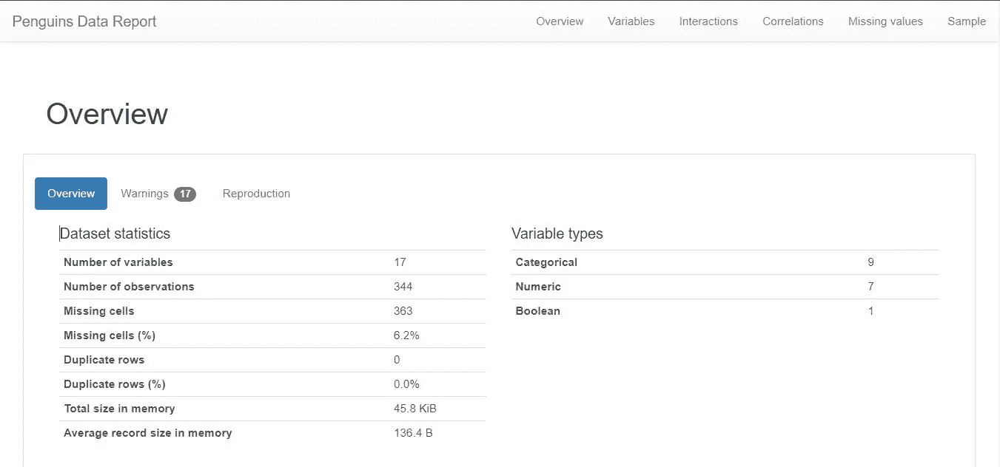
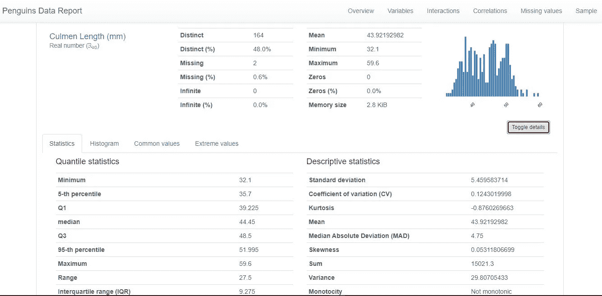
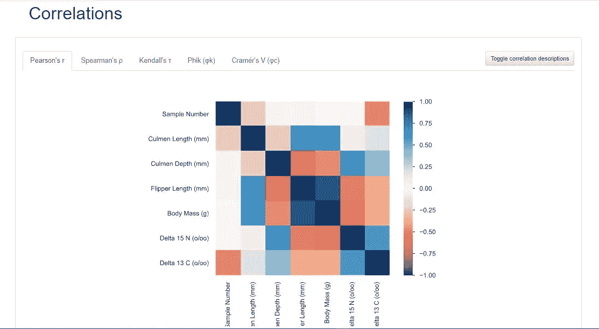

# 熊猫简介

> 原文：<https://medium.com/mlearning-ai/pandas-profiling-b395c7264958?source=collection_archive---------3----------------------->

Photo by [billow926](https://unsplash.com/@billow926?utm_source=medium&utm_medium=referral) on [Unsplash](https://unsplash.com?utm_source=medium&utm_medium=referral)

## 一种快速从数据中获得洞察力的方法。

有时我们没有太多时间来分析数据，在这种情况下，我们会寻找恢复工具。
我们可以将大熊猫特征分析视为这些工具之一。这个工具给了我们一份令人难以置信的爆炸数据分析报告。该报告包括数据框架概述、定义数据框架的每个属性、属性之间的相关性(Pearson 相关性和 Spearman 相关性……)以及数据框架样本。

在 pandas-profiling 两行代码的帮助下，我们可以快速地对我们拥有的数据进行许多分析。
让我们看看它能在一个示例数据集中做些什么，以更好地了解熊猫概况。
首先，从安装熊猫档案开始。您可以使用 pip 软件包管理器轻松安装。(或者从[资源](https://pandas-profiling.github.io/pandas-profiling/docs/master/rtd/pages/installation.html)获得一些帮助)然后只需导入包，多写两行代码并运行它。

报告的结果是惊人的，正如您从代码中看到的，您可以保存报告并在以后的工作中使用它。我在这里放了一些报告的快照，你可以从参考资料中看到所有的报告和笔记本代码。

不需要再写很多代码了，你可以在我在参考书目中提到的网站上看到更多关于熊猫的例子。
很高兴看到您带来关于数据科学的新文章。

参考书目:

 [## 熊猫简介/熊猫简介

### 文档|松弛|堆栈溢出从 pandas 数据帧生成配置文件报告。熊猫 df.describe()…

github.com](https://github.com/pandas-profiling/pandas-profiling)  [## 简介-熊猫-简介 2.12.0 文档

### 从熊猫生成档案报告。熊猫的 df.describe()函数很棒，但是对于严肃的……

pandas-profiling.github.io](https://pandas-profiling.github.io/pandas-profiling/docs/master/rtd/) 

[参见完整脚本](https://www.kaggle.com/resulcaliskan/penguins-data-quick-analysis-with-pandas-profiling)。