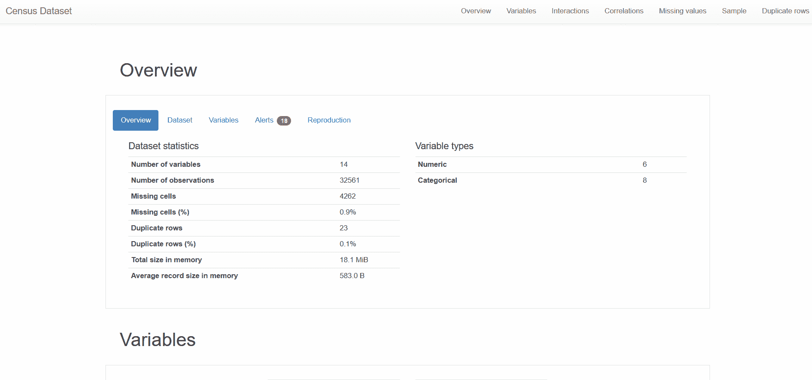
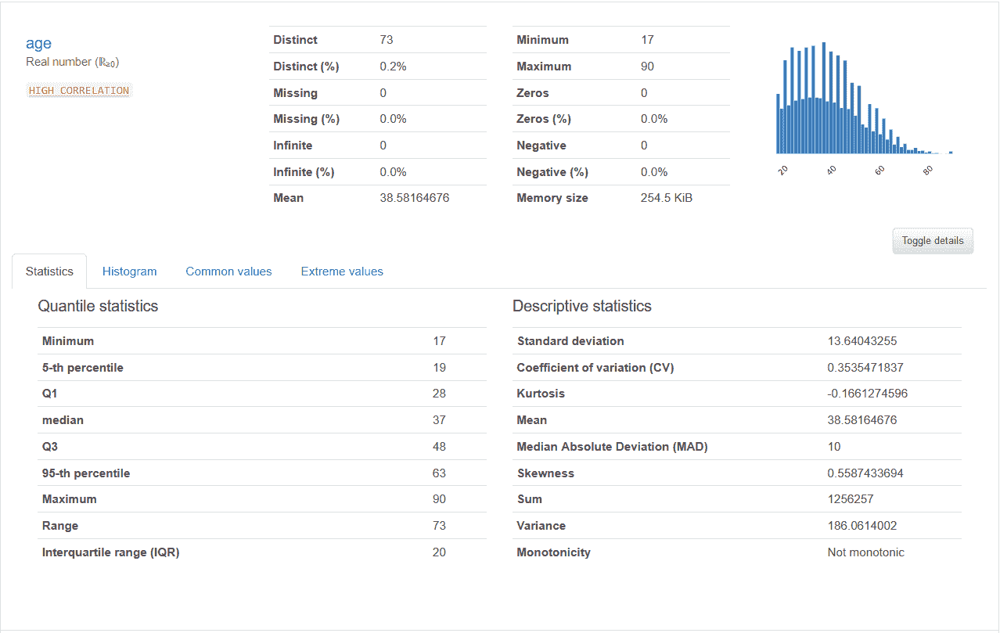
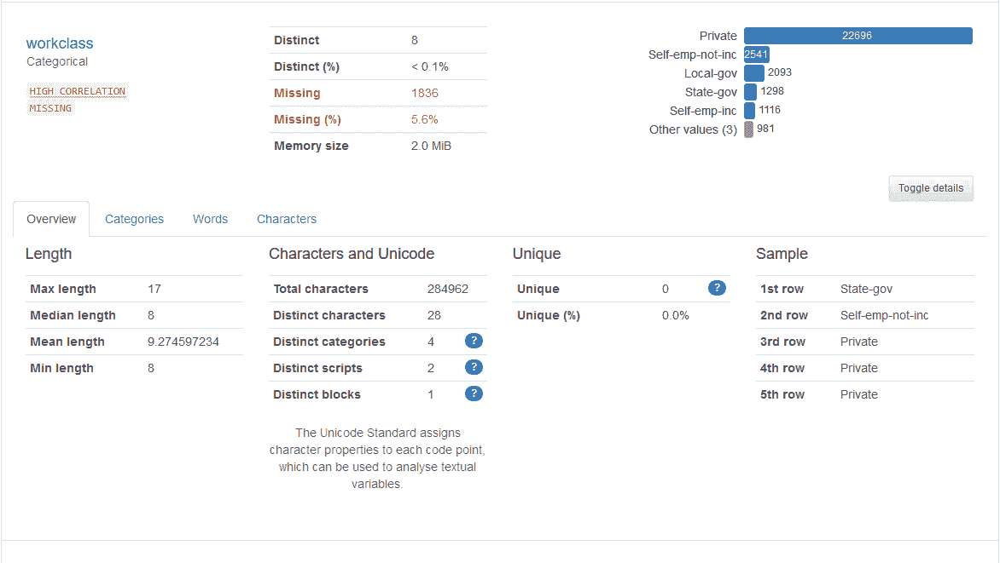
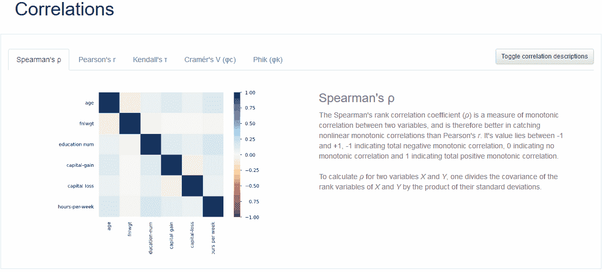

# Pandas Profiling:一行代码中完整数据探索的完整指南

> 原文：<https://medium.com/mlearning-ai/pandas-profiling-full-guide-on-complete-data-exploration-in-one-line-of-code-e4c0b023dd2d?source=collection_archive---------6----------------------->

## 关于如何通过 pandas-profiling 生成详尽的数据探索的综合指南


[Image on [https://pandas-profiling.ydata.ai/docs/master/index.html](https://pandas-profiling.ydata.ai/docs/master/index.html)]

# 目录

> [1。](#aec4)
> 简介 [2。代号](#9bea)
> [3。结构](#0964)
> [4。管理大型数据集](#cb97)

# 1.介绍

作为数据科学家，但总的来说，作为处理数据的计算机科学家，我们都发现自己处于以下情况:

> “真好，我得到了一个新的数据集！哦，等等，它有 500，000 行，200 列。我如何在不发疯的情况下快速了解内容？”

我确信你们每个人(像我一样)至少曾经拿出过那个小心翼翼地保护着的 python 文件，它包含了计算统计数据、绘图等的函数。试图找出这个数据集中到底有什么🤣。

今天，我想向大家介绍一个**解决方案**，它(至少对我来说)**极大地减少了在这些探索中浪费的时间**，**提高了**它们的**质量**，并允许我注意到数据中我通常会忽略的行为！🥳

这个包裹被称为 [**熊猫——简介**](https://pandas-profiling.ydata.ai/docs/master/index.html) 。它可以让你用一行代码生成一个完整详尽的报告。

结果的一个例子:



Census Income Dataset Example. [GIF by Author]

潜力和配置的可能性比你想象的要多得多。这不会是一个详尽的指南，但我会向你展示其中的一些并给你一些提示。

注:本文中的所有例子都基于一份由公共数据集生成的报告，即人口普查收入数据集，可通过以下[链接](https://archive.ics.uci.edu/ml/datasets/census+income)获得。

# 2.密码

正如预期的那样，生成报告的代码非常简单。安装数据集就足够了，例如通过 pip:

```
pip install pandas-profiling
```

然后执行下面的代码:

```
import pandas as pd
from pandas_profiling import ProfileReportdf = pd.read_csv('census.csv')profile = ProfileReport(df)
profile.to_file(output_file='census.html', title = 'Census Dataset')
```

这样，报告将保存在一个 html 文件中，可以使用简单的浏览器进行导航和交互。

或者，如果您想在笔记本中直接使用它，您可以使用以下代码:

```
profile.to_widgets()
profile.to_notebook_iframe()
```

# 3.结构

pandas-profiling 生成的报告分为 **7 个部分**:

*   **概述**:包含与数据集相关的高级信息(变量数量、行数等)的概述。)和再现性(配置、包版本等。).
*   **变量**:这是**主段**。它包含每个变量(列)的一个小节，描述基本统计数据(差异、中位数、标准差等)。)和剧情。
*   **交互**:它包含所有数字变量组合的热图。
*   **相关性**:这是**第二重要的部分**。它包含使用不同度量的各种相关矩阵。
*   **缺失值**:包含一个柱状图，描述每个变量缺失值的数量。
*   **样本**:包含数据集的一个样本。
*   **重复行**:包含最频繁重复的行。

我们现在将详细研究以下部分:变量和相关性。

## 变量

正如预期的那样，为每个变量生成了一个专用的子部分。它的主要特点是分析器**可以区分变量的类型** (Int、Float、Categorical、Timestamp 等。)**和改编探索**。

让我们以一个**整型变量**为例:



Numerical variable description. [GIF by Author]

现在让我们一起来看一个分类变量的例子:



Categorical variable description. [GIF by Author]

正如我们所看到的，曲线图和统计数据都根据被分析变量的类型而变化。

如果 pandas-profiling 错误地解释了某些变量(例如，分类变量的值为“1”、“2”、“3”等。被解释为整数)在启动报告之前，您可以通过以下方式解决这个问题:

```
df['cat_var'] = df['cat_var'].astype('str')
```

## 相关

当执行探索性分析时，尤其是在数据科学领域，要考虑的主要特征之一是变量之间的相关性。

Pandas-profiling 为我们提供了不同类型的相关性(甚至有一个简短的描述来正确地解释它们):



Correlations provided by pandas-profiling. [GIF by Author]

这是因为每个指标都有不同的特征。

让我们简单总结一下:

*   **斯皮尔曼**:数值变量之间的单调相关。范围[-1，1]。
*   **皮尔森**:数值变量之间的线性相关。范围[-1，1]。
*   **肯德尔**:数值变量之间的序数相关性。范围[0，1](因此不识别逆相关)。
*   **Cramer** :分类变量之间的相关性。范围[0，1]。
*   **Phik** :所有变量之间的相关性。范围[-1，1]。

有趣的是，Phik 相关性是存在的。一个相当近期的和**创新的**指标，能够关联所有类型的变量。更多详情，请看[这里](https://phik.readthedocs.io/en/latest/index.html)。

# 4.管理大型数据集

相关性和相互作用的计算相当耗时。可能会有情况下，它可能会变得太难管理。幸运的是，我们有几种方法来处理这个问题:

## 1.简单但不可配置的方法

必须设置以下参数:

```
profile = ProfileReport(df, minimal=True)
```

这将自动停用所有繁重的计算(如 Phik，原因显而易见)。

## 2:硬性但可定制的方法

有几个参数可以配置您自己的报告。

用户可以通过以下方式单独配置要停用的相关性:

```
profile = df.profile_report(
    correlations={
        "pearson": {"calculate": True},
        "spearman": {"calculate": False},
        "kendall": {"calculate": False},
        "cramers": {"calculate": True},
        "phi_k": {"calculate": False},
    },
)
```

或者，在机器学习问题的情况下，您只想看到所有变量与您的目标的交互，您可以通过以下方式来实现:

```
profile = df.profile_report(
    interactions={
        "targets": ['target']
    },
)
```

我们可以认为这个关于**熊猫的简介**已经完成了。我希望它能帮助你第一次接触这个包，避免不必要的时间浪费。😄

再见，弗朗西斯科

[](/mlearning-ai/mlearning-ai-submission-suggestions-b51e2b130bfb) [## Mlearning.ai 提交建议

### 如何成为 Mlearning.ai 上的作家

medium.com](/mlearning-ai/mlearning-ai-submission-suggestions-b51e2b130bfb)