# 熊猫初学者快速入门 1

> 原文：<https://medium.com/mlearning-ai/pandas-quickstart-for-beginners-1-547006306a9e?source=collection_archive---------3----------------------->


Photo by [Maxwell Nelson](https://unsplash.com/@maxcodes?utm_source=medium&utm_medium=referral) on [Unsplash](https://unsplash.com?utm_source=medium&utm_medium=referral)

就数据分析而言，Pandas 是 Python 中最重要的库之一。它提供了使用各种类型的数据结构的优势。熊猫最常用的数据结构是序列和数据帧。导入熊猫图书馆

```
import pandas as pd
```

已使用。用熊猫的命令，一般简称为“pd”。

**熊猫系列**

这些是包括索引的一维数据结构，即关于其元素的索引的信息是固有属性。要创建熊猫系列:

```
s = pd.Series([10,77,12,4,5])
s
--------------------------------------------------------------------Out:
s
Out[1]: 
0    10
1    77
2    12
3     4
4     5
dtype: int64
```

从输出中，很容易看到每个元素与其索引并排放置。可以通过以下命令查看系列的一些属性:

```
s.index   # to get information about indices 
s.dtype   # types of elements
s.size    # number of elements
s.ndim    # dimension-1-dimension
s.values  # values (gives a NumPy array)
s.head(4) # first 4 rows (default the first 5 rows)
s.tail(3) # last 3 rows (default the last 5 rows)
--------------------------------------------------------------------Out:
s.index  
Out[1]: RangeIndex(start=0, stop=5, step=1)s.dtype 
Out[2]: dtype('int64')s.size   
Out[3]: 5s.ndim    
Out[4]: 1s.values  
Out[5]: array([10, 77, 12,  4,  5])s.head(4)
Out[6]: 
0    10
1    77
2    12
3     4
dtype: int64
```

**数据帧**

数据帧是长度相等的向量列表。这个列表中的任何元素都可以被视为一个变量。因此，数据框可能在其列中包含不同的对象类，如字符串、整数、浮点或布尔。数据帧通常是通过命令从 CSV 文件创建的

`pd.read_csv("path of the CSV file")`

一些常用的数据帧可以从 Seaborn 库中获得。为了说明数据帧的结构属性，我们导入“titanic”数据集，并通过命令“load_dataset()”读取它。

```
import seaborn as sns
df = sns.load_dataset("titanic")
df.head() # the first 5 rows (default 5)
```

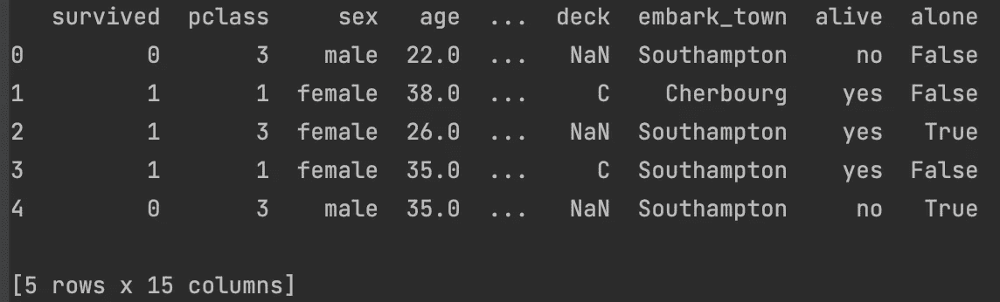

类似地，我们可以通过“tail()”命令看到数据集的最后一次观察:

```
df.tail() # the last 5 rows (default 5)
```

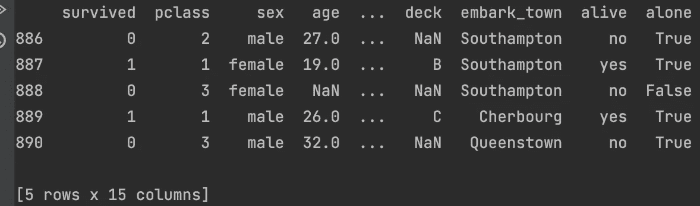

有关其形状或尺寸的信息，可以使用以下命令:

```
df.shape         # dimensions
--------------------------------------------------------------------Out:
(891, 15)
```

有关索引、变量类型和缺失值数量等更多信息:

```
df.info
```

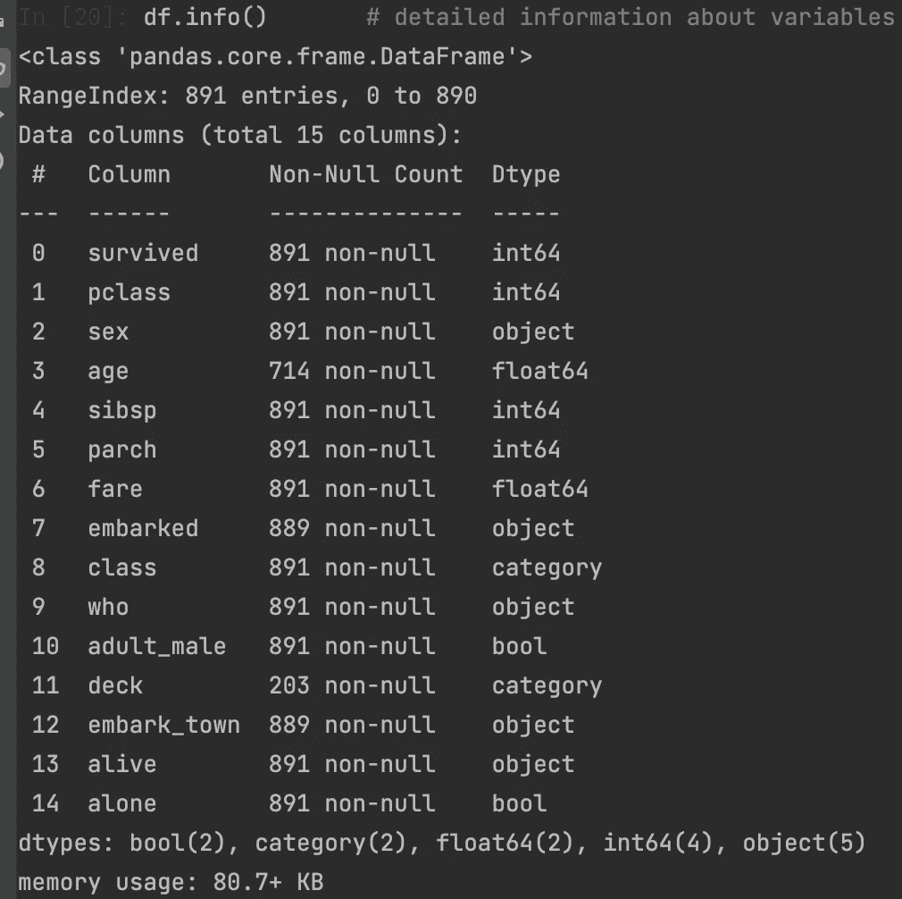

特别地，人们可以得到变量的名称和关于指数的信息:

```
df.columns
df.index
```

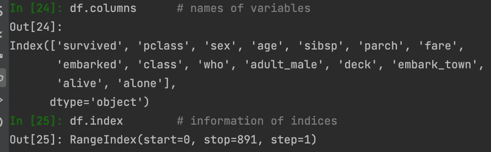

我们使用“describe()”方法总结其统计数据，如平均值、标准差、最小值、最大值和四分位数。

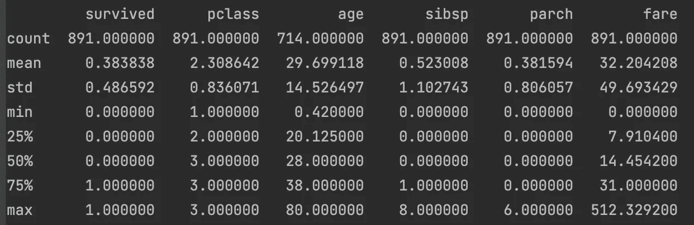

为了使输出更具可读性，我们将。t”。这将采取上述框架的转置。

```
df.describe().T
```

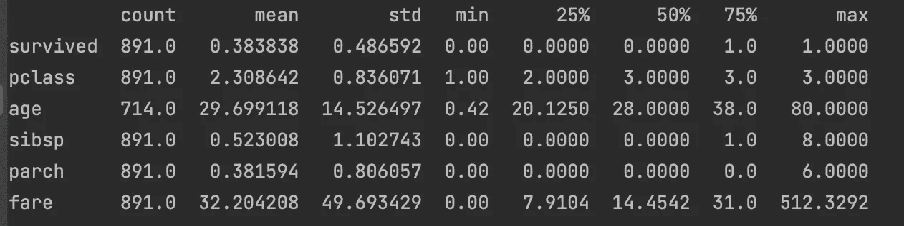

请注意，我们可以在上表中给出我们希望看到的百分比列表。

```
df.describe([0, 0.05, 0.50, 0.95, 0.99, 1]).T
```

要询问 Python 数据框中是否有任何缺失值，请执行以下操作:

```
df.isnull().values.any() # lack values 
```

如果有任何缺失值，这将返回 True，否则返回 False。此外，如果我们想知道每个变量中缺失值的数量:

```
df.isnull().sum()  # number of lack values of all variables
```

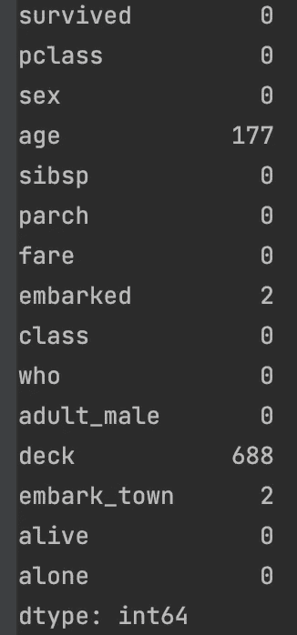

要选择一个变量，我们把它的名字放在方括号内；对于不止一个变量，我们再次将选择的变量列表放在方括号中。请注意，如果我们将变量放入一个括号中，输出将返回一个熊猫系列。如果我们想在选择后获得一个数据框，我们需要将变量写入两个方括号中。

```
df["sex"]    # to choose the variable "sex"(gives pandas Series) 
df.sex       # to choose the variable "sex"(gives pandas Series) df[["sex"]]  # to choose the variable "sex"(gives pandas data frame)df[["age","alive"]] # to choose more than one variable
```

获取分类变量中每个类的元素数量

```
df["sex"].value_counts()
--------------------------------------------------------------------Out:
male      577
female    314
Name: sex, dtype: int64
```

**熊猫的选择**

为了从一个数据集中获得一个区间，我们用方括号，写起点的索引和终点的索引的后继，在它们之间加“:”。

```
df[55:58]
```

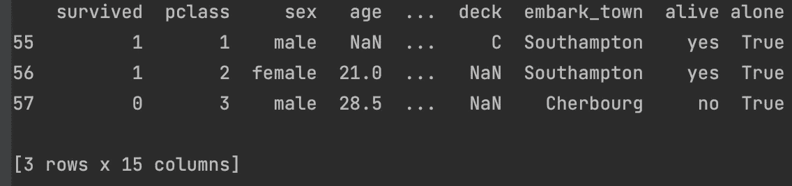

要删除数据框的行或列(=变量):

```
df.drop(0, axis=0).    # deletes first row
df.drop("age",axis=1) # deletes "age" variable
```

要删除多行或多列，我们应该列出它们。

```
df.drop([1,3,5,7], axis=0) # deletes the rows in the list
```

这种删除过程不是永久性的，即它不会改变原始数据帧。如果我们也想更改原始数据框，我们需要使“原地”参数为“真”:

```
df.drop([2,4],axis=0, inplace=True)df.drop(["age","alive"],axis=1, inplace=True)
```

要将数据集的变量转换成数据集的索引:

```
df.index=df["age"] # indices are ages now
```

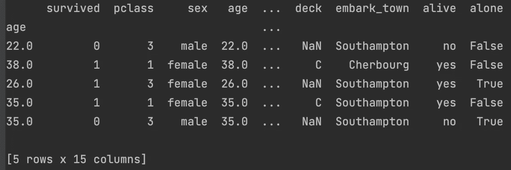

要收回此更改:

```
df.reset_index()
```

该方法再次将“年龄”列作为变量添加到数据框中，并刷新索引。

**对变量的操作**

要查看数据框的所有变量:

```
pd.set_option("display.max_columns",None)
```

这在处理包含大量变量的数据集时没有用。

要质疑数据集中变量的存在:

```
"age" in df
```

这将根据数据集中变量的存在返回 True 或 False。

要将新变量添加到数据框中:

```
df["age2"]=df["age"]**2
```

**Loc & Iloc**

**iloc:** 基于整数的选择，经典方式

```
df.iloc[0:3] # doesn't include 4th row, 
```

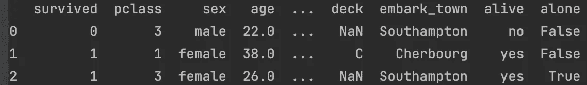

**位置:**基于标签的选择

`df.loc[0:3] # includes 4th row`

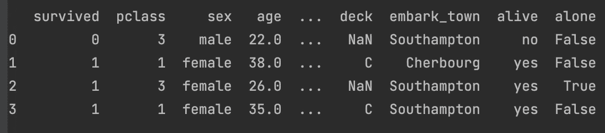

一些例子:

```
df.loc[0:3,"age"] # chooses first 4 rows of the "age" variable
--------------------------------------------------------------------Out:
0    22.0
1    38.0
2    26.0
3    35.0
Name: age, dtype: float64
--------------------------------------------------------------------df.iloc[0:3,0:3]
--------------------------------------------------------------------Out:
```


```
 col_names = ["age", "embarked", "alive"]
df.loc[0:3, col_names]
```

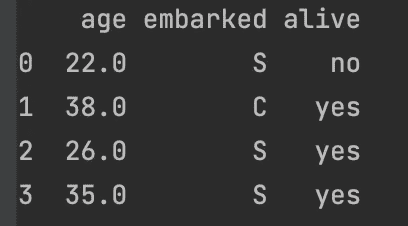

另一个例子:取包含“al”的变量的所有行，然后不包含字符串“al”

```
df.loc[:,df.columns.str.contains("al")] # selects all variables containing "al"df.loc[:,~df.columns.str.contains("al")] # selects all variables not containing "al"
```

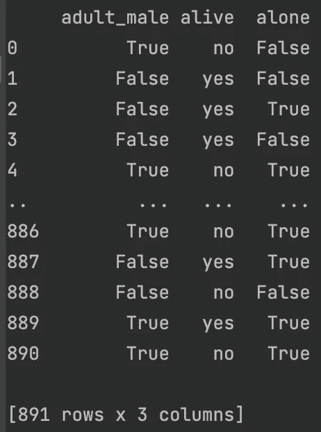

**条件选择**

从一个数据帧中，我们可以取出满足某些条件的一些行或列。首先，我们只放一个条件。

```
# df[conditions][variable]
# df.loc[condition,[list of variables"]]df[df.age >50]    # gives rows having age variable greater than 50df[df.age >50]["age"].count() #numbers of ages greater than 50df.loc[df["age"]>50,["class","age"]] 
```

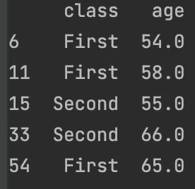

但是如果我们想要放置多个条件，我们必须将它们写在括号()中。在两个条件之间，我们需要使用其中一个逻辑符号“&”、“|”，其中前者表示“与”，后者表示“或”。

```
# df.loc[conditions in paranthesis,[list of variables"]]df.loc[(df["age"]>50) 
& (df["sex"]=="male"),
["class","age"]]df_new = df.loc[(df["age"] > 50) 
& (df["sex"] == "male")
& ((df["embark_town"] == "Cherbourg") | (df["embark_town"] == "Southampton")),["age", "class", "embark_town"]]
```

[](/mlearning-ai/mlearning-ai-submission-suggestions-b51e2b130bfb) [## Mlearning.ai 提交建议

### 如何成为 Mlearning.ai 上的作家

medium.com](/mlearning-ai/mlearning-ai-submission-suggestions-b51e2b130bfb)