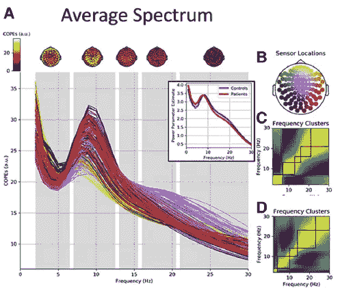
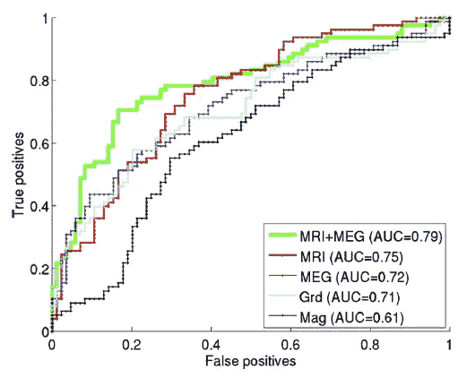
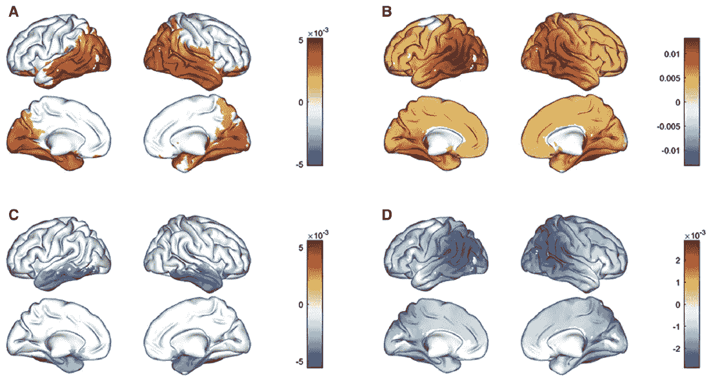
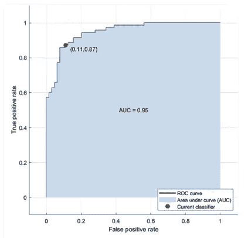

# 痴呆的生物磁生物标志物:脑磁图的推荐方法框架的试点多中心研究

> 原文：<https://medium.com/mlearning-ai/paper-review-biomagnetic-biomarkers-for-dementia-a-pilot-multicentre-study-with-a-recommended-5dd40c629dbd?source=collection_archive---------8----------------------->

# 术语

**脑磁图** ( **梅格**)是一种[功能性神经成像](https://en.wikipedia.org/wiki/Functional_neuroimaging)技术，通过记录[大脑](https://en.wikipedia.org/wiki/Human_brain)中自然产生的[电流](https://en.wikipedia.org/wiki/Electric_current)产生的[磁场](https://en.wikipedia.org/wiki/Magnetic_field)，使用非常灵敏的[磁力计](https://en.wikipedia.org/wiki/Magnetometer)来绘制大脑活动。 [SQUIDs](https://en.wikipedia.org/wiki/SQUID) (超导量子干涉器件)阵列是目前最常见的磁力计，而 [SERF](https://en.wikipedia.org/wiki/SERF) (自旋交换无弛豫)磁力计正在研究中，用于未来的机器。脑磁图的应用包括对感知和认知大脑过程的基础研究，在手术切除之前定位受病理影响的区域，确定大脑各部分的功能，以及[神经反馈](https://en.wikipedia.org/wiki/Neurofeedback)。这可以应用在临床环境中以发现异常的位置，也可以应用在实验环境中以简单地测量大脑活动。(维基百科)

# 目的

这项研究分析了两组患者，轻度认知障碍 (MCI)或健康对照，来自 3 个地点(剑桥、牛津&马德里)

> (1)检查数据中不同地点之间的潜在差异，
> (2)检查不同分析结果中不同地点之间的差异，
> (3)基于 MEG 数据的不同特征(例如，峰值频率、传感器上的功率分布、源上的功率分布以及源之间的连接性)并与基于 MRI 数据的特征进行比较，报告区分 MCI 患者与对照组的分类准确性。

# 方法

由于我们的研究兴趣主要在于计算方法，我们将跳过数据收集，专注于脑磁图分析。由脑磁图收集的频谱功率数据可以表示为一个`(N, C, T)`张量，其中`N`是患者数量，`C`是通道数量，`T`是会话长度(一个时间序列)。(关于梅格的更多细节参见[这篇报道](/@humbdrag/understanding-meg-eeg-initial-exploration-with-python-mne-c5fb7f26c680)。)

## 分析 1:跨传感器的平均光谱

(1)预处理⁴
(2) [5 周期小波变换](https://en.wikipedia.org/wiki/Continuous_wavelet_transform) : `(N, C, T) -> (N, C, F, T)`其中`F`是所用频率的数量
(3) `N * C * F`在时间轴、组(MCI 对控制)、地点等上拟合的广义线性模型(GLM)。
(4) `C * F`使用时间平均功率拟合患者的 GLMs
(5)[对比](https://en.wikipedia.org/wiki/Contrast_(statistics))比较 GLMs 的参数估计

## 分析 2:电源频率拓扑

(1)将数据对齐到公共设备空间
(2) [快速傅立叶变换](https://en.wikipedia.org/wiki/Fast_Fourier_transform)和[汉恩窗](https://en.wikipedia.org/wiki/Hann_function)，随后对每个历元进行平均，取`log-10`并在连续频率范围内进行子采样:`(N, C, T) -> (N, C, F)`其中`F = 94`是样本的数量
(3)根据它们的传感器位置(通道的)将功率投影到`(32, 32)`网格上:`N`个实例的`32 * 32 *94`像素 3D 头皮频率图像
(4)平滑图像

## 分析 3:源级功耗分析和功能连接

(1) Preprocessing⁵⁶⁷⁸⁹
(2) [主成分分析](https://en.wikipedia.org/wiki/Principal_component_analysis) (PCA)以生成每个区域的一个代表性时间序列
(3)具有组和地点的 2 乘 2 方差分析
(4)具有成对的[锁相值](https://praneethnamburi.com/2011/08/10/plv/)和区域对之间的[互信息](https://en.wikipedia.org/wiki/Mutual_information) (MI)的功能连接性分析，然后 2 乘 2 方差分析
(5)使用具有线性核的[支持向量机](https://en.wikipedia.org/wiki/Support-vector_machine)进行分类

# 结果

类似于方法，我们把它们分成 3 个部分，每个分析一部分。

## 分析 1:跨传感器的平均光谱

(1)除了α频率处的显著峰值之外，患者和对照的谱功率都随频率下降。
(2)α振荡的峰值频率，对照组平均为 9–10Hz，患者平均为 8–9Hz，不考虑性别或年龄的影响。
(3)患者在低频段(< 8 Hz)具有较高的频谱功率，而对照组在较高频段(> 8 Hz)。

## 分析 2:电源频率拓扑

ROCs from MKL image-based classification. MEG power spectra (gradiometers +magnetometers), MRI, and combined MEG-power spectra and MRI.

## 分析 3:源级功耗分析和功能连接

Differences in relative power across frequency bands between MCI and controls. (A) Delta band (2–4 Hz); (B) Theta band (4–8 Hz); (C) Alpha band (8–12 Hz); (D) Beta band (12–30 Hz).

ROC of the SVM trained using 6 functional connectivity related variables

使用功能连接特征的缩减子集，通过在θ、α和宽带(6 个特征)中选择 MI 衍生的子网络获得了高准确度。在这种情况下，分类器达到了 88%的准确度(AUC 为 0.95)，证明了其使用多位点数据区分对照和 MCI 受试者的能力。

# 讨论

这篇论文表明，在脑磁图信号方面，估计轻度认知障碍患者和对照组之间的差异是可行的，而不是由获取的变化来决定结果。他们还证实了患者的振荡功率减慢和α带峰值频率降低，这是 MCI 和 AD 的显著特征。

总的来说，我们认为这篇论文将来自多个站点的数据结合起来的努力是非常宝贵的，一个普遍接受的协议对于未来的脑磁图/脑电图数据收集是必不可少的。

使用六个 FC 相关变量训练的向量机分类器

[1] Hughes，Laura E .等人，“痴呆的生物磁性生物标志物:一项带有脑磁图方法框架的试点多中心研究。”*阿尔茨海默氏症&痴呆症:诊断、评估&疾病监测*11(2019):450–462。

[2]陶鲁、萨姆和朱哈·西莫拉。"抑制脑磁图测量中邻近干扰的时空信号空间分离方法."*医学中的物理学&生物学* 51.7 (2006): 1759。

[3] Quinn，Andrew J .等人，“通过隐马尔可夫模型进行任务诱发的动态网络分析”*神经科学前沿* 12 (2018): 603。

[4]伯纳德·罗斯纳。"广义 ESD 多异常值程序的百分点."*技术计量学*25.2(1983):165–172。

[5] Oostenveld，Robert 等，“FieldTrip:用于高级分析脑磁图、脑电图和侵入性电生理数据的开源软件。”*计算智能与神经科学* 2011 (2011)。

[6]吉多·诺尔特。“准静态近似中的磁导场定理及其在实际体积导体中脑磁图正演计算中的应用。”*医学物理学&生物学* 48.22 (2003): 3637。

[7] Tzourio-Mazoyer，Nathalie 等人，“使用 MNI MRI 单受试者大脑的宏观解剖分割对 SPM 中的激活进行自动解剖标记。”神经影像学 15.1(2002):273–289。

[8] Desikan，Rahul S .等人，“一种自动标记系统，用于在 MRI 扫描中将人类大脑皮层细分为基于脑回的感兴趣区域。”*神经影像*31.3(2006):968–980。

[9]范维恩、巴里·d .等人，“通过线性约束最小方差空间滤波定位脑电活动”IEEE 生物医学工程汇刊 44.9(1997):867–880。

 [## Mlearning.ai 提交建议

### 如何成为 Mlearning.ai 上的作家

medium.com](/mlearning-ai/mlearning-ai-submission-suggestions-b51e2b130bfb)