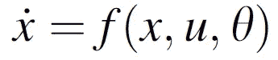
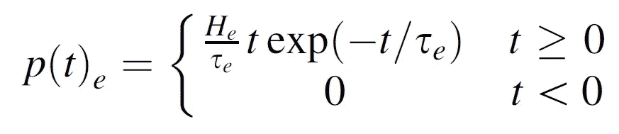
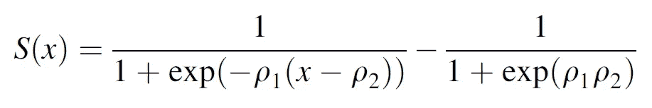
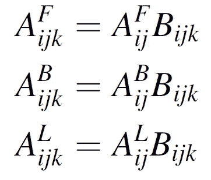
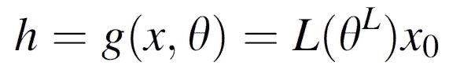
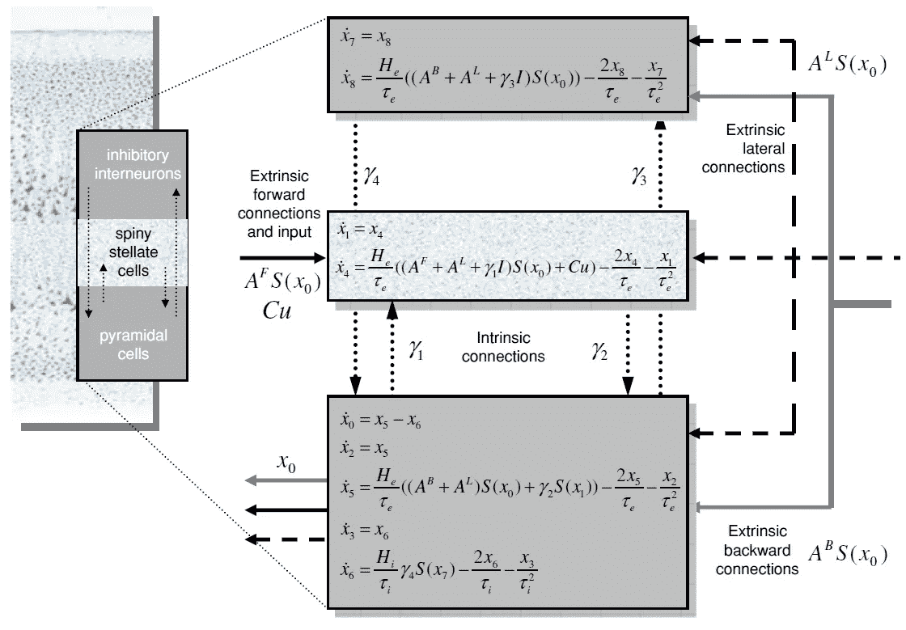
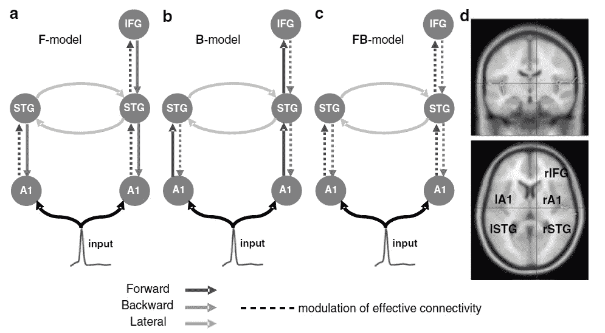
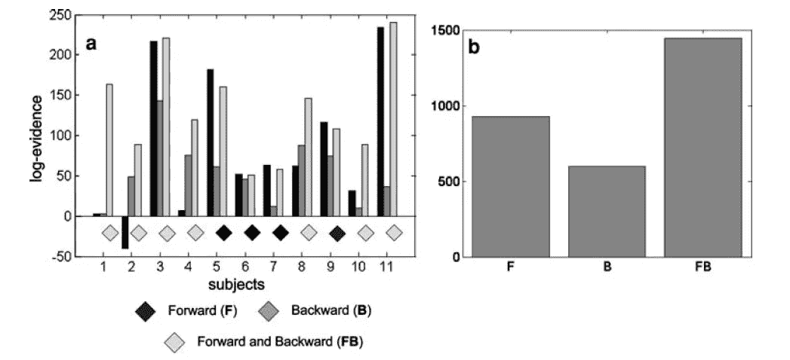

# 脑电图和脑磁图的动态因果模型

> 原文：<https://medium.com/mlearning-ai/paper-review-dynamic-causal-modelling-for-eeg-and-meg%C2%B9-ba3d09f3b1cd?source=collection_archive---------7----------------------->

## 回顾用于高维神经科学数据分析的贝叶斯网络

# 术语

**动态因果建模** ( **DCM** )是一个框架，用于指定模型，将它们与数据拟合，并使用[贝叶斯模型比较](https://en.wikipedia.org/wiki/Bayes_factor)来比较它们的证据。它使用连续时间中的非线性[状态空间](https://en.wikipedia.org/wiki/State_space)模型，使用[随机](https://en.wikipedia.org/wiki/Stochastic_differential_equation)或[常微分方程](https://en.wikipedia.org/wiki/Ordinary_differential_equation)指定。DCM 最初是为测试关于[神经动力学](https://en.wikipedia.org/wiki/Dynamical_system)的假设而开发的。在这种情况下，微分方程描述了神经群体的相互作用，这直接或间接产生功能性神经成像数据，例如[功能性磁共振成像](https://en.wikipedia.org/wiki/Functional_magnetic_resonance_imaging)(fMRI)[脑磁图](https://en.wikipedia.org/wiki/Magnetoencephalography) (MEG)或[脑电图](https://en.wikipedia.org/wiki/Electroencephalography) (EEG)。这些模型中的参数量化了神经元群体之间的直接影响或有效连接，这是使用[贝叶斯](https://en.wikipedia.org/wiki/Bayesian_inference)统计方法从数据中估计的。

**导线场**是通过向导线馈送单位电流而在体积导体中产生的电流场。

# 模型假设

(1)感觉**输入**由离散但相互作用的神经元源网络处理。

Equation 1: ODE for neuronal source interactions. `x` are the neuronal states of cortical sources, `u` are exogenous inputs, θ are the model parameters and the overhead dot meaning first derivative with respect to time.

(2)每一个神经元源都可以用一个神经质量模型来建模，整个源集及其相互作用完全由等式 1 所示的一组一阶微分方程来指定。

Equation 2: Convolution kernel for exogenous input combinations. Subscript ‘‘e’’ stands for ‘‘excitatory’’. Similarly subscript ‘‘i’’ is used for inhibitory synapses. H controls the maximum postsynaptic potential, and τrepresents a lumped rate constant.

(2.1)与每个亚群相关的微分方程的积分可表示为产生 response⁴的外源输入的卷积，等式 2 中显示了**核**。

Equation 3: Operator for converting subpopulation potential into firing rate. free parameters ρ1 and ρ2 determine its slope and translation.

(2.2)等式 3 中定义的算子 S 将每个亚群的潜力转化为发射率，这是对其他亚群的**外源输入。**

Equation 4: Changes in source connectivity. A(i, j) encodes the strength of a connection to the i-th source from the j-th and B(i, j, k) encodes its gain for the kth event related potential (ERP). The superscripts (F, B, or L) indicate the type of connection, i.e., forward, backward or lateral.

(2.3)源**连通性**的变化被表示为固有、前向、后向或横向连接的差异，根据其对其他源的响应，赋予每个源选择性灵敏度，如等式 4 中所总结的。

Equation 5: MEG/EEG output from dendritic signal. `L` is a lead-field matrix (i.e., spatial forward model), which accounts for passive conduction of the electromagnetic field³.

(3)在**输出**脑磁图/脑电图中，在头皮表面远程检测特定源的锥体亚群的树突信号。头皮数据`h`和源活动之间的关系被假设为线性和瞬时的，如等式 5 所总结的。

结合上述所有假设，本文得出了描述该系统的下列方程组。

Figure 1: Neuronal state-equations. A source consists of three neuronal subpopulations, which are connected by four intrinsic connections with weights γ1,2,3,4\. Mean firing rates from other sources arrive via forward AF, backward AB and lateral connections AL. Similarly, exogenous input Cu enters receiving sources. The output of each subpopulation is its trans-membrane potential.

# 实验

嵌入在一串重复声音或标准中的新奇声音或古怪声音会产生一种独特的反应，这种反应可以用脑磁图和脑电图无创记录下来。不匹配负波(MMN)是波形的负分量，通过从对古怪或异常的反应中减去对标准的事件相关反应获得。这种对声学环境突然变化的反应在 onset⁵变化后约 100-200 毫秒达到峰值，并表现出分布在听觉和额叶区域的增强的负性，在额叶区域尤为突出。

该论文研究了 13 名年龄在 24-35 岁的健康志愿者。在听觉“oddball”范例中测量脑电图活动，其中受试者听到“标准”(1，000 Hz)和“异常”(2，000 Hz)音调，在伪随机序列中分别出现 80% (480 次试验)和 20% (120 次试验)。

Figure 2: Model specification. The sources comprising the network are connected with forward (dark grey), backward (grey) or lateral (light grey) connections as shown. A1: primary auditory cortex, STG: superior temporal gyrus, IFG: inferior temporal gyrus. Three different models were tested within the same architecture (a–c), allowing for learning-related changes in forward F, backward B and forward and backward FB connections, respectively. The broken lines indicate the connections we allowed to change. (d) Sources of activity, modelled as dipoles (estimated posterior moments and locations), are superimposed in an MRI of a standard brain in Montreal Neurology Institute space.

受最近对 MMN 研究的启发，定义并测试了 3 个模型，如图 2 所示，此外还有一个零模型。它们之间的主要区别在于允许改变的连接(虚线)。使用标准[期望值最大化算法](https://en.wikipedia.org/wiki/Expectation%E2%80%93maximization_algorithm)学习模型参数，结果汇总在图 3 中。

Figure 3: Bayesian model selection among DCMs for the three models, F, B and FB, expressed relative to a DCM in which no connections were allowed to change (null model). The graphs show the free energy approximation to the log-evidence. (a) Log-evidence for models F, B and FB for each subject (relative to the null model). The diamond attributed to each subject identifies the best model on the basis of the subject’s highest log-evidence. (b) Log-evidence at the group level, i.e., pooled over subjects, for the three models.

# 讨论

所展示的结果证明了权重可修改模型相对于零模型的优越性，但是本文并未针对任何不是基于其假设/架构的模型进行基准测试。因此，尽管它在 EEG/MEG 数据建模方面显示出巨大的潜力，但我们感到在更令人信服的验证方面稍有欠缺。

[1] Kiebel，Stefan J .等人，“脑电图和脑磁图的动态因果模型”*认知神经动力学*2.2(2008):121–136。

[2]大卫、奥利维尔和卡尔·j·弗里斯顿。"脑磁图/脑电图的神经质量模型::耦合和神经元动力学."*神经影像*20.3(2003):1743–1755。

[3]约翰·莫舍、理查德·李希和保罗·刘易斯。"脑电图和脑磁图:逆方法的正向解."IEEE 生物医学工程汇刊 46.3(1999):245–259。

[4] David，Olivier 等，“脑电图和脑磁图中诱发反应的动态因果建模”*神经影像*30.4(2006):1255–1272。

[5] Sams，Mikko，等《听觉频率辨别与事件相关电位》*脑电图和临床神经生理学/诱发电位部分*62.6(1985):437–448。

 [## Mlearning.ai 提交建议

### 如何成为 Mlearning.ai 上的作家

medium.com](/mlearning-ai/mlearning-ai-submission-suggestions-b51e2b130bfb)