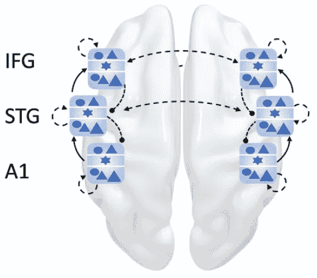
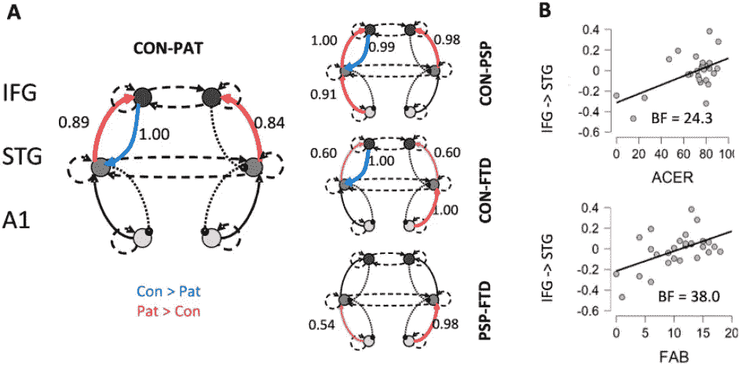

# 额颞叶变性中的γ-氨基丁酸能皮质网络生理学

> 原文：<https://medium.com/mlearning-ai/paper-review-gabaergic-cortical-network-physiology-in-frontotemporal-lobar-degeneration-58134caf61bf?source=collection_archive---------11----------------------->

## 回顾动态因果模型在 FTLD 和提加宾的应用

# 术语

**γ**-氨基丁酸( **GABA** )是发育成熟的[哺乳动物](https://en.wikipedia.org/wiki/Mammal) [中枢神经系统](https://en.wikipedia.org/wiki/Central_nervous_system)中主要的[抑制性](https://en.wikipedia.org/wiki/Inhibitory) [神经递质](https://en.wikipedia.org/wiki/Neurotransmitter)。它的主要作用是降低整个[神经系统](https://en.wikipedia.org/wiki/Nervous_system)的[神经元](https://en.wikipedia.org/wiki/Neuron)兴奋性。

**额颞叶变性** ( **FTLD** )是发生在[额颞叶痴呆](https://en.wikipedia.org/wiki/Frontotemporal_dementia)的一种病理过程。其特征是[脑](https://en.wikipedia.org/wiki/Brain)的[额叶](https://en.wikipedia.org/wiki/Frontal_lobe)和[颞叶](https://en.wikipedia.org/wiki/Temporal_lobe)萎缩，而[顶叶](https://en.wikipedia.org/wiki/Parietal_lobe)和[枕叶](https://en.wikipedia.org/wiki/Occipital_lobe)缺失。

**进行性核上性麻痹** ( **PSP** )是一种晚发型[变性疾病](https://en.wikipedia.org/wiki/Degenerative_disease)，涉及[脑](https://en.wikipedia.org/wiki/Brain)特定体积的逐渐恶化与死亡。导致[失去平衡](https://en.wikipedia.org/wiki/Balance_disorder)、[行动迟缓](https://en.wikipedia.org/wiki/Hypokinesia)、[眼球活动困难](https://en.wikipedia.org/wiki/Ophthalmoparesis)等症状及认知障碍。PSP 可能与其他神经退行性疾病如[帕金森病](https://en.wikipedia.org/wiki/Parkinson%27s)、[额颞叶痴呆](https://en.wikipedia.org/wiki/Frontotemporal_dementia)和[阿尔茨海默病](https://en.wikipedia.org/wiki/Alzheimer%27s)等混淆。该疾病的病因尚不明确，但涉及大脑内 [tau 蛋白](https://en.wikipedia.org/wiki/Tau_protein)的积聚。[左旋多巴](https://en.wikipedia.org/wiki/L-DOPA)和[金刚烷胺](https://en.wikipedia.org/wiki/Amantadine)等药物在某些情况下可能有用。

**行为变异型额颞叶痴呆** ( **bvFTD** )既往有*皮克氏病*之称，是 FTD 型中最常见的一型。bvFTD 的确诊率是 PPA 变体的四倍。bvFTD 中的行为可以通过以下两种方式中的任何一种发生变化——它可以变成冲动和去抑制，以社会不可接受的方式行事；或者它可以变成无精打采和冷漠。约 12-13%的 bvFTD 患者发生[运动神经元病](https://en.wikipedia.org/wiki/Motor_neuron_disease)。

# **目的**

(1)建立脑磁图(MEG)的[动态因果模型](https://en.wikipedia.org/wiki/Dynamic_causal_modeling)以识别 PSP 和 bvFTD 中的局部网络动态，在巡回听觉[古怪范式](https://en.wikipedia.org/wiki/Oddball_paradigm)期间。然后测试额颞连接是否与临床严重程度成比例。
(2)优化 GABA-再摄取抑制剂[噻加宾](https://en.wikipedia.org/wiki/Tiagabine)的安慰剂对照双盲随机交叉研究的(基于电导的)动态因果模型，以测试噻加宾是否恢复了 PSP 和 bvFTD 中对意外感觉干扰的诱发反应的额颞叶皮质机制。
(3)测试噻加宾对额叶皮质神经动力学的药理作用是否以患者个体γ-氨基丁酸能缺乏的程度为条件，根据超高场(7 T)获得的磁共振波谱(MRS)进行评估。

# 实验

该研究进行了一项随机安慰剂对照双盲交叉研究，以调查噻加宾在 32 名患者(17 名 bvFTD，15 名 PSP)和 20 名年龄和性别匹配的健康成人中的作用。通过头部位置对准和运动补偿来收集和预处理脑磁图数据。

Figure 1: A schematic of the network used to model the roving auditory oddball paradigm. The six sources [bilateral primary auditory (A1), superior temporal gyrus (STG) and inferior frontal gyrus (IFG)] are each represented by a local network node of six cell populations shown in blue. These nodes are extrinsically connected with forward, backward and lateral connections (shown as solid and dashed black arrows).

构建了一个动态因果模型来拟合收集的数据集，如图 1 所示。(下面链接了详细的评论。)根据神经元和生物物理参数的高斯后验概率，变分贝叶斯模型反演和随后的简化确定了受试者特定脑磁图数据最可能的解释。使用参数经验贝叶斯(PEB)分析对组和药物效应进行检验，并在每组的第二级 PEB 确定药物效应后，对所有组进行“PEB-of-PEBs”第三级 PEB 分析。

 [## 脑电图和脑磁图的动态因果模型

### 用于高维神经科学数据分析的贝叶斯网络

medium.com](/@humbdrag/paper-review-dynamic-causal-modelling-for-eeg-and-meg¹-ba3d09f3b1cd) 

# 结果

Figure 2: Between-source connectivity in response to deviant stimuli: effect of group and cognitive function. (A) Extrinsic connection strength difference between controls and patients in deviant trials, with blue indicating higher in controls and red meaning higher in patients (posterior probabilities are shown next to significant connections for values > 0.5, and considered significant for values > 0.95). Note the reduced strength of frontal lobe back projections to temporal cortex in patients. (B) Scatter plots show the relation between the patient scores for the Revised Addenbrookes Cognitive Examination (ACE-R) (top) and the Frontal Assessment Battery (FAB) (bottom) and the strength of their fronto-temporal backward connectivity. BF = Bayes factor.

(1)图 2 表明，额叶到颞叶的后向连接强度与认知能力相关，认知能力通过修订的 Addenbrookes 认知检查(ACE-R)进行测量，行为损伤通过额叶评估成套测验(FAB)进行测量。
(2) PEB 结果显示噻加宾组深层中间神经元的背景抑制作用整体增强。此外，星状细胞的阶段性抑制在两个患者组中表现出相反的效果，在安慰剂条件下，PSP 队列在该突触连接处具有高抑制，然后通过噻加宾降低；而 bvFTD 患者在这种突触连接上抑制作用较低，在噻加宾上抑制作用增强。
(3)在深层皮质-皮质投射神经元的抑制性突触中，发现了噻加宾(与安慰剂相比)的作用与 GABA 浓度之间的相互作用，当患者服用噻加宾时，突触活性与 GABA 浓度之间存在较高的相关性。对于深层紧张性抑制性突触，而不是相位性突触，观察到了药物条件、GABA 和患者组之间的高阶相互作用。

# 讨论

因此，先前提出的主要目标通过所进行的实验得以实现，尽管数字有所改善，但本研究提出了 FTLD 动态因果模型的重要应用，并阐明了噻加宾在该疾病中的应用。

 [## Mlearning.ai 提交建议

### 如何成为 Mlearning.ai 上的作家

medium.com](/mlearning-ai/mlearning-ai-submission-suggestions-b51e2b130bfb)