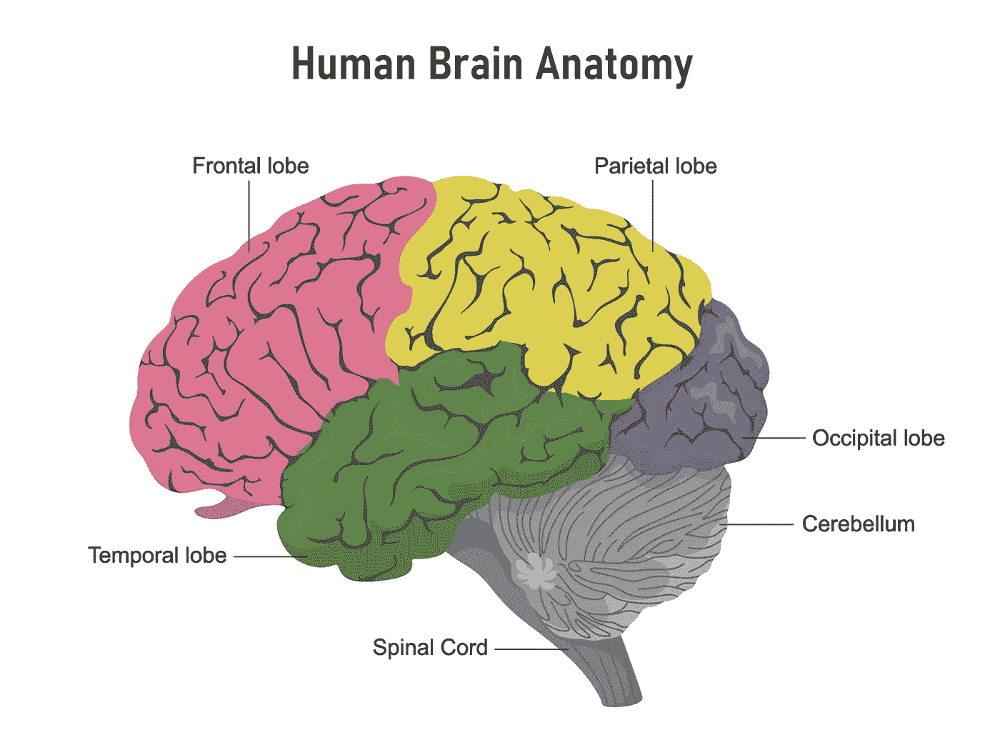
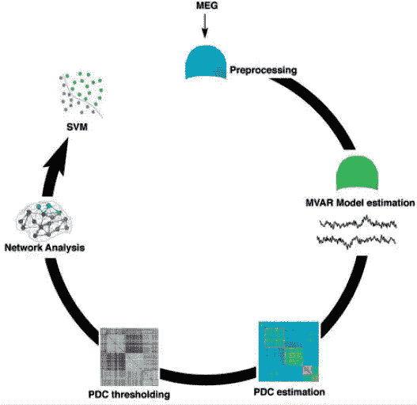

# 阿尔茨海默病和额颞叶变性的神经生理学特征:病理与表型

> 原文：<https://medium.com/mlearning-ai/paper-review-neurophysiological-signatures-of-alzheimers-disease-and-frontotemporal-lobar-bb6c86d7be1d?source=collection_archive---------8----------------------->

Image Credit: John Hopkins Medicine

## 术语

**额颞叶变性**(**)是发生在[额颞叶痴呆](https://en.wikipedia.org/wiki/Frontotemporal_dementia)的一种病理过程。其特征是[脑](https://en.wikipedia.org/wiki/Brain)的[额叶](https://en.wikipedia.org/wiki/Frontal_lobe)和[颞叶](https://en.wikipedia.org/wiki/Temporal_lobe)萎缩，而[顶叶](https://en.wikipedia.org/wiki/Parietal_lobe)和[枕叶](https://en.wikipedia.org/wiki/Occipital_lobe)缺失。在 FTLD 发现的常见[蛋白病](https://en.wikipedia.org/wiki/Proteopathy)包括 [tau 蛋白](https://en.wikipedia.org/wiki/Tau_protein)和 [TAR DNA 结合蛋白 43](https://en.wikipedia.org/wiki/TAR_DNA-binding_protein_43) (TDP-43)的积聚。 [*C9orf72*](https://en.wikipedia.org/wiki/C9orf72) 基因的突变已被确定为 FTLD 的主要遗传贡献，尽管[颗粒蛋白](https://en.wikipedia.org/wiki/Granulin) (GRN)和[微管相关蛋白](https://en.wikipedia.org/wiki/Microtubule-associated_protein) (MAPs)的缺陷也与之相关。
**皮层回路**是大脑外层的神经回路。**

## **假设**

> **…不同的神经病理学具有独特的生理特征，这些特征反映了病理学的解剖分布及其对皮质回路振荡动力学的影响。**

**这就是说，研究中的疾病在
(1)它们影响大脑的不同部分，并且影响程度不同(空间)，
(2)它们影响皮层回路的方式不同(光谱)。**

## **预言；预测；预告**

> **..典型的阿尔茨海默氏病和 PCA 在功能效应的定位上有所不同，但是在受影响区域内振荡动力学的变化是相似的。**

**第一个预测表明，典型的阿尔茨海默病(AD)和后部皮质萎缩(PCA)变体将
(1)影响不同的大脑区域，
(2)但对皮质回路振荡动力学的影响将分别在受影响的区域内相似。**

**例如，典型的 AD 可能会将区域 A 中的电路频率从(0，0，0)更改为(1，2，3)，然后尽管 PCA 对大脑区域 A 没有影响，但它也会将区域 B 中的电路频率从(0，0，0)更改为(1，2，3)。然而，由于它们的空间差异，这两个变异体的表型仍然可以是不同的。**

> **与阿尔茨海默病相比，FTLD 病的三种亚型具有不同的光谱和空间特性，而它们的光谱特性可能彼此相似，尽管空间分布不同且具有不同的临床表型。**

**第二个预测将不同疾病(FTLD)的 3 个亚型添加到比较中，现在的情况变为
(1)所有 5 个疾病亚型影响不同的大脑区域(A、B、C、D、E)
(2)2 个 AD 亚型具有相同的频谱影响((0，0，0) - > (1，2，3))，
(3)3 个 FTLD 亚型具有相同的频谱影响((1，2，3) - > (3，2，1))，但与 AD 亚型的频谱影响不同。**

## **方法**

****

**Clockwise from top: Preprocessing, to remove biological artefacts using MaxFilter and independent component analysis denoising; estimation of effective connectivity using MVAR; compiling the association matrix between sensors by PDC; applying a statistical threshold to create a binarized graph, represented by the connectivity matrix; graph network analysis to estimate local efficiency; and group classification using a support vector machine (SVM).**

**整个实验流水线由以下步骤组成
(1)用[最大滤波器](https://imaging.mrc-cbu.cam.ac.uk/meg/Maxfilter)和独立分量分析对脑磁图信号进行预处理，以去除环境伪影，对准头部位置并去噪，
(2.1)对头部周围 102 个位置的每一个位置处的两个平面梯度仪的均方根应用[主分量分析](https://en.wikipedia.org/wiki/Principal_component_analysis)，并保留前 60 个主分量，
(2.2)对缩减的时间序列应用模型阶数为`p=8`的多元自回归(MVAR) 并获得拟合的参数，
(3)估计所有 102 个传感器位置之间的部分有向 coherence⁴ (PDC)，其测量依赖于频率的成对连通性，
(4)计算频率(1 Hz，1.1 Hz，1.2 Hz，…，80 Hz)的 PDC，并使用 85%的阈值将 p 值二进制化，
(5)使用二进制矩阵估计[局部效率](https://en.wikipedia.org/wiki/Efficiency_(network_science))，
(6)训练支持向量**

## **结果**

**介绍的主要测试指标是使用脑磁图(MEG)数据对所研究的 5 种疾病亚型进行成对二元分类的准确性和 AUC。更具体地说，AUC 范围从 0.62 到 1.0，证明了模型的合理分类能力。**

**虽然这在一定程度上支持了这一假设，即嵌入脑磁图的信息使我们能够预测疾病表型，但我们认为它缺乏对疾病亚型对皮质回路影响的光谱不变性的彻底调查，正如预测中所建议的那样。**

**[1] Sami，Saber 等，“阿尔茨海默病和额颞叶变性的神经生理学特征:病理与表型。”*大脑*141.8(2018):2500–2510。**

**[2]hyv rinen、Aapo 和 Erkki Oja。"独立成分分析:算法和应用."*神经网络*13.4–5(2000):411–430。**

**[3]施洛格尔，阿洛伊斯。"多元自回归估计量的比较."*信号处理*86.9(2006):2426–2429。**

**[4] Baccalá，Luiz A .，和 Koichi Sameshima。"部分定向相干:神经结构测定中的新概念."生物控制论 84.6(2001):463–474。**

** [## Mlearning.ai 提交建议

### 如何成为 Mlearning.ai 上的作家

medium.com](/mlearning-ai/mlearning-ai-submission-suggestions-b51e2b130bfb)**