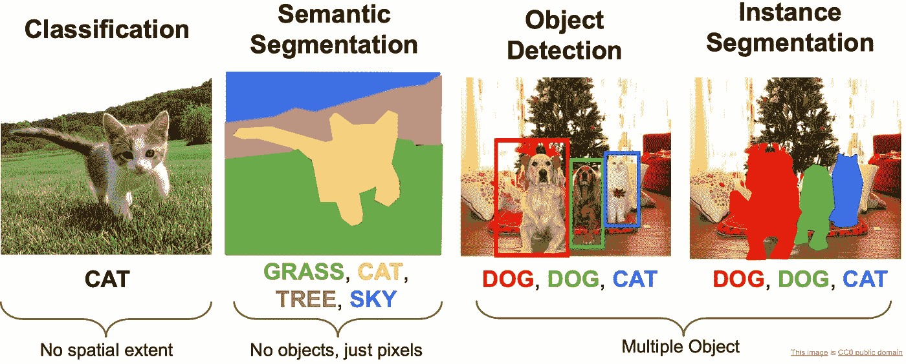
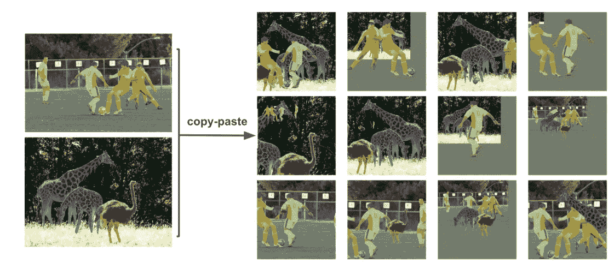
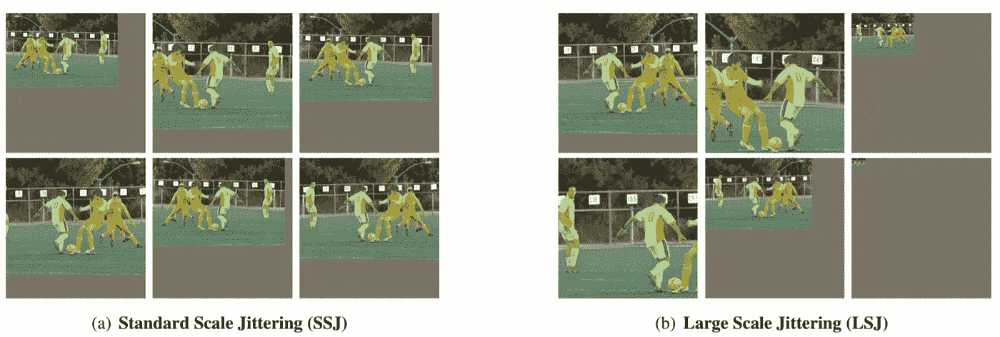
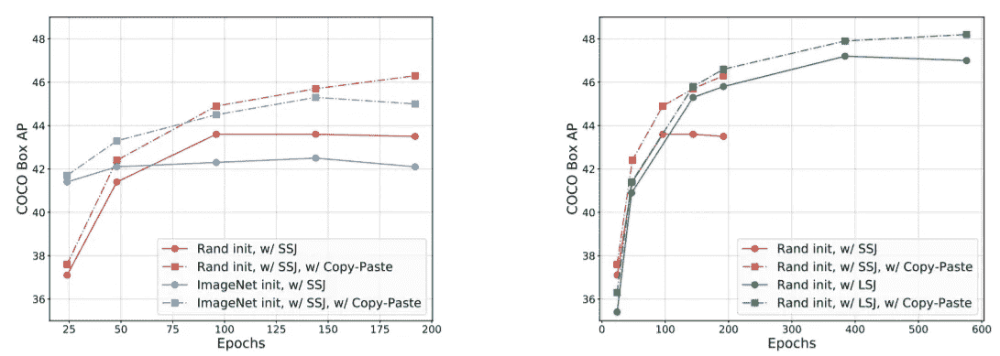
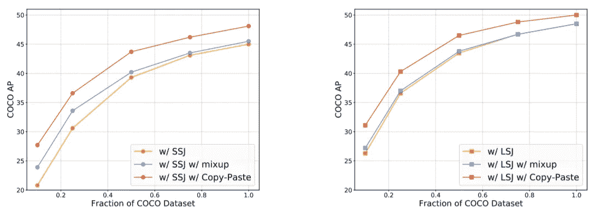
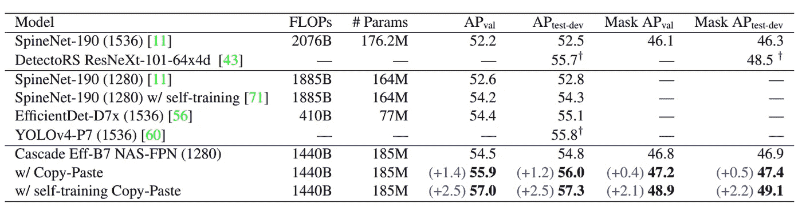

# 论文综述:“简单的复制-粘贴是一种用于实例分割的强大的数据扩充方法”

> 原文：<https://medium.com/mlearning-ai/paper-review-simple-copy-paste-is-a-strong-data-augmentation-method-for-instance-segmentation-aa0899e91f9d?source=collection_archive---------5----------------------->

## 在本文中，我将回顾简单的复制粘贴扩充，这是一种简单而有效的解决实例分割问题的扩充方法

原文：<https://arxiv.org/pdf/2012.07177.pdf>

# **1。实例分割**

实例分割是比语义分割更高级的问题——可以检测和区分同一类的一组对象中的每个单独的对象。它通过预测对象类别标签和特定于像素的对象实例掩码来定位存在于各种图像中的不同类别的对象实例。实例分割是计算机视觉中的一项重要任务，在现实世界中有许多应用。它可以在很大程度上用于自动驾驶、医学、监控等领域。

**Fig. 1:** Problems in computer vision ([1])

近年来，对象检测技术的快速发展也推动了实例分割技术的进步，其准确性和速度不断突破。然而，在基于最先进的卷积网络的模型中，数据往往是饥渴的。此外，标记数据，例如分割问题，通常是昂贵和耗时的。因此，必须开发新的策略来提高最先进的实例分割模型的数据效率。在论文[2]中，作者提出了一个简单的增强实例分割，它可以在强基线的基础上提供可靠的增益。

# 2.方法

作者使用简单的复制和粘贴方法为训练模型生成新图像。首先，从训练集中随机选取两幅图像，并对其进行随机尺度抖动和随机水平翻转。然后，他们从一个图像中随机选择一部分实例粘贴到另一个图像上。最后，他们对地面实况注释进行必要的更改，移除完全被遮挡的对象，并更新部分被遮挡对象的遮罩和边界框。

**Fig. 2:** Copy-paste method to create new data for training instance segmentation models ([2])

**混合粘贴对象。**对于新图像中的混合对象，作者使用地面真实注释计算粘贴对象的二进制掩码(α),并将新图像计算为*I1×α+I2×(1α)*其中 *I1* 是粘贴图像，而 *I2* 是主图像。高斯滤镜用于平滑粘贴对象的边缘。

**大范围抖动。**作者在全文中使用了两种不同类型的与复制粘贴相结合的增强方法:标准尺度抖动(超级喷机)和大尺度抖动(LSJ)。这些方法随机调整图像大小和裁剪图像。

**Fig. 3:** SSJ and LSJ ([2])

**自我训练复制粘贴。**自我训练复制粘贴程序如下:

1.  在标记的
    数据上训练具有复制粘贴增强的监督模型。
2.  在无标签数据上生成伪标签。
3.  将地面实况实例粘贴到伪标记和监督
    标记的图像中，并根据这些新数据训练一个模型。

# 3.方法

这些作者使用 Mask R-CNN 和其他主干:Efficient-Net 和 ResNet 作为基线模型。下面这几张图是得到的一些对比结果(细节在原文中)。

**Fig. 4:** Copy-Paste provides gains that are robust to training configurations.

**Fig. 5:** Copy-Paste is additive to large scale jittering augmentation

**Fig. 6:** Comparison with the state-of-the-art models on COCO object detection and instance segmentation

# 结论:

在本文中，作者提出了复制粘贴的方法来增加实例分割任务中的训练数据。这是一种简单的方法，但对于在强基线的基础上进行显著改进非常有用。

您可以在以下网址找到论文的官方源代码:

 [## TPU/模特/官方/检测/项目/复制 _ 粘贴在大师 tensorflow/tpu

### Golnaz Ghiasi，Yin Cui，Aravind Srinivas，Rui Qian，Tsung-林逸，Ekin D. Cubuk，Quoc V. Le，Barret Zoph Simple…

github.com](https://github.com/tensorflow/tpu/tree/master/models/official/detection/projects/copy_paste) 

***如有任何问题，请在下方评论或通过***[***LinkedIn***](https://www.linkedin.com/in/tuan-nguyen85/)***或***[***github***](https://github.com/anhtuan85)联系我

如果你喜欢这个，请考虑支持我。

# 资源:

[1]cs 231n:[http://cs231n.stanford.edu/slides/2020/lecture_12.pdf](http://cs231n.stanford.edu/slides/2020/lecture_12.pdf)

[2]简单的复制粘贴增强:[https://arxiv.org/pdf/2012.07177.pdf](https://arxiv.org/pdf/2012.07177.pdf)

 [## Mlearning.ai 提交建议

### 如何成为 Mlearning.ai 上的作家

medium.com](/mlearning-ai/mlearning-ai-submission-suggestions-b51e2b130bfb) 

🔵 [**成为作家**](/mlearning-ai/mlearning-ai-submission-suggestions-b51e2b130bfb)