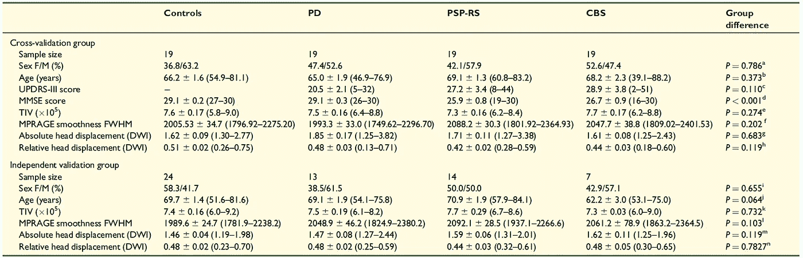
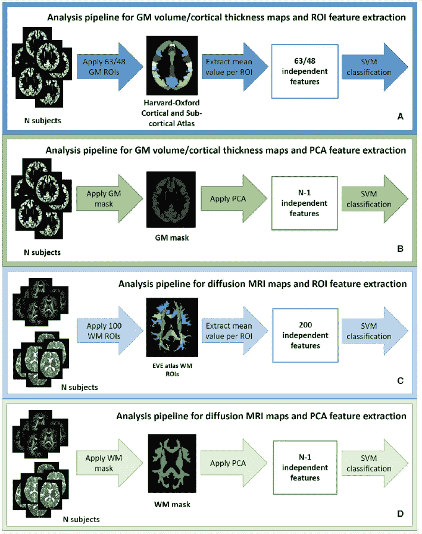
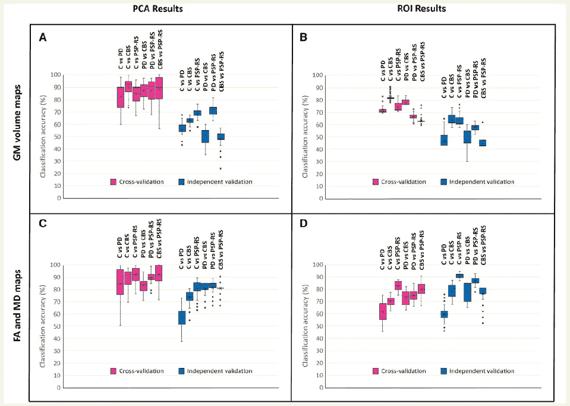

# 对帕金森病、进行性核上性麻痹和皮质基底综合征进行准确和无偏见的影像学鉴别

> 原文：<https://medium.com/mlearning-ai/paper-review-towards-accurate-and-unbiased-imaging-based-differentiation-of-parkinsons-disease-84fd78efdd3b?source=collection_archive---------7----------------------->

Photo Credit: [Unbalanced Datasets & What To Do About Them | by German Lahera | Strands Tech Corner | Medium](/strands-tech-corner/unbalanced-datasets-what-to-do-144e0552d9cd)

# 术语

**进行性核上性麻痹** ( **PSP** )是一种迟发性[变性疾病](https://en.wikipedia.org/wiki/Degenerative_disease)，涉及[大脑](https://en.wikipedia.org/wiki/Brain)特定体积的逐渐退化和死亡。这种情况导致的症状包括[失去平衡](https://en.wikipedia.org/wiki/Balance_disorder)、[移动缓慢](https://en.wikipedia.org/wiki/Hypokinesia)、[移动眼睛困难](https://en.wikipedia.org/wiki/Ophthalmoparesis)以及认知障碍。PSP 可能被误认为其他神经退行性疾病，如[帕金森](https://en.wikipedia.org/wiki/Parkinson%27s)、[额颞叶痴呆](https://en.wikipedia.org/wiki/Frontotemporal_dementia)和[阿尔茨海默病](https://en.wikipedia.org/wiki/Alzheimer%27s)。这种情况的原因尚不确定，但涉及大脑内 [tau 蛋白](https://en.wikipedia.org/wiki/Tau_protein)的积累。左旋多巴[和金刚烷胺](https://en.wikipedia.org/wiki/L-DOPA)等药物在某些情况下可能有用。

**皮质基底综合征** (CBS)是一种罕见的、[非典型帕金森综合征](https://en.wikipedia.org/wiki/Parkinson_plus_syndrome)，是一种[与](https://en.wikipedia.org/wiki/Tauopathy)[额颞叶痴呆](https://en.wikipedia.org/wiki/Frontotemporal_dementia)相关的 tau 病。CBS 通常是由大脑不同区域形成的 tau 蛋白沉积引起的。

**基于体素的形态测量** (VBM)是一种针对[神经解剖学](https://en.wikipedia.org/wiki/Neuroanatomy)的计算方法，通过对多幅大脑图像进行体素比较来测量大脑组织局部浓度的差异。

**磁共振成像** ( **MRI** )是一种[医学成像](https://en.wikipedia.org/wiki/Medical_imaging)技术，用于[放射学](https://en.wikipedia.org/wiki/Radiology)中，形成身体的[解剖](https://en.wikipedia.org/wiki/Anatomy)和[生理](https://en.wikipedia.org/wiki/Physiological)过程的图像。[核磁共振扫描仪](https://en.wikipedia.org/wiki/Physics_of_magnetic_resonance_imaging#MRI_scanner)使用强[磁场](https://en.wikipedia.org/wiki/Magnetic_field)、磁场梯度和[无线电波](https://en.wikipedia.org/wiki/Radio_wave)来生成体内器官的图像。核磁共振成像不涉及 [X 射线](https://en.wikipedia.org/wiki/X-rays)或[电离辐射](https://en.wikipedia.org/wiki/Ionizing_radiation)的使用，这与 [CT](https://en.wikipedia.org/wiki/CT_scan) 和 [PET 扫描](https://en.wikipedia.org/wiki/PET_scan)相区别。核磁共振成像是核磁共振成像的一个医疗应用，也可以用于其他核磁共振成像的应用，如核磁共振波谱成像。

# 目标限制

本研究旨在解决之前基于影像学的研究中存在的以下 4 个目标限制。
(1)**不平衡数据集:在年龄或临床变量方面不匹配的组，以及疾病组和对照组的大小差异很大。
【2】**任意的特征选择**:动机不良且解释不可信的特征选择被用于建模。
(3)**:由于研究规模有限，一个受试者可以同时用于训练和验证。
(4)**去除运动水平的偏置:头部运动导致伪影和采集的 MRI 数据平滑。******

# ******方法******

******针对上述局限性，本研究设计了具体的方法来解决这些问题，如下所述。
(1，3，4) **平衡数据集、独立验证集和运动水平调整** :
数据集平衡和验证集准备如图 1 所示。通过将 [SPM12](http://www.fil.ion.ucl.ac.uk/spm/) 应用于 3D 磁化预备快速梯度回波(MPRAGE)图像，以及将 [FSL](http://www.fmrib.ox.ac.uk/fsl) *涡流校正*函数应用于扩散 MRI 数据，实现运动水平的调整。******

********

****Figure 1: Data are shown as mean +/- standard error (range). Superscripts: a, i = Chi-squared test, b, c, e, f, h, j, k, n = ANOVA, d = Kruskal–Wallis ANOVA followed by non-parametric Mann-Whitney post hoc tests (Control > CBS P<0.01, Control > PSP-RS P<0.05, Parkinson’s disease > CBS P<0.01 and Parkinson’s disease > PSP-RS P<0.05), g, m = Kruskal–Wallis ANOVA, l = Welch’s ANOVA. Acronyms: UPDRS = [Unified Parkinson’s Disease Rating Scale](https://en.wikipedia.org/wiki/Unified_Parkinson%27s_disease_rating_scale), MMSE = [mini mental state examination](https://en.wikipedia.org/wiki/Mini%E2%80%93Mental_State_Examination), TIV = total intracranial volume, MPRAGE = magnetization prepared rapid gradient echo², DWI = diffusion weighted imaging.****

****(2) **灰质和白质信号的自动特征选择**:测试了两种方法——
(a)来自[哈佛-牛津图谱](http://neuro.imm.dtu.dk/wiki/Harvard- Oxford_Atlas)
的皮层和皮层下感兴趣区域(b)主成分分析(PCA)****

****因此，整个管道可以总结为如图 2 所示。****

********

****Figure 2: Analysis pipelines for each combination of data type and feature extraction method. (A) T1-weighted MRI and ROIs. (B) T1-weighted MRI and PCA. (C) Diffusion MRI and ROIs. (D) Diffusion MRI and PCA. Acronyms: GM = Grey Matter, ROI = Region-Of-Interest, SVM = Support Vector Machine, PCA = Principal Component Analysis, WM = White Matter.****

# ****结果****

********

****Figure 3: Comparison between cross-validation (magenta) and independent validation (blue) results. The range of classification accuracies presented for each pairwise comparison and combination of methodological variables corresponds to the results obtained as different numbers of features are included in the statistical model. (A) Results obtained when PCA is used for feature extraction, with GM volumes maps as feature type. (B) Results obtained when ROIs are used for feature extraction, with GM volumes maps as feature type. (C) Results obtained when PCA is used for feature extraction, with fractional anisotropy (FA) and mean diffusivity (MD) maps as feature type. (D) Results obtained when ROIs are used for feature extraction, with FA and MD maps as feature type.****

****感兴趣的主要结果如图 3 所示。它显示了在 MRI 特征上训练的 SVM 的**高预测交叉验证准确度**，当在独立测试集上测试时，其**对于 PCA 特征显著降低**，但是对于 ROI 特征**降低不多。如果对交叉验证集和独立验证集独立进行 PCA，这是可以理解的，因为 PCA 使用所有提供的数据点找到特征向量，而 ROI 没有这样的问题。一个改进的想法可能是在交叉验证集**上使用 **PCA 计算主轴，并且**将独立测试集直接投影到这些维度**上，而不是在测试集上重新应用 PCA。这将确保测试数据点与训练集和验证集落在相同的低维空间中，因此有可能提高模型性能。******

**此外，尽管本文证明了用更平衡的数据集训练的统计模型的分类能力，但它**没有在无偏模型和有偏模型**之间进行直接比较。因此，未来工作的另一个想法是将[上采样](https://en.wikipedia.org/wiki/Upsampling)或[下采样](https://en.wikipedia.org/wiki/Downsampling_(signal_processing))技术应用于**从平衡数据集构建非平衡数据集**，并在不同数据集上训练相同模型后比较模型性能，从而得出相应的可推广性见解。**

**[1] Correia，Marta M .等人，“对帕金森病、进行性核上性麻痹和皮质基底综合征进行准确和无偏见的影像学鉴别”*大脑通讯* 2.1 (2020): fcaa051。**

**[2] de Lange EE，Mugler JP 3rd，Bertolina JA，Gay SB，Janus CL，Brookeman JR .肝脏磁化准备快速梯度回波(MP-RAGE) MR 成像:与自旋回波成像的比较。磁共振成像。1991;9(4):469–76.PMID: 1779716。**

** [## Mlearning.ai 提交建议

### 如何成为 Mlearning.ai 上的作家

medium.com](/mlearning-ai/mlearning-ai-submission-suggestions-b51e2b130bfb)**