# 论文综述:《YOLOX:2021 年超越 YOLO 系列》

> 原文：<https://medium.com/mlearning-ai/paper-review-yolox-exceeding-yolo-series-in-2021-ffc1bd94a1f3?source=collection_archive---------2----------------------->

## 在本文中，我将介绍 YOLOX，它是 YOLO 的一个无锚点版本，做了一些改进以获得更好的性能。

原文：<https://arxiv.org/pdf/2107.08430.pdf>

# 1.YOLO 物体探测器

你只看一次(YOLO)是一个流行的实时处理的对象检测算法。这是一个单阶段的对象检测，因为它提出了使用一个端到端的神经网络，该网络可以同时预测包围盒和类别概率。因此，YOLO 比以前的两阶段模型(R-CNN，快速 R-CNN，更快 R-CNN)具有更好的推理速度。

YOLO 模型的主要思想如图 1 所示。输入图像被分成一个 *S* x *S* 网格，每个网格单元负责预测位于该网格单元中心的物体。每个网格单元预测 *B* 边界框(中心坐标、宽度、高度)及其相应的置信度得分。

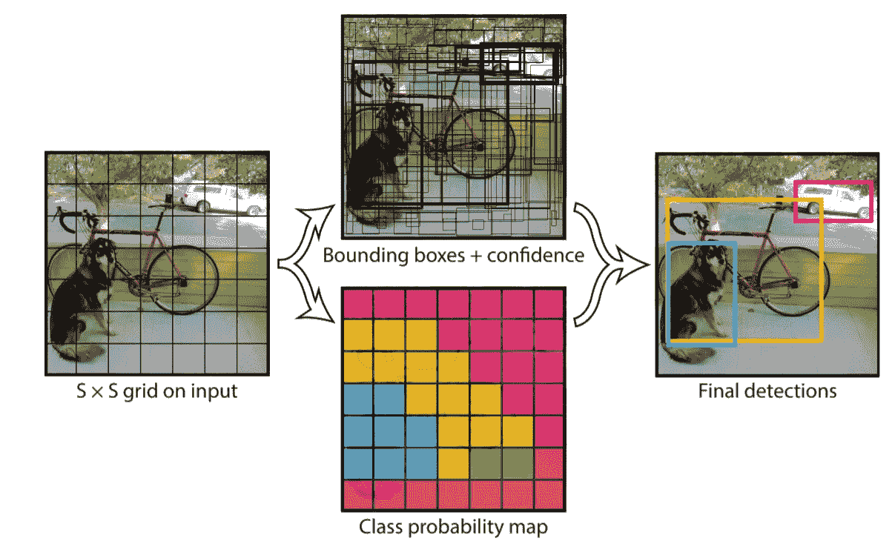

**Fig. 1:** Main ideal of YOLO ([1])

我们知道，每个网格单元只预测一个单一的对象。当一个单元格有多个对象时，这就产生了问题。接下来的版本(YOLOv2，YOLOv3，…)通过使用锚盒解决了这个问题。它们在图像周围形成许多锚框。锚盒的宽度/高度的比率被检查，并且接近于要预测的对象的比率。我们预测每个锚定框的偏移量，而不是预测任意边界框。此外，该模型还从锚盒中预测相应的对象类。然而，这种设计有一些缺点:

*   我们需要使用聚类分析(kNN，…)来确定锚盒的最佳大小。
*   这种设计增加了预测的数量。这增加了算法的复杂性，并且我们需要在后处理中使用 NMS(非最大抑制)算法来移除相同对象的包围盒。

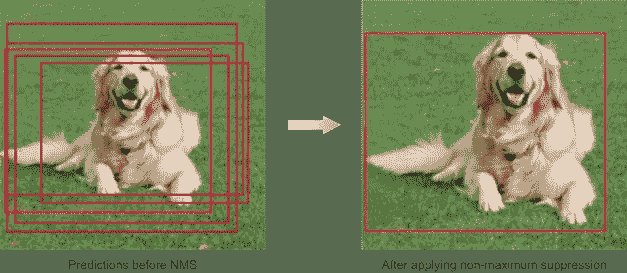

**Fig. 2:** Non-maximum Suppression

# 2.YOLOX

考虑到 YOLOv4 和 YOLOv5 对于基于锚点的管道可能有点过度优化，作者决定使用 YOLOv3 作为基线。

# 2.1 YOLOX-Darknet53

**YOLOv3 基线**

在 YOLOX 的论文中，作者选择具有 Darknet-53 骨架和 SPP 层的 yolo v3(yolo v3-SPP)作为基线。SPP 图层使用 3 个不同大小的最大池图层来输入要素地图。然后，他们收集并连接 3 个输出特征图，形成最终的输出特征图。

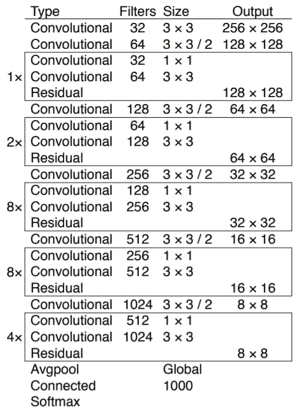

**Fig. 3:** Darknet-53 architecture ([2])

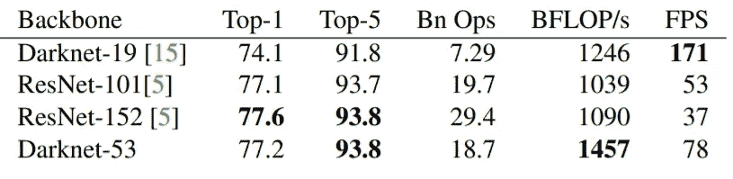

**Fig.4:** Comparision of backbones. YOLOv2 uses Darknet-19 backbone while YOLOv3 uses Darknet-53 backbone ([2])

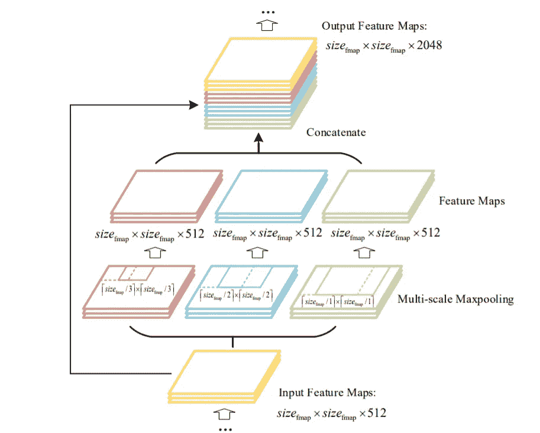

**Fig.5**: Spatial Pyramid Pooling (SPP) layer ([3])

**培训详情**

训练 YOLOX 和基线的一些设置:

*   作者在 COCO train2017 上训练了总共 300 个时代的模型，其中有 5 个时代的热身。
*   用于训练的随机梯度下降法。
*   学习率是 0.01*BatchSize/64 和余弦学习率表。
*   重量衰减为 0.0005，SGD 动量为 0.9，批量为 128。
*   输入大小从 448 到 832 以 32 步均匀绘制。
*   添加 EMA 权重更新。
*   培训 cls 和 obj 分支的 BCE 损失和培训 reg 分支的 IoU 损失。
*   用于数据扩充的随机水平翻转、颜色抖动和多尺度。

**解耦头**

在对象检测中，分类和回归任务之间的冲突是一个众所周知的问题。许多对象检测系统使用去耦头(分离分类和回归)。然而，YOLO 探测头保持耦合。

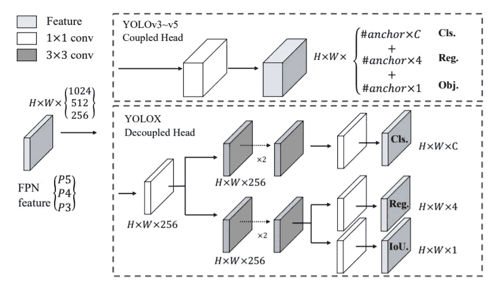

**Fig. 6**: Illustration of the difference between YOLOv3 head and the proposed decoupled head ([4])

在 YOLOX 中，作者用一个分离的头替换了 YOLO 的头。这提高了收敛速度并增加了端到端 YOLO 的 AP。所以，他们为 YOLOX 型号选择了去耦头。新的探测头包括 1x1 卷积以减少特征图的数量，以及两个具有 3x3 卷积的分支。

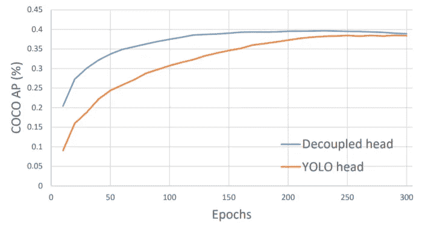

**Fig. 7:** Training curves for detectors with YOLOv3 head
or decoupled head. ([4])

**强大的数据增强**

作者使用马赛克和混搭。有了这些增强，他们从零开始训练模型。

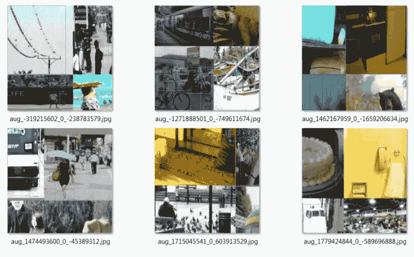

**Fig. 8**: Mosaic ([5])

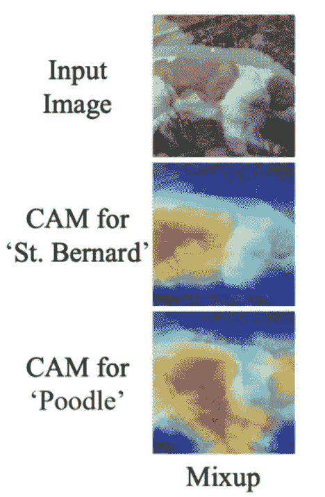

**Fig. 9:** Mixup ([6])

**无锚**

如上所示，使用锚点的模型有一些缺点。为了使 YOLO 无锚，作者将每个位置的预测从 3 减少到 1，并直接预测边界框的四个值(即，网格的左上角和框的高度和宽度)。).每个对象的中心位置是一个正样本，它们预先定义了一个标度范围，以定义每个对象的 FPN 水平。

因为 YOLOX with anchor-free 只为每个对象选择一个阳性样本，这就在训练时造成了阳性/阴性之间的不平衡。为了减轻这种情况，他们简单地将中间的 3×3 区域指定为阳性。这种策略在 FCOS 被称为“中心抽样”。

**西蒙塔**

高级标签分配是近年来目标检测的又一重要进展。作者总结了高级标签分配的四个关键观点:

*   损失/质量意识
*   中心先验
*   每个地面实况的正锚动态数量
*   全局视图

作者选择将指派过程公式化为最优运输(OT)问题的 OTA 来寻找最优指派。然而，OTA 使用 Sinkhorn-Knopp 迭代算法，这带来了 25%的额外训练时间，这对训练 300 个历元来说是相当昂贵的。因此，作者将其简化为动态 top-k 策略，命名为 SimOTA，以获得近似解。

首先，SimOTA 计算每个预测-基础真实对的成对匹配度。地面实况 g_i 和预测 p_j 之间的成本
计算如下:

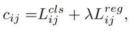

对于 gt g_i，他们选择在**固定中心区域**内**最小成本**的 **top k 预测**作为其正样本。最后，那些阳性预测的对应网格被指定为阳性，而其余网格为阴性。

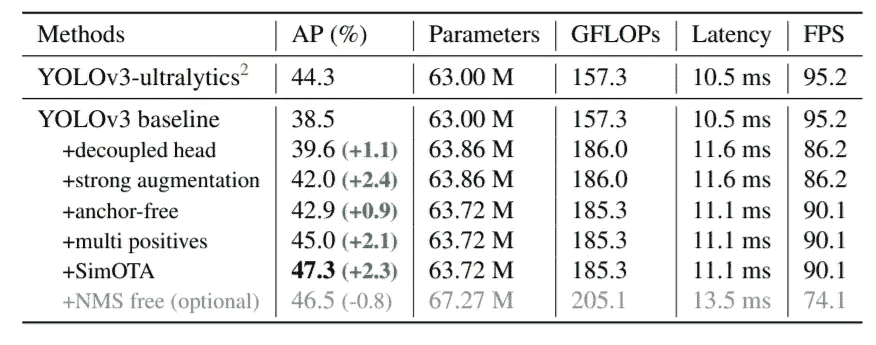

**Fig. 10:** Roadmap of YOLOX-Darknet53 in terms of AP (%) on COCO val. ([4])

# **2.2 结果**

除了 DarkNet53，作者还测试了 YOLOX 的其他主干配置，以实现不同的速度-精度权衡。作者修改了 YOLOv5 中的 CSPNet，以比较 YOLOv5。他们将模型缩小为 YOLOX-Tiny，以便与 YOLOv4-Tiny 进行比较。。对于移动设备，他们采用深度卷积来构建 YOLOX-Nano 模型。下面的图片是得到的一些对比结果(细节在原文中)。

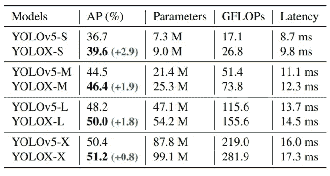

**Fig. 11:** Comparison of YOLOX and YOLOv5 in terms
of AP (%) on COCO.

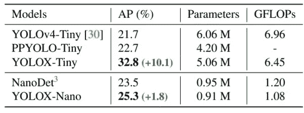

**Fig. 12:** Comparison of YOLOX-Tiny and YOLOX-Nano
and the counterparts in terms of AP (%) on COCO val.

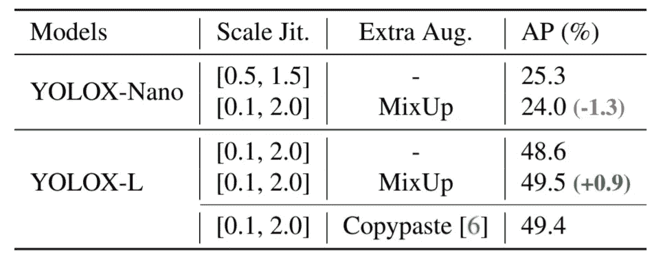

**Fig. 13**: Effects of data augmentation under different model
sizes.

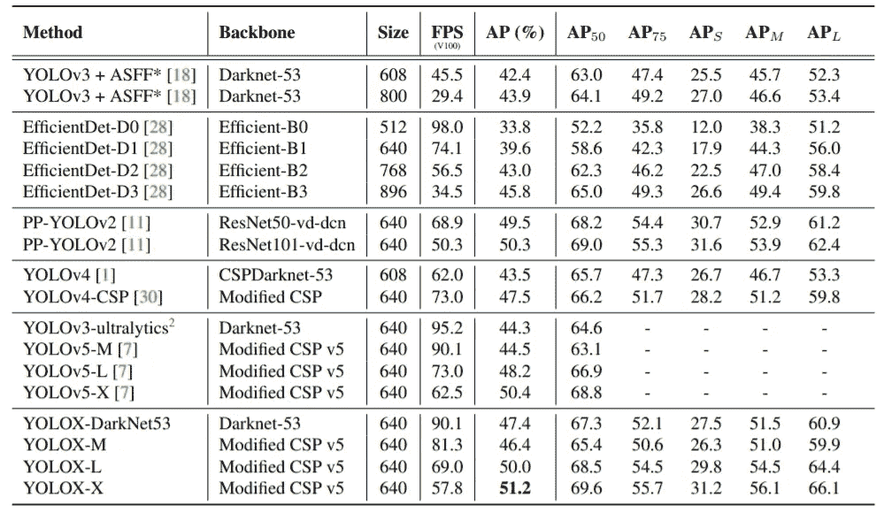

**Fig. 14**: Comparison of the speed and accuracy of different object detectors on COCO 2017 test-dev

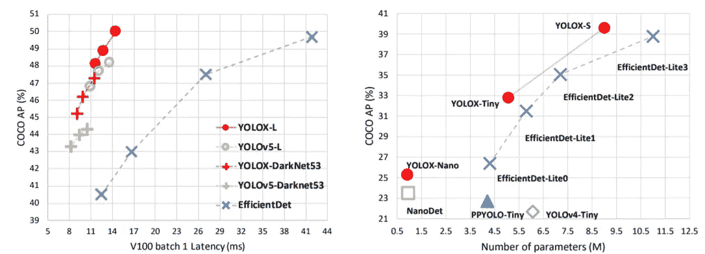

# 结论

YOLOX 是 YOLO 的无锚点版本，做了一些改进以获得更好的性能。作者在 2021 年 CVPR 自动驾驶研讨会上获得了第一名。

您可以在以下网址找到 YOLOX 的官方源代码:

 [## GitHub -旷视科技-BaseDetection/YOLOX: YOLOX 是一款高性能无锚点 YOLO，超过…

### YOLOX 是一款高性能无锚 YOLO，超过 yolov3~v5 有 MegEngine，ONNX，TensorRT，ncnn，OpenVINO…

github.com](https://github.com/Megvii-BaseDetection/YOLOX) 

***如有任何问题，请在下方评论或通过***[***LinkedIn***](https://www.linkedin.com/in/tuan-nguyen85/)***或***[***github***](https://github.com/anhtuan85)联系我

如果你喜欢这个，请考虑支持我。

# **资源:**

[1]https://arxiv.org/pdf/1506.02640.pdf 论文:[YOLO 论文](https://arxiv.org/pdf/1506.02640.pdf)

[2]约洛夫 3 论文:[https://arxiv.org/pdf/1804.02767.pdf](https://arxiv.org/pdf/1804.02767.pdf)

[3]https://arxiv.org/ftp/arxiv/papers/1903/1903.08589.pdf 的 DC-南非-YOLO

[4] YOLOX 论文:[https://arxiv.org/pdf/2107.08430.pdf](https://arxiv.org/pdf/2107.08430.pdf)

[5]约洛夫 4 论文:[https://arxiv.org/pdf/2004.10934.pdf](https://arxiv.org/pdf/2004.10934.pdf)

[6]剪辑画面:[https://arxiv.org/pdf/1905.04899.pdf](https://arxiv.org/pdf/1905.04899.pdf)

[7]yolov 5 github:[https://github.com/ultralytics/yolov5](https://github.com/ultralytics/yolov5)

 [## Mlearning.ai 提交建议

### 如何成为 Mlearning.ai 上的作家

medium.com](/mlearning-ai/mlearning-ai-submission-suggestions-b51e2b130bfb) 

[**提交到 MLearning.ai**](/mlearning-ai/mlearning-ai-submission-suggestions-b51e2b130bfb)