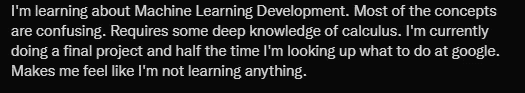
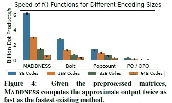
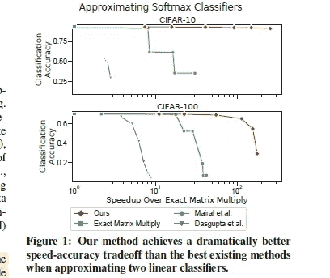
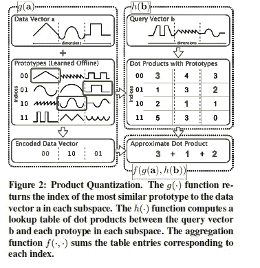
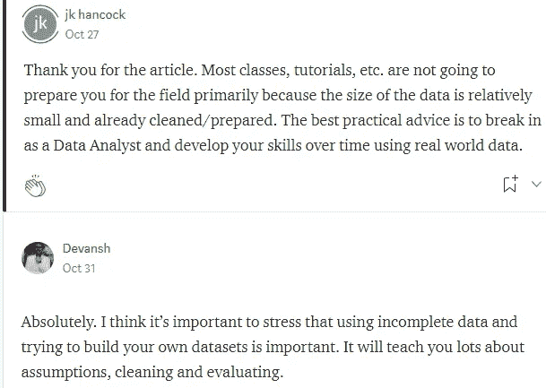

# 论文展示了为什么你会在机器学习上苦苦挣扎

> 原文：<https://medium.com/mlearning-ai/paper-shows-why-you-will-struggle-at-machine-learning-a6885fb76d12?source=collection_archive---------0----------------------->

## 这无疑是我读过的技术上最复杂的论文。

为了帮助我理解您[填写本调查表(匿名)](https://forms.gle/7MfQmKhEhyBTMDUD7)

我一直在研究没有矩阵的乘法矩阵(链接:[https://arxiv.org/abs/2106.10860](https://arxiv.org/abs/2106.10860))。这是一篇我花了很多时间研究的论文。我怎么能不呢？摘要声明，“*使用来自不同领域的数百个矩阵的实验表明，它通常比精确矩阵乘积快 100 倍，比当前的近似方法快 10 倍。在提前知道一个矩阵的常见情况下，我们的方法也有一个有趣的特性，即它需要零乘加。*“如果你了解机器学习，这对学习过程有着巨大的影响。

This sentiment is not uncommon. If you feel this way, you are not alone

与此同时，我在时间线上偶然发现了上面的推特。我可以肯定地看到这是从哪里来的。有意义的语言本质上是多学科的。虽然 LSTM 森林和随机森林的代码保持不变，但是问题周围的环境发生了变化。根据您所从事的工作，您获取、准备、清理和评估数据更改的方式。因此，您最终将需要精通多种事物。这个过程涉及大量的谷歌搜索，可能会非常令人沮丧/沮丧。

这篇论文是一个相当极端的例子。我主修数学和计算机科学。选择我的课程，以获得良好的编码，特别是人工智能/ML。所以我非常适合理解细节。但是，即使过了一个月，这篇论文的大部分内容都非常具有挑战性。

Me trying to understand the paper.

在本文中，我将把这篇论文作为一个例子来说明为什么好的机器学习是困难的。我会解释为什么这对您有利，以及您可以做些什么来从中受益。如果没有别的，我希望在本文结束时，您能理解要达到 ML 的高水平需要什么。

# 理解本文的含义

一个简短的词为什么这篇论文是伟大的。在机器学习中，数据点被表示为多维矩阵。乘法矩阵对许多函数来说非常重要。*也是出了名的难*。对于那些感兴趣的人来说，量子公司的这篇文章很容易理解。

Don’t underestimate pre-processing.

这就是报纸疯狂的地方。在事先已知一个矩阵的常见情况下，我们的方法还有一个有趣的特性，即它不需要乘加运算我们什么时候会看到这样的案例？假设我们的模型有权重，只需要根据输入计算预测。权重是一个我们知道的矩阵，它将与输入矩阵相乘。考虑到这个过程发生的次数，你的储蓄将会真正增加。

This is one example of a great application of matrix multiplacation.

# 为什么这篇论文很难理解。

既然我们对这个概念的重要性有了一些了解，那么让我们来谈谈这篇论文为什么具有挑战性。简单来说，它跨越了很多技术领域。以下是对他们使用的产品量化的描述:

它不仅使用向量，还依赖原型学习、哈希和聚合。这需要非常好的编码和数学技能。甚至他们的散列法也远非基础。作者依赖于散列树，这可以是特里芬。查看第 4.1 节了解更多详情。该论文的复杂性和广泛性被作者最好地表述为“*我们的工作借鉴了许多不同的领域，但并不完全适合其中的任何一个领域*”。加深你对基础知识的理解至少会帮助你理解假设和实验设置。

想要详细了解论文中的一些假设，请看[的这段视频](https://youtu.be/nCnPRFI2tMc)。我回顾了假设，矩阵乘法近似的一个具体例子。确保暂停视频，阅读我从报纸上截取的片段。我发现他们特别有见地。

# 为什么这种复杂性对您来说是一件好事

显然不是每个机器学习/人工智能项目都像这篇论文一样复杂。然而，现实生活中的 ML 会很复杂。以下是我与一个阅读并喜欢我的文章的人的交流，[关于机器学习工作的 5 个不性感的事实](/mlearning-ai/5-unsexy-truths-about-working-in-machine-learning-d44369e1e088)。

机器学习的复杂性打开了许多大门。这意味着总是有新的方法去尝试，新的知识去发现，新的协议/组合去发明。它会让你专攻你最感兴趣的领域。如果你愿意投入工作和奋斗，你很快就能开发自己的增值。这才是有趣的时候。[如何成为机器学习专家](/geekculture/an-overlooked-tool-for-becoming-a-machine-learning-expert-edfef1556135)是一篇帮助你加快进程的文章。只要你愿意找到你感兴趣的领域并投身其中，你就能在你的机器学习之旅中获得巨大的成果。

 [## Mlearning.ai 提交建议

### 如何成为 Mlearning.ai 上的作家

medium.com](/mlearning-ai/mlearning-ai-submission-suggestions-b51e2b130bfb) 

如果你喜欢这篇文章，看看我的其他内容。我定期在 Medium、YouTube、Twitter 和 Substack 上发帖(所有链接都在下面)。我专注于人工智能、机器学习、技术和软件开发。如果你正在准备编码面试，请查看:[编码面试变得简单](https://codinginterviewsmadesimple.substack.com/)。

为一次性支持我的工作，以下是我的 Venmo 和 Paypal。任何数额都值得赞赏，并有很大帮助:

https://account.venmo.com/u/FNU-Devansh

贝宝:【paypal.me/ISeeThings 

# 向我伸出手

如果那篇文章让你对联系我感兴趣，那么这一部分就是为你准备的。你可以在任何平台上联系我，或者查看我的其他内容。如果你想讨论家教，发短信给我。如果你想支持我的工作，使用我的免费罗宾汉推荐链接。我们都有免费的股票，对你没有风险。因此，不使用它只是失去免费的钱。

查看我在 Medium 上的其他文章。:[https://rb.gy/zn1aiu](https://rb.gy/oaojch)

我的 YouTube:[https://rb.gy/88iwdd](https://rb.gy/88iwdd)

在 LinkedIn 上联系我。我们来连线:[https://rb.gy/m5ok2y](https://rb.gy/f7ltuj)

我的 insta gram:[https://rb.gy/gmvuy9](https://rb.gy/gmvuy9)

我的推特:[https://twitter.com/Machine01776819](https://twitter.com/Machine01776819)

如果你正在准备编码面试:[https://codinginterviewsmadesimple.substack.com/](https://codinginterviewsmadesimple.substack.com/)

获得罗宾汉的免费股票:[https://join.robinhood.com/fnud75](https://www.youtube.com/redirect?redir_token=QUFFLUhqa0xDdC1jTW9nSU91WXlCSFhEVkJ0emJvN1FaUXxBQ3Jtc0ttWkRObUdfem1DZzIyZElfcXVZNGlVNE1xSUc4aVhSVkxBVGtHMWpmei1lWWVKNzlDUXVJR24ydHBtWG1PSXNaMlBMWDQycnlIVXNMYjJZWjdXcHNZQWNnaFBnQUhCV2dNVERQajFLTTVNMV9NVnA3UQ%3D%3D&q=https%3A%2F%2Fjoin.robinhood.com%2Ffnud75&v=WAYRtSj0ces&event=video_description)