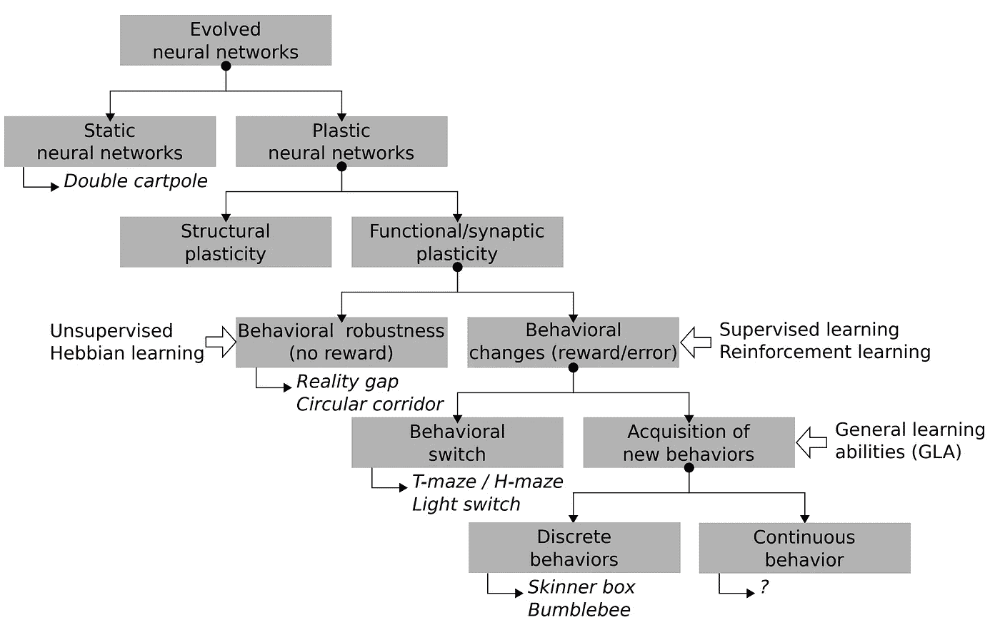

# 论文摘要:“塑料神经网络的人工进化:几个关键概念”

> 原文：<https://medium.com/mlearning-ai/paper-summary-artificial-evolution-of-plastic-neural-networks-a-few-key-concepts-a4fc350dafe3?source=collection_archive---------4----------------------->

## 塑料神经网络初学者指南

# 摘要:

本文综述了神经进化和突触可塑性相结合的工作。他们把所有的概念和格式放在一个层次结构中进行比较和分类。