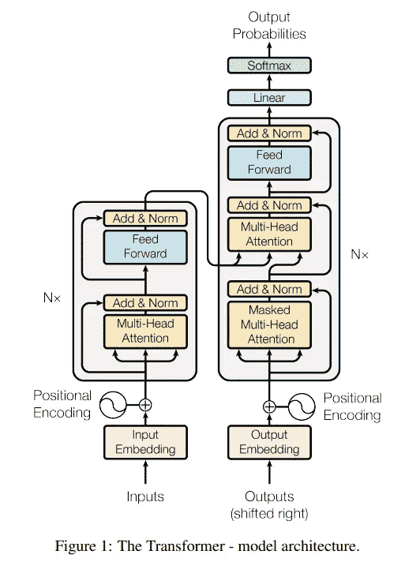
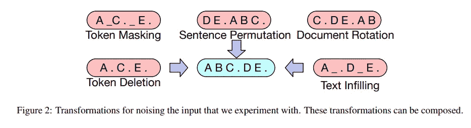
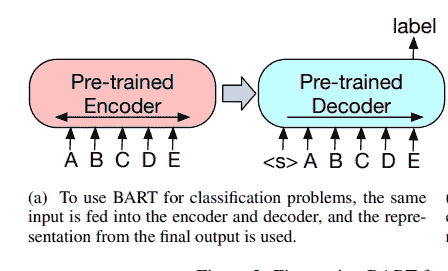
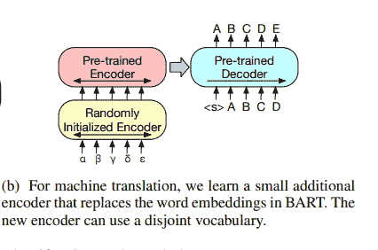
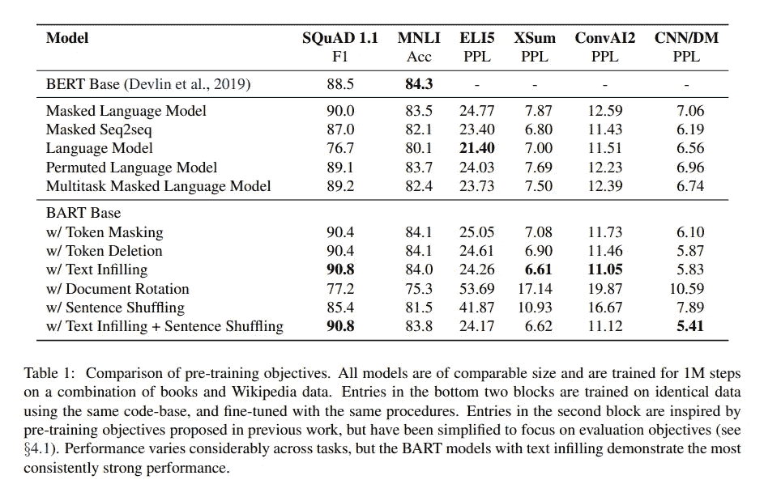

# 论文综述:“BART:自然语言生成、翻译和理解的去噪序列间预训练”

> 原文：<https://medium.com/mlearning-ai/paper-summary-bart-denoising-sequence-to-sequence-pre-training-for-natural-language-generation-69e41dfbb7fe?source=collection_archive---------0----------------------->

https://arxiv.org/abs/1910.13461

# 要点

*   提出名为 BART 的自回归模型，它在结构上类似于标准的变压器编码器+解码器
*   检查 5 个预训练任务，并试验哪个预训练任务最有帮助
*   通过对下游任务进行大规模预处理来测试 BART 性能

# 模型架构

encoder and decoder of standard transformer architecture

这项工作引入了 BART，它基本上与标准序列间变压器架构几乎相同，但有一些修改

*   用格鲁代替 RELU
*   不同层大小
    -基础版:编码器 6 层，解码器 6 层
    -大版:编码器 12 层，解码器 12 层
*   每个解码器层另外执行来自编码器的最终隐藏层的输出的交叉注意。
*   在末端没有前馈网络

虽然模型架构非常简单，但这项工作的主要贡献是对各种预处理任务进行了精心的实验。而许多其他论文都是关于“哦，我们和其他人一起使用了这个预训练任务，获得了更好的性能！哇”，这篇文章更多的是关于“在所有这些准备工作中，哪些**真的**有用和有效？”

# 训练前任务

任务都是关于从文档损坏中恢复。使用了五种类型的“噪声”方法。

# 令牌屏蔽

追随伯特。

# 令牌删除

删除令牌并使模型在正确的位置恢复被删除的令牌。

# 文本填充

在一个跨度中选择多个单词，并用单个掩码标记替换。这将教会模型预测有多少令牌丢失。

# 句子排列

打乱句子，让模型恢复它们。

# 文档旋转

选择随机令牌。将文档排序更改为从所选令牌开始。让模型预测原始文档的开始。

# 微调

为了评估模型性能(并最终发现哪些预训练任务对性能的贡献最大)，可以使用以下下游任务进行微调。

# 序列分类

相同的输入序列被馈送到编码器和解码器。

最终解码器令牌的最终隐藏状态用于分类。

与 BERT 中的[CLS]令牌输出方法相似，但不同之处在于，在 BART 中，我们使用最终令牌的输出，因此输出令牌是关注所有先前输入令牌的结果。

# 令牌分类

向编码器和解码器提供输入序列。

解码器的顶部隐藏状态被用作对每个相应的输入标记进行分类的表示。

# 序列生成

输入序列馈入编码器，而解码器自回归产生输出。

# 机器翻译

乍一看，有人可能会问:这不就是“序列生成”任务的一部分吗？是的，但是这个特殊的任务采用了稍微不同的方法。

它不是根据当前的下游任务(机器翻译)来微调 BART 模型本身，而是使用预训练的 BART 模型作为子模型，其中另一个小编码器连接到 BART 编码器。

此配置旨在表明，通过为新语言的机器翻译任务添加小型前端编码器，可以将预先训练的 BART 模型本身作为一个整体加以利用。

现有的 BART 的第一个编码器的嵌入层被替换为随机初始化的编码器，然后整个模型被端到端地训练。这个新的编码器可以使用独立于预训练的词汇表。

在此配置中进行微调时，训练分为两个阶段。第一阶段将只训练新编码器的参数、BART 位置嵌入和 BART 的第一编码器层的自我注意输入投影矩阵。在第二阶段，更新所有模型参数。

# 预训练任务比较

如前所述，在本节中，作者分析了哪些预处理任务是有效的。

作者做了这项调查，其中 5 个其他模型与之前提到的类似的预训练任务进行了比较，6 个下游任务。

结果总结在下表中。

作者从这个关于预训练任务的实验中得出的结论可以总结如下:

*   不同任务的预训练方法的表现差异很大
*   令牌屏蔽至关重要
*   从左到右的预训练改善了生成
*   双向编码器对小队至关重要
*   训练前的目标不是唯一重要的因素。架构选择很重要，比如相对位置嵌入、段级递归等。
*   纯语言模型在 ELI5 下游任务上表现最好。
*   BART 实现了最稳定的强劲表现

# 大规模预训练实验

最近的工作表明，当大批量进行预训练时，下游任务性能显著提高。因此作者也测试了这种方法，但是仅使用文本填充和句子置换的组合，因为这种设置在预训练客观比较实验中表现出最佳性能。

在大批量预训练之后，作者测试了下游任务的性能。

# 辨别任务

总的来说，BART 的表现与其他模型相似

# 生成任务

总的来说，BART 比以前的作品表现更好。特别是在高度抽象的 XSum 数据集上，它的性能明显优于。

对于对话，巴特胜过其他人。

对于抽象的 QA，BART 比其他人做得更好，但即使对 BART 来说，这项任务仍然非常具有挑战性。

# 机器翻译

它试验了一个预训练任务中提到的“机器翻译”设置，其中通过在前端添加一个全新的新编码器来重用预训练的 BART。

该实验使用 WMT16 罗马尼亚语-英语数据集，与基线变压器架构进行比较。

结果表明，以这种方式使用 BART 是无效的。

*有关用于下游任务的数据集和测试结果的详细信息可在论文*中找到

 [## Mlearning.ai 提交建议

### 如何成为 Mlearning.ai 上的作家

medium.com](/mlearning-ai/mlearning-ai-submission-suggestions-b51e2b130bfb)