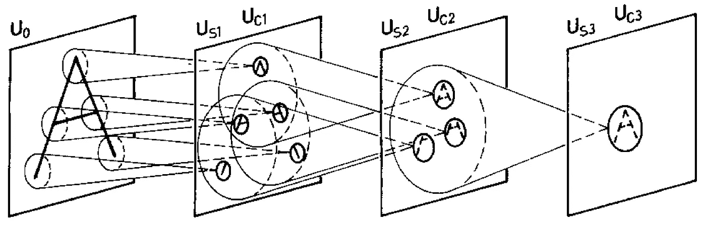

# 论文摘要:“Neocognitron:不受位置变化影响的模式识别机制的自组织神经网络模型”

> 原文：<https://medium.com/mlearning-ai/paper-summary-neocognitron-a-self-organizing-neural-network-model-for-a-mechanism-of-pattern-16fac734e64?source=collection_archive---------2----------------------->

## CNN 原版——无人监管版！

# 摘要:

这篇论文提出了最初的 CNN——但是它的无监督版本——T1。它通过识别基于…的模式来做到这一点