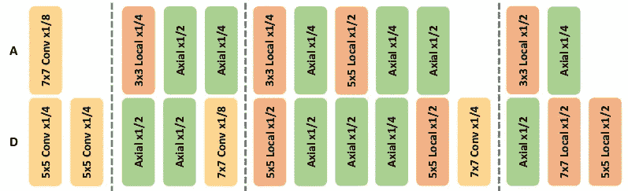
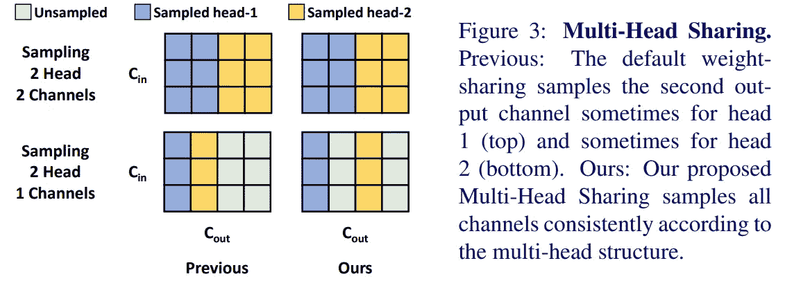
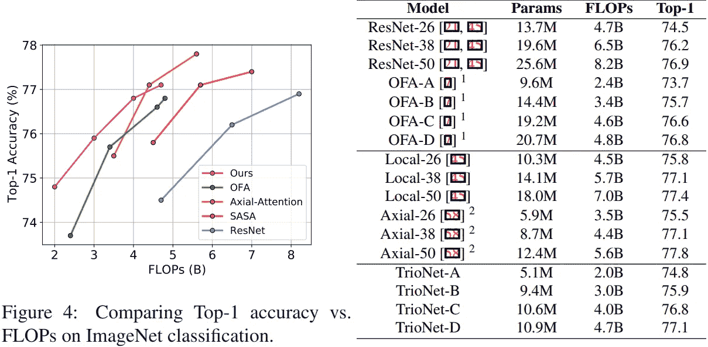

# 论文摘要——寻找 TrioNet

> 原文：<https://medium.com/mlearning-ai/paper-summary-searching-for-trionet-6ec2d3b56593?source=collection_archive---------4----------------------->

在这篇博客中，我将对论文**寻找 TrioNet:结合卷积与局部和全局自我关注**进行简单总结*。*在本文中，作者提出了一种新的结构，它是卷积、局部和全局自我注意的结合。除此之外，他们还引入了用于神经结构搜索的分层采样技术和用于自我关注的多头共享技术。

> **搜索 TrioNet 论文—** [**链接**](https://arxiv.org/abs/2111.07547)
> 
> **注意**——“任何从纸上复制的内容都将是斜体并加引号”

# 摘要

如今，CNN 架构正在使用神经架构搜索或 NAS 进行采样，其中自关注视觉模型是通过堆叠多层手工制作的。卷积和自我关注相结合的建筑空间很少被探索。作者使用权重共享 NAS 算法探索了这一领域。*结果架构被命名为****TrioNet——卷积、局部自关注和全局(轴向)自关注的组合*** *。*除此之外，作者还提出了一种新颖的 ***权重分担策略******多头自我关注算子*** 。该模型优于基于 CNN 的模型，在 ImageNet 分类数据上具有更少的 FLOPs。TrioNet 能够在较小的数据集上匹配 CNN 模型的性能，而其他自我关注模型无法达到 CNN 模型。

# 介绍

大多数模型都是建立在卷积上的。但是最近我们已经看到自我关注模型优于或者至少与基于 CNN 的分类/分割模型相当。但是，这些自我关注模型是人为设计的，因此在新的数据集或任务上实现最佳结果具有挑战性。

**神经架构搜索**或 NAS 是一种有效的技术，可以用最少的人力自动找到想要的架构。简单来说，NAS 将目标数据集、任务和计算预算作为输入。NAS 已经成功地应用于诸如对象检测、视频理解和语义分割等任务。高效网络体系结构是 NAS 的成果！要了解有关 NAS 的更多信息，请阅读此博客— [媒体链接](/digital-catapult/neural-architecture-search-the-foundations-a6cc85f7562)。

Figure 1 (Source — Paper)

> *图 1 : A 和 D 是搜索到的 TrioNet。x1/2，x1/4，x1/8 是膨胀率。这种架构在较低层使用 convs，在较高层使用 self-attention。*

在 NAS 中，通常，自我注意算子从未被认为是诸如卷积之类的实际运算。作者发现，在权重共享 n as 方法中使用自我关注作为操作是困难的，因为自我关注具有更宽的搜索空间，包括查询、键、值、空间范围和多头数，而 CNN 在搜索空间中具有核大小和宽度。

作者提出**分层抽样**，保证每个操作者(Conv，注意)在超网中得到平等的训练机会。

另一个问题是当前 NAS 算法的权重共享策略。当前算法“*”共享全权重矩阵的前几个通道来构建小模型的权重。然而，在自我关注中，通道被分成多头组以捕捉不同的依赖性。当前的权重共享策略忽略了权重中的多头结构，并将相同的通道分配给不同的头，迫使相同的通道同时捕获不同类型的依赖性”。*为了克服这一点，作者提出了***多头共享*** *的策略。*

这是作者的四个贡献，包括 **TrioNet 架构**。

# 方法

## 操作员级搜索空间

在本文中，作者将自关注算子引入到 NAS 的算子级空间中。作者使用轴向注意，而不是完全连接的 2D 自我注意。局部自我关注在搜索空间中被用作“*不清楚每个阶段应该使用多少个局部自我关注层或者如何为每个层选择窗口大小*”。

## 架构级搜索空间

作者使用类似 ResNet 的模型来构建他们的体系结构，使用 NAS 中的搜索空间。它们用包含 conv、局部和全局/轴向自关注的算子级搜索空间替换所有 3x3 convs。

## 搜索管道

为了搜索模型，作者使用一次性 NAS 管道。

## 分层抽样

对于每个块，首先均匀地采样空间算子，然后采样来自算子空间的候选算子，因为发现搜索空间高度偏向局部注意算子。**由于搜索空间充满了中型模型，在为每个块选择操作符后，使用三明治规则**。

## 多头共享

我发现论文中的描述很容易理解，因此我引用了论文中的内容。"

Source — Paper

*参考上图，作者考虑到多头结构，首先将所有输出通道分成若干头组。然后，只有在多头自关注中属于同一个头的情况下，它们才共享信道权重。*

# 结果

Source — Paper

从这些结果中，我们可以看到，与以前的 SOTA 模型相比，TrioNet 的表现更好。与其他 SOTA 模型相比，TrioNets 需要较少的失败次数。

# 收场白

因此，我们已经看到了 Convs 和自我关注层的组合如何比仅 Convs 或仅自我关注模型执行得更好，同时需要更少的 FLOPs。

据信，类似变压器的架构迟早也会投入生产，并将取代 CNN 模型。类似 Transformer 的模型仍然存在一些问题，例如它们需要大量的数据，并且它们不是等变翻译。

我强烈建议读一遍这篇论文，以便对所做的实验有一个清晰的了解。

感谢阅读:)。一定要跟着我在媒体上获得这样的论文摘要。

也在 [LinkedIn](https://www.linkedin.com/in/sahil-chachra/) 上联系我:d。

 [## Mlearning.ai 提交建议

### 如何成为 Mlearning.ai 上的作家

medium.com](/mlearning-ai/mlearning-ai-submission-suggestions-b51e2b130bfb)