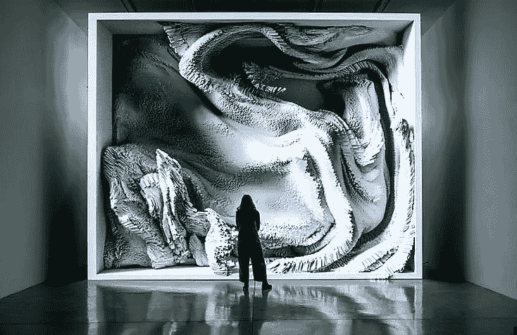
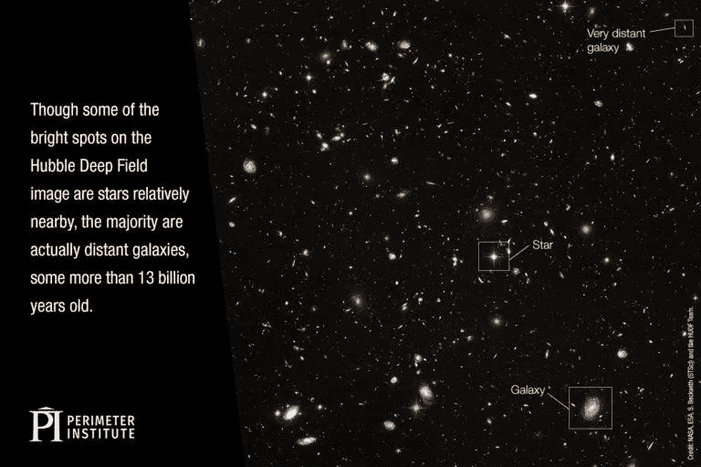
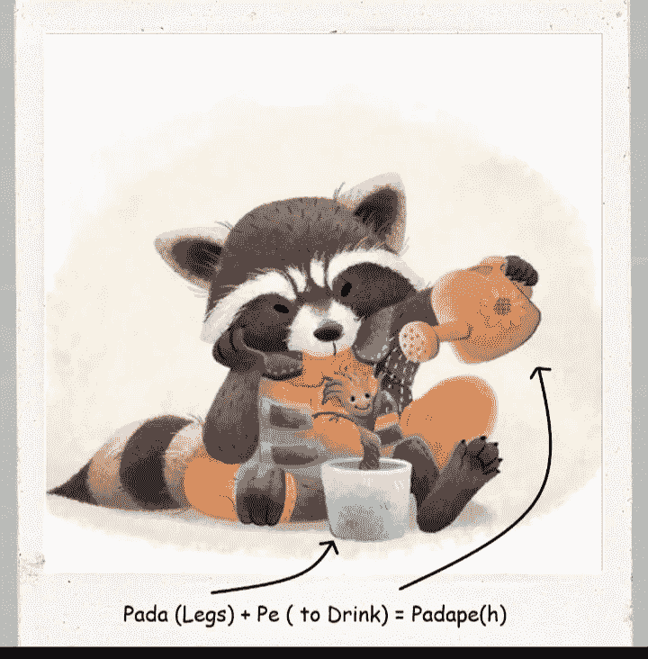
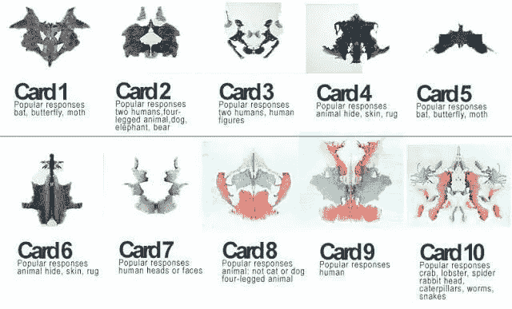
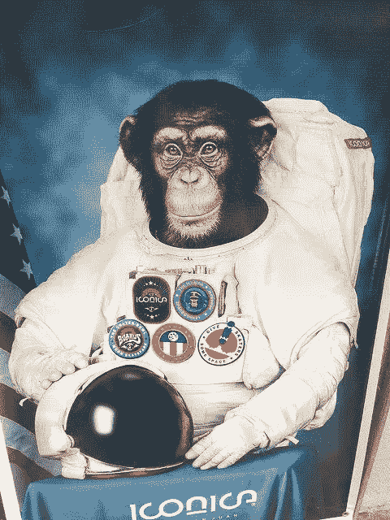

# 大脑艺术和机器学习艺术中的人类创造力

> 原文：<https://medium.com/mlearning-ai/parallelism-between-brain-art-machine-learning-art-and-human-evolutionary-creativity-d52007253b61?source=collection_archive---------4----------------------->

“Melting memories” a data painting By Refik Anadol

你有没有通过天文学掌握过什么哲学概念？

神经科学家大卫·伊格尔曼讲述了哈勃望远镜的深视场观测，科学家们拍摄了一个拇指指甲大小的天空暗点，并把望远镜对准了它。

在收集了一段时间从那里进来的光子后，当他们开发这个镜头时，他们发现的是*****在那个小点里有几千个星系********光点*！….******

****

**当然，对于整个宇宙中的任何一点都是如此。**

**对他来说，这是令人兴奋和具有启发性的，但是哲学在哪里呢？**

**有…如果你仔细看的话。**

**我从听卡尔·萨根的著名演讲开始我的一天。对我来说，这是深刻的存在主义哲学知识的来源。当你听它的时候，有些东西会改变。不信你凌晨 4 点试试。**

**这就是宇航员在太空飞行中遇到的*概览效应*。**

**如果你把像好奇号火星车这样的机器人送上太空，它没有任何概览效应。为什么？**

**因为机器人对这个事实漠不关心:地球是无边无际的宇宙中的一粒微尘，我们居住的地方是它的一个微小的角落，但对我们来说，它是我们的家， ***它有*** ***的意思。*****

**在学习有着 5000 年历史的古老语言梵语时，我偶然发现了一个叫做“Vyutapatti kosh”或词源词典的概念。梵语中的每个词就像其他语言一样，都有一些含义，但在梵语中，含义往往太有意义了！我会告诉你怎么做。**

**例如，梵语中的一棵树叫做“帕达帕”,它是这样形成的**

****

**因此，*用它的根/腿喝水的人就是“帕达帕”或树。***

**有时，这可能会变得复杂，所以为了简单一点，让我们看看语法要说什么，**

**梵语中的每个单词都有两种形式**

**1 .体型——字母结构**

**2 .意义形式——为组成单词的随机字母提供意义。**

**嗯，这就是“Padapa”这个词的由来。这个公式还能做出什么？嗯……也许是人类的行为？**

**我妈妈总是对我大喊大叫，从字面上来看，*的意思是*她恨我，但真正隐藏的意思是，她承受着某种压力，这种压力表现为对所爱的人的仇恨。我们倾向于以一种特定的方式行动，这种方式构成了行动的有形的身体形式，而这种行动有一种潜在的、隐藏的、不可见的意义。比我们愿意承认的更多的时候，身体形式和意义形式是不一致的。很多心理帮助/干预都是解码隐藏在可见的*潜意识、*强迫模式或身体形态背后的不可见的*意义形式*。**

**所以，我到底在说什么？**

**A.心理学，梵语**

**B.天文学或哲学**

**C.所有这些**

**D.这些都不是。**

**正确选项是 **D : )****

**我只想告诉大家，人类(包括我)沉迷于把点点滴滴联系起来*有意义* *无意义*！**

**研究创伤如何改变感知和想象的精神病学家经常使用罗夏测试。与要求直接回答问题的测试不同，这些测试的答案是不可能伪造的。**

**罗夏使用一种独特的方式来观察人们如何从一个基本上无意义的刺激——一个墨迹——中创造出一个心理图像。**

****

**Rorschach Test**

**因为人类是创造意义的生物，我们倾向于用墨迹创造某种故事，就像我们在美丽的夏日躺在草地上，看到我们最喜欢的动物在*、* ***上空漂浮的云上的图像，或者在看似不相关的梵文主题中看到我们最喜欢的主题——心理学的概念！不用说，天文学和哲学对于卡尔·萨根*和大卫·伊格尔曼和 T21*同样适用。*****

**人们从这些污点中得到的东西可以告诉我们很多关于他们的大脑是如何工作的。**

**我们通过自己有限的感知和独特的经历，把我们的话语作为一种工具来理解(复杂且天生无意义的)现实。**

**文明的病，在于我们有太多的好东西；我们混淆了描述的神奇工具和实际发生的事情，世界被贴上标签，被分类。它试图将一个非线性的多维振动系统转化为一个线性(字母或数学)符号系统，但我们忘记了，*五种颜色蒙蔽了眼睛，* *五个音符蒙蔽了耳朵。***

> **Robert Sapolsky 说:“当我们处理复杂的、多方面的现象时，我们倾向于使用某种认知策略，因为我们将这些单独的方面分成类别，分成不同的解释。假设你旁边站着一只公鸡，街对面有一只鸡。公鸡做了一个以鸡的标准来看很性感的性挑逗手势，然后她立刻跑过去和他交配(我不知道这是怎么回事，但是让我们假设一下)。**

****

> **因此，我们有一个关键的行为生物学问题——为什么鸡要过马路？**
> 
> **如果你是一名**心理神经内分泌学家**，你的答案会是“因为那只鸡体内循环的雌激素水平在她大脑的某个部位起作用，使她对这种男性信号做出反应”**
> 
> **如果你是一名**生物工程师**，答案会是“因为鸡腿上的长骨为她的骨盆(或类似的东西)形成了一个支点，允许她快速向前移动”**
> 
> **如果你是一名进化生物学家，你会说，“因为在数百万年的时间里，在生育能力强的时候对这种手势做出反应的鸡会留下更多的基因拷贝，因此这现在是鸡的一种先天行为，”等等，在不同的科学解释学科中进行分类思考。"**

**“将事实放入界限分明的解释性符号桶中有其优势——例如，它可以帮助你更好地记住事实。但是它会严重破坏你思考这些事实的能力。**

**这是因为不同类别之间的界限通常是任意的，但是一旦某个任意的界限存在，我们就会忘记它是任意的，并且对它的重要性印象过于深刻。**

**换句话说，当你断然思考时，你很难看出两个事物有多么相似或不同。如果你非常注意字母边界在哪里，你就不会注意完整的图片。**

**计算技术(特别是艺术 BCI 和机器学习)是我们新的词汇，我们新的思维类别吗？**

**这个词汇不仅仅是用来说技术术语，而是通过引入一组新的字母/数学符号来解释无意义的事物，这些符号使我们能够引入一种全新的解释人类存在现象的类别。 **想想吧！****

**术语***大脑艺术*** 已经与使用脑机接口(BCI)进行艺术表达联系在一起。它依赖于将神经信号转化为声音和图像，使大脑的内部运作变得可以感知。我喜欢认为机器学习艺术是大脑艺术的一个子集。**

**自 20 世纪 60 年代以来，艺术家一直使用脑机接口进行艺术表达。艺术 BCI 的应用可以追溯到辅助和临床脑机接口之前。艺术 BCI 有无数的应用，但对我来说，通过这种技术实验和创造艺术的过程比最终产品更有趣和令人兴奋。 让我们看一个例子来真正理解为什么。**

**Claire Evans， **YACHT** 乐队成员阐述了他们如何使用机器学习来创作歌曲。首先，他们手工将他们所有的音乐目录——82 首歌曲注释到 MIDI 中。(乐器数字接口或 MIDI 是一种允许电子乐器和其他音乐工具相互通信的协议)**

**之后，他们将所有的低音线、声乐旋律、键盘线、鼓部分分解成四个小节循环，然后在不同的温度下通过谷歌 Colab 笔记本(一种开源研究工具)运行这些循环，有时会运行几十次，以生成大量的旋律信息。**

**虽然旋律在美学上非常有趣，但就像音乐 VAE 模型产生的每一个旋律一样，它只是一个无止境的音符序列，持续不断，直到停止。所以，这就是 ***界限*** 进来的地方，也是我们第一个 ***人的事情*** 开始的地方！**

**他们有两个界限-1。通过这个过程创作的每首歌都必须从他们现有的备份目录中推断出来。2.他们不会做任何加法改变，只会做减法和换位改变。**

**现在是歌词部分，为此他们与其他创意技术专家罗斯·古德温合作，创造了一个与旋律模型具有相同精神特质的歌词模型，一种对他们自己的灵感、背景和历史的反映。他们开发的模型是在 20 兆字节的文本或 50 万页的歌词、他们认为受其影响的人的音乐、他们从小听的音乐、他们自己的音乐等语料库上训练的。结果是一大块文本。再次，他们手动设定一些思维的界限和范畴，让 ***有意义*** 的句子、怪异的专有名词、人名以及其他所有机器生成的 ***无意义*****

**最后，要从这一大堆旋律和文本中创作出真正的歌曲，他们必须选取有趣的段落，并将它们放在旋律之上，但问题是…..**

**VAE 模式产生的旋律与人体没有关系，当然也与英语语言的内部节奏没有关系。所以，这意味着他们不得不打断旋律上的歌词，迫使他们工作，拉起音节，用非常不直观的奇怪方式发音。**

**你可以在这里听到最后一首歌[**。**](https://youtu.be/EJJxYJwOCBo)**

> ***“所以，作为一个通常创作与意义和节奏有关的歌曲或在某种程度上与个人有关的歌曲的人来说，唱这种歌词真的迫使我走出我的习惯和舒适区，首先发展与单词作为声音的关系，然后逐渐喜欢和欣赏声音背后的意义。这是相当自由的。”* - **克莱尔** **埃文斯。****

**你看这里有一个美味的讽刺！**

**一方面，这种创造性的过程消除了所有熟悉的模式或思维和行动的字母界限，从而使完整的画面可见，而不是分类解释的微小咀嚼片段，这样五个音符就不会再震耳欲聋了。**

**同时，它也促使我们运用我们与生俱来的人类感官制造机制，直观地设定创新的范畴和界限，从无到有地创造出某种东西，这至少揭示了我们作为一个人、作为一个独特的人、作为一个独特的 ***思考*** 的人的真正价值。**

**我认为，*艺术和技术的这种相互作用赋予艺术家/科学家如此丰富的想象力，它挑逗着可能性的边缘，剥夺了他们所有知识上的熟悉，迫使他们成为直立的颤抖的猿猴，在未知的不确定性维度中醒来*。**

**它让我们成为真正的人。不仅仅是 Instagram 类型的灵长类动物，还有挑战自己智力极限的智人。**

****

**Primate ? Nope**

**所有这些听起来很深奥，但可能毫无意义。**

**也许，以一种自命不凡的方式，我只是说大脑艺术和机器学习艺术促进创造力、创新和人类智力进化，但在阅读这篇文章时，你必须注意单词的声音而不是它们的意思，然后你就会明白我的意思。**

**[LinkedIn](https://www.linkedin.com/in/neha-gajbhiye-3a032b1b4/)|[insta gram](https://www.instagram.com/ambition.onfleek_48/)|[Twitter](https://twitter.com/NehaGaj50202526?s=09)**