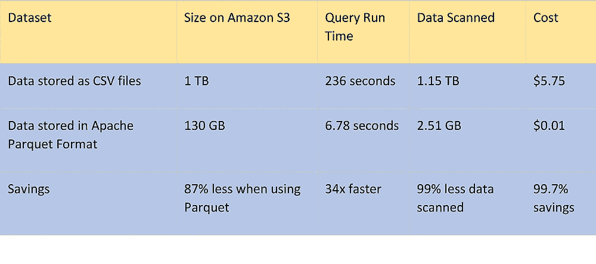
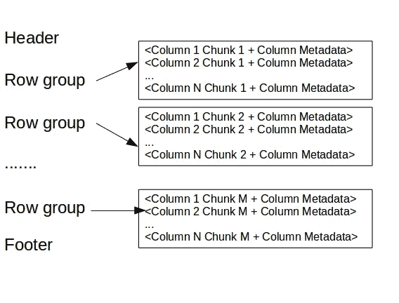

# 拼花文件-已解释

> 原文：<https://medium.com/mlearning-ai/parquet-file-explained-8d5b85b3ea60?source=collection_archive---------1----------------------->

我意识到您可能从未听说过 Apache Parquet 文件格式。与 CSV 文件类似，拼花也是一种文件。

Parquet 是一种免费的开源文件格式，适用于 Hadoop 生态系统中的任何项目。与基于行的文件(如 CSV 或 TSV 文件)相比，Apache Parquet 旨在提供高效、高性能的数据平面列存储格式。它提供了高效的数据压缩和具有增强性能的方案来批量处理复杂数据。这种方法尤其适用于那些需要从大型表中读取某些列的查询。Parquet 只能读取需要的列，因此极大地减少了 IO。

# **拼花地板的特点**

*   Apache Parquet 是面向列的，与基于行的方式(如 CSV)相比，旨在提供高效的数据列存储(块、行组、列块等)
*   Apache Parquet 是使用记录粉碎和组装算法实现的，该算法支持可用于存储数据的复杂数据结构。
*   按列压缩是高效的，并且节省存储空间
*   Apache Parquet 允许降低数据文件的存储成本，并通过 Amazon Athena、Redshift Spectrum、BigQuery 和 Azure Data Lakes 等无服务器技术最大化查询数据的效率。
*   不同的编码技术可以应用于不同的列。
*   Apache Parquet 可以使用不同的编程语言，如 C++，Java，Python 等。
*   支持熟悉的数据类型，文件元数据，自动字典编码。

# 模块

*   parquet-format 项目包含正确读取 parquet 文件所需的元数据的格式规范和节俭定义。
*   parquet-mr 项目包含多个子模块，这些子模块实现读写嵌套的、面向列的数据流的核心组件，将这个核心映射到 parquet 格式，并提供 Hadoop 输入/输出格式、Pig loaders 和其他基于 Java 的实用程序来与 parquet 交互。
*   parquet-cpp 项目是一个读写 parquet 文件的 C++库。
*   parquet-rs 项目是一个读写 parquet 文件的 Rust 库。
*   parquet-compatibility 项目包含兼容性测试，可用于验证不同语言的实现可以读写彼此的文件。

# **为什么是拼花地板？**

与 CSV 之类的格式相比，拼花地板的性能在成本、效率和灵活性方面提供了引人注目的优势。通过将 CSV 数据转换为 Parquet 的列格式，对其进行压缩和分区，我们可以节省资金并获得更好的性能。

# **文件格式**

这个文件和 thrift 定义应该一起阅读以理解格式。

image netjstech

在上面的例子中，这个表中有 N 列，分成 M 个行组。文件元数据包含所有列元数据开始位置的位置。可以在 thrift 文件中找到元数据中包含的更多细节。

**Pandas 实现了拼花接口读取。**

**pandas . read _ parquet(path，engine='auto '，columns=None，use_nullable_dtypes=False，* * kwargs)**

# **参数解释**

这是文件的路径。任何有效的字符串路径都是可以接受的。文件 URL 也可以是包含多个分区拼花文件的目录的路径。pyarrow 和 fastparquet 都支持目录路径和文件 URL。

**引擎-** 默认设置为自动。默认行为是尝试“pyarrow ”,如果“pyarrow”不可用，则返回到“fastparquet”。

**列**-如果该参数设置为某个整数，那么只有这些列将从文件中读取

**use_nullable_dtypes-** 如果为真，则使用使用 pd 的 dtypes。NA 作为结果数据帧的缺失值指示器(仅适用于 engine="pyarrow ")。因为添加了支持 pd 的新数据类型。以后，使用此选项的输出将改为使用这些 dtypes。

*   ***kwargs-** 任何额外的 kwargs 被传递到引擎。

# 摘要

**希望上述细节能够帮助您更好地使用拼花文件。**

参考

[https://parquet.apache.org/documentation/latest](https://parquet.apache.org/documentation/latest/)

[https://pandas . pydata . org/pandas-docs/stable/reference/API/pandas . read _ parquet . html](https://pandas.pydata.org/pandas-docs/stable/reference/api/pandas.read_parquet.html)

*原载于 2021 年 3 月 16 日*[*https://www.numpyninja.com*](https://www.numpyninja.com/post/parquet-file-explained)*。*