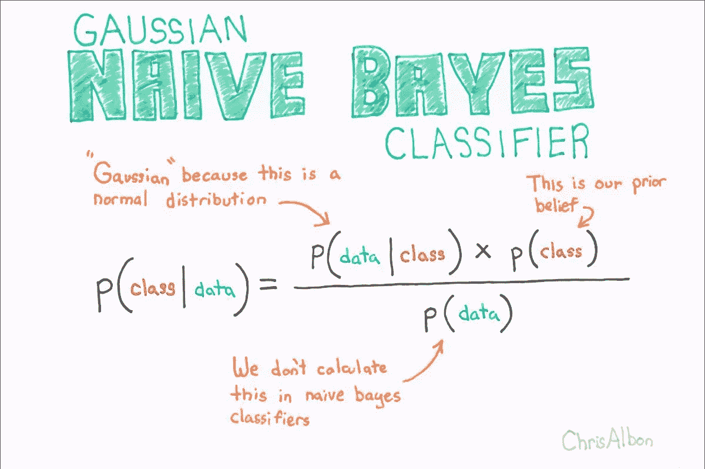

# 第 4 部分:朴素贝叶斯

> 原文：<https://medium.com/mlearning-ai/part-4-naive-bayes-e00f69c822b8?source=collection_archive---------4----------------------->

Image from [Becoming Human](https://becominghuman.ai/naive-bayes-theorem-d8854a41ea08?gi=8fe3ecb1f951)

朴素贝叶斯方法是一组监督学习算法，它基于贝叶斯定理的应用，假设给定类变量的值，每对要素之间存在条件独立性的“朴素”假设。没有单一的算法来训练这些分类器，因此朴素贝叶斯方法假设给定一个类变量，特定特征的值独立于任何其他特征的值。朴素贝叶斯分类器假设所有预测变量相互独立，并根据输入数据的样本预测一组类的概率分布，从而计算目标分类变量属于每个类的概率。当用于文本分类时，朴素贝叶斯分类器通常比其他算法获得更高的成功率，因为它能够在保持独立性的同时在多类问题上表现良好。

朴素贝叶斯分类器旨在用于每个类中的预测器相互独立的情况，但在实践中，即使独立性假设为假，它也能很好地执行。预测器类的条件独立性假设允许朴素贝叶斯分类器使用比许多其他分类器更少的训练数据来估计精确分类所需的参数。在无色和无定形特征相互独立的天真假设下，一个类的条件概率可以计算为单个条件概率的简单乘积。在朴素贝叶斯分类中处理连续数据的策略之一可以是特征的离散化和个体类别的形成，或者使用高斯核来计算类的条件概率。

朴素分类器的贝叶斯概率模型基于贝叶斯的流行概率定理，形容词“朴素”来自于一个数据集的特征相互独立的假设。许多实际应用使用最大似然法来估计朴素贝叶斯模型的参数；换句话说，在不假设贝叶斯概率和不使用贝叶斯方法的情况下，使用朴素贝叶斯模型是可能的。贝叶斯定理的关键点是事件的概率可以随着新数据的出现而调整。

贝叶斯定理描述了基于可能与事件相关的条件的先验知识的事件概率。从技术上讲，贝叶斯定律计算的是一个条件概率，即观察数据的概率。我们可以使用朴素贝叶斯分类器生成具有相同概率分布的新虚拟数据集。

我们可以简单地忽略缺失值，因为该算法在模型构建阶段和预测阶段都会分别处理输入特征。分类器的目的是在只知道 3 个特征(长、甜和黄色)的情况下，预测给定的水果是香蕉、桔子还是其他水果。上述函数使用的特征/预测值是文档中单词的频率。

朴素贝叶斯分类器是最简单、最有效的分类算法之一，可帮助您构建快速的机器学习模型，从而做出快速预测。

 [## Mlearning.ai 提交建议

### 如何成为 Mlearning.ai 上的作家

medium.com](/mlearning-ai/mlearning-ai-submission-suggestions-b51e2b130bfb)