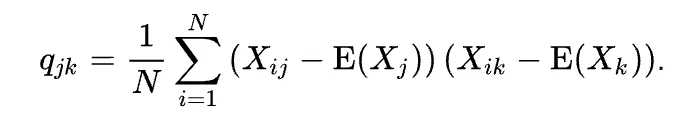
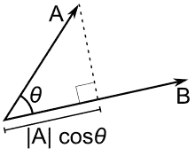
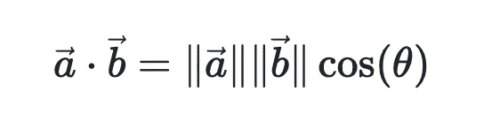

# 主成分分析:最大化协方差——这意味着什么？

> 原文：<https://medium.com/mlearning-ai/pca-maximising-the-covariance-what-does-it-mean-fe196442cb5c?source=collection_archive---------5----------------------->

在我们进入标题中的问题之前，让我们先做一些铺垫，这样每个人都知道 PCA 是什么，并在同一页上。

Photo by [Chris Liverani](https://unsplash.com/@chrisliverani?utm_source=medium&utm_medium=referral) on [Unsplash](https://unsplash.com?utm_source=medium&utm_medium=referral)

# 什么是 PCA？

主成分分析，或称 PCA，在这里可以得到最好的解释:"[https://builtin . com/data-science/step-step-explaining-principal-component-analysis](https://builtin.com/data-science/step-step-explanation-principal-component-analysis)"——我只是在就我计划讨论的主题上台之前，采用了与定义相同的 to。

PCA 是一种[降维](https://builtin.com/data-science/dimensionality-reduction-python)方法，通常用于通过将一大组变量转换成仍然包含大组中大多数信息的较小变量来降低大型[数据集](https://builtin.com/data-science)的维度。

减少数据集的变量数量自然会以牺牲准确性为代价，但降维的诀窍是用一点准确性换取简单性。因为更小的数据集更容易探索和可视化，并使分析数据对于[机器学习算法](https://builtin.com/data-science/tour-top-10-algorithms-machine-learning-newbies)来说更容易和更快，而无需处理额外的变量。

因此，总而言之，主成分分析的思想很简单——减少数据集的变量数量，同时尽可能多地保留信息。

PCA 的过程已经在许多文章和视频中进行了广泛的解释——我将在评论部分添加一些参考资料——但这不是本文的重点。

Photo by [Paul Skorupskas](https://unsplash.com/es/@pawelskor?utm_source=medium&utm_medium=referral) on [Unsplash](https://unsplash.com?utm_source=medium&utm_medium=referral)

我们将讨论短语“最大化协方差”,这是许多参考资料和来源未能解释/没有充分讨论的，并给出了正确的见解。这自然会把我们带到下一个问题。

# 什么是协方差？

协方差衡量两个随机变量之间的关系以及它们一起变化的程度。这是当变量被线性变换时函数/数据集保持其形式的属性。

所以，它通常倾向于这样描述:
*如果协方差高—数据不稳定或分散。
*同样，如果协方差较低—数据相对稳定或不太分散。

也就是说，为什么主成分分析试图“最大化”这一部分，以适应描述数据集的更好的线，而不是最小化它？要回答这个问题，我们需要稍微了解一下进行 PCA 的过程。

# PCA 实际上是做什么的？

Source — [https://i.stack.imgur.com/lNHqt.gif](https://i.stack.imgur.com/lNHqt.gif)

我们从一条随机线开始，并通过使用梯度下降来尝试更好地拟合我们的数据集，我们的意思是，我们尝试“减少这些点投影到我们线上的垂直距离的方差”。

但是首先！我们找到数据集的平均值，并将轴(组件)的中心移动到平均值，移动中心不会改变数据集，因为它们的“相对”位置不会改变。

那么，我们所说的投射是什么意思呢？让我们再回顾一下向量。

投影的意思是“阴影在/沿着”因此，按照数学语言(尤其是向量)的指导方针，我们执行点积来找到这个“投影”

projection of A onto B

设向量 A 和向量 B 的交点为 O——在这种情况下，O 将是我们分量的平均值/新中心。因此，当我们尝试最大化投影时，即，使 A 更接近 B(使用梯度下降调整线-找到更好的拟合线)，它们之间的角度不断减小，因此投影增加-这也意味着||OA||值增加！！—这意味着您的协方差/方差增加！！(唷~~)。

我希望这篇文章能够帮助那些困惑的人，为什么我们要“最大化”协方差而不是“最小化”它——现在我已经给出了这种情况的完整描述(大多数资料都没有做到这一点)。

下次见！再见！

 [## Mlearning.ai 提交建议

### 如何成为 Mlearning.ai 上的作家

medium.com](/mlearning-ai/mlearning-ai-submission-suggestions-b51e2b130bfb)