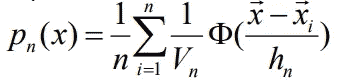
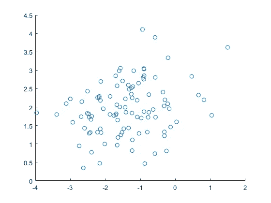
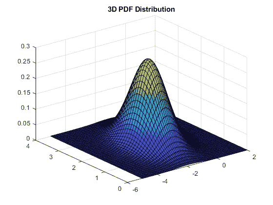
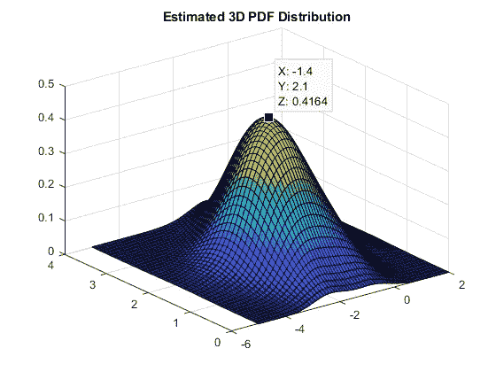

# Parzen 窗的 PDF 估计

> 原文：<https://medium.com/mlearning-ai/pdf-estimation-with-parzen-window-a32f3bfffd4c?source=collection_archive---------5----------------------->

在模式识别中，我们经常会遇到参数估计问题。该参数可以是分布的平均值/方差或一些其他统计数据。我们主要利用参数方法，如最大似然，最大后验概率或贝叶斯学习。但是这些方法需要知道密度的形式(高斯、泊松等。)并尝试根据这个 pdf 表单假设来估计缺失的参数。可悲的是，密度的形式并不总是已知的。

此时，非参数方法开始发挥作用。在不假设任何形式的密度的情况下，非参数方法试图估计给定样本的 pdf。Parzen Window 就是这些非参数方法中的一种，我们将在本文中对其进行分析。

Parzen 窗口方法的主要目的是为每个可能的向量 x 估计一个似然值 p(x ),以便这些似然值可以被组合以产生一个概率密度函数。在每次迭代中，放置一个边长为 **h_n** 的超立方体，并将超立方体的中心设置为当前的 **x** 向量。在围绕 x 向量拟合超立方体之后，评估来自给定样本的每个输入 x_i，不管它是否在超立方体中。该程序由窗口功能**φ**执行。窗口函数可以是离散函数，使得如果 x_i 在超立方体中，则它返回 1，否则返回 0。并且它也可以是诸如高斯的连续窗口。这样，每个样本的贡献将是连续的，取决于相对于中心向量 **x** 的距离。下面给出了一个简单的公式来计算给定 x 向量的可能性 p(x ):



Likelihood calculation for a given vector x

在上面的公式中；**φ**代表窗口函数， **x** 是我们要寻找其可能性的向量， **x_i** 是来自分布的 **i** ^th 样本， **h_n** 是超立方体的边长， **V_n** 是超立方体的体积，最后 **n** 是数据集中的样本数。如果我们总结这个公式中所发生的事情，我们可以说窗口函数**φ**是在每个样本 **x_i** 上操作的，并且窗口的输出除以超立方体的体积。最后，将每个结果相加，并按样本数量 **n** 进行平均。这个最终值给了我们向量 **x** 的可能性！下面提供了一个示例来说明此过程:

让我们首先创建 100 个双变量高斯样本，其平均值为 **[-1.5，2]** ，协方差矩阵为 **[0.7，0.1；0.1，0.5]:**

```
mu = [-1.5 2];
sigma = [0.7 0.1;0.1 0.5];
N = 100;
rng(‘default’)
Samples = mvnrnd(mu,sigma,N);
scatter(Samples(:,1),Samples(:,2))
```



Scatter Plot of 100 Bi-variate Gaussian Samples

现在，使用 Matlab 中的 **mvnpdf** 函数找到该分布的原始 pdf，并绘制原始分布图:

```
x1 = -5:0.1:2;
x2 = 0:0.1:4;
[X1,X2] = meshgrid(x1,x2);
X_grid = [X1(:) X2(:)];
y = mvnpdf(X_grid,mu,sigma);
y = reshape(y,length(x2),length(x1));
figure()
surf(x1,x2,y)
title(‘3D PDF Distribution’)
```



Original PDF

现在，让我们实现我们自己的 Parzen 窗口函数，并尝试估计上面显示的原始 pdf。

```
%% Parzen Windowpdf_estimate = zeros(size(X_grid,1),1);h1 = 5; % Can be changed to see the effect of the edge length
hn = h1 / sqrt(N);
V0 = h1^2;
Vn = 1 / sqrt(N);for i = 1:size(X_grid,1)
    for j = 1 : N
        u = X_grid(i,:) — Samples(j,:);
        u = u / hn;
        win_out = Window_Function(mu’,u’);
        pdf_estimate(i) = pdf_estimate(i) + win_out / Vn;
    end
    pdf_estimate(i) = pdf_estimate(i) / N;
endpdf_estimate = reshape(pdf_estimate,length(x2),length(x1));
figure()
surf(x1,x2,pdf_estimate)
title(‘Estimated 3D PDF Distribution’)
%%%%%%%%%%%%%%%%%%%%%%%%%%%%%%%%%%%%%%%%%%%%%%%%%%%%%%%%%%% Gaussian Window is implemented in the function below
function y = Window_Function(mu,u)
d = length(mu);
y = exp(-0.5 * u’ * u) / ((2*pi)^(d/2));
end
```



Estimated PDF

从上图中我们可以看出，估算的 pdf 与原始 PDF 相似。在 **[-1.4，2.1]** 附近达到峰值，与原始均值 **[-1.5，2]** 相当接近。尽管这个结果并不理想，但它仍然让我们了解了如何估计数据集的 pdf，即使分布的形式是未知的。在这个例子中，我们不知道样本是正态分布的，但是我们仍然可以得到一个相似的分布。

另一个挑战可能是使用 n 和 h_n 值来观察它们的效果，并找到理想的设置。下一篇文章再见！

[](/mlearning-ai/mlearning-ai-submission-suggestions-b51e2b130bfb) [## Mlearning.ai 提交建议

### 如何成为 Mlearning.ai 上的作家

medium.com](/mlearning-ai/mlearning-ai-submission-suggestions-b51e2b130bfb)