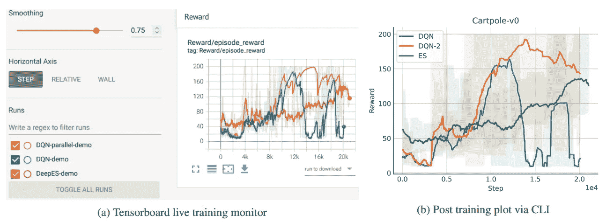

# Pearl:并行进化和强化学习库

> 原文：<https://medium.com/mlearning-ai/pearl-parallel-evolutionary-and-reinforcement-learning-library-cdcc5400135?source=collection_archive---------4----------------------->

## 开源研究工具箱

Image by Author: Logo for Pearl

强化学习(RL)在优化具有奖励结构的环境中的代理时取得了很大的成功。例子包括令人印象深刻的算法，能够在 Dota 2 或国际象棋等游戏中击败世界上最好的玩家。最近，进化计算(EC)算法也取得了成功，其性能与通常更复杂的 RL 相似。虽然存在许多开源 RL 和 EC 库，但没有公开可用的库将这两种方法结合起来以增强比较、合作或可视化。

Pearl 🦪是一个基于 PyTorch 的软件包，其目标是在 rl 和 EC 之间的交叉点上为新的自适应决策算法提供优秀的快速原型。在本文中，我想介绍这个库，并详细介绍一些关键特性。

*   库本身托管在 GitHub [**这里**](https://github.com/LondonNode/Pearl) 。
*   更详细的技术报告可以在 arXiv [**这里**](https://arxiv.org/abs/2201.09568) 找到。
*   使用 Google Colab 的互动教程可以在 [**这里**](https://github.com/LondonNode/Pearl-tutorials) 找到。

# 关键特征

*   ✅ RL 算法、EC 算法和混合算法(结合 RL 和 EC)都可以从单个基类实现。
*   ✅所有代理都与 OpenAI 健身房环境兼容。
*   ✅多代理支持更快的培训。
*   ✅张量板集成用于实时分析。
*   带有类型提示和函数文档字符串的✅模块化和可扩展组件。
*   ✅固执己见的模块设置按数据类分组。
*   ✅自定义回调，为您的算法注入独特的逻辑。
*   ✅单元测试实现了 92%的覆盖率。
*   ✅灵活而强大的神经网络模型。
*   ✅命令行界面，用于运行已实现的代理作为演示，并用于可视化复杂的情节。

# 一个例子

Image by Author

现在，您可以使用相同的软件直接可视化和比较 RL 和 EC 算法的结果🤩

 [## Mlearning.ai 提交建议

### 如何成为 Mlearning.ai 上的作家

medium.com](/mlearning-ai/mlearning-ai-submission-suggestions-b51e2b130bfb)