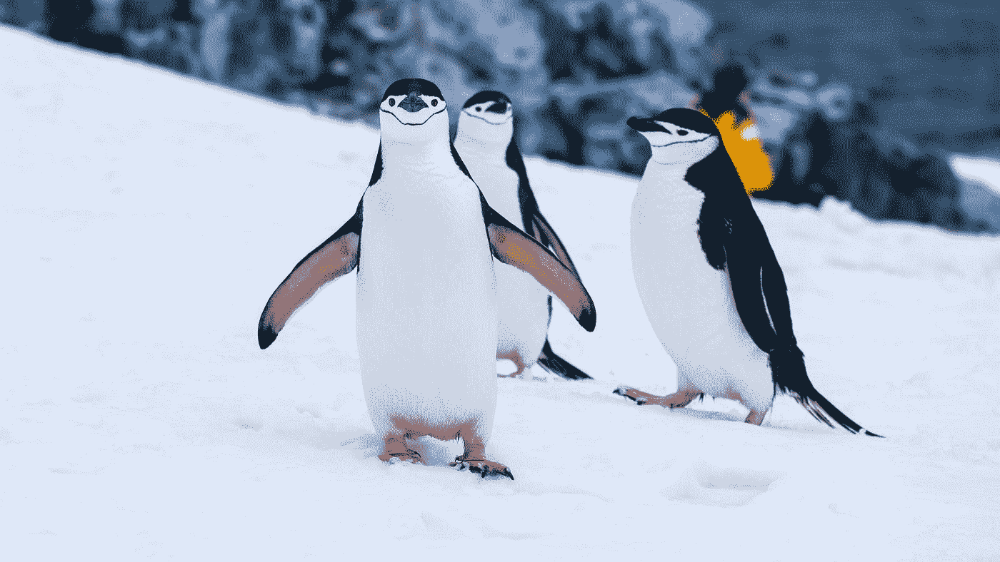
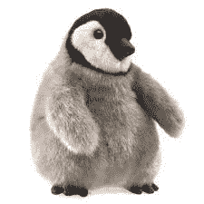
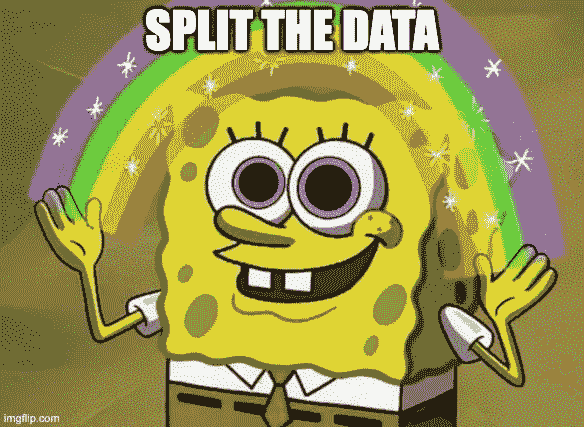
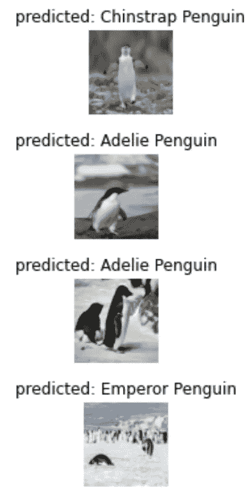

# 从头到脚的企鹅——企鹅如何帮助你掌握图像分类过程

> 原文：<https://medium.com/mlearning-ai/penguins-from-head-to-toe-how-penguins-can-help-you-master-image-classification-process-8be9cd68121d?source=collection_archive---------5----------------------->

## 创建自定义企鹅图像分类模型的分步指南



Photo by [Derek Oyen](https://unsplash.com/@goosegrease?utm_source=medium&utm_medium=referral) on [Unsplash](https://unsplash.com?utm_source=medium&utm_medium=referral)

# 介绍

我是一个企鹅爱好者，所以我决定创建自己的企鹅图像小数据集，并在其上训练图像分类模型。这是一个指南，让你跟随我在这个项目上的工作。它可以帮助您为您感兴趣的任何图像分类项目建立自己的模型。

# 下载数据

## 谷歌图片下载

每个数据项目都必须从一些数据开始。您将使用 google-image-download 基于从 Google Images 收集的图像构建您的自定义企鹅数据集。数据集将由 4 种企鹅组成:阿德利企鹅、下巴颏企鹅、帝企鹅和巴布亚企鹅。

[google-image-download](https://github.com/hardikvasa/google-images-download) 是一个简单的命令行工具，用于根据关键字从 google 下载图像。要安装它，请运行:

```
git clone [https://github.com/hardikvasa/google-images-download.git](https://github.com/hardikvasa/google-images-download.git)
cd google-images-download && python setup.py install
```

不幸的是，这个库中的最新版本已损坏。在它的一个[分支](https://github.com/Joeclinton1/google-images-download)中建议了一个修复。

## 数据集大小

稍后，您将使用迁移学习来利用预先训练的模型。在这个阶段，你需要决定数据集的大小。

每种企鹅类型的 100 个或更少图像的数据集是一个足够小的数据集，可以容易地管理，并且足以让模型在迁移学习设置中学习。但是，这可能会导致模型过度拟合。

如果您认为这个数据集大小已经足够了，那么您可以使用下面的下载脚本:

要运行它:

```
python penguin_download.py
```

这个脚本试图下载 100 张阿德利、下巴颏带、帝企鹅和巴布亚企鹅的图片。每种企鹅都被保存在一个名为“下载/ <penguin type="">”的专用文件夹中。为了减少下载运行时间和改进以后的训练时间，下载的图像是中等大小的。图像大小可以设置为“大”或“图标”，或者根本不传递到库中。</penguin>

注意，阿德利企鹅有一个法语名字，重音在 e 上，然而谷歌图像下载返回关于这个关键字的非常不相关的结果，即使它是拉丁编码的，所以你将改为搜索“阿德利”..


## 下载每种企鹅类型的 100 多张图片

google-image-download 需要一些修改才能下载更多的数据。

首先，你需要安装[硒](https://www.selenium.dev/):

```
pip install selenium
```

然后从[这里](https://sites.google.com/chromium.org/driver/)下载 chromedriver。注意，chromedriver 版本应该和你的 chrome 版本匹配(你可以在这里查看你的 chrome 版本[)。](https://www.whatismybrowser.com/detect/what-version-of-chrome-do-i-have)

下载完成后，您需要将 chromedriver 文件复制到包含下载脚本的文件夹中:

```
cp ~/Downloads/chromedriver .
```

MacOS 可能会拒绝运行 chromedriver，因此此命令有助于解决问题:

```
xattr -d com.apple.quarantine chromedriver
```

下面是修改后的脚本，每个企鹅类型下载 150 张图片。运行它需要一段时间才能完成，所以现在你可以去喝杯咖啡了。

# 清理数据

数据清洗是深度学习模型训练过程中至关重要的一步，因为校长[“垃圾进，垃圾出”](https://en.wikipedia.org/wiki/Garbage_in,_garbage_out)。如果你用有缺陷或不正确的图像训练模型，它将无法学习，并将给出糟糕的结果。当在小数据集上训练时，这甚至更重要，因为每个图像对训练结果的影响比在由数千或数百万个图像组成的数据集中大得多。

要清理数据，您需要手动浏览图像，并删除所有不相关的图像。这包括绘画，从太远的地方拍摄的企鹅照片，多种企鹅物种的照片，企鹅娃娃的照片等等。所有不是活企鹅的图片都应该被删除。



An image of a cute Emperor penguin doll that should be removed from the dataset, [https://www.bookvine.com/prod-20-1-96-121/baby-emperor-penguin-puppet.htm](https://www.bookvine.com/prod-20-1-96-121/baby-emperor-penguin-puppet.htm)

# 平衡数据

由于一些图像下载可能会失败，并且在清理阶段从数据中移除了相当多的图像，因此您可能会获得不平衡的数据集，这意味着一些类获得的图像明显少于其他类。这可能会影响训练结果，有几种方法可以解决这个问题。

要了解数据集是如何平衡的，只需计算下载目录中图像的数量。

要计算企鹅图像，请运行:

```
find downloads -type f -not -name ".*" | cut -d/ -f2 | sort | uniq -c
```

这些是我在下载了每种企鹅的 150 张图片并清理了数据集后获得的相关图片的数量:

```
119 Adelie Penguin124 Chinstrap Penguin103 Emperor Penguin126 Gentoo Penguin
```

在这个场景中，职业是相当平衡的。

# 拆分数据

为了估计模型的性能，训练测试分割是重要的。我们将把数据分成 3 个部分:训练、验证和测试，它们的大小分别是数据的 80%、10%和 10%。



分割数据集很容易。首先，您需要安装一个名为 [split-folders](https://pypi.org/project/split-folders/) 的 python 库:

```
pip install split-folders
```

然后，您需要运行以下命令:

```
python -c "import splitfolders; splitfolders.ratio('downloads', output='output', seed=1337, ratio=(.8, 0.1, 0.1))"
```

该命令根据指定的比率分割数据集。它生成一个名为“输出”的文件夹，其结构如下:

```
ls output/**test**/  **train**/ **val**/
```

每个子文件夹现在都有一个专门的文件夹来存放每一种企鹅。火车文件夹应该是这样的:

```
$ ls output/train/**Adelie Penguin**/    **Chinstrap Penguin**/ 
**Emperor Penguin**/   **Gentoo Penguin**/
```

# 压缩并上传数据

现在是时候创建一个包含所有图像的 zip 文件，并将其上传到一个可以在培训期间访问的位置。

要将输出文件夹压缩到名为 data.zip 的文件中，您需要运行:

```
zip -r data.zip output
```

现在把压缩文件上传到你的谷歌硬盘。你会把它作为你的云存储。

# 火车

(如果您只想运行培训，可以跳过数据集准备阶段，通过[此链接](https://drive.google.com/file/d/1i8Ayy8zsKeI40Lt4pgQOKRZfzJhu1-3I/view?usp=sharing)下载数据)

## 迁移学习

迁移学习是一种技术，允许您使用之前在大型数据集上训练的模型来完成不同但相似的任务。用于图像分类的迁移学习背后的直觉是，如果一个模型在一个足够大和通用的数据集(如 ImageNet)上训练，该模型将有效地充当视觉世界的通用模型。

关于迁移学习的更多信息，你可以参考 [CS231n 笔记。](https://cs231n.github.io/transfer-learning/)

## 设置

训练代码就是基于这个 [PyTorch 教程](https://pytorch.org/tutorials/beginner/transfer_learning_tutorial.html)进行迁移学习的。本教程解释了如何使用 ResNet18 模型的迁移学习来对蚂蚁和蜜蜂这两个类别进行分类。

我创建了一个笔记本，对教程代码做了一些修改和改进。笔记本代码可在[这里](https://github.com/asyaf/fun_mini_projects/blob/master/penguin_classification/transfer_learning_penguin.ipynb)获得。

这款笔记本被设计成可以在 [Google Colab](https://colab.research.google.com/) 上运行。要执行它，您需要做一些更改。我们现在将检查笔记本的主要部分和我添加的修改。

## 将数据加载到 Google Colab

要让 Google Colab 访问您的 Google Drive，您需要执行以下代码行:

```
from google.colab import drivedrive.mount('/content/drive')
```

接下来，您需要用 Google Drive 上的位置替换数据文件的路径:

```
DATA_FILE = ‘drive/My\ Drive/Data/penguin\ data/data.zip’
```

这一阶段的最后一步是解压缩 zip 文件，以便 PyTorch 可以访问其中包含的图像:

```
!unzip $DATA_FILE
```

## 创建数据加载器

您需要设置 3 种类型的数据集:训练、验证和测试。每个数据集都需要对数据进行一些转换:

*   图像的大小被调整为网络的输入大小，即 224*224。
*   数据被转换成张量格式。
*   根据 ImageNet 的平均值和标准偏差对图像数据进行标准化(这是一种常见的做法，也在 PyTorch 的[预训练模型文档中进行了说明)](https://pytorch.org/vision/stable/models.html)
*   为了训练，还增加了随机水平翻转。这允许通过沿水平轴随机翻转图像来创建更多的数据样本。

## 添加张量板记录

Tensorboard 是一个用于测量和可视化训练过程的工具。您将通过向训练代码添加几行来跟踪模型的损失和准确性。

要设置 tensorboard，请在开始训练前执行以下代码:

另外，将下面的代码添加到“train”函数中:

培训结束后，您可以通过运行以下命令来查看收集的指标:

```
%tensorboard --logdir='./runs'
```

## 火车

通过执行以下命令来运行培训:

```
model_ft = train_model(model_ft, criterion, optimizer_ft, exp_lr_scheduler, num_epochs=24)
```

在训练过程的最后，您应该看到验证集上最佳模型的准确性。我得到了以下结果:

```
Best val Acc: 0.977778
```

以下是来自验证集的一些结果示例:



## 测试时运行模型

训练结束后，您可能想知道模型的概括程度。这可以通过在测试集上计算模型的准确性来实现。下面的代码还显示了一些模型出错的图片。

## 保存模型

通过运行以下命令将模型保存到文件中:

```
torch.save(model_ft, ‘model.pt’)
```

要持久化训练好的模型，您可以下载它:

```
from google.colab import filesfiles.download(‘model.pt’)
```

或者通过运行以下命令将其复制到您的 Google Drive:

```
!cp model.pt "drive/My Drive/Data/"
```

# 结论

创建自定义图像分类模型是计算机视觉中非常常见的任务。通过利用谷歌图像和现有的预训练模型，这项任务可以在几个小时内完成。希望这个指南能帮你解决你的酷图分类问题，无论是否涉及企鹅。

[](/mlearning-ai/mlearning-ai-submission-suggestions-b51e2b130bfb) [## Mlearning.ai 提交建议

### 如何成为 Mlearning.ai 上的作家

medium.com](/mlearning-ai/mlearning-ai-submission-suggestions-b51e2b130bfb)