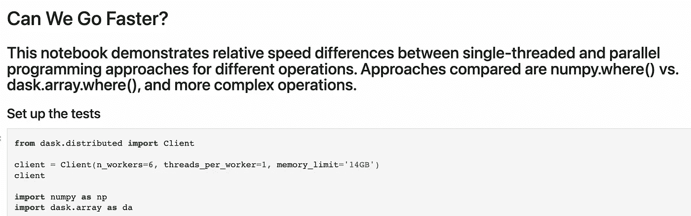
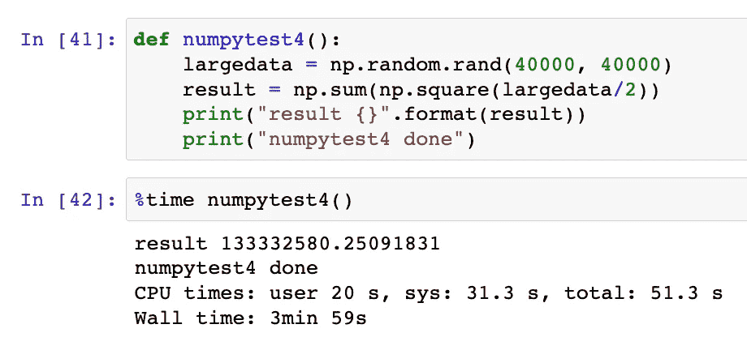
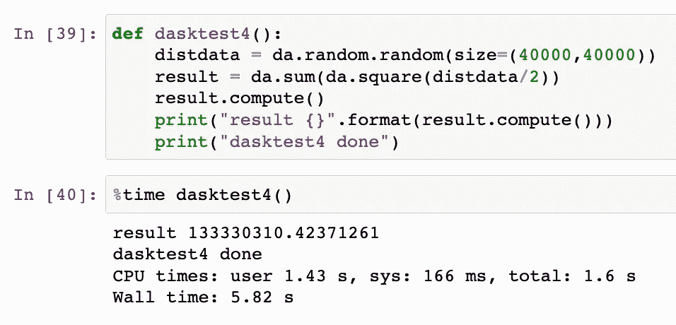

# 完善并行 Python 编程

> 原文：<https://medium.com/mlearning-ai/perfecting-parallel-python-programming-d92c1a0c1d8f?source=collection_archive---------3----------------------->

使用 Dask 的任务，享受快速

在我的[上一篇文章](https://jasondeden.medium.com/eat-my-dust-loops-33e5279a01de)中，我比较了用 Python 执行任务的四种不同方法，NumPy 和矢量化 Python 在循环和列表理解方面明显优于前者。但是，如果有一种方法可以更快，特别是在非常大、非常复杂的问题上，会怎么样呢？

Faster than NumPy? That’s ludicrous!

如果你回到我关于 Python 中的[递归函数](https://jasondeden.medium.com/recursive-functions-in-python-a-visual-walk-through-28cf22cc10e2)的博客文章，你会想起 Python 的挑战之一是它的单线程特性。当您运行循环、递归函数或其他函数时，默认情况下，它一次执行一个代码命令，并等待该命令完成后再执行下一个命令。为了避免这类问题，我们使用像 NumPy 这样的包，它接受 Python 命令并在较低的级别执行它们。假设 a) NumPy 支持您正在尝试执行的操作，b)您正在处理的数据足够小，可以放入系统内存，这种方法非常有效。但是，当我们开始真正定制的操作或真正的大数据时，事情开始分崩离析，这在历史上迫使我们进入完全不同的平台，如 Hadoop/Spark，以便对真正的大数据进行并行操作。但是今天，由于 [Dask](https://dask.org/) 的存在，这在很多情况下不再需要。

我不打算花太多时间解释 Dask 是如何工作的。有一套很棒的教程带你完成设置和各种组件操作。在这里，我将假设您已经安装并配置了 Dask，让我们看看是否能找出它胜过 NumPy 的用例。会是全部吗？而如果不是，在什么情况下更好(如果有的话)，会好到什么程度？

如果你想直接跳到答案，查看笔记本[这里](https://github.com/jasondeden/GCP-Jupyter/blob/main/NumPy%20vs.%20Dask%20Array.ipynb)。

首先，我首先测试了一个简单的 numpy.where()与 dask.array.where()操作，测试对象是我的机器上 numpy 能够处理的最大数据集。(注意:Dask 实际上可以处理的数据比你在内存中可以容纳的要多，但我是在比较苹果和苹果。)

Let’s go!

最初的几次测试对于并行化方法来说并不乐观。在大型数组和矩阵中用-1 替换 0 的简单 where()函数让 NumPy 打败了 Dask，通常是 2 倍左右。

所以我决定加大赌注，做一个更复杂的问题——创建一个大的随机矩阵，将其所有值除以 2，对结果求平方，然后对平方求和。

So…. sloooooow…..

与之前的练习相比，这花费了相对较长的时间，加上所有增加的复杂性，我认为这将是 Dask 大放异彩的机会。我还打印了结果输出作为健全性测试——以确保 Dask 和 NumPy 确实在执行类似的复杂操作。

所以我用 Dask 创建了一个类似的函数，并试了一下。

ZOOM!

伙计们，起初我不相信自己的眼睛，所以我运行了几次以确保万无一失(在这一点上，我添加了打印结果语句作为健全性检查……)果然，Dask 在这个更复杂的问题上的方法将计算时间从 4 分钟减少到了 6 秒，在我的笔记本电脑上实现了 97%的性能提升(一台装有新 m1 芯片的 Mac，因此您的里程数可能会有所不同)。

还是那句话，你自己去看看吧。Dask 需要一点时间来适应，并且不支持 NumPy 支持的所有东西，但是对于大型复杂的问题，基于这些结果，它已经很快成为我的首选。

 [## Mlearning.ai 提交建议

### 如何成为 Mlearning.ai 上的作家

medium.com](/mlearning-ai/mlearning-ai-submission-suggestions-b51e2b130bfb)