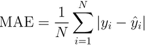
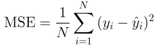
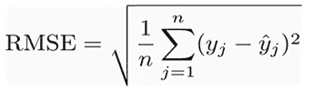
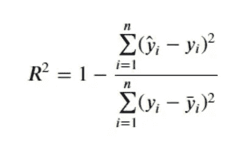
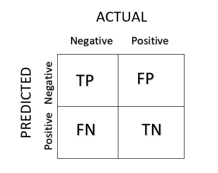
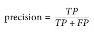
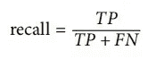
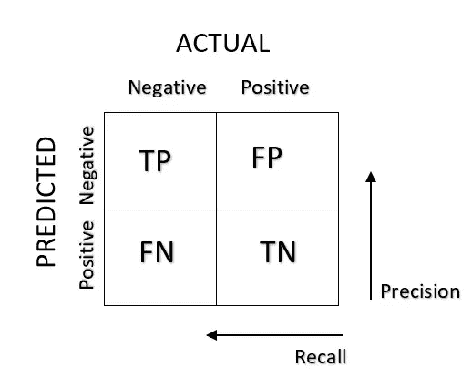
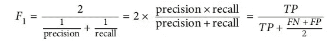

# 机器学习模型的性能度量

> 原文：<https://medium.com/mlearning-ai/performance-measure-of-a-machine-learning-model-fb657263bf98?source=collection_archive---------5----------------------->

image by [Jakob Rosen](https://unsplash.com/@jakobnoahrosen) on unsplash

制作机器学习模型并进行预测并不是唯一的任务。我们的最终目标是创建一个对样本外数据给出高精度的模型。因此，在进行预测之前检查性能指标是很重要的。

# 机器学习中回归模型的性能度量

回归模型的性能通常以 4 种不同的方式来衡量:

1.  绝对平均误差
2.  均方误差
3.  均方根误差
4.  R2 分数

# 平均绝对误差

它只是每个残差的和除以项数的绝对值。

其中，yᵢ是实际预期产量，ŷᵢ是模型预测产量。

残差=实际值-预测值

# 均方误差

它就是残差的平方和除以项数。

其中，yᵢ是实际预期产量，ŷᵢ是模型预测产量。

# 均方根误差

由于 MSE 包含平方误差项，我们取 MSE 的平方根，这就产生了均方根误差(RMSE)。

# R2——分数

我们知道误差较小的模型比误差较大的模型更好。这些性能指标给我们提供了绝对误差值。但我们可能会对如何知道模型有多好产生疑问？？答案可能是 r2-score。这种性能指标为我们提供了衡量模型好坏的方法，用百分比表示。现在让我们看看它的公式:

其中，yᵢ是实际预期产量，ȳ是平均值，ŷᵢ是模型的预测值。

# 机器学习中分类模型的性能度量

评估一个分类器通常比评估一个回归变量要复杂得多。有许多可用的性能指标:

1.  通过交叉验证测量准确度。
2.  混淆矩阵

是我们现在要讨论的两个性能指标。

# 通过交叉验证测量准确度。

在这种评估模型的方法中，训练集被分成较小的训练集和验证集，然后根据较小的训练集训练我们的模型，并根据验证集评估它们。这是一点工作，但没有什么太难的，它会工作得相当好。一个很好的替代方法是使用 Scikit-Learn 的 K 倍交叉验证功能，其中 K 代表该过程重复的次数。

如果提供的 k 值为 10，则训练集被分成 10 个不同的子集，称为折叠，然后训练和评估模型 10 次，每次选择不同的折叠进行评估，并在其他 9 个折叠上进行训练。结果是一个包含 10 个评估分数的数组。

请注意，交叉验证不仅允许我们获得模型性能的估计，还允许我们测量模型的精确程度..

# 混淆矩阵

评估分类器性能的一个更好的方法是查看混淆矩阵。总的想法是统计 A 类的实例被分类为另一个类的次数。

混淆矩阵是一个 N×N 矩阵，其中 N 是类的数量。混淆矩阵中的每一行代表一个实际类别，而每一列代表一个预测类别。

其中 TP 为真阳性，FP 为假阳性，FN 为假阴性，TN 为真阴性。

一个完美的分类器只有真阳性和真阴性，所以它的混淆矩阵只有在主对角线上有非零值

混淆矩阵给了我们很多信息，但有时我们可能更喜欢更简洁的度量。一个有趣的现象是积极预测的准确性；这被称为分类器的精度。

TP 是真阳性的数量，FP 是假阳性的数量。

获得完美精度的一个简单方法是进行一次正面预测，并确保它是正确的(精度= 1/1 = 100%)。这不是很有用，因为分类器将忽略除了一个正实例之外的所有实例。因此，精确度通常与另一个称为召回的指标一起使用，也称为灵敏度或真阳性率

FN 当然是漏报数。

将精度和召回率结合到一个称为 *F1 得分*的单一指标中通常很方便，特别是如果您需要一种简单的方法来比较两个分类器。F1 分数是精确度和召回率的*调和平均值*。

