# 使用 Python 执行气象数据分析

> 原文：<https://medium.com/mlearning-ai/performing-analysis-of-meteorological-data-using-python-57767e9f23b0?source=collection_archive---------1----------------------->

Reach out to me on Kaggle.

> **概述**

在这个项目中，我们正在对数据集进行假设检验，并试图证明该假设是否正确。我们也在做一些数据清理技术、数据可视化和假设检验。

> **先决条件**

1.  Numpy
2.  熊猫
3.  海生的
4.  Matplotlib

> **假设**

本项目的假设:零假设 H0 是"**有超过 10 年的数据显示，由于全球变暖**，每月的表观温度和湿度有所增加

> **数据集**

该数据集记录了从 2006 年 4 月 1 日 00:00:00.000 +0200 到 2016 年 9 月 9 日 23:00:00.000 +0200 的过去 10 年的每小时温度。对应的是北欧国家芬兰。您可以从这个[链接](https://www.kaggle.com/muthuj7/weather-dataset)下载数据集。

> **说明**

下面解释了我们将在代码中使用的 10 列数据。

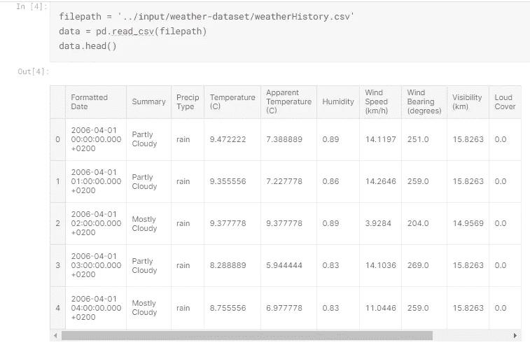

现在，删除我们不需要的列

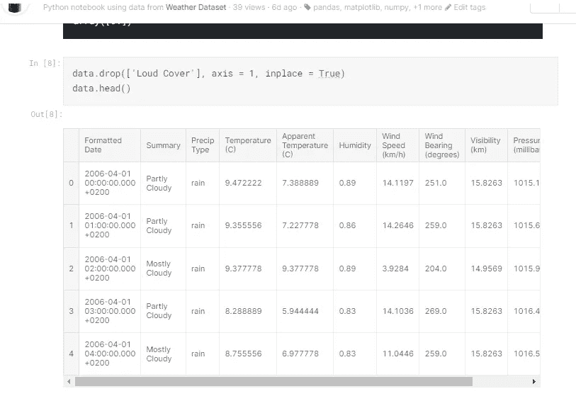

现在，我们将检查丢失的值并计数它们有多少

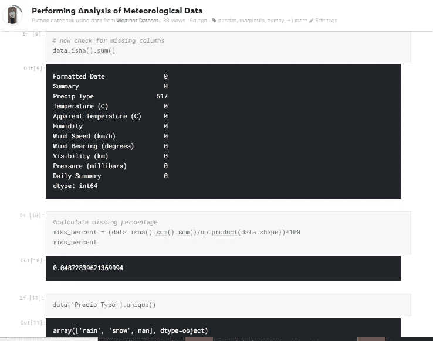

并用 bfill 方法替换 nan 值

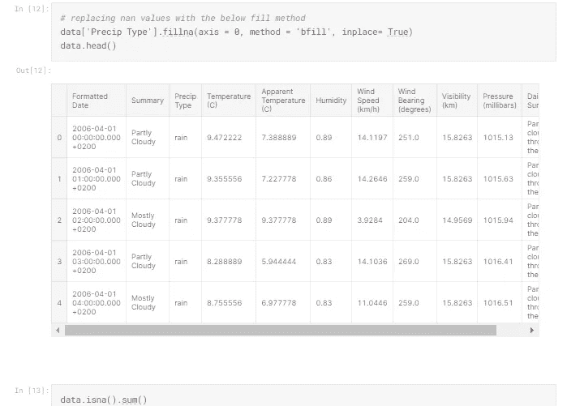

现在，我们可以看到格式化的日期不是 utc 时间格式，我们必须将其更改为适当的格式。

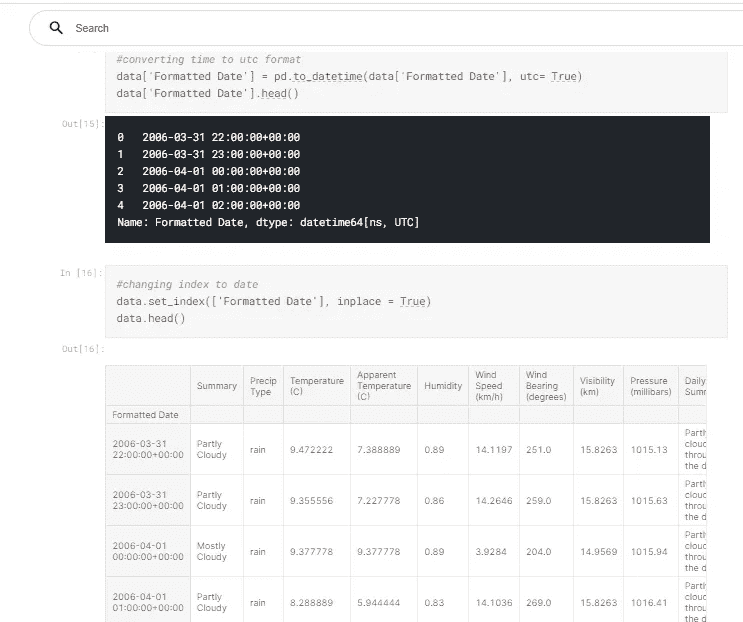

现在我们检查数据集中的唯一值

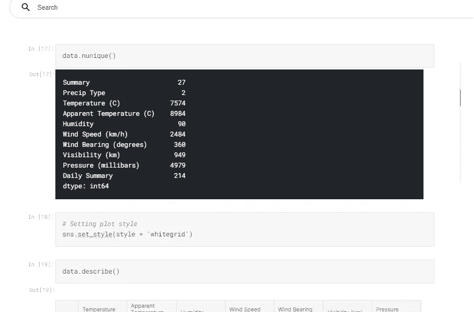

现在，首先绘制数据的线图

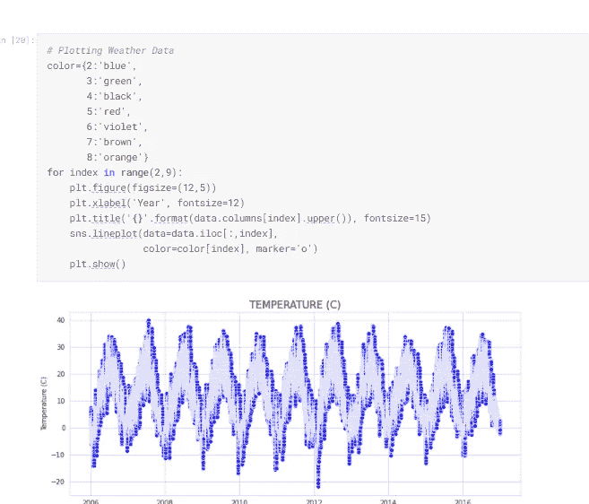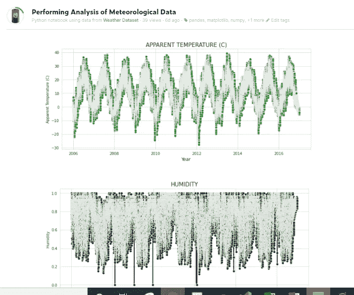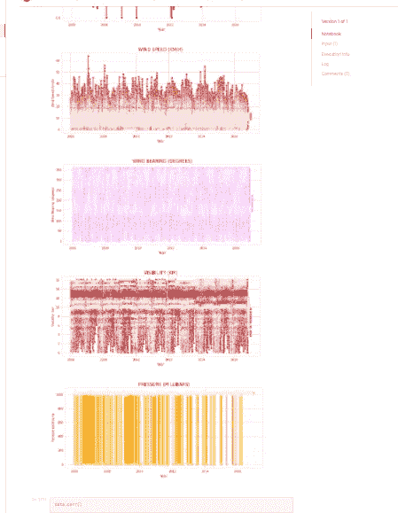

现在创建可视化热图

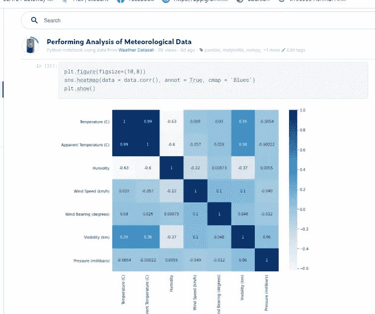

用摘要绘制散点图

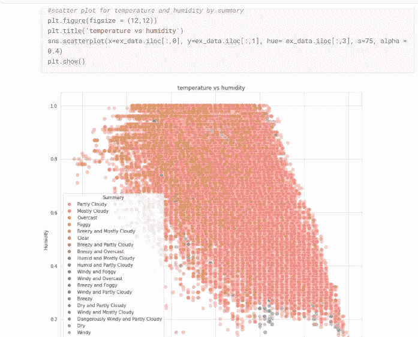

现在我们比较散点图中的温度和湿度

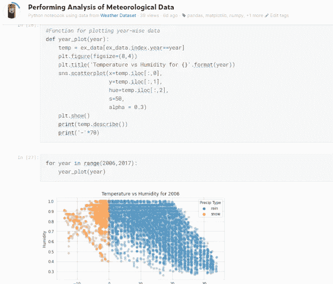

现在，我们通过使用 python 中的重采样函数对数据进行重采样，对不同年份进行年度分析

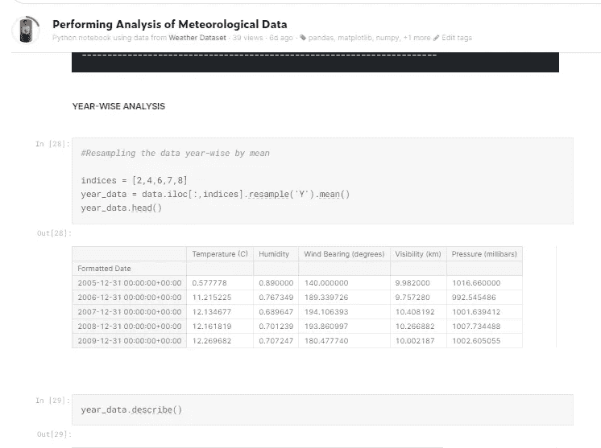

现在，我们将绘制不同特征与密度的距离图

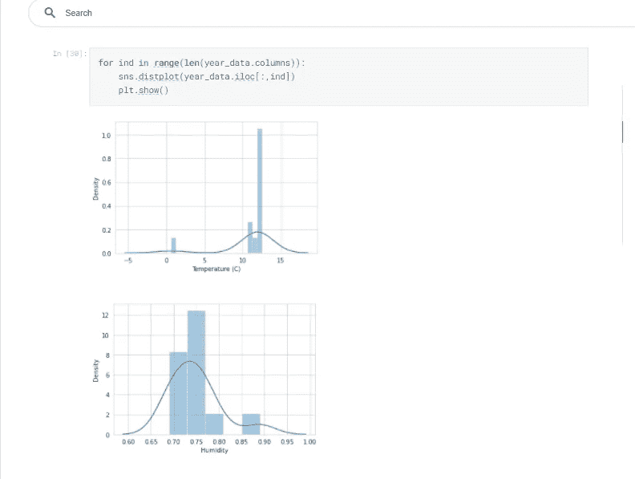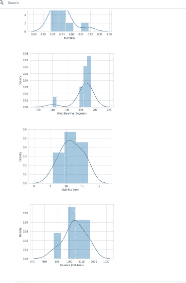

此外，热图:

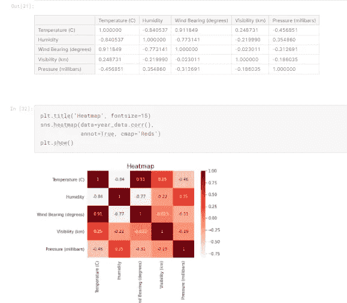

> **四月份的最终图形:**

**AT_monthly_average** 和**moisture _ monthly _ average**是两本拥有 2006-2016 年月度数据的字典。两本词典都有月索引键(比如四月索引是 4)。

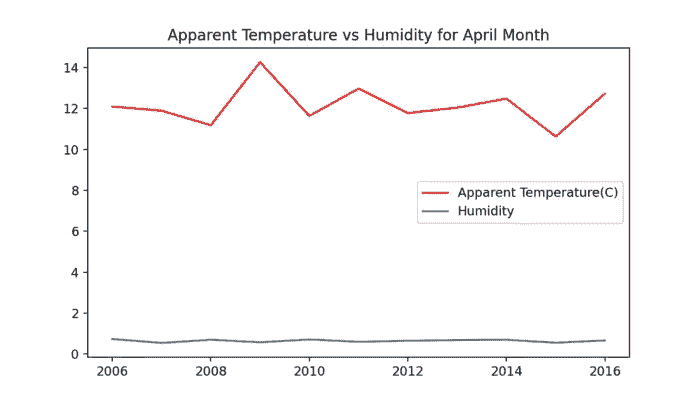

Line graph AT and Humidity

> ***结论***

在这 10 年的数据集中，我们可以看到随着每年增加的表面温度和湿度是不相关的。全年月平均湿度相同，但表观温度不同。全球变暖正在影响地球的温度，所以我们在这个数据中看到了一些不确定性。

> **代码**

项目代码可在 [Kaggle](https://www.kaggle.com/ashmalvayani/performing-analysis-of-meteorological-data) 上获得。