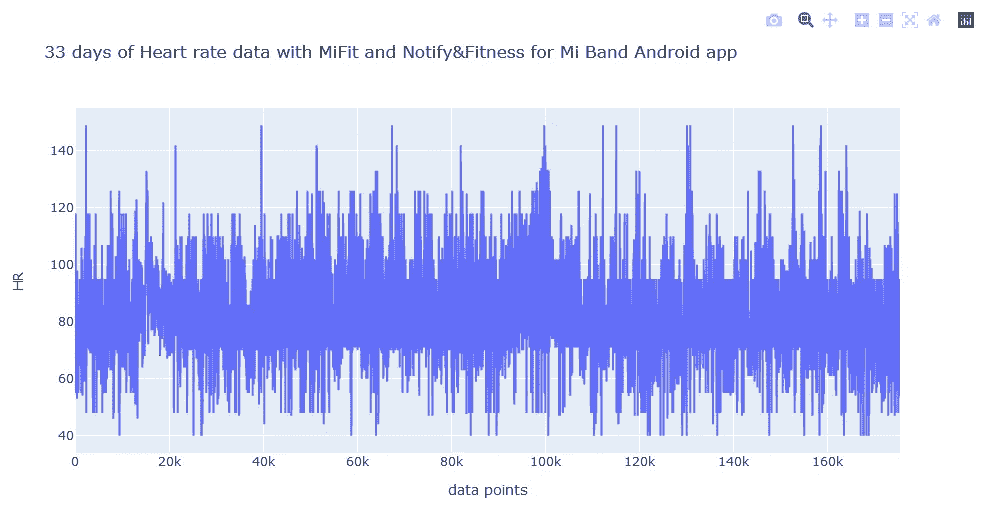
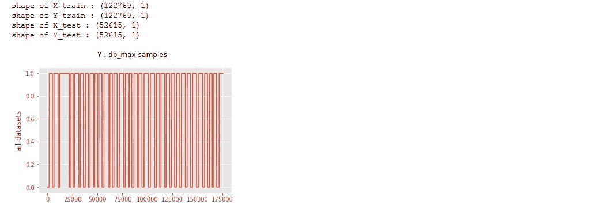

# 个人生物信号项目

> 原文：<https://medium.com/mlearning-ai/personal-biosignal-project-271467ea6f9b?source=collection_archive---------10----------------------->

这个项目的灵感来自于想学习机器学习和深度学习技术的基础知识。目标与健康监控应用程序(Mifit、Fitbit 等)相似，但使用不同的措施组合来影响健康。更具体地，在长期连续的基础上监测外部环境影响和生理测量，以找到与外部影响和健康的任何相关联系。

我每天从收集大量的光电容积描记术(PPG)心率数据开始。然后，我进行了一个简单的分析，看看是否有重大的趋势，在人力资源由于一天的时间。

我做了一个快速分析，对一天中不同时间的心率进行分类，人们可以类似地进行统计分析，比较一天中不同时间的心率分布或平均值。分类结果表明，心率作为一个特征可以预测清醒状态和睡眠状态之间的时间差异，睡眠状态下心率的均值明显低于清醒状态。

在这本笔记本里，你会发现:
1。正在加载。“Mi Band Notify 8.11.3”电话应用程序保存的 xls Mifit 4 数据，
2。创建 X 和 Y 数据矩阵，
3。创建 X_train，Y_train，X_test，Y_test，
4。几个 Y_train 和 Y_test 标签的测试(4 类:[night _ sleep = 0–7 小时，morning = 8–12 小时，evening = 13–18 小时，night _ awake = 19–24 小时]，3 类:[night _ sleep = 0–7 小时，morning = 8–12 小时，evening = 13–24 小时]，2 类[night _ sleep = 0–7 小时，awake = 9–24 小时]，
5。用一些多类和二元分类器测试分类。

可以在 GitHub 查看代码:[https://github.com/j622amilah/Heart_classification](https://github.com/j622amilah/Heart_classification)。数据集也发布在 kaggle 上:[https://www . ka ggle . com/jamilahfoucher/mi-fit-daily life-heart-rate](https://www.kaggle.com/jamilahfoucher/mi-fit-dailylife-heart-rate)。

# 打开. h5 格式的数据

# 准备 X 训练，Y 训练，X 测试，Y 测试

# 让我们制作标签:一天中不同的时间

我为三个 y 标签中的每一个运行了下面的代码块，下面是 2 个类 y 标签的结果。

# 测试分类模型:随机森林

问:一天中的时间会影响人力资源吗？结果:在清醒时，一天中的时间对心率没有显著影响。睡眠和清醒状态对心率有显著影响。

多类 SVM : n_class=4 训练精度:40.61937459782193%测试精度:43.463666635

多类 SVM : n_class=3 训练精度:55.65981640316367%测试精度:57.500636086

多类 SVM : n_class=2 训练精度:72.040173007844%测试精度:68.68485485686

这个结果似乎是显而易见的，但我自己测试也很有趣。下一个项目是测试 HR 是否基于特定的日常活动和/或导电金属(如珠宝)而有所不同。下期帖子再见！

 [## Mlearning.ai 提交建议

### 如何成为 Mlearning.ai 上的作家

medium.com](/mlearning-ai/mlearning-ai-submission-suggestions-b51e2b130bfb)