# 个人生物信号项目:长期问题！

> 原文：<https://medium.com/mlearning-ai/personal-biosignal-project-long-term-questions-ae4c3c18bcff?source=collection_archive---------13----------------------->

一段时间以来，为了更好地了解个人健康状况，跟踪身体信号已经成为一种流行的运动和睡眠方式。我有一个 MiFit 已经有几年了，能够随时测量我的心率或查看前一天晚上我睡得有多好的统计数据是很好的。有了这些关于我身体的信息，我可以思考过去的选择/行为是如何影响我的身体的，这让我更加意识到如何更好地控制我的身体/生活。

MiFit 应用程序提供了关于短期测量的统计数据，但我更感兴趣的是长期统计数据，比如我在周末和工作日的平均心率。在这篇短文中，我制作了简单的随机森林模型来预测我是否很忙或者现在是周末。

请在以下网址查看完整代码:[https://www . ka ggle . com/code/jamilahfoucher/exploring-mi-smart-band 4-data](https://www.kaggle.com/code/jamilahfoucher/exploring-mi-smart-band4-data)

# 你能根据心率告诉我忙不忙吗？

如果我的心率数据与账户活动相关联，那就太好了，因此，也许不是有人因为登录了 Linkedin 而“在线”,它可以根据心脏测量结果提供真实的可用性信息。如果模型是准确的，这也是一个很好的方法来监测你是否是一个工作狂，因为你总是很忙。

我制作了一个半监督标签，使用 kmeans 和一天中的小时来确定繁忙程度。

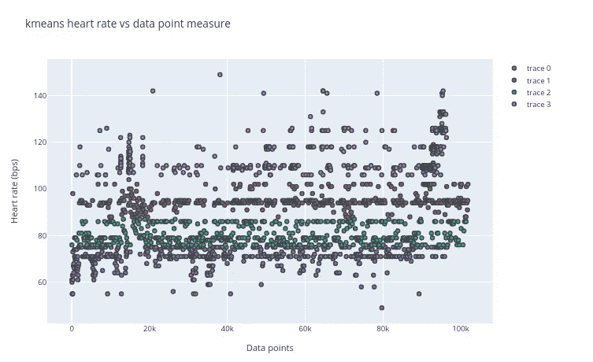

Note: all data points were downsampled to 500 data point, such that I could nicely plot them on the figure, there are actually over 10,000 heart rate data points.

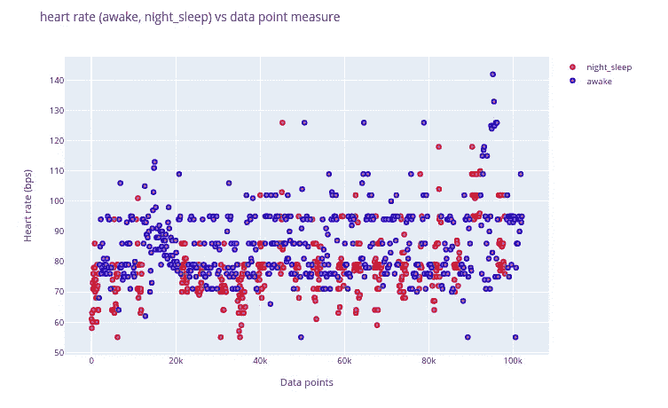

Note: all data points were downsampled to 500 data point, such that I could nicely plot them on the figure, there are actually over 10,000 heart rate data points.

在制作了我们的忙碌和活动标签之后，我们使用一个简单的 RandomForest 模型，并制作一个模型来预测我们正在做什么活动或者我们是否忙碌。

我们在 Y_activity 上使用 value_counts()，我们可以看到类是不均匀的，所以结果会有偏差。

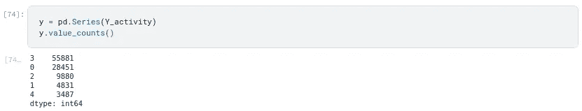

我们使用方便的 pad _ data _ 2 make classes _ equivalent 函数来平衡这些类。

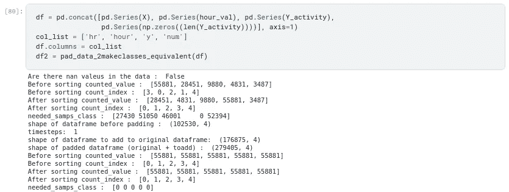

我展示了 Y_activity 的类平衡，我们也展示了 Y_busy 的类平衡。

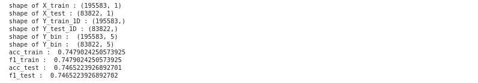

不给出小时会导致精度为 0.75，而给出小时会导致精度为 1.0。使用带有心率的小时数可以清楚地给出结果，但如果我们想制作一个完全可靠的无误差产品来显示我们的活动，这是一个可行的选择，因为所有的心率数据都有时间戳。

使用 Y_busy 时，不给出小时会得到 0.81 的精度，给出小时会得到 1.0 的精度。

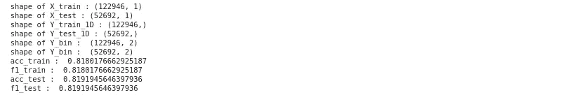

为了好玩，我们使用 Y_activity 模型，并告诉模型我们的心率是 73 和/或时间是上午 11 点。对于 workingproductORnot 等于 0 或 1，结果是相同的。

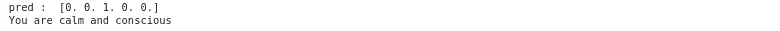

同样，Y_busy 告诉我们‘我不忙’。

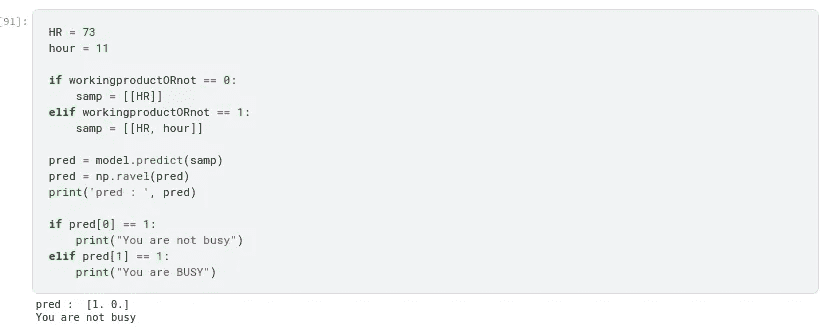

如果我实际记录我忙和不忙的时候，可以改进从心率预测繁忙程度，因此使用了心率和活动之间更精确的关系。

# 一周中的哪一天决定你的心率吗？

有研究表明，周末和工作日的静息心率是不同的，很大程度上是基于我们所做的活动，也可能是基于我们对周末和工作日的预期/感知。对于这个数据集，我实际上在周末和工作日做同样的活动；适度的步行和社交活动，计算机上的数据科学活动。

首先，我们制作一个标签来区分哪些测量值是在工作日和周末记录的。

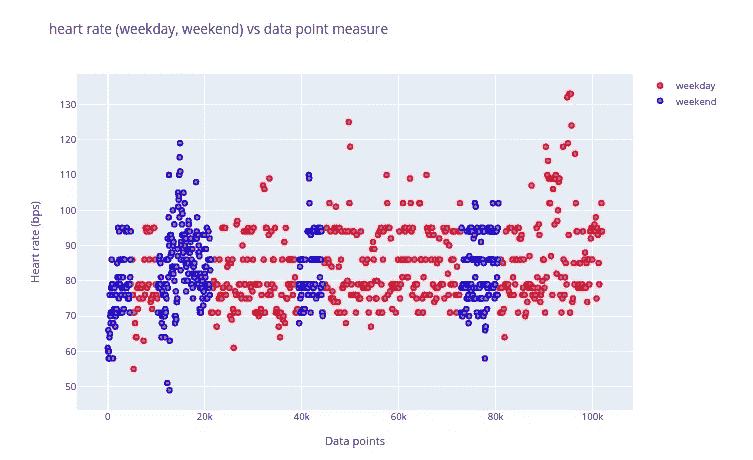

Note: all data points were downsampled to 500 data point, such that I could nicely plot them on the figure, there are actually over 10,000 heart rate data points.

我们可以看到，有更多的心率测量为工作日比周末的数据点更多。我们验证类差异并再次平衡类。

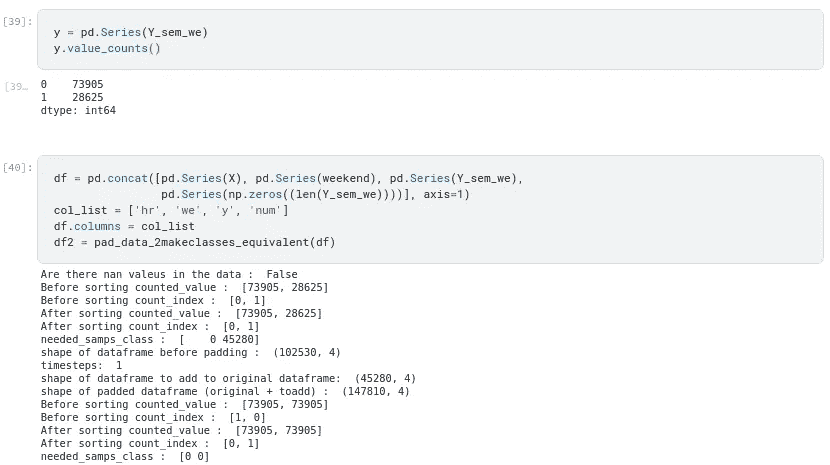

接下来，我们使用 scipy 的几个两样本比较测试，对 0 类(工作日)和 1 类(周末)的心率测量值进行统计比较。心率测量值的分布不正常，因此我们使用 sign head 和 sumrank 检验。

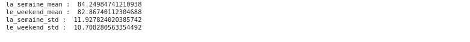

我们可以看到，平均心率在工作日比周末稍高，而且心率值的范围在工作日比周末大。统计分析表明，这两个群体在统计上并不显著。

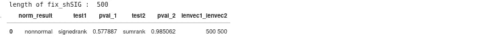

如果不指定工作日，则准确率为 0.57；如果指定小时，则准确率为 1.0。同样，此结果显示我在周末和工作日的心率值在统计上不显著，就像我们为统计结果显示的那样。

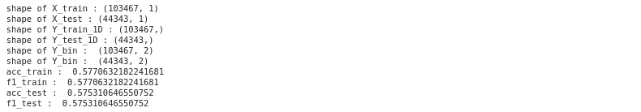

但是，由于使用 MiFit 可以免费获得心率数据，因此我们可以使用周末功能创建一个工作模型。

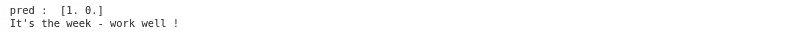

如果我在周末有一个不同于工作日的生活方式，我们将能够使这个模型预测周末和工作日只有心率。这一结果表明，周末和工作日的知觉差异，对心率没有显著影响。人们在周末会有不同的心率，因为他们在身体上所做的活动与平日不同。

练习愉快！👋

 [## Mlearning.ai 提交建议

### 如何成为 Mlearning.ai 的作者

medium.com](/mlearning-ai/mlearning-ai-submission-suggestions-b51e2b130bfb)